### # 通用寄存器

AX称为累加器(Accumulator),是CPU中使用最多,功能最强,执行效率的寄存器。

BX称为基地址寄存器(Base Register)。

CX称为计数寄存器(Count Register)。

DX称为数据寄存器(Data Register)。

### # CS和IP

(1) CS和IP是8086CPU中两个最关键的寄存器，它们指示了CPU当前要读取指令的地址。CS为代码段寄存器，IP为指令指针寄存器。

(2) 在8086PC机中，任意时刻，设CS中内容为M，IP中内容为N，8086CPU将从内存M×16+N单元开始，读取一条指令并执行。（任意时刻，CPU将CS：IP指向的内容当做指令执行）

### # 修改CS、IP的指令

(1) MOV指令不能用于设置CS、IP的值。

(2) 能够改变CS、IP的内容的指令统称为转移指令。

(3) 若想同时修改CS、IP的内容，可用形如“jmp 段地址：偏移地址”的指令完成。

(4) “jmp 段地址：偏移地址”指令的功能为：用指令中给出的段地址修改CS，偏移地址修改IP。

(5) 若仅想修改IP的内容，可用形如“jmp 某一合法寄存器”的指令完成，如：

​        jmp ax，指令执行前：ax=1000H，CS=2000H，IP=0003H

​                      指令执行后：ax=1000H，CS=2000H，IP=1000H

​     “jmp 某一合法寄存器”指令的功能为：用寄存器的值修改IP。（jmp ax含义就如：mov IP，ax）

### # 小结

(1) 段地址在8086CPU的段寄存器中存放。当8086CPU要访问内存时，由段寄存器提供内存单元的段地址。8086CPU有4个段地址寄存器，其中CS用来存放指令的段地址。

(2) CS存放指令的段地址，IP存放指令的偏移地址。8086机中，任意时刻，CPU将CS：IP指向的内容当做指令执行。

(3) 8086CPU的工作过程：

​    ① 从CS：IP指向的内存单元读取指令，读取的指令进入指令缓冲器；

​    ② IP指向下一条指令；

​    ③ 执行指令。（转到步骤①，重复这个过程）

(4) 8086CPU提供转移指令修改CS和IP的内容。

### # 实验1 查看CPU和内存，用机器指令和汇编指令编程

(1) 什么是Debug？

Debug是DOS、Windows都提供的实模式（8086方式）程序的调试工具。使用它，可以查看CPU各种寄存器中的内容、内存的情况和机器码级跟踪程序的运行。

(2) 用到的Debug功能。

① 用Debug的R命令查看、改变CPU寄存器的内容；

② 用Debug的D命令查看内存中的内容；

③ 用Debug的E命令改写内存中的内容；

④ 用Debug的U命令将内存中的机器指令翻译成汇编指令；

⑤ 用Debug的A命令以汇编指令的格式在内存中写入一条机器指令；

⑥ 用Debug的T命令执行一条指令；

⑦ 用Debug的P命令执行汇编程序，单步跟踪。与T命令不同的是：P命令不会跟踪进入子程序或软中断。

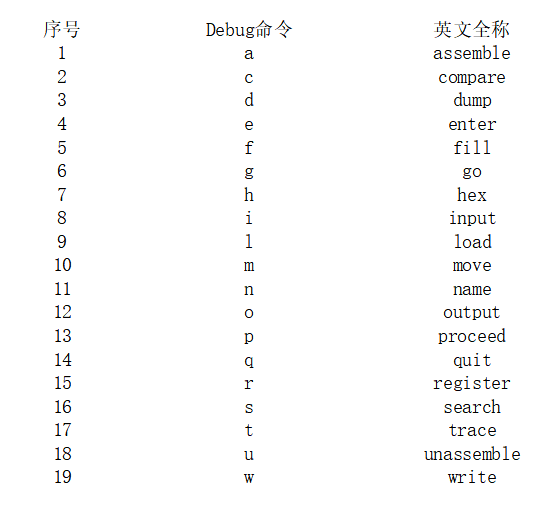

(3) 利用DOSBox进入Debug：

​    ① 打开Dosbox。

​    ② 执行MOUNT C E:\Debug（debug程序在的文件夹）

​    ③ C：

​    ④ debug

(4) 用R（register 寄存器）命令查看、改变CPU寄存器的内容。

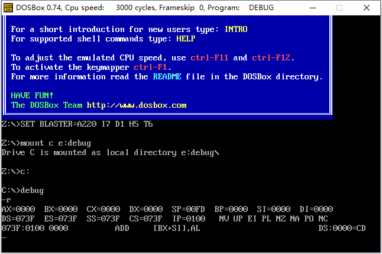

注意此时CS和IP的值，也就是内存073F：0100处的指令为CPU当前要读取、执行的指令。在所有寄存器的下方，Debug还列出了CS：IP所指向的内存单元所存放的机器码，并将它翻译为汇编指令。

还可以使用R命令改变寄存器中的内容，若要修改一个寄存器的值，比如AX的值，可以用R命令后加寄存器名来进行，输入“r ax”之后按回车，即可在“：”后输入要写入的数据，再次按回车完成更改。

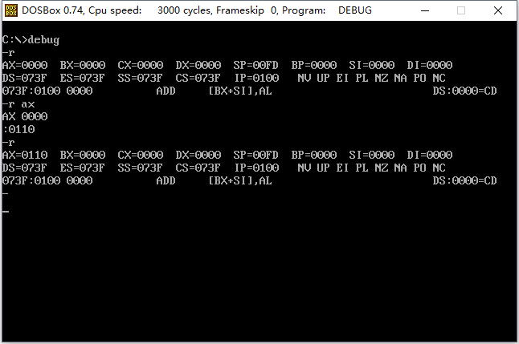

(5) 用Debug的D（dump 转储）命令查看内存中的内容。

用Debug的D命令，可以查看内存中的内容，D命令的格式较多，这里只介绍部分。

如果我们想知道内存10000H处的内容，可以用“d 段地址：偏移地址”的格式来查看：

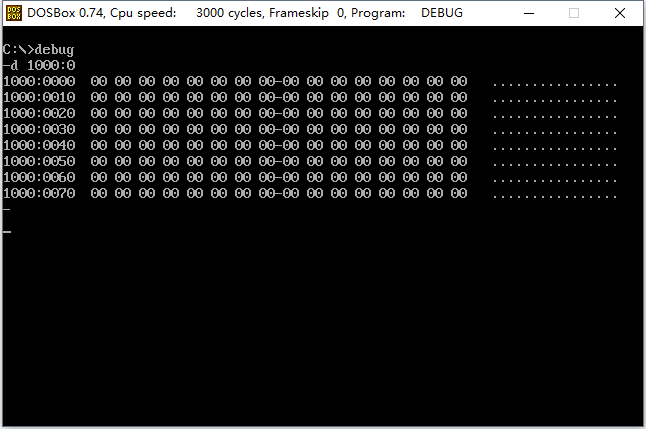

使用“d 段地址：偏移地址”的格式，Debug将列出从指定单元开始的128个内存单元的内容。

使用D命令，Debug将输出3部分内容：

① 中间是从指定位置开始的128个内存单元的内容，用16进制格式输出，每行的输出从16的整数倍的地址开始，最多输出16个单元的内容。注意每行中间有一个“-”，将每行的输出分成两部分，便于查看。

② 左边是每行的起始地址。

③ 右边是每个内存单元中的数据对应的可显示的ASCII码字符。没有可显示的字符，Debug就用“.”来代替。

在使用“d 段地址：偏移地址”之后，接着使用D命令，可列出后续内容：

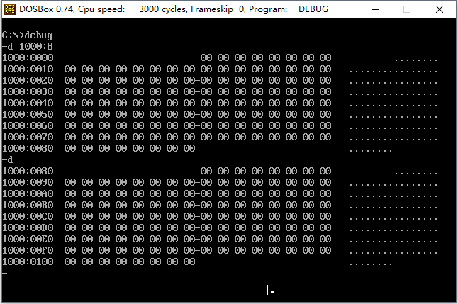

也可以指定D命令的查看范围，此时采用“d 段地址：起始偏移地址 结尾偏移地址”的格式： 

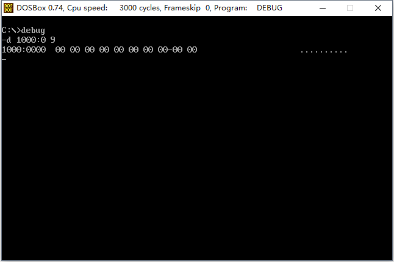

(6) 用Debug的E（enter 输入）命令改写内存个中的内容。

可是使用E命令来改写内存中的内容，比如，要将内存1000:0-1000:6单元的内容分别写为0、1、2、3、4、5、6，可以用“e 起始地址 数据...”的格式来进行：

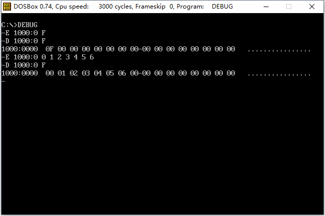

也可以采用提问的方式一个一个改写内存中的内容： 

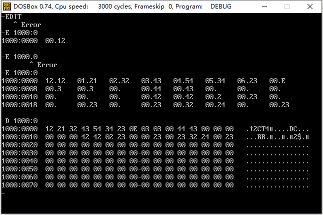

步骤如下：

① 输入 e 1000:0，按enter键

② Debug显示起始地址1000:0000，和第一单元（1000：0000）的原始内容：12，然后光标停在“.”后提示输入要写入的数据，此时可以输入数据（数值、字符、字符串），按下空格键，完成更改（或者不输入，不会更改）。

③ Debug接着显示下一个单元的原始内容，并提示修改，依次下去。

④ 不再更改时，按下Enter键，结束命令。

(7) 用E命令向内存中写入机器码，有U（unassemble 反汇编）命令查看内存中机器码的含义，用T命令执行内存中的机器码。

```assembly
机器码        对应的汇编指令
b80100       mov ax,0001
b90200       mov cx,0002
01c8         add ax,cx
```

使用E命令将机器码写入后，可以使用U命令将内存单元中的内容翻译为汇编指令，并显示出来： 

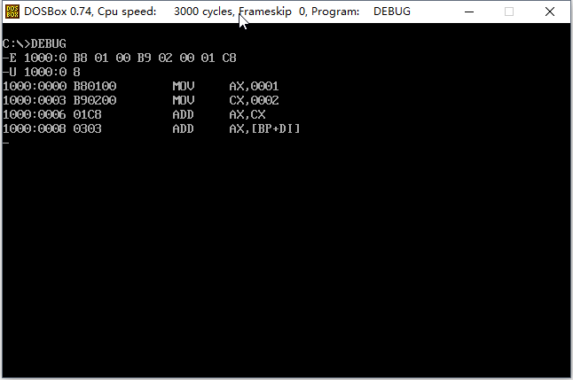

使用Debug的T（trace 追踪）命令可以执行一条或多条指令，简单地使用T命令，可以执行CS：IP指向的指令： 

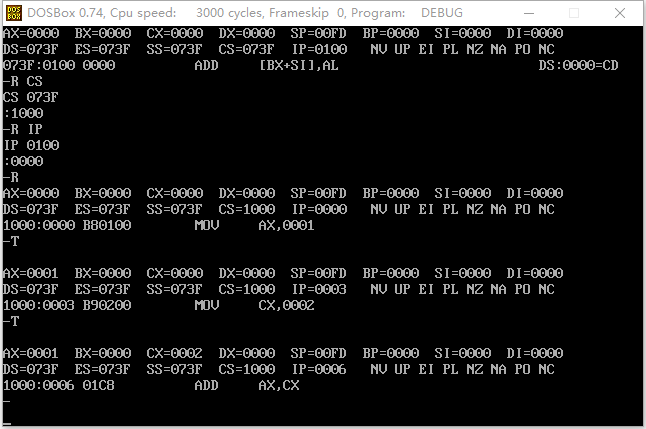

(8) 用Debug的A（assemble 汇编）命令以汇编的形式在内存中写入机器命令。 

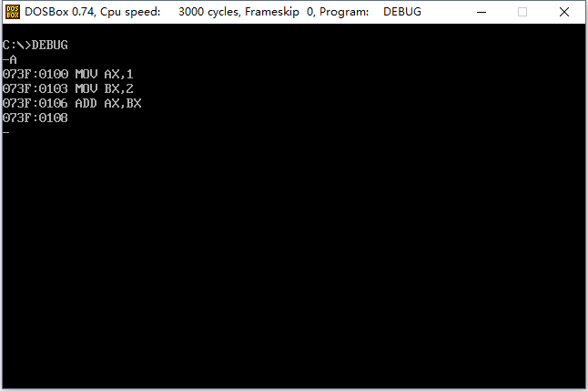