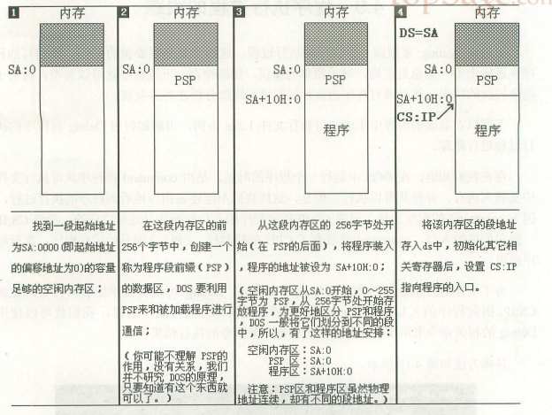

### # 源程序

下面就是一段简单的汇编语言源程序：

```assembly
; Description : 第一个汇编程序
; Author : Angus
; Date : 2017-11-11 00:27:07
; Version: V1.0

assume cs:codesg

codesg segment
		
		mov ax,0123H
		mov bx,0426H
		add ax,bx
		add ax,ax

		mov ax,4c00H
		int 21H
codesg	ends

end
```

#### 1.伪指令 

在汇编语言源程序中，包含两种指令，一种是汇编指令，一种是伪指令。汇编指令是由对应的机器码的指令，可以被编译为机器指令，最终为CPU所执行。而伪指令没有对应的机器指令，最终不被CPU所执行。伪指令是由编译器来执行的指令，编译器根据伪指令来进行相关的编译工作。

上段程序出现了三种伪指令：

(1) XXX segment

​            ：

​            ：

​     XXX ends

segment和ends是一对成对使用的伪指令，这是在写可被编译的汇编程序时，必须要用到的一对伪指令。segment和ends的功能是定义一个段，segment说明一个段开始，ends说明一个段结束。一个段必须有一个名称来标识，使用格式为：

​     段名 segment

​            ：

​            ：

​     段名 ends

一个汇编程序由多个段组成的，这些段被用来存放代码、数据或当做栈空间来使用。一个有意义的汇编程序至少有一个段，用来存放代码。

(2) end

end是一个汇编程序的结束标记，编译器如果在编译汇编的时候，如果碰到了伪指令end处，就结束了对源程序的编译。所以程序写完，一定要正在结尾加上end。

(3) assume （假定，设想，采取）

这条伪指令的含义是“假设”。它假设某一段寄存器和源程序中的某一个用segment...ends定义的段关联。通过·assume说明这种关联，在需要的情况下，编译程序可以将段寄存器和某一具体段相关联。以后编程时，记得用assume将有特定用途的段和相关的段寄存器相关联即可。

#### 2.源程序中的“程序”

以后将源文件中的所有内容称为源程序，将源程序最终由计算机执行、处理的指令或数据，称为程序。程序最先以汇编指令的形式存在源程序中，经编译、连接后转变为机器码，存储在可执行文件中。

#### 3.标号

汇编程序中，除了汇编指令和伪指令外，还有一些标号，比如“codesg”。一个标号指代了一个地址。比如codesg在segment的前面，作为一个段的名称，这个段对的名称最终被编译、连接程序处理为一个段的段地址。

#### 4.程序的结构

任务：编程运算2^3，源程序应该怎么写呢？

(1) 我们要定义一个段，名称为abc。

```assembly
abc segment
    ：
abc ends
```

(2) 在这个段中写入汇编指令，来实现任务 

```assembly
abc segment
	mov ax,2
	add ax,ax
	add ax,ax
abc ends
```

(3) 然后，要指出程序在何处结束 

```assembly
abc segment
	mov ax,2
	add ax,ax
	add ax,ax
abc ends
end
```

(4) abc被当做代码段使用，所以应该将abc与cs关联起来（对于该程序，非必须） 

```assembly
assume cs:abc

abc segment
	mov ax,2
	add ax,ax
	add ax,ax
abc ends
end
```

#### 5.程序返回

一个程序结束后，将CPU的控制权交还给使它得以运行的程序，我们称这个过程为：程序返回。

开头提到的简单的源程序的末尾两条指令实现的功能就是程序返回：

```assembly
mov ax,4c00H
int 21H
```

#### 6.语法错误和逻辑错误

可见我们编写的“运算2^3”程序是有一些问题的，因为程序没有返回。当然这个错误在编译时候不能表现出来，也就是说程序对于编译器来说是正确的程序。

一般来说，程序在编译时被发现的错误是语法错误，比如写成下面这样：

```assembly
aume cs:abc

abc segment
	mov ax,2
	add ax,ax
	add ax,ax
end
```

显然，编译器不能识别aume，也不知道abc何时才能结束。

源程序编译后，在运行时发生的错误是逻辑错误。语法错误容易发现，但是逻辑错误就需花费一些功夫。我们将“运算2^3”程序更正如下：

```assembly
assume cs:abc

abc segment
	mov ax,2
	add ax,ax
	add ax,ax

	mov ax,4c00H
	int 21H

abc ends
end
```

### # 汇编程序从写出到执行的过程

​    编程 → test.asm → 编译 → test.obj → 连接 → test.exe → 加载 → 内存中的程序 → 运行

 （edit）                 （masm）               （link）              （command）                      （cpu）

### # 程序的加载过程



(1) 找到一段起始地址为SA：0000（即起始地址的偏移地址为0）的容量足够的空闲内存区；

(2) 在这段内存区的前256个字节中，创建一个称为程序段前缀（PSP）的数据区，DOS要利用PSP来和被加载程序进行通信；

(3) 在这段内存区的256字节开始（在PSP的后面），将程序装入，程序的地址被设为SA+10H：0；

(4) 将该内存区的段地址存入ds中，初始化其他相关寄存器，设置CS：IP指向程序的入口。

### # 实验3 编程、编译、连接、跟踪

(1) 将下面的程序保存为t1.asm文件，将其生成可执行文件t1.exe。

```assembly
; Date : 2017-11-11 10:20:32
; File Name : 03T1.ASM
; Description : 实验3
; Author : Angus
; Version: V1.0

assume cs:codesg

codesg segment
	
	mov ax,2000H
	mov ss,ax
	mov sp,0
	add sp,10
	pop ax
	pop bx
	push ax
	push bx
	pop ax
	pop bx

	mov ax,4c00H
	int 21H

codesg ends

end
```

(2) 用Debug跟踪t1.exe的执行过程，写出每一步执行后，相关寄存器中内容和栈顶的内容。

(3) PSP的头两个字节是CD20，用Debug加载t1.exe，查看psp的内容。