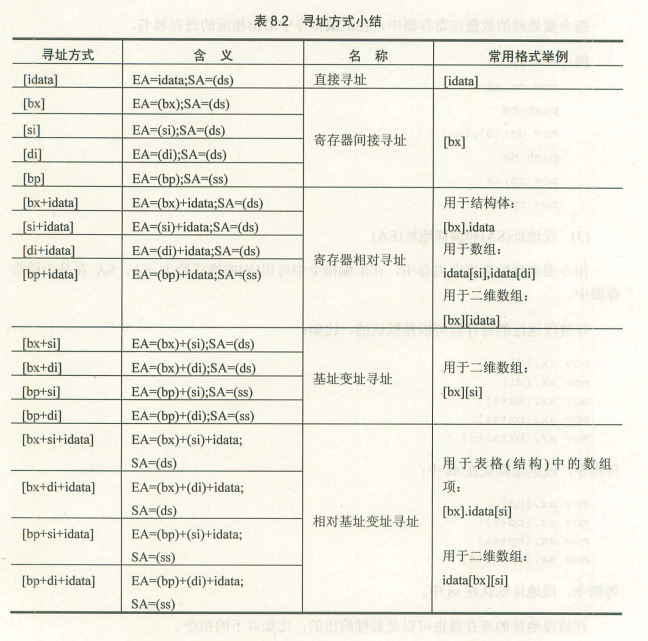

### # 约定

为了描述上简洁，我们将使用两个描述性的符号，reg表示一个寄存器，sreg表示一个段寄存器。

reg的集合包括：ax，bx，cx，dx，ah，al，bh，bl，ch，cl，dh，dl，sp，bp，si，di；

sreg的集合包括：ds，ss，cs，es；

### # bx、si、di和bp

(1) 在8086CPU中，只有这4个寄存器可以用在[...]中用来进行内存单元的寻址。

(2) 在[...]中，这4个寄存器可以单个出现，或只能以4种组合出现：bx和si、bx和di、bp和si、bp和di。

(3) 只要在[...]中使用寄存器bp，而指令没有显性地给出段地址，段地址就默认在ss中。

### # 汇编语言中数据位置的表达

汇编语言中用3个概念来表达数据的位置。

(1) 立即数（idata）

对于直接包含在机器指令中的数据（执行前在CPU的指令缓冲器中），在汇编语言中称为：立即数（idata），在汇编指令中直接给出。

(2) 寄存器

指令要处理的数据在寄存器中，在汇编指令中给出相应的寄存器名。

(3) 段地址（SA）和偏移地址（EA）

指令要处理的数据在内存中，在汇编指令中可用[x]的格式给出EA，SA在某个段寄存器中。

① 存放段地址的寄存器可以是默认的，比如：

```assembly
mov ax,[0]
mov ax,[di]
mov ax,[bx+8]
mov ax,[bx+si]
mov ax,[bx+si+8]
```

等指令，段地址默认在ds中； 

```assembly
mov ax,[bp]
mov ax,[bp+8]
mov ax,[bp+si]
mov ax,[bp+si+8]
```

等指令，段地址默认在ss中。

② 存放段地址的寄存器也可以是显性给出的，比如： 

```assembly
mov ax,ds:[bp]
mov ax,es:[bx]
mov ax,ss:[bx+si]
mov ax,cs:[bx+si+8]
```

### # 寻址方式小结



### # 指令要处理的数据有多长

8086CPU的指令，可以处理两种尺寸的数据，byte和word。所以要在机器指令中指明，指令进行的是字操作还是字节操作。对于这个问题，汇编语言用以下方法处理。

(1) 通过寄存器名指明要处理的数据的尺寸。

(2) 在没有寄存器的情况下，用操作符X ptr指明内存单元的长度，X在汇编指令中国可以为word或byte。

例如，下面的指令中，用word ptr指明了指令访问的内存单元是一个字单元。

```assembly
mov word ptr ds:[0],1
add word ptr [bx],2
```

下面的指令中，用byte ptr指明了指令访问的单元是一个字节单元。 

```assembly
mov byte ptr ds:[0],1
add byte ptr [bx],2
```

(3) 其他方法

有些指令默认了访问的内存单元是字单元还是字节单元，比如push[1000H]就不用指明访问的是字单元还是字节单元，因为push指令只进行字操作。

### # div指令

div除法指令，使用div做除法的时候应注意以下问题：

(1) 除数：有8位和16位两种，在一个reg或内存单元中。

(2) 被除数：默认放在AX或DX和AX中，如果除数是8位，被除数则为16位，默认存放在AX中；如果除数是16位，被除数则为32位，在DX和AX中存放，DX存放高16位，AX中存放低16位。

(3) 结果：如果除数为8位，则AL存储除法操作的商，AH存储除法操作的余数；如果除数是16位，则AX存储除法操作的商，DX存储除法操作的余数。

(4) 格式：div reg或div 内存单元

### # 伪指令dd

dd是用来定义dword（double word，双字）型数据的。

### # dup

dup是一个操作符，在汇编语言中同db、dw、dd等一样，也是由编译器识别处理的符号。它是和db、dw、dd等数据定义1伪指令配合使用的的，用来进行数据的重复。

dup的使用格式如下：

① db 重复的次数 dup（重复的字节型数据）

② dw 重复的次数 dup（重复的字型数据）

③ dd 重复的次数 dup（重复的双字型数据）

### # 实验7 寻址方式在结构化数据访问中的应用

 