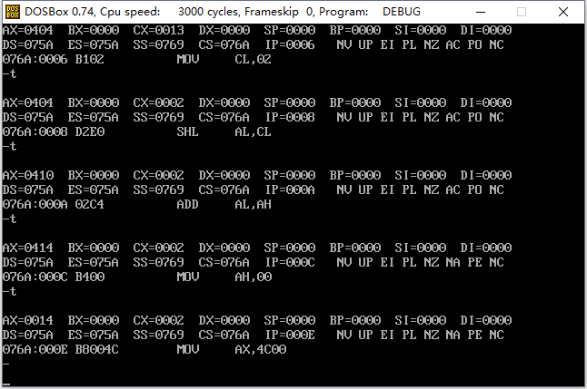

### # 端口的读写

(1) 在访问端口的时候，CPU通过端口地址来定位端口。因为端口地址所在的芯片和CPU通过总线相连，所以端口地址和内存地址一样，通过地址总线传送。在PC系统中，CPU最多可以定位64KB个不同的端口，则端口地址的范围时0-65535.

(2) 对端口的读写不能用mov、push、pop等内存读写指令。端口的读写指令只有两条：in和out，分别用于从端口中读取数据和往端口写入数据。

注意：在in和out指令中，只能使用ax和al来存放从端口中读入的数据或要发送到端口中的数据。访问8位端口时用al，访问16位端口时用ax。

```assembly
对0-255以内的端口进行读写时：
in al,20h    ; 从20h端口读入一个字节
out 20h,al   ; 往20h端口写入一个字节

对256-65535的端口进行读写时，端口号放入dx中：
mov dx,3f8h  ; 将端口号3f8h送入dx
in al,dx    ; 从3f8h端口读入一个字节
out dx,al   ; 往3f8h端口写入一个字节
```

### # CMOS RAM芯片

PC机中，有一个CMOS RAM芯片，一般称为CMOS，其特征如下。

(1) 包含一个实时钟和一个有128个存储单元的RAM存储器。

(2) 该芯片靠电池供电。所以，关机后其内部的实时钟仍可正常工作，RAM中的信息不丢失。

(3) 128字节的RAM中，内部时钟占用0-0dh单元来保存时间信息，其余大部分单元用于保存系统配置信息，供系统启动时BIOS程序读取。BIOS也提供了相关的程序2，使我们可以在开机时配置CMOS RAM中的系统信息。

(4) 该芯片内部有两个端口，端口地址为70h和71h。CPU通过这两个端口来读写CMOS RAM。

(5) 70h为地址端口，存放要访问的CMOS RAM单元的地址；71h为数据端口，存放从选定的CMOS RAM单元中读取的数据，或要写入到其中的数据。可见，CPU对CMOSRAM的读写分两步进行，比如，读CMOS RAM的2号单元：

​    ① 将2送入70h

​    ② 从端口71h读取2号单元的内容

编程：读取CMOS RAM的2号单元的内容，向其写入0。

```assembly
; Date : 2017-11-14 11:23:01
; File Name : 30TEST.ASM
; Description : 读取CMOS RAM的2号单元的内容，向其写入0
; Author : Angus
; Version: V1.0

assume cs:code
code segment
	mov al,2        ;  CMOS RAM的2号单元
	out 70h,al
	in al,71h

	mov al,0
	out 71h,al

	mov ax,4c00h 
	int 21h
code ends
end
```

### # shl和shr指令

shl和shr指令是逻辑移位指令。

(1) shl是逻辑左移指令，它的功能为：

① 将一个寄存器或内存单元的数据向左移位；

② 将最后移出的一位写入CF中；

③ 最低位用0补充。

```assembly
指令：
mov al,01001000b
shl al,1    ; 将al中的数据左移一位
执行后（al）=10010000b，CF=0
```

④ 如果移动位数大于1时，必须将移动位数放在cl中。 

```assembly
mov al,01010001b
mov cl,3
shl al,cl
执行后（al）=10001000b，CF=0
```

将X逻辑左移一位，相当于执行X=X*2

(2)shr是逻辑右移指令，它和shl所进行的操作正好相反。

① 将一个寄存器或内存单元的数据向右移位；

② 将最后移出的一位写入CF中；

③ 最高位用0补充。

```assembly
指令：
mov al,10010001b
shr al,1    ; 将al中的数据左移一位
执行后（al）=01001000b，CF=1
```

④ 如果移动位数大于1时，必须将移动位数放在cl中。

可以看出，将X逻辑右移一位，相当于执行X=X/2。

编程：用加法指令和移位指令实现（ax）=（ax）*10.

提示：（ax）\*10=(ax)\*2+(ax)\*8

```assembly
; Date : 2017-11-14 12:05:16
; File Name : 31TEST.ASM
; Description : 用加法指令和移位指令实现（ax）=（ax）*10.
; Author : Angus
; Version: V1.0

assume cs:code 
code segment
	mov al,2	; 设定al初始值为2
	shl al,1	; al左移1位 (al)*2
	mov ah,al

	mov cl,2	
	shl al,cl   ; al左移2位 (al)*4
	add al,ah   ; (al)=(al)*2+(al)*2+(al)*4
	mov ah,0

	mov ax,4c00h
	int 21h
code ends
end
```



### # CMOS RAM中存储的时间信息

### # 实验14 访问CMOS RAM