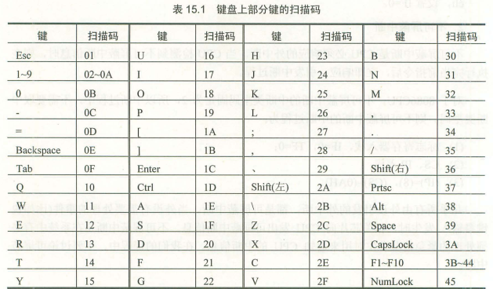
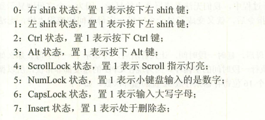
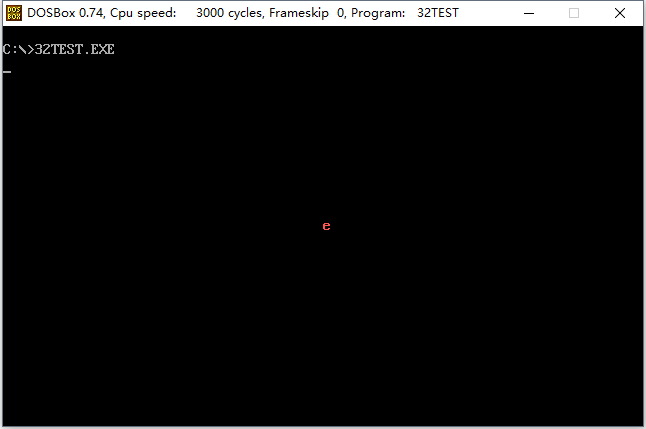

### # 外中断信息

在PC系统中，外中断源一共有以下两类。

1.可屏蔽中断

(1) 可屏蔽中断是CPU可以不响应的外中断。CPU是否响应可屏蔽中断，要看标志寄存器IF位的设置。当CPU检测到可屏蔽中断信息时，如果IF为1，则CPU在执行完当前指令后响应中断，引发中断过程；如果IF=0，则不响应可屏蔽中断。

(2) 回忆一下中断引发的中断过程:

① 取中断类型码n；

② 标记寄存器入栈，IF=0，TF=0；

③ CS、IP入栈；

④ （IP）=（n\*4），（CS）=（n\*4+2）

由此转去执行中断处理程序。

在中断过程中将IF置为0的原因就是，在进入中断处理程序后，禁止其他可屏蔽中断。如果在中断处理中需要处理可屏蔽中断，可以用指令将IF置为1。8086CPU提供的设置IF的指令如下：

```assembly
sti：设置IF为1
cli：设置IF为0
```

2.不可屏蔽中断

(1) 不可屏蔽中断是CPU必须响应的外中断。当CPU检测到不可屏蔽中断信息时，则在执行完当前指令后，立即响应，引发中断过程。

(2) 对于8086CPU，不可屏蔽中断的中断类型码固定为2，所以中断过程中不需要取中断类型码。则不可屏蔽中断的中断过程为：

① 标记寄存器入栈，IF=0，TF=0；

② CS、IP入栈；

③ （IP）=8，（CS）=（0AH）。

### # PC机键盘的处理过程

1.键盘输入

(1) 按下一个键时，开关接通，产生一个扫描码，扫描码说明了按下的键在键盘上的位置，扫描码被送入主板上的相关接口芯片的寄存器中，该寄存器的端口地址为60h。松开按下的键时，也产生一个扫描码，扫描码说明了松开的按键在键盘上的位置。松开按键产生的扫描码也送入60h端口。

(2) 一般将按下一个键产生的扫描码称为通码，松开一个按键产生的扫描码称为断码。扫描码长度为一个字节，通码的第7位为0，断码的第7位为1，即：断码=通码+80h。比如，g键的通码为22h，断码为a2h。



2.引发9号中断

键盘的输入到达60h时，相关的芯片就会向CPU发出中断类型码为9的可屏蔽中断信息。CPU在检测到该信息后，如果IF为1，则响应中断，引发中断过程，转去执行int 9中断例程。

3.执行int 9中断例程

(1)BIOS提供了int 9中断例程，用来进行基本的键盘输入处理，主要的工作的如下：

① 读出60h端口中的扫描码；

② 如果是字符键的扫描码，将该扫描码和它对应的字符码（即ASCII码）送入内存的中BIOS键盘缓冲区；如果是控制键（比如Ctrl）和切换键（比如CapsLock）的扫描码，则将其转变为状态字（用二进制记录控制键和切换键转状态的字节）写入内存中存储状态字的单元。

③ 对键盘系统进行相关的控制，比如说，向相关芯片发出应答信息。

(2) BIOS键盘缓冲区是系统启动后，BIOS用于存放int 9中断例程所接收的键盘输入的内存区。该内存去可以存储15个键盘的输入，因为int 9中断例程除了接收扫描码外，还要产生和扫描码对应的字符码，所以在BIOS键盘缓冲区中，一个键盘输入用一个字单元存储，高位字节存放扫描码，低位字节存放字符码。

(3) 0040:17单元存储键盘状态字节，该字节记录了控制键和切换键的状态，键盘状态字节各位记录如下。



### # 编写int 9中断例程

1.从上面的内容中，可以看出键盘输入的处理过程：

(1) 键盘产生扫描码；

(2) 扫描码送入到60h端口；

(3) 引发9号中断；

(4) CPU执行int 9中断例程处理键盘输入。

2.编程：在屏幕中间依次显示“a”-“z”，并让人可以看清。在显示过程中，按下Esc键后，改变显示的颜色。

键盘输入到达60h端口后，就会引发9号中断，CPU则转去执行9号中断例程。我们可以编写int 9中断例程，功能如下。

(1) 从60h端口读出键盘的输入；

```assembly
in al，60
```

(2) 调用BIOS的int 9中断例程，处理其他硬件细节

要能在我们写的新int 9中断例程中调用原来的int 9中断例程，就必须在将中断向量表中的中断例程的入口地址改为新地址之前，将原来的入口地址保存起来。这样，在需要调用的时候，我们才能找到原来的中断例程的入口。

因为不能使用指令int 9来调用原来的中断例程，我们在假设要调用的中断例程的入口地址在ds：0和ds：2单元的前提下，将int过程模拟为下面几步：

① 标志寄存器入栈

② IF=0，TF=0；

③ CS、IP入栈；

④ （IP）=（（ds）*16+0），（CS）=（（ds）*16+2）。

可以知道③、④步和call dword ptr ds：[0]的功能一样。故而可以模拟为：

① 标志寄存器入栈

② IF=0，TF=0；

call dword ptr ds：[0]

对于①，可用pushf实现；

对于②，可用下面的指令实现：

```assembly
pushf
pop ax
and ah,11111100b    ;IF和TF为标志寄存器的第9位和第8位
push ax
popf
```

则模拟int指令调用功能，调用入口地址在ds：0、ds：2的中断例程的程序为： 

```assembly
pushf               ; 标志寄存器入栈

pushf
pop ax
and ah,11111100b    ;IF=0，TF=0
push ax
popf

call dword ptr ds：[0]   ; CS、IP入栈；（IP）=（（ds）*16+0），（CS）=（（ds）*16+2）
```

(3) 判断是否为Esc的扫描码，如果是，改变显示的颜色后返回；如果不是则直接返回。

显示的位置是屏幕的中间，即第12行40列，显存中的偏移地址为：160*12+40*2。所以字符的ASCII码要送入段地址为b800h，偏移地址为160*12+40*2处。而段地址b800h，偏移地址160*12+40*2+1处是字符的属性，只要改变此处的数据就可以改变字符的颜色。

该程序的最后一个问题是，要在程序返回前，将中断向量表中的int 9中断例程的入口地址回复为原来的地址。否则程序返回后，别的程序将无法使用键盘。

```assembly
; Date : 2017-11-14 13:25:22
; File Name : 32TEST.ASM
; Description : 在屏幕中间依次显示“a”-“z”，并让人可以看清。在显示过程中，按下Esc键后，改变显示的颜色
; Author : Angus
; Version: V1.0

assume cs:code,ss:stack,ds:data

stack segment
	db 128 dup (0)
stack ends

data segment
	dw 0,0
data ends

code segment
start:	mov ax,stack
		mov ss,ax
		mov sp,128

		mov ax,data
		mov ds,ax

		mov ax,0
		mov es,ax

		push es:[9*4]
		pop ds:[0]
		push es:[9*4+2]
		pop ds:[2]		; 将原来的int 9中断例程的入口地址保存在ds：0和ds：2单元中

		cli				; 防止在改变时出现键盘中断，设置IF=0
		mov word ptr es:[9*4],offset int9
		mov es:[9*4+2],cs	; 在中断向量表中设置新的int 9中断例程的入口地址
		sti

		mov ax,0b800h
		mov es,ax
		mov ah,'a'
	s:	mov es:[160*12+40*2],ah
		call delay			; 调用delay延时子程序
		inc ah
		cmp ah,'z'
		jna s 				; 显示‘a’-‘z’

		mov ax,0
		mov es,ax
		push ds:[0]
		pop es:[9*4]
		push ds:[2]
		pop es:[9*4+2]		; 将中断向量表中的int 9中断例程的入口地址恢复为原来的地址

		mov ax,4c00h
		int 21h

;-------- delay延时子程序 ---------
delay:	push ax
		push dx
		mov dx,10h	; 循环10000h次
		mov ax,0
   s1:  sub ax,1
     	cmp ax,0
     	jne s1
   		sub	dx,1
		cmp dx,0
		jne s1
		pop dx
		pop ax
		ret

;-------- 以下为新的int 9中断例程 ---------
int9:  		push ax
			push bx
			push es

			in al,60h	; 60h端口读出键盘的输入

			pushf 		; 标志寄存器入栈
			; pushf
			; pop bx
			; and bh,11111100b	
			; push bx
			; popf 		; IF=0，TF=0 进行精简，因为进入中断时，IF和TF已经为0
			call dword ptr ds:[0] ; 对int指令进行模拟，调用原来的int 9中断例程

			cmp al,01h	; Esc的扫描码为01h
			jne int9ret	; 不是Esc，直接返回

			mov ax,0b800h
			mov es,ax
			inc byte ptr es:[160*12+40*2+1]	; 将属性值加1，该白泥颜色

int9ret:	pop es
			pop bx
			pop ax
			iret

code ends
end start
```



### # 安装新的int 9中断例程

### # 指令系统总结

8086CPU提供一下几大类指令。

(1) 数据传送指令

比如，mov、push、pushf、popf、xchg等都是数据传送指令，这些指令实现寄存器和内存、寄存器和寄存器之间的但单个数据之间传送。

(2) 算数运算指令

比如，add、sub、adc、sbb、inc、dec、cmp、imul、idiv、aaa等都是算数运算指令，这些指令实现寄存器和内存中数据的算数运算。它们的执行结果影响标志位寄存器的sf、zf、of、cf、pf、af位。

(3) 逻辑指令

比如，and、or、not、xor、test、shl、shr、sal、rol、ror、rcl、rcr等都是逻辑指令。除了not指令外，它们的执行结果都影响标志位寄存器的相关标志位。

(4) 转移指令

可以修改IP，或同时修改CS和IP的指令统称为转移指令。转移指令分为以下几类。

① 无条件转移指令，比如jmp；

② 条件转移指令，比如jcxz、je、jb、ja、jna、jna等；

③ 循环指令，比如loop；

④ 过程，比如call、ret、retf；

⑤ 中断，比如，int，iret。

(5) 处理机控制指令

这些指令对 标志寄存器或其他处理机状态进行设置，比如cld、std、cli、sti、nop、clc、cmc、stc、hlt、wait、esc、lock等都是处理机控制指令。

(6) 串处理指令

这些指令对内存中的批量数据进行处理，比如movsb、movsw、cmps、scas、loads、stos等，若要使用这些指令方便地进行批量数据的处理，则需要用rep、repe、repne等

 


