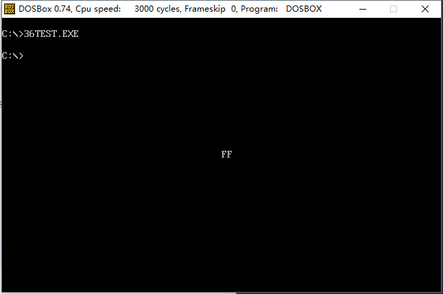

### # 描述了单元长度的标号

```assembly
assume cs:code
code segment
    a db 1,2,3,4,5,6,7,8
    b dw 0
    
start:  mov si,0
        mov cx,8
    s:  mov al,a[si]
        mov ah,0
        add b,ax
        inc si
        loop s
        mov ax,4c00h
        int 21h
code ends
end start
```

(1) 在code段中使用的标号a、b后面没有“：”；它们是同时描述内存地址和单元长度的标号。标号a，描述了地址code：0，和从这个地址开始，以后的内存单元嗾使字节单元；而标号b描述了地址code：8，和从这个地址开始，以后的内存单元都是字单元。

(2) 因为这种标号包含了对单元长度的 描述，所以，在指令中，它可以代表一个段中的内存单元。

比如，对于程序的b dw 0：

```assembly
指令：mov ax,b
相当于：mov ax,cs:[8]

指令：mov b,2
相当于：mov word ptr cs:[8],2

指令：inc b
相当于：intc word ptr cs:[8]
```

在这些指令中，标号b代表了一个内存单元，地址为code：8，长度为两个字节。下面的指令将引起编译错误; 

```assembly
mov al,b
```

因为b代表的内存单元是字单元，而al是8位寄存器。

对于程序中的a db 1,2,3,4,5,6,7,8：

```assembly
指令：mov al,a[si]
相当于：mov al,cs:0[si]

指令：mov al,al[3]
相当于：mov al,cs:0[3]

指令： mov al,a[bx+si+3]
相当于：mov al,cs:0[bx+si+3]
```

使用包含单元长度的标号，可以更简洁的访问内存中的数据。这种标号就是数据标号，它标记了存储数据的单元的地址和长度，不同于仅仅表示地址的地址标号。

(3) 检测：下面的程序将code段中a处的8个数据累加，结果存储到b处的双字中，补全程序。

```assembly
; Date : 2017-11-15 10:25:02
; File Name : 33TEST.ASM
; Description : 下面的程序将code段中a处的8个数据累加，结果存储到b处的双字中，补全程序
; Author : Angus
; Version: V1.0

assume cs:code
code segment
	a dw 1,2,3,4,5,6,7,8
	b dd 0

start: 
	mov si,0
	mov cx,8
s:	
	mov ax,a[si]
	add word ptr b,ax
	adc word ptr b[2],0
	add si,2
	loop s

	mov ax,4c00h
	int 21h
code ends
end start
```

### # 在其他段中使用数据标号

(1) 一般来说，我们不在代码段中定义数据，而是将数据定义到其他段中。在其他段中我们也可以使用数据标号来描述存储数据的单元的地址和长度。

注意：在后面加有“：”的地址标号，只能在代码段中使用，不能在其他段中使用。

(2) 下面的程序将data段中a标号处的8个数据累加，结果存储到b标号处的字中。

```assembly
; Date : 2017-11-15 10:43:13
; File Name : 34TEST.ASM
; Description : 下面的程序将data段中a标号处的8个数据累加，结果存储到b标号处的字中
; Author : Angus
; Version: V1.0

assume cs:code,ds:data
data segment
	a db 1,2,3,4,5,6,7,8
	b dw 0
data ends

code segment
start:
	mov ax,data
	mov ds,ax

	mov si,0
	mov cx,8

s:
	mov al,a[si]
	mov ah,0
	add b,ax
	inc si
	loop s

	mov ax,4c00h
	int 21h
code ends
end start
```

注意，如果想在代码段直接使用数据标号访问数据，则需要用伪指令assume将标号所在的段和一个段寄存器联系起来，否则编译器在编译的时候，无法确定标号的地址在哪一个寄存器中。这种联系是编译需要的，用assume指令将段寄存器和某个段相联系，段寄存器不会真的存放该段的地址（没运行时是不知道其地址的），所以我们在程序中还要使用指令对段寄存器进行设置。

(3) 可以将标号当做数据来定义，此时编译器将标号所表示的位置当做数据的值。

```assembly
比如：
data segment
    a db 1,2,3,4,5,6,7,8
    b dw 0
    c dw a,b
data ends
数据标号c处存储的两个字型数据为标号a,b的偏移地址。相当于：
data segment
    a db 1,2,3,4,5,6,7,8
    b dw 0
    c dw offset a,offset b
data ends

再比如：
data segment
    a db 1,2,3,4,5,6,7,8
    b dw 0
    c dd a,b
data ends
数据标号c处存储的两个双字型数据为标号a,b的偏移地址和段地址。相当于：
data segment
    a db 1,2,3,4,5,6,7,8
    b dw 0
    c dw offset a,seg a，offset b，seg b
data ends
seg操作符，功能为取得某一标号的段地址。
```

(4) 检测：下面的程序将data段中a处的8个数据累加，结果存储到b处的字节中，补全程序。  

```assembly
; Date : 2017-11-15 11:02:26
; File Name : 35TEST.ASM
; Description : 下面的程序将data段中a处的8个数据累加，结果存储到b处的字节中，补全程序
; Author : Angus
; Version: V1.0

assume cs:code,es:data

data segment
	a db 1,2,3,4,5,6,7,8
	b dw 0
data ends

code segment
start:
	mov ax,data
	mov es,ax
	mov si,0
	mov cx,8
s:
	mov al,a[si]
	mov ah,0
	add b,ax
	inc si
	loop s

	mov ax,4c00h
	int 21h
code ends
end start
```

### # 直接定址表

现在，我们讨论用查表的方法编写相关程序的技巧。

编写子程序，以十六进制的形式在屏幕中间显示给定的字节型数据。

(1) 分析：

① 一个字节型数据需要用两个两个16进制数码来表示，所以，子程序需要在屏幕上显示两个ASCII码字符。

② 用“0”，“1”，“2”，“3”，“4”，“5”，“6”，“7”，“8”，“9”，“A”，“B”，“C”，“D”，“E”，“F”这16个字符来显示十六进制数码。

③ 可以将一个自己的高4位和低4位分开，分别用他们的值来得到对应的数码字符。

④ 数值0-9和字符“0”-“9”之间的映射关系很明显，即：数字+30H=对应字符的ASCII值；10-15和“A”-“F”之间的映射关系是：数值+37H=对应字符的ASCII值。

⑤ 因为数值0-15和字符没有一致的映射关系存在，所以我们可以在它们之间建立新的映射关系。即建立一张表，表中依次存储字符“0”-“F“，这样我们就可以通过数值0-15直接查找到对应的字符。

子程序如下：

```assembly
; Date : 2017-11-15 11:35:19
; File Name : 36TEST.ASM
; Description : 编写子程序，以十六进制的形式在屏幕中间显示给定的字节型数据
; Author : Angus
; Version: V1.0

assume cs:code
code segment
main:
	mov ax,0
	mov al,0ffh
	call showbyte

	mov ax,4c00h
	int 21h

;=====================================
; Name : showbyte
; Func : 将寄存器中的值以十六进制输出
; Param : al传送要显示的数据
; Result : 结果显示在屏幕中间
;=====================================

showbyte:
	jmp short show
	table db '0123456789ABCDEF'		; 字符表
show:
	push ax
	push bx
	push cx
	push es

	mov ah,al
	mov cl,4
	shr ah,cl 		; 右移4位，ah得到高四位的值 
	and al,0fh 		; al中为低4位的值

	mov bl,ah
	mov bh,0
	mov ah,table[bx]	; 用高4位的值作为相对于table的偏移，取得对应的字符

	mov bx,0b800h
	mov es,bx
	mov es:[160*12+40*2],ah

	mov bl,al
	mov bh,0
	mov al,table[bx]	; 用低4位的值作为相对于table的偏移，取得对应的字符
	mov es:[160*12+41*2],al

	pop es
	pop cx
	pop bx
	pop ax
	ret

code ends
end main
```



(2) 利用表，在两个数据集合之间建立一种映射关系，使我们可以用查表的方法根据给出的数据的到其在另一个集合中的对应数据，这样的做的目的一般来有以下3个：

① 为了算法的清晰和简洁；

② 为了加快运算速度；

③ 为了使程序易于扩充。

### # 程序入口地址的直接定址表

### # 实验16 编写包含多个功能子程序的中断例程