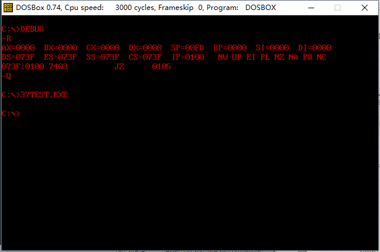

### # int 9中断例程对键盘输入的处理

(1) 键盘输入将引发9h中断，BIOS提供了int 9中断例程。CPU在9号中断发生后，执行int 9中断例程，从60h端口读出扫描码，并将其转化为相应的ASCII码或状态信息，存储在内存指定空间（键盘缓冲区或状态字）中。

(2) 一般的键盘输入，在CPU执行完int 9中断例程后，都放到了键盘缓冲区中。键盘缓冲区中有16个字单元，可以存储15个按键的扫描码和对应的ASCII码

### #使用int 16h中断例程读取键盘缓冲区

(1) BIOS提供了int 16h中断例程供程序员调用，int 16h中断例程中包含的一个最重要的功能是从键盘缓冲区读取一个键盘输入，该功能的编号为0。

(2) 下面的指令从键盘缓冲区中读取一个键盘输入，并且将其从缓冲区中删除：

```assembly
mov ah,0
int 16h
结果：（ah）=扫描码，（al）=ASCII码
```

(3) int 16h中断例程的0号功能，进行如下工作。

① 检测键盘缓冲区中是否有数据；

② 没有则继续第一步；

③ 读取键盘缓冲区第一个字单元的键盘输入；

④ 将读取的扫描码送入ah，ASCII码送al；

⑤ 将已读取的键盘输入重缓冲区中删除。

(4) 可见，BIOS的int 9h中断例程和int 16h中断例程是一对相互配合的程序，int 9中断例程向键盘缓冲区中写入，int 16h中断例程从缓冲区中读出。它们写入和读出的时机不同，int 9中断例程是在有按键的按下的时候向键盘缓冲区中写入数据；而int 6h中断例程是在应用程序对其进行啊调用的时候，将数据从键盘缓冲区中读出。

编程：接收用户的输入，输入“r”，将屏幕的字母设置为红色，输入“g”，将屏幕上的字符设置为绿色，输入“b”，将屏幕上的字符设置为蓝色。

```assembly
; Date : 2017-11-15 14:25:35
; File Name : 37TEST.ASM
; Description : 接收用户的输入，
;				输入“r”，将屏幕的字母设置为红色，
;				输入“g”，将屏幕上的字符设置为绿色，
;				输入“b”，将屏幕上的字符设置为蓝色。
; Author : Angus
; Version: V1.0

assume cs:code

code segment
start:
	mov ah,0
	int 16h

	mov ah,1
	cmp al,'R'
	je red
	cmp al,'G'
	je green
	cmp al,'B'
	je blue
	jmp short sret

red:
	shl ah,1
green:
	shl ah,1
blue:
	mov bx,0b800h
	mov es,bx
	mov bx,1
	mov cx,2000
s:
	and byte ptr es:[bx],11111000b
	or es:[bx],ah
	add bx,2
	loop s
sret:
	mov ax,4c00h
	int 21h
code ends
end start
```

