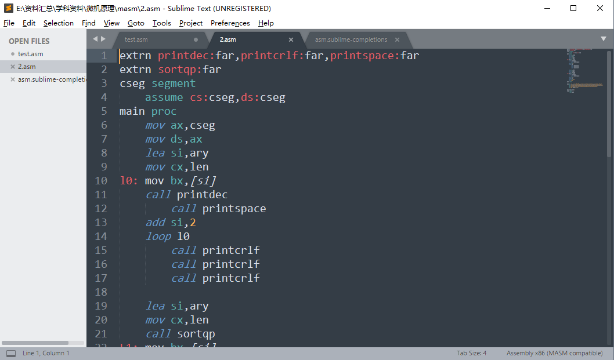

### # 实现语法高亮

安装插件MasmAssembly：<https://packagecontrol.io/packages/MasmAssembly>



### # 实现代码补全

手动编写代码补全文件，格式参照：<http://sublimetext.info/docs/en/extensibility/completions.html>

asm.sublime-snippet

```xml
<snippet>
; File Name : $TM_FILENAME
; Description : $1
; Author : Angus
; Date : ${2:alt+d}
; Version: V1.0
</content>
	<tabTrigger>info</tabTrigger>
	<scope>source.asm</scope>
</snippet>
```

asm.sublime-completions 

```json
{
   "scope": "source.asm",
 
   "completions":
   [
    
    //{ "trigger": "a", "contents": "<a href=\"$1\">$0</a>" }
    // AX寄存器
    // "ax","ah","al","AX","AH","AL",

    // ASSUME伪指令
    "assume","ASSUME",

    // ADD指令
    "add","ADD",

    // ADC指令
    "adc","ADC",

    // BX寄存器
    // "bx","bh","bl","BX","BH","BL",
      
    // CX寄存器
    // "cx","ch","cl","CX","CH","CL",

    // 段寄存器
    // "cs","CS",

    // CLD指令
    "cld","CLD",

    // BYTE
    "byte","BYTE",

    // CLD指令
    "cld","CLD",

    // CMP指令
    "cmp","CMP",

    // DX寄存器
    // "dx","dh","dl","DX","DH","DL",

    // DB\DW
    "db","DB","dw","DW",

    // DIV指令
    "div","DIV",

    // DUP指令
    "dup","DUP",

    // DS寄存器
    // "ds","DS",

    // ES寄存器
    // "es","ES",

    // END伪指令
    "end","END",

    // ENDS伪指令
    "ends","ENDS",

    // ENDP伪指令
    "endp","ENDP",

    // INT指令
    "int","INT",

    // INC指令
    "inc","INC",

    // JCXZ指令
    "jcxz","JCXZ",

    // JMP指令
    "jmp","JMP",

    // JNE指令
    "jne","JNE",

          
    // MOV指令
    "mov","MOV",

    // 串传送指令
    "movsb","MOVESB","movsw","MOVSW",

    // MUL乘法指令
    "mul","MUL",

    // OFFSET
    "offset","OFFSET",
   
    // 栈操作
    "push","PUSH","pushf","PUSHF",
    "pop","POP","popf","POPF",

    // PROC
    "proc","PROC",

    // PTR
    "ptr","PTR",

    // REP指令
    "rep","REP",

    // SBB指令(借位减)
    "sbb","SBB",

    // SEGMENT伪指令
    "segment","SEGMENT",

    // SHORT
    "short","SHORT",


    // STD指令
    "std","STD",

    // SUB指令
    "sub","SUB",

    // 注释
    { "trigger": "zx", 
      "contents": ";=====================================\n; Name : $1\n; Func : $2\n; Param : $3\n; Result : $4\n;=====================================" 
    },

   ]
}
```

