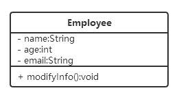
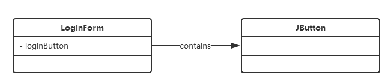
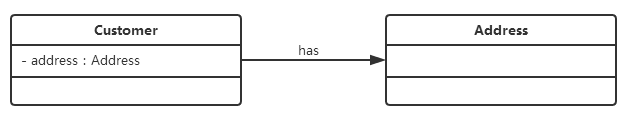
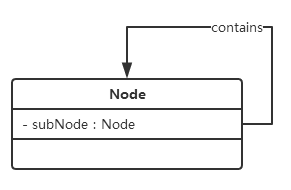
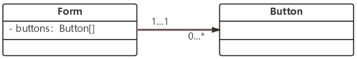
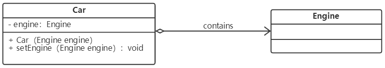
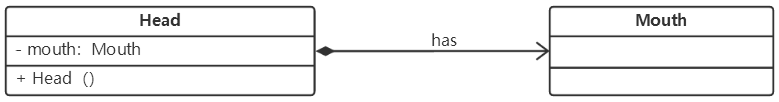
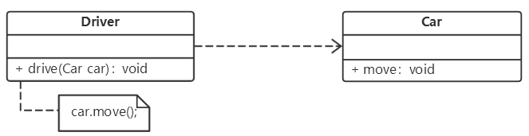
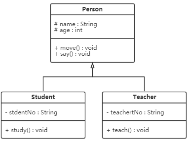
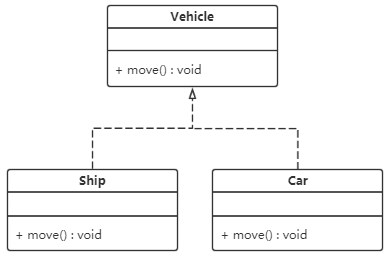

### 1.UML概述

#### 1.1 UML特性

UML的特性体现在其名称的3个字母中：

(1) UML融合了多种优秀的面向对象建模方法以及多种得到认可的软件工程方法，集百家之所长，让不同知识背景的人员可以方便交流，故名**“统一（Unified）”**。

(2) UML是一种通用的可视化**建模（Modeling）**语言，不同于编程语言，它通过一些标准的图形化符号和文字来对系统进行建模，用于对软件进行描述、可视化处理、构造和建立软件系统制品的文档。

(3) UML是一种**语言（Language）**，有属于自己的标准表达规则，是一种分析设计语言，也就是一种建模语言。

#### 1.2 UML结构

(1) **视图（View）：**UML视图从不同的角度来表示待建模系统。视图是由许多图形组成的一个抽象集合。在建立一个系统模型时，只有通过定义多个视图，每个视图显示该系统的一个特定方面，才能构造出该系统的完整蓝图，视图也将建模语言链接到开发所选择的方法和过程。

UML的视图包括以下几类：

 ① 用户视图：以用户的观点表示系统的目标，是所有视图的核心，用于描述系统的需求。

 ② 结构视图：表示系统的静态行为，描述系统的静态元素（如包、类与对象）之间的关系。

 ③ 行为视图：表示系统的动态行为，描述系统的组成元素（如对象）在系统运行时的交互关系。

 ④ 实现视图：表示系统中逻辑元素的分布，描述系统中物理文件以及它们之间的关系。

 ⑤ 环境视图：表示系统中物理元素的分布，描述系统中硬件设备以及它们之间的关系。

(2) **图（Diagram）：**UML图示描述UML视图内容的图形。UML2.0提供了13种图，分别是用例图、类图、对象图、包图、组合结构图、状态图、活动图、顺序图、通信图、定时图、交互概览图、组件图和部署图，通过它们之间我的相互组合可以提供建模系统的所有视图。其中，用例图对应用户视图，类图、对象图、包图和组合结构图对应结构视图，状态图、活动图、顺序图、通信图、定时图和交互预览图对应行为视图，组件图对应实现视图，部署图对应环境视图。

(3) **模型元素（Model Element）：**模型元素指UML图中所使用的一些概念，对应于普通的面向对象概念，如类、对象、消息以及这些概念之间的关系，如关联关系、依赖关系、泛化关系等。同一个模型元素可以在多个不同的UML图中使用，但必须保持相同的意义和符号。

(4) **通用机制（General Mechnism）：**UML提供的通用机制为模型元素提供额外的注释、信息和语义，同时提供了热扩展机制，允许用户对UML进行扩展，如定义新的建模元素、扩赞原有元素的语义、添加新的特殊信息来扩展模型元素的规则说明等。

### 2.类与类的UML图示

#### 2.1.类

类（Class）封住了数据和行为，是面向对象的重要组成部分，它是具有相同属性、操作、关系的对象集合的总称。每个类都具有一定的职责，类的属性即类的数据职责，类的操作即类的行为职责。系统运行时，类将会被实例化成对象（Object），对象对应于某个具体的事物，是类的实例（Instance）。

类图（Class Diagram）是用出现在系统中的不同类来描述系统的静态结构，主要用于描述不同的类及它们之间的关系。

#### 2.2 类的UML图示

在UML中，类使用包含类名、属性和操作且带有分割线的长方形表示，如定义一个Employee类，它包含属性name、age和email，以及操作modifyInfo()，在UML图中该类表示如下：



对应的java代码如下： 

```java
public class Emploee {
    private String name;
    private int age;
    private String email;

    public void modifyInfo() {
        ...
    }
}
```

在UML图中，类一般由3部分组成：类名、类的属性、类的操作。

(1) 类名：每个类必有，是一个字符串。

(2) 类的属性：即其成员变量。

​    UML规定属性的表示形式为： 可见性 名称：类型 [ = 默认值 ]

​    ① “可见性”表示该属性对于类外的元素而言是否可见，包括公有（public）、私有（private）和受保护（protected）3种，分别用符号+、-和#表示。

​    ② “名称”表示属性名，用一个字符串表示。

​    ③ “类型”表示属性的数据类型，可以是基本数据类型、引用类型，也可以是用户自定义类型。

​    ④ “默认值”是一个可选项，即属性的初始值。

(3) 类的操作：即类的成员方法。

​    UML规定操作的表示方式为： 可见性 名称（参数列表） [ ：返回类型 ]

​    ① “可见性”的定义与属性的可见性定义相同。

​    ② “名称”即方法名，字符串表示。

​    ③ “参数列表”表示方法的参数，其语法与属性的定义相似。

​    ④ “返回类型”是一个可选项，表示方法的返回值类型，依赖于具体的编程语言，可以基本数据类型，也可以是用户自定义类型，还可以是void，若是构造方法，则没有返回类型。

### 3.类之间的关系

对于类与类之间的各种关系，UML提供了不同的表示方式。

#### 3.1 关联关系

(1) 关联（Association）关系是类与类之间最常用的一种关系，是一种结构化关系，用于表示一类对象与另一类对象之间有关系，如汽车和轮胎、班级和学生等。

(2) 在UML图中，用实线连接有关联关系的对象所对应的类，在使用Java、C#和C++等编程语言实现关联关系时，通常将一个类的对象作为另一个类的成员变量。

(3) 使用类图表示关联关系时可以在关联关系线上标注角色名（非必须），使类之间的关系更加明确。

(4) 实例：一个登录界面类LoginForm中包含一个JButton类型的注册按钮loginButton，它们之间可以表示为关联关系。



对应的Java代码如下： 

```java
public class LoginForm {
    private JButton loginButton; // 定义为成员变量
    ...
}

public class JButton {
    ...
}
```

(5) 在UML中，关联关系通常包含如下几种形式：

① 双向关联

默认情况下，关联是双向的。例如，顾客购买并拥有商品，与此对应，卖出的商品总是属于某个顾客。因此，Customer类与Product类之间具有双向关联关系。


对应的Java代码如下： 

```java
public class Customer {
    private Product[] products;
    ...
}

public class Product {
    private Customer customer;
    ...
}
```

② 单向关联

类的关联关系也可以是单项的，在UML中单项关联用带箭头的实线表示。例如，顾客拥有地址，则Customer类与Address类具有单向关联关系。



对应的Java代码如下： 

```java
public class Customer {
    private Address address;
    ...
}

public class Address {
    ...
}
```

③ 自关联

在系统中可能会存在一些类的属性的类型是该类本身，这类特殊的关联关系称为自关联。例如，一个节点类的成员又是节点Node类型的对象。



对应的Java代码如下： 

```java
public class Node {
    private Node subNode;
    ...
}
```

④ 多重性关联

多重性关联关系又称为重数性（Multiplicity）关系，表示两个关系对象在数量上的对应关系。在UML中，对象之间的多重性可以直接在关联直线上用一个数字或一个数字范围表示。

| 表示方式 | 多重性说明                                                  |
| -------- | ----------------------------------------------------------- |
| 1.. 1    | 表示另一个类的一个对象只与该类的一个对象有关系              |
| 0.. *    | 表示另一个类的一个对象与该类的零个或多个对象有关系          |
| 1.. *    | 表示另一个类的一个对象与该类的一个或多个对象有关系          |
| 0.. 1    | 表示另一个类的一个对象没有或只与该类的一个对象有关系        |
| m.. n    | 表示另一个类的一个对象与该类最少m，最多n个对象有关系（m≤n） |

例如，一个界面（Form）可以拥有零个或多个按钮（Button），但是一个按钮只能属于一个界面。 



对应的Java代码如下： 

```java
public class From {
    private Button[] buttons; // 定义一个集合对象
    ...
}

public class Button {
    ...
}
```

⑤ 聚合关系

聚合（Aggregation）关系表示整体与部分的关系。在聚合关系中，成员对象是整体对象的一部分，但是成员对象可以退脱离整体对象独立存在。在UML中，用带空心菱形的直线表示聚合关系。例如，汽车发动机是汽车的组成部分，同时它也可以独立存在。



在代码实现聚合关系时，成员对象通常作为构造方法、Setter方法或业务方法的参数注入到整体对象中。对应的Java代码如下： 

```java
public class Car {
    private Engine engine;
    // 构造注入
    public Car(Engine engine) {
        this.engine = engine;
    }
    // 设置注入
    public void setEngine(Engine engine) {
        this.engine = engine;
    }
    ...
}

public class Engine {
    ...
}
```

⑥ 组合关系

组合（Composition）关系也表示类之间整体与部分的关系，但是组合关系中整体对象可以控制成员对象的生命周期，一旦整体对象不存在，成员对象也将不存在。在UML中，用带实心菱形的直线表示组合关系。例如，嘴巴是头的组成部分，如果头没了，嘴巴也就不复存在，故而嘴巴和头是组合关系。



在代码实现组合关系时，通常在整体类的构造方法做发给你直接实例化成员类。对应的Java代码如下： 

```java
public class Head {
    private Mouth mouth;

    public Head() {
        mouth = new Mouth(); // 实例化成员类
    }
    ...
}

public class Mouth {
    ...
}
```

#### 3.2 依赖关系

(1) 依赖（Dependency）关系是一种使用关系，特定事物的改变有可能会影响到使用该事物的其他事物，在需要表示一个事物使用另一个事物时使用依赖关系。

(2) 大多数情况下，依赖关系体现在某个类的方法使用另一个类的对象作为参数。

(3) 在UML中，依赖关系用带箭头的虚线表示，由依赖的一方指向被依赖的一方。例如驾驶员开车，在Driver类中的drive()方法中将Car类型的对象car作为一个参数传递，以便在drive()方法中能够调用Car类的move()方法，且驾驶员的drive()方法依赖Car类的move()方法，因此类Driver依赖类Car。



对应的代码如下： 

```java
public class Driver {
    public void drive(Car car) {
        car.move();
    }
    ...
}

public class Car {
    public void move() {
        ...
    }
    ...
}
```

(4) 依赖关系通常使用3种方式是来实现。第1种也是最常用的一种方式是将一个类的对象作为另一个类中方法的参数；第二种是在一个类的方法中将另一个类的对象作为其局部变量；第三种是在一个类的方法中调用另一个类的静态方法。

#### 3.3 泛化关系

泛化（Generalization）关系也就是继承关系，用于描述父类与子类之间的关系。



#### 3.4 接口与实现的关系

接口之间也可以有与类之间关系类似的继承关系和依赖关系，但是接口之间还存在一种实现关系。在这种关系中，类实现了接口，类中的操作实现了接口中所声明的操作。



### 4.面向对象的设计原则概述

#### 4.1 七种常用的面向对象设计原则

| 设计原则名称                                        | 定义                                             | 使用频率 |
| --------------------------------------------------- | ------------------------------------------------ | -------- |
| 单一职责原则 (Single Responsibility Principle, SRP) | 一个类只负责一个功能领域中的相应职责             | ★★★★☆    |
| 开闭原则 (Open-Closed Principle, OCP)               | 软件实体应对扩展开放，而对修改关闭               | ★★★★★    |
| 里氏代换原则 (Liskov Substitution Principle, LSP)   | 所有引用基类对象的地方能够透明地使用其子类的对象 | ★★★★★    |
| 依赖倒转原则 (Dependence  Inversion Principle, DIP) | 抽象不应该依赖于细节，细节应该依赖于抽象         | ★★★★★    |
| 接口隔离原则 (Interface Segregation Principle, ISP) | 使用多个专门的接口，而不使用单一的总借口         | ★★☆☆☆    |
| 合成复用原则 (Composite Reuse Principle, CRP)       | 尽量使用对象组合，而不是继承来达到复用的目的     | ★★★★☆    |
| 迪米特法则 (Law of Demeter, LoD)                    | 一个软件实体应当尽可能少地与其他实体发生相互作用 | ★★★☆☆    |

#### 4.2 单一职责原则

单一职责原则是最简单的面向对象设计原则，它用于控制类的粒度大小。单一职责原则定义：一个类只负责一个功能领域中的相应职责，或者可以定义为：就一个类而言，应该只有一个引起它变化的原因。

#### 4.3 开闭原则

(1) 开闭原则是面向对象的可复用设计的第一块基石，它是最重要的面向对象设计原则。开闭原则由Bertrand  Meyer于1988年提出，其定义：一个软件实体应当对扩展开放，对修改关闭。即软件实体应尽量在不修改原有代码的情况下进行扩展。

(2) 在开闭原则的定义中，软件实体可以指一个软件模块、一个由多个类组成的局部结构或一个独立的类。

(3) 为了满足开闭原则，需要对系统进行抽象化设计，抽象化是开闭原则的关键。

#### 4.4 里氏代换原则

(1) 里氏代换原则严格表述如下：如果对每一个类型为S的对象o1，都有类型为T的对象o2，使得以T定义的所有程序P在所有的对象o1代换o2时，程序P的行为没有变化，那么类型S是类型T的子类型。

(2) 这个定义比较拗口且难以理解，因此我们一般使用它的另一个通俗版定义：所有引用基类（父类）的地方必须能透明地使用其子类的对象。

(3) 里氏代换原则告诉我们，在软件中将一个基类对象替换成它的子类对象，程序将不会产生任何错误和异常，反过来则不成立，如果一个软件实体使用的是一个子类对象的话，那么它不一定能够使用基类对象。

(4) 里氏代换原则是实现开闭原则的重要方式之一，由于使用基类对象的地方都可以使用子类对象，因此在程序中尽量使用基类类型来对对象进行定义，而在运行时再确定其子类类型，用子类对象来替换父类对象。

#### 4.5 依赖倒转原则

(1) 如果说开闭原则是面向对象设计的目标的话，那么依赖倒转原则就是面向对象设计的主要实现机制之一，它是系统抽象化的具体实现。依赖倒转原则定义：抽象不应该依赖于细节，细节应当依赖于抽象。换言之，要针对接口编程，而不是针对实现编程。

(2) 依赖倒转原则要求我们在程序代码中传递参数时或在关联关系中，尽量引用层次高的抽象层类，即使用接口和抽象类进行变量类型声明、参数类型声明、方法返回类型声明，以及数据类型的转换等，而不要用具体类来做这些事情。

(3) 在实现依赖倒转原则时，我们需要针对抽象层编程，而将具体类的对象通过依赖注入(DependencyInjection, DI)的方式注入到其他对象中，依赖注入是指当一个对象要与其他对象发生依赖关系时，通过抽象来注入所依赖的对象。

(4) 常用的注入方式有三种，分别是：构造注入，设值注入（Setter注入）和接口注入。构造注入是指通过构造函数来传入具体类的对象，设值注入是指通过Setter方法来传入具体类的对象，而接口注入是指通过在接口中声明的业务方法来传入具体类的对象。这些方法在定义时使用的是抽象类型，在运行时再传入具体类型的对象，由子类对象来覆盖父类对象。

(5) 开闭原则是目标，里氏代换原则是基础，依赖倒转原则是手段，它们相辅相成，相互补充，目标一致，只是分析问题时所站角度不同而已。

#### 4.6 接口隔离原则

(1) 接口隔离原则定义如下：使用多个专门的接口，而不使用单一的总接口，即客户端不应该依赖那些它不需要的接口。

(2) 每一个接口应该承担一种相对独立的角色，不干不该干的事，该干的事都要干。

#### 4.7 合成复用原则

(1) 合成复用原则又称为组合/聚合复用原则(Composition/Aggregate Reuse Principle, CARP)，其定义：尽量使用对象组合，而不是继承来达到复用的目的。

(2) 在面向对象设计中，可以通过两种方法在不同的环境中复用已有的设计和实现，即通过组合/聚合关系或通过继承，但首先应该考虑使用组合/聚合，组合/聚合可以使系统更加灵活，降低类与类之间的耦合度，一个类的变化对其他类造成的影响相对较少；其次才考虑继承，在使用继承时，需要严格遵循里氏代换原则，有效使用继承会有助于对问题的理解，降低复杂度，而滥用继承反而会增加系统构建和维护的难度以及系统的复杂度，因此需要慎重使用继承复用。

(3) 一般而言，如果两个类之间是“Has-A”的关系应使用组合或聚合，如果是“Is-A”关系可使用继承。"Is-A"是严格的分类学意义上的定义，意思是一个类是另一个类的"一种"；而"Has-A"则不同，它表示某一个角色具有某一项责任。

#### 4.8 迪米特法则

(1) 迪米特法则又称为最少知识原则(LeastKnowledge Principle, LKP)，其定义：一个软件实体应当尽可能少地与其他实体发生相互作用。

(2) 迪米特法则可降低系统的耦合度，使类与类之间保持松散的耦合关系。

(3) 迪米特法则还有几种定义形式，包括：不要和“陌生人”说话、只与你的直接朋友通信等，在迪米特法则中，对于一个对象，其朋友包括以下几类：

 ① 当前对象本身；

 ② 一参数形式传入到当前对象方法中的对象；

 ③ 当前对象的成员对象；

 ④ 如果当前对象的成员是一个集合，那么集合中的元素也是朋友；

 ⑤ 当前对象所创建的对象。

(4) 迪米特法则要求我们在设计系统时，应该尽量减少对象之间的交互，如果两个对象之间不必彼此直接通信，那么这两个对象就不应当发生任何直接的相互作用，如果其中的一个对象需要调用另一个对象的某一个方法的话，可以通过第三者转发这个调用。简言之，就是通过引入一个合理的第三者来降低现有对象之间的耦合度。

(5) 在将迪米特法则运用到系统设计中时，要注意下面的几点：在类的划分上，应当尽量创建松耦合的类，类之间的耦合度越低，就越有利于复用，一个处在松耦合中的类一旦被修改，不会对关联的类造成太大波及；在类的结构设计上，每一个类都应当尽量降低其成员变量和成员函数的访问权限；在类的设计上，只要有可能，一个类型应当设计成不变类；在对其他类的引用上，一个对象对其他对象的引用应当降到最低。