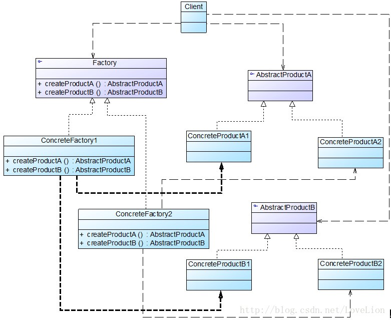

### 抽象工厂模式概述

(1) 抽象工厂模式为创建一组对象提供了一种解决方案。与工厂方法模式相比，抽象工厂模式中的具体工厂不只是创建一种产品，它负责创建一族产品。

(2) 抽象工厂模式(Abstract Factory Pattern)：提供一个创建一系列相关或相互依赖对象的接口，而无须指定它们具体的类。抽象工厂模式又称为Kit模式，它是一种对象创建型模式。

(3) 在抽象工厂模式中，每一个具体工厂都提供了多个工厂方法用于产生多种不同类型的产品，这些产品构成了一个产品族，抽象工厂模式结构如图所示：



(4) 在抽象工厂模式结构图中包含如下几个角色：

+ AbstractFactory（抽象工厂）：它声明了一组用于创建一族产品的方法，每一个方法对应一种产品。
+ ConcreteFactory（具体工厂）：它实现了在抽象工厂中声明的创建产品的方法，生成一组具体产品，这些产品构成了一个产品族，每一个产品都位于某个产品等级结构中。
+ AbstractProduct（抽象产品）：它为每种产品声明接口，在抽象产品中声明了产品所具有的业务方法。
+ ConcreteProduct（具体产品）：它定义具体工厂生产的具体产品对象，实现抽象产品接口中声明的业务方法。

(5) 在抽象工厂中声明了多个工厂方法，用于创建不同类型的产品，抽象工厂可以是接口，也可以是抽象类或者具体类，其典型代码如下所示：

```java
abstract class AbstractFactory {  
    public abstract AbstractProductA createProductA(); //工厂方法一  
    public abstract AbstractProductB createProductB(); //工厂方法二  
    ……  
}  
```

具体工厂实现了抽象工厂，每一个具体的工厂方法可以返回一个特定的产品对象，而同一个具体工厂所创建的产品对象构成了一个产品族。对于每一个具体工厂类，其典型代码如下所示：  

```java
class ConcreteFactory1 extends AbstractFactory {  
    //工厂方法一  
    public AbstractProductA createProductA() {  
        return new ConcreteProductA1();  
    }  

    //工厂方法二  
    public AbstractProductB createProductB() {  
        return new ConcreteProductB1();  
    }  

    ……  
}  
```

与工厂方法模式一样，抽象工厂模式也可为每一种产品提供一组重载的工厂方法，以不同的方式对产品对象进行创建。

### 抽象工厂模式总结

抽象工厂模式是工厂方法模式的进一步延伸，由于它提供了功能更为强大的工厂类并且具备较好的可扩展性，在软件开发中得以广泛应用，尤其是在一些框架和API类库的设计中，例如在Java语言的AWT（抽象窗口工具包）中就使用了抽象工厂模式，它使用抽象工厂模式来实现在不同的操作系统中应用程序呈现与所在操作系统一致的外观界面。抽象工厂模式也是在软件开发中最常用的设计模式之一。

#### 主要优点 

+ 抽象工厂模式隔离了具体类的生成，使得客户并不需要知道什么被创建。由于这种隔离，更换一个具体工厂就变得相对容易，所有的具体工厂都实现了抽象工厂中定义的那些公共接口，因此只需改变具体工厂的实例，就可以在某种程度上改变整个软件系统的行为。
+ 当一个产品族中的多个对象被设计成一起工作时，它能够保证客户端始终只使用同一个产品族中的对象。
+ 增加新的产品族很方便，无须修改已有系统，符合“开闭原则”。

#### 主要缺点

增加新的产品等级结构麻烦，需要对原有系统进行较大的修改，甚至需要修改抽象层代码，这显然会带来较大的不便，违背了“开闭原则”。

#### 适用场景

+ 一个系统不应当依赖于产品类实例如何被创建、组合和表达的细节，这对于所有类型的工厂模式都是很重要的，用户无须关心对象的创建过程，将对象的创建和使用解耦。
+ 系统中有多于一个的产品族，而每次只使用其中某一产品族。可以通过配置文件等方式来使得用户可以动态改变产品族，也可以很方便地增加新的产品族。
+ 属于同一个产品族的产品将在一起使用，这一约束必须在系统的设计中体现出来。同一个产品族中的产品可以是没有任何关系的对象，但是它们都具有一些共同的约束，如同一操作系统下的按钮和文本框，按钮与文本框之间没有直接关系，但它们都是属于某一操作系统的，此时具有一个共同的约束条件：操作系统的类型。
+ 产品等级结构稳定，设计完成之后，不会向系统中增加新的产品等级结构或者删除已有的产品等级结构。

 

