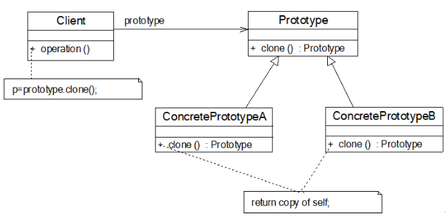
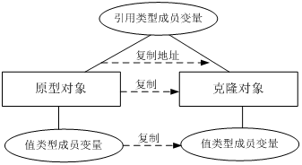
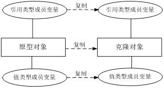
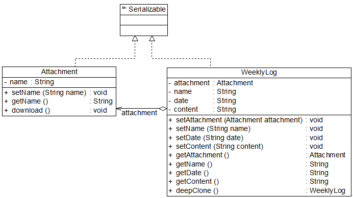
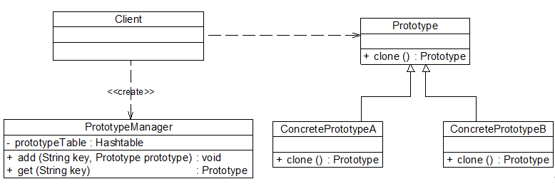

### # 原型模式概述

(1)  在使用原型模式时，我们需要首先创建一个原型对象，再通过复制这个原型对象来创建更多同类型的对象。原型模式(Prototype  Pattern)的定义：使用原型实例指定创建对象的种类，并且通过拷贝这些原型创建新的对象。原型模式是一种对象创建型模式。

(2) 原型模式的工作原理很简单：将一个原型对象传给那个要发动创建的对象，这个要发动创建的对象通过请求原型对象拷贝自己来实现创建过程。由于在软件系统中我们经常会遇到需要创建多个相同或者相似对象的情况，因此原型模式在真实开发中的使用频率还是非常高的。原型模式是一种“另类”的创建型模式，创建克隆对象的工厂就是原型类自身，工厂方法由克隆方法来实现。

(3) 需要注意的是通过克隆方法所创建的对象是全新的对象，它们在内存中拥有新的地址，通常对克隆所产生的对象进行修改对原型对象不会造成任何影响，每一个克隆对象都是相互独立的。通过不同的方式修改可以得到一系列相似但不完全相同的对象。

(4) 原型模式的结构如图所示：



(5) 在原型模式结构图中包含如下几个角色：

+ Prototype（抽象原型类）：它是声明克隆方法的接口，是所有具体原型类的公共父类，可以是抽象类也可以是接口，甚至还可以是具体实现类。
+ ConcretePrototype（具体原型类）：它实现在抽象原型类中声明的克隆方法，在克隆方法中返回自己的一个克隆对象。
+ Client（客户类）：让一个原型对象克隆自身从而创建一个新的对象，在客户类中只需要直接实例化或通过工厂方法等方式创建一个原型对象，再通过调用该对象的克隆方法即可得到多个相同的对象。由于客户类针对抽象原型类Prototype编程，因此用户可以根据需要选择具体原型类，系统具有较好的可扩展性，增加或更换具体原型类都很方便。

###  # 克隆方法的实现

原型模式的核心在于如何实现克隆方法，下面将介绍两种在Java语言中常用的克隆实现方法：

#### 1.通用实现方法 

通用的克隆实现方法是在具体原型类的克隆方法中实例化一个与自身类型相同的对象并将其返回，并将相关的参数传入新创建的对象中，保证它们的成员属性相同。示意代码如下所示：

```java
class ConcretePrototype implements Prototype {
    private String  attr; //成员属性
    public void  setAttr(String attr) {
        this.attr = attr;
    }
    public String  getAttr() {
        return this.attr;
    }
    public Prototype  clone() { //克隆方法 
        Prototype  prototype = new ConcretePrototype(); //创建新对象
        prototype.setAttr(this.attr);
        return prototype;
    }
}
```

在客户类中我们只需要创建一个ConcretePrototype对象作为原型对象，然后调用其clone()方法即可得到对应的克隆对象，如下代码所示：  

```java
Prototype obj1  = new ConcretePrototype();
obj1.setAttr("Sunny");
Prototype obj2  = obj1.clone();
```

这种方法可作为原型模式的通用实现，它与编程语言特性无关，任何面向对象语言都可以使用这种形式来实现对原型的克隆。

#### 2. Java语言提供的clone()方法 

学过Java语言的人都知道，所有的Java类都继承自java.lang.Object。事实上，Object类提供一个clone()方法，可以将一个Java对象复制一份。因此在Java中可以直接使用Object提供的clone()方法来实现对象的克隆，Java语言中的原型模式实现很简单。

需要注意的是能够实现克隆的Java类必须实现一个标识接口Cloneable，表示这个Java类支持被复制。如果一个类没有实现这个接口但是调用了clone()方法，Java编译器将抛出一个CloneNotSupportedException异常。如下代码所示：

```java
class ConcretePrototype implements  Cloneable {
    ……
    public Prototype  clone() {
　　    Object object = null;
　　    try {
　　　    　　object = super.clone();
　　    } catch (CloneNotSupportedException exception) {
　　　　    　System.err.println("Not support cloneable");
　　    }
　　    return (Prototype )object;
    }
    ……
}
```

在客户端创建原型对象和克隆对象也很简单，如下代码所示：  

```java
Prototype obj1  = new ConcretePrototype();
Prototype obj2  = obj1.clone();
```

一般而言，Java语言中的clone()方法满足：

(1) 对任何对象x，都有x.clone() != x，即克隆对象与原型对象不是同一个对象；

(2) 对任何对象x，都有x.clone().getClass() == x.getClass()，即克隆对象与原型对象的类型一样；

(3) 如果对象x的equals()方法定义恰当，那么x.clone().equals(x)应该成立。

为了获取对象的一份拷贝，我们可以直接利用Object类的clone()方法，具体步骤如下：

(1) 在派生类中覆盖基类的clone()方法，并声明为public；

(2) 在派生类的clone()方法中，调用super.clone()；

(3)派生类需实现Cloneable接口。

此时，Object类相当于抽象原型类，所有实现了Cloneable接口的类相当于具体原型类。

### # 浅克隆，深克隆 

在Java语言中，数据类型分为值类型（基本数据类型）和引用类型，值类型包括int、double、byte、boolean、char等简单数据类型，引用类型包括类、接口、数组等复杂类型。浅克隆和深克隆的主要区别在于是否支持引用类型的成员变量的复制。

#### 1.浅克隆 

在浅克隆中，如果原型对象的成员变量是值类型，将复制一份给克隆对象；如果原型对象的成员变量是引用类型，则将引用对象的地址复制一份给克隆对象，也就是说原型对象和克隆对象的成员变量指向相同的内存地址。简单来说，在浅克隆中，当对象被复制时只复制它本身和其中包含的值类型的成员变量，而引用类型的成员对象并没有复制，如图所示：



#### 2.深克隆 

在深克隆中，无论原型对象的成员变量是值类型还是引用类型，都将复制一份给克隆对象，深克隆将原型对象的所有引用对象也复制一份给克隆对象。简单来说，在深克隆中，除了对象本身被复制外，对象所包含的所有成员变量也将复制，如图所示：



在Java语言中，如果需要实现深克隆，可以通过序列化(Serialization)等方式来实现。序列化就是将对象写到流的过程，写到流中的对象是原有对象的一个拷贝，而原对象仍然存在于内存中。通过序列化实现的拷贝不仅可以复制对象本身，而且可以复制其引用的成员对象，因此通过序列化将对象写到一个流中，再从流里将其读出来，可以实现深克隆。需要注意的是能够实现序列化的对象其类必须实现Serializable接口，否则无法实现序列化操作。下面我们使用深克隆技术来实现工作周报和附件对象的复制，由于要将附件对象和工作周报对象都写入流中，因此**两个类均需要实现Serializable接口**，其结构如图所示： 



修改后的附件类Attachment代码如下：  

```java
import  java.io.*;
//附件类
class  Attachment implements Serializable
{
       private  String name; //附件名
       public  void setName(String name)
       {
              this.name  = name;
       }
       public  String getName()
       {
              return  this.name;
       }
     public void download()
     {
            System.out.println("下载附件，文件名为" + name);
     }
}
```

工作周报类WeeklyLog不再使用Java自带的克隆机制，而是通过序列化来从头实现对象的深克隆，我们需要重新编写clone()方法，修改后的代码如下：  

```java
import  java.io.*;
//工作周报类
class  WeeklyLog implements Serializable
{
       private  Attachment attachment;
       private  String name;
       private  String date;
       private  String content;
       public  void setAttachment(Attachment attachment) {
              this.attachment  = attachment;
       }
       public  void setName(String name) {
              this.name  = name;
       }
       public  void setDate(String date) {
              this.date  = date;
       }
       public  void setContent(String content) {
              this.content  = content;
       }
       public  Attachment getAttachment(){
              return  (this.attachment);
       }
       public  String getName() {
              return  (this.name);
       }
       public  String getDate() {
              return  (this.date);
       }
       public  String getContent() {
              return  (this.content);
       }
   //使用序列化技术实现深克隆
       public WeeklyLog deepClone() throws  IOException, ClassNotFoundException, OptionalDataException
       {
              //将对象写入流中
              ByteArrayOutputStream bao=new  ByteArrayOutputStream();
              ObjectOutputStream oos=new  ObjectOutputStream(bao);
              oos.writeObject(this);
             
              //将对象从流中取出
              ByteArrayInputStream bis=new  ByteArrayInputStream(bao.toByteArray());
              ObjectInputStream ois=new  ObjectInputStream(bis);
              return  (WeeklyLog)ois.readObject();
       }
}
```

客户端代码如下所示：  

```java
class Client
{
       public  static void main(String args[])
       {
              WeeklyLog  log_previous, log_new = null;
              log_previous  = new WeeklyLog(); //创建原型对象
              Attachment  attachment = new Attachment(); //创建附件对象
              log_previous.setAttachment(attachment);  //将附件添加到周报中
              try
              {
                     log_new =  log_previous.deepClone(); //调用深克隆方法创建克隆对象                  
              }
              catch(Exception e)
              {
                     System.err.println("克隆失败！");
              }
              //比较周报
              System.out.println("周报是否相同？ " + (log_previous ==  log_new));
              //比较附件
              System.out.println("附件是否相同？ " +  (log_previous.getAttachment() == log_new.getAttachment()));
       }
}
```

编译并运行程序，输出结果如下：  

```bash
周报是否相同？  false
附件是否相同？  false
```

从输出结果可以看出，由于使用了深克隆技术，附件对象也得以复制，因此用“==”比较原型对象的附件和克隆对象的附件时输出结果均为false。深克隆技术实现了原型对象和克隆对象的完全独立，对任意克隆对象的修改都不会给其他对象产生影响，是一种更为理想的克隆实现方式。

###  # 原型管理器的引入和实现

原型管理器(Prototype Manager)是将多个原型对象存储在一个集合中供客户端使用，它是一个专门负责克隆对象的工厂，其中定义了一个集合用于存储原型对象，如果需要某个原型对象的一个克隆，可以通过复制集合中对应的原型对象来获得。在原型管理器中针对抽象原型类进行编程，以便扩展。其结构如图所示：



### # 原型模式总结

原型模式作为一种快速创建大量相同或相似对象的方式，在软件开发中应用较为广泛，很多软件提供的复制(Ctrl + C)和粘贴(Ctrl + V)操作就是原型模式的典型应用，下面对该模式的使用效果和适用情况进行简单的总结。

#### 1.主要优点

(1) 当创建新的对象实例较为复杂时，使用原型模式可以简化对象的创建过程，通过复制一个已有实例可以提高新实例的创建效率。

(2) 扩展性较好，由于在原型模式中提供了抽象原型类，在客户端可以针对抽象原型类进行编程，而将具体原型类写在配置文件中，增加或减少产品类对原有系统都没有任何影响。

(3) 原型模式提供了简化的创建结构，工厂方法模式常常需要有一个与产品类等级结构相同的工厂等级结构，而原型模式就不需要这样，原型模式中产品的复制是通过封装在原型类中的克隆方法实现的，无须专门的工厂类来创建产品。

(4) 可以使用深克隆的方式保存对象的状态，使用原型模式将对象复制一份并将其状态保存起来，以便在需要的时候使用（如恢复到某一历史状态），可辅助实现撤销操作。

#### 2.主要缺点

(1) 需要为每一个类配备一个克隆方法，而且该克隆方法位于一个类的内部，当对已有的类进行改造时，需要修改源代码，违背了“开闭原则”。

(2) 在实现深克隆时需要编写较为复杂的代码，而且当对象之间存在多重的嵌套引用时，为了实现深克隆，每一层对象对应的类都必须支持深克隆，实现起来可能会比较麻烦。

#### 3.适用场景

(1) 创建新对象成本较大（如初始化需要占用较长的时间，占用太多的CPU资源或网络资源），新的对象可以通过原型模式对已有对象进行复制来获得，如果是相似对象，则可以对其成员变量稍作修改。

(2) 如果系统要保存对象的状态，而对象的状态变化很小，或者对象本身占用内存较少时，可以使用原型模式配合备忘录模式来实现。

(3) 需要避免使用分层次的工厂类来创建分层次的对象，并且类的实例对象只有一个或很少的几个组合状态，通过复制原型对象得到新实例可能比使用构造函数创建一个新实例更加方便。

 