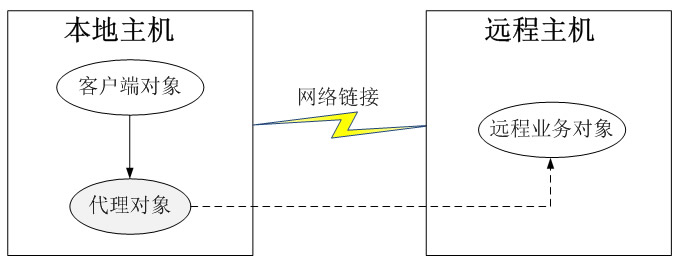

### # 代理模式概述 

(1) 代理模式是常用的结构型设计模式之一，当无法直接访问某个对象或访问某个对象存在困难时可以通过一个代理对象来间接访问，为了保证客户端使用的透明性，所访问的真实对象与代理对象需要实现相同的接口。根据代理模式的使用目的不同，代理模式又可以分为多种类型，例如保护代理、远程代理、虚拟代理、缓冲代理等，它们应用于不同的场合，满足用户的不同需求。

(2) 代理模式(Proxy Pattern)定义：给某一个对象提供一个代理或占位符，并由代理对象来控制对原对象的访问。

(3) 代理模式是一种对象结构型模式。在代理模式中引入了一个新的代理对象，代理对象在客户端对象和目标对象之间起到中介的作用，它去掉客户不能看到的内容和服务或者增添客户需要的额外的新服务。

### # 代理模式结构与实现

#### 1.模式结构

代理模式的结构比较简单，其核心是代理类，为了让客户端能够一致性地对待真实对象和代理对象，在代理模式中引入了抽象层，代理模式结构如图所示：


由图可知，代理模式包含如下三个角色：

**(1) Subject（抽象主题角色）：**它声明了真实主题和代理主题的共同接口，这样一来在任何使用真实主题的地方都可以使用代理主题，客户端通常需要针对抽象主题角色进行编程。

**(2) Proxy（代理主题角色）：**它包含了对真实主题的引用，从而可以在任何时候操作真实主题对象；在代理主题角色中提供一个与真实主题角色相同的接口，以便在任何时候都可以替代真实主题；代理主题角色还可以控制对真实主题的使用，负责在需要的时候创建和删除真实主题对象，并对真实主题对象的使用加以约束。通常，在代理主题角色中，客户端在调用所引用的真实主题操作之前或之后还需要执行其他操作，而不仅仅是单纯调用真实主题对象中的操作。

**(3) RealSubject（真实主题角色）：**它定义了代理角色所代表的真实对象，在真实主题角色中实现了真实的业务操作，客户端可以通过代理主题角色间接调用真实主题角色中定义的操作。

#### 2.模式实现

代理模式的结构图比较简单，但是在真实的使用和实现过程中要复杂很多，特别是代理类的设计和实现。

抽象主题类声明了真实主题类和代理类的公共方法，它可以是接口、抽象类或具体类，客户端针对抽象主题类编程，一致性地对待真实主题和代理主题，典型的抽象主题类代码如下：

```c#
abstract class Subject
{
    public abstract void Request();
}
```

真实主题类继承了抽象主题类，提供了业务方法的具体实现，其典型代码如下：  

```c#
class RealSubject : Subject
{
    public override void Request()
    {
        //业务方法具体实现代码
    }
}
```

代理类也是抽象主题类的子类，它维持一个对真实主题对象的引用，调用在真实主题中实现的业务方法，在调用时可以在原有业务方法的基础上附加一些新的方法来对功能进行扩充或约束，最简单的代理类实现代码如下：  

```c#
class Proxy : Subject
{
    private RealSubject realSubject = new RealSubject(); //维持一个对真实主题对象的引用

    public void PreRequest() 
    {
        ...
    }

    public override void Request() 
    {
        PreRequest();
        realSubject.Request(); //调用真实主题对象的方法
        PostRequest();
    }

    public void PostRequest() 
    {
        ...
    }
}
```

在实际开发过程中，代理类的实现比上述代码要复杂很多，代理模式根据其目的和实现方式不同可分为很多种类，其中常用的几种代理模式简要说明如下：

**(1) 远程代理(Remote Proxy)：为一个位于不同的地址空间的对象提供一个本地的代理对象，这个不同的地址空间可以是在同一台主机中，也可是在另一台主机中，远程代理又称为大使(Ambassador)。**

**(2) 虚拟代理(Virtual Proxy)：如果需要创建一个资源消耗较大的对象，先创建一个消耗相对较小的对象来表示，真实对象只在需要时才会被真正创建。**

**(3) 保护代理(Protect Proxy)：控制对一个对象的访问，可以给不同的用户提供不同级别的使用权限。**

**(4) 缓冲代理(Cache Proxy)：为某一个目标操作的结果提供临时的存储空间，以便多个客户端可以共享这些结果。**

**(5) 智能引用代理(Smart Reference Proxy)：当一个对象被引用时，提供一些额外的操作，例如将对象被调用的次数记录下来等。**

在这些常用的代理模式中，有些代理类的设计非常复杂，例如远程代理类，它封装了底层网络通信和对远程对象的调用，其实现较为复杂。

### # 远程代理

**远程代理(Remote Proxy)**是一种常用的代理模式，它使得客户端程序可以访问在远程主机上的对象，远程主机可能具有更好的计算性能与处理速度，可以快速响应并处理客户端的请求。远程代理可以将网络的细节隐藏起来，使得客户端不必考虑网络的存在。客户端完全可以认为被代理的远程业务对象是在本地而不是在远程，而远程代理对象承担了大部分的网络通信工作，并负责对远程业务方法的调用。

远程代理示意图如图所示，客户端对象不能直接访问远程主机中的业务对象，只能采取间接访问的方式。远程业务对象在本地主机中有一个代理对象，该代理对象负责对远程业务对象的访问和网络通信，它对于客户端对象而言是透明的。客户端无须关心实现具体业务的是谁，只需要按照服务接口所定义的方式直接与本地主机中的代理对象交互即可。



在Java语言中，可以通过RMI（Remote Method Invocation，远程方法调用）机制来实现远程代理，它能实现一个Java虚拟机中的对象调用另一个Java虚拟机中对象的方法。在RMI中，客户端可以通过一个桩（Stub）对象与远程业务对象那个接口一致，引出对于客户端而言，操作远程对象和本地桩对象没有任何区别，桩对象就是远程业务对象在本地主机的代理对象。

在RMI实现过程中，远程主机端有一个Skeleton（骨架）对象来负责与Stub对象通信，RMI的基本实现步骤如下：

(1) 客户端发起请求，将请求装交至RMI客户端的Stub类。

(2) Stub类将请求的接口、方法、参数等信息进行序列化。

(3) 将序列化后的流使用Socket传输至服务器端。

(4) 服务器端接收到流后将其转发至相应的Skeleton类。

(5) Skeleton类将请求信息反序列化后调用实际的业务处理类。

(6) 业务处理类处理完毕后将结果返回给Skeleton类。

(7) Skeleton类将结果序列化，再次通过Socket将流传给客户端的Stub。

(8) Stub在接收到流后进行反序列化，将反序列化后得到的Java Object对象返回给客户调用者。

至此，一次完整的远程方法调用完成。

### # 虚拟代理

**虚拟代理(Virtual Proxy)**也是一种常用的代理模式，对于一些占用系统资源较多或者加载时间较长的对象，可以给这些对象提供一个虚拟代理。在真实对象创建成功之前虚拟代理扮演真实对象的替身，而当真实对象创建之后，虚拟代理将用户的请求转发给真实对象。

通常，在以下两种情况下可以考虑使用虚拟代理：

(1) 由于对象本身的复杂性或者网络等原因导致一个对象需要较长的加载时间，此时可以用一个加载时间相对较短的代理对象来代表真实对象。通常在实现时可以结合多线程技术，一个线程用于显示代理对象，其他线程用于加载真实对象。这种虚拟代理模式可以应用在程序启动的时候，由于创建代理对象在时间和处理复杂度上要少于创建真实对象，因此，在程序启动时，可以用代理对象代替真实对象初始化，大大加速了系统的启动时间。当需要使用真实对象时，再通过代理对象来引用，而此时真实对象可能已经成功加载完毕，可以缩短用户的等待时间。

(2) 当一个对象的加载十分耗费系统资源的时候，也非常适合使用虚拟代理。虚拟代理可以让那些占用大量内存或处理起来非常复杂的对象推迟到使用它们的时候才创建，而在此之前用一个相对来说占用资源较少的代理对象来代表真实对象，再通过代理对象来引用真实对象。为了节省内存，在第一次引用真实对象时再创建对象，并且该对象可被多次重用，在以后每次访问时需要检测所需对象是否已经被创建，因此在访问该对象时需要进行存在性检测，这需要消耗一定的系统时间，但是可以节省内存空间，这是一种用时间换取空间的做法。

无论是以上哪种情况，虚拟代理都是用一个“虚假”的代理对象来代表真实对象，通过代理对象来间接引用真实对象，可以在一定程度上提高系统的性能。

### # Java动态代理

按照代理的创建时期，代理类可以分为两种。 

**静态代理：**由程序员创建或特定工具自动生成源代码，再对其编译。在程序运行前，代理类的.class文件就已经存在了。 

**动态代理：**在程序运行时，运用反射机制动态创建而成。     

动态代理作为代理模式的一种扩展形式，广泛应用于框架（尤其是基于AOP的框架）的设计与开发，本文将通过实例来讲解Java动态代理的实现过程。

通常情况下，代理模式中的**每一个代理类在编译之后都会生成一个class文件，代理类所实现的接口和所代理的方法都被固定，这种代理被称之为静态代理(Static Proxy)。**那么有没有一种机制**能够让系统在运行时动态创建代理类**？答案就是本文将要介绍的**动态代理(Dynamic Proxy)**。动态代理是一种较为高级的代理模式，它在事务管理、AOP（面向方面编程）等领域都发挥了重要的作用。

在传统的代理模式中，客户端通过Proxy类调用RealSubject类的request()方法，同时还可以在代理类中封装其他方法（如preRequest()和postRequest()等）。如果按照这种方法使用代理模式，那么**代理类和真实主题类都应该是事先已经存在的，代理类的接口和所代理方法都已明确指定，如果需要为不同的真实主题类提供代理类或者代理一个真实主题类中的不同方法，都需要增加新的代理类，这将导致系统中的类个数急剧增加，因此需要想办法减少系统中类的个数。动态代理可以让系统能够根据实际需要来动态创建代理类，让同一个代理类能够代理多个不同的真实主题类而且可以代理不同的方法。**

从JDK 1.3开始，Java语言提供了对动态代理的支持，Java语言实现动态代理时需要用到位于java.lang.reflect包中的一些类，现简要说明如下：

#### 1.Proxy类 

Proxy类提供了用于创建动态代理类和实例对象的方法，它是所创建的动态代理类的父类，它最常用的方法如下：

+ public static Class<?> getProxyClass(ClassLoader loader,Class<?>... interfaces)：该方法用于返回一个Class类型的代理类，在参数中需要提供类加载器并需要指定代理的接口数组（与真实主题类的接口列表一致）。
+ public static Object newProxyInstance(ClassLoader loader, Class<?>[]interfaces, InvocationHandler h)：该方法用于返回一个动态创建的代理类的实例，方法中第一个参数loader表示代理类的类加载器，第二个参数interfaces表示代理类所实现的接口列表（与真实主题类的接口列表一致），第三个参数h表示所指派的调用处理程序类。

#### 2.InvocationHandler接口 

InvocationHandler接口是代理处理程序类的实现接口，该接口作为代理实例的调用处理者的公共父类，每一个代理类的实例都可以提供一个相关的具体调用处理者（InvocationHandler接口的子类）。在该接口中声明了如下方法：

+ public Object invoke(Objectproxy, Method method, Object[] args)：该方法用于处理对代理类实例的方法调用并返回相应的结果，当一个代理实例中的业务方法被调用时将自动调用该方法。invoke()方法包含三个参数，其中第一个参数proxy表示代理类的实例，第二个参数method表示需要代理的方法，第三个参数args表示代理方法的参数数组。

**动态代理类需要在运行时指定所代理真实主题类的接口，客户端在调用动态代理对象的方法时，调用请求会将请求自动转发给InvocationHandler对象的invoke()方法，由invoke()方法来实现对请求的统一处理。**

下面通过一个简单实例来学习如何使用动态代理模式：

Sunny软件公司欲为公司OA系统数据访问层DAO增加方法调用日志，记录每一个方法被调用的时间和调用结果，现使用动态代理进行设计和实现。

```java
import java.lang.reflect.Proxy;
import java.lang.reflect.InvocationHandler;
import java.lang.reflect.InvocationTargetException;
import java.lang.reflect.Method;
import java.util.Calendar;
import java.util.GregorianCalendar;

//抽象UserDAO：抽象主题角色
interface AbstractUserDAO {
    public Boolean findUserById(String userId);
}

//抽象DocumentDAO：抽象主题角色
interface AbstractDocumentDAO {
    public Boolean deleteDocumentById(String documentId);
}

//具体UserDAO类：真实主题角色
class UserDAO implements AbstractUserDAO {
    public Boolean findUserById(String userId) {
        if (userId.equalsIgnoreCase("张无忌")) {
            System.out.println("查询ID为" + userId + "的用户信息成功！");
            return true;
        }
        else {
            System.out.println("查询ID为" + userId + "的用户信息失败！");
            return false;
        }
    }
}

//具体DocumentDAO类：真实主题角色
class DocumentDAO implements AbstractDocumentDAO {
    public Boolean deleteDocumentById(String documentId) {
        if (documentId.equalsIgnoreCase("D001")) {
            System.out.println("删除ID为" + documentId + "的文档信息成功！");
            return true;
        }
        else {
            System.out.println("删除ID为" + documentId + "的文档信息失败！");
            return false;
        }
    }
}

//自定义请求处理程序类
class DAOLogHandler implements InvocationHandler {
    private Calendar calendar;
    private Object object;

    public DAOLogHandler() {	
    }

    //自定义有参构造函数，用于注入一个需要提供代理的真实主题对象
    public DAOLogHandler(Object object) {
        this.object = object;
    }

    //实现invoke()方法，调用在真实主题类中定义的方法
    public Object invoke(Object proxy, Method method, Object[] args) throws Throwable {
        beforeInvoke();
        Object result = method.invoke(object, args); //转发调用
        afterInvoke();
        return null;
    }

    //记录方法调用时间
    public void beforeInvoke(){
        calendar = new GregorianCalendar();
        int hour = calendar.get(Calendar.HOUR_OF_DAY);
        int minute = calendar.get(Calendar.MINUTE);
        int second = calendar.get(Calendar.SECOND);
        String time = hour + ":" + minute + ":" + second;
        System.out.println("调用时间：" + time);
    }

    public void afterInvoke(){
        System.out.println("方法调用结束！" );
    }
}
```

 编写如下客户端测试代码： 

```java
class Client {
    public static void main(String args[]) {
        InvocationHandler handler = null;

        AbstractUserDAO userDAO = new UserDAO();
        handler = new DAOLogHandler(userDAO);
        AbstractUserDAO proxy = null;
        //动态创建代理对象，用于代理一个AbstractUserDAO类型的真实主题对象
        proxy = (AbstractUserDAO)Proxy.newProxyInstance(AbstractUserDAO. class.getClassLoader(), new Class[]{AbstractUserDAO.class}, handler);
        proxy.findUserById("张无忌"); //调用代理对象的业务方法

        System.out.println("------------------------------");

        AbstractDocumentDAO docDAO = new DocumentDAO();
        handler = new DAOLogHandler(docDAO);
        AbstractDocumentDAO proxy_new = null;
        //动态创建代理对象，用于代理一个AbstractDocumentDAO类型的真实主题对象
        proxy_new = (AbstractDocumentDAO)Proxy.newProxyInstance(Abstract DocumentDAO.class.getClassLoader(), new Class[]{AbstractDocumentDAO.class}, handler);
        proxy_new.deleteDocumentById("D002"); //调用代理对象的业务方法
    } 
}
```

编译并运行程序，输出结果如下： 

```bash
调用时间：13:47:14
查询ID为张无忌的用户信息成功！
方法调用结束！
------------------------------
调用时间：13:47:14
删除ID为D002的文档信息失败！
方法调用结束！
```

通过使用动态代理，我们可以实现对多个真实主题类的统一代理和集中控制。

**注：JDK中提供的动态代理只能代理一个或多个接口，如果需要动态代理具体类或抽象类，可以使用CGLib(Code Generation Library)等工具，CGLib是一个功能较为强大、性能和质量也较好的代码生成包，在许多AOP框架中都得以广泛应用，大家可以自行查阅相关资料来学习CGLib。**

### # 代理模式效果与适用场景

代理模式是常用的结构型设计模式之一，它为对象的间接访问提供了一个解决方案，可以对对象的访问进行控制。代理模式类型较多，其中远程代理、虚拟代理、保护代理等在软件开发中应用非常广泛。

#### 1.模式优点 

(1) 能够协调调用者和被调用者，在一定程度上降低了系统的耦合度。

(2) 客户端可以针对抽象主题角色进行编程，增加和更换代理类无须修改源代码，符合开闭原则，系统具有较好的灵活性和可扩展性。

(3) 远程代理为位于两个不同地址空间对象的访问提供了一种实现机制，可以将一些消耗资源较多的对象和操作移至性能更好的计算机上，提高系统的整体运行效率。

(4) 虚拟代理通过一个消耗资源较少的对象来代表一个消耗资源较多的对象，可以在一定程度上节省系统的运行开销。

(5) 保护代理可以控制对一个对象的访问权限，为不同用户提供不同级别的使用权限。

#### 2.模式缺点 

(1) 由于在客户端和真实主题之间增加了代理对象，因此有些类型的代理模式可能会造成请求的处理速度变慢，例如保护代理。

(2) 实现代理模式需要额外的工作，而且有些代理模式的实现过程较为复杂，例如远程代理。

#### 3.模式适用场景 

(1) 当客户端对象需要访问远程主机中的对象时可以使用远程代理。

(2) 当需要用一个消耗资源较少的对象来代表一个消耗资源较多的对象，从而降低系统开销、缩短运行时间时可以使用虚拟代理，例如一个对象需要很长时间才能完成加载时。

(3) 当需要为某一个被频繁访问的操作结果提供一个临时存储空间，以供多个客户端共享访问这些结果时可以使用缓冲代理。通过使用缓冲代理，系统无须在客户端每一次访问时都重新执行操作，只需直接从临时缓冲区获取操作结果即可。

(4) 当需要控制对一个对象的访问，为不同用户提供不同级别的访问权限时可以使用保护代理。

(5) 当需要为一个对象的访问（引用）提供一些额外的操作时可以使用智能引用代理。

 