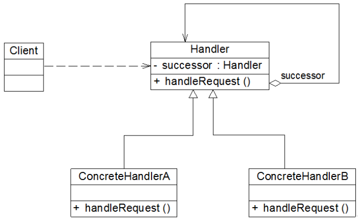

### # 职责链模式概述

(1) 很多情况下，在一个软件系统中可以处理某个请求的对象不止一个，例如SCM系统中的采购单审批，主任、副董事长、董事长和董事会都可以处理采购单，他们可以构成一条处理采购单的链式结构，采购单沿着这条链进行传递，这条链就称为职责链。职责链可以是一条直线、一个环或者一个树形结构，最常见的职责链是直线型，即沿着一条单向的链来传递请求。链上的每一个对象都是请求处理者，职责链模式可以将请求的处理者组织成一条链，并让请求沿着链传递，由链上的处理者对请求进行相应的处理，客户端无须关心请求的处理细节以及请求的传递，只需将请求发送到链上即可，实现请求发送者和请求处理者解耦。

(2) 职责链模式(Chain of Responsibility  Pattern)定义：避免请求发送者与接收者耦合在一起，让多个对象都有可能接收请求，将这些对象连接成一条链，并且沿着这条链传递请求，直到有对象处理它为止。职责链模式是一种对象行为型模式。

(3) 职责链模式结构的核心在于引入了一个抽象处理者。职责链模式结构如图所示：



(4) 在职责链模式结构图中包含如下几个角色：

+ Handler（抽象处理者）：它定义了一个处理请求的接口，一般设计为抽象类，由于不同的具体处理者处理请求的方式不同，因此在其中定义了抽象请求处理方法。因为每一个处理者的下家还是一个处理者，因此在抽象处理者中定义了一个抽象处理者类型的对象（如结构图中的successor），作为其对下家的引用。通过该引用，处理者可以连成一条链。
+ ConcreteHandler（具体处理者）：它是抽象处理者的子类，可以处理用户请求，在具体处理者类中实现了抽象处理者中定义的抽象请求处理方法，在处理请求之前需要进行判断，看是否有相应的处理权限，如果可以处理请求就处理它，否则将请求转发给后继者；在具体处理者中可以访问链中下一个对象，以便请求的转发。

(5) 在职责链模式里，很多对象由每一个对象对其下家的引用而连接起来形成一条链。请求在这个链上传递，直到链上的某一个对象决定处理此请求。发出这个请求的客户端并不知道链上的哪一个对象最终处理这个请求，这使得**系统可以在不影响客户端的情况下动态地重新组织链和分配责任。**

(6) 职责链模式的核心在于抽象处理者类的设计，抽象处理者的典型代码如下所示：

```java
abstract class Handler {
    //维持对下家的引用
    protected Handler successor;

    public void setSuccessor(Handler successor) {
        this.successor=successor;
    }

    public abstract void handleRequest(String request);
}
```

上述代码中，抽象处理者类定义了对下家的引用对象，以便将请求转发给下家，该对象的访问符可设为protected，在其子类中可以使用。在抽象处理者类中声明了抽象的请求处理方法，具体实现交由子类完成。

具体处理者是抽象处理者的子类，它具有两大作用：**第一是处理请求**，不同的具体处理者以不同的形式实现抽象请求处理方法handleRequest()；**第二是转发请求**，如果该请求超出了当前处理者类的权限，可以将该请求转发给下家。具体处理者类的典型代码如下：

```java
class ConcreteHandler extends Handler {
    public void handleRequest(String request) {
        if (请求满足条件) {
            //处理请求
        }
        else {
            this.successor.handleRequest(request);  //转发请求
        }
    }
}
```

在具体处理类中通过对请求进行判断可以做出相应的处理。

需要注意的是，**职责链模式并不创建职责链，职责链的创建工作必须由系统的其他部分来完成，一般是在使用该职责链的客户端中创建职责链。**职责链模式降低了请求的发送端和接收端之间的耦合，使多个对象都有机会处理这个请求。 

### # 纯与不纯的职责链模式

职责链模式可分为纯的职责链模式和不纯的职责链模式两种：

#### 1.纯的职责链模式 

一个纯的职责链模式要求一个具体处理者对象只能在两个行为中选择一个：**要么承担全部责任，要么将责任推给下家**，不允许出现某一个具体处理者对象在承担了一部分或全部责任后又将责任向下传递的情况。而且在纯的职责链模式中，**要求一个请求必须被某一个处理者对象所接收**，不能出现某个请求未被任何一个处理者对象处理的情况。在前面的采购单审批实例中应用的是纯的职责链模式。

#### 2.不纯的职责链模式 

在一个不纯的职责链模式中**允许某个请求被一个具体处理者部分处理后再向下传递，或者一个具体处理者处理完某请求后其后继处理者可以继续处理该请求，而且一个请求可以最终不被任何处理者对象所接收**。Java AWT 1.0中的事件处理模型应用的是不纯的职责链模式，其基本原理如下：由于窗口组件（如按钮、文本框等）一般都位于容器组件中，因此当事件发生在某一个组件上时，先通过组件对象的handleEvent()方法将事件传递给相应的事件处理方法，该事件处理方法将处理此事件，然后决定是否将该事件向上一级容器组件传播；上级容器组件在接到事件之后可以继续处理此事件并决定是否继续向上级容器组件传播，如此反复，直到事件到达顶层容器组件为止；如果一直传到最顶层容器仍没有处理方法，则该事件不予处理。**每一级组件在接收到事件时，都可以处理此事件，而不论此事件是否在上一级已得到处理，还存在事件未被处理的情况。**显然，这就是不纯的职责链模式，早期的Java AWT事件模型(JDK 1.0及更早)中的这种事件处理机制又叫**事件浮升(Event Bubbling)机制**。从Java.1.1以后，JDK使用观察者模式代替职责链模式来处理事件。目前，在JavaScript中仍然可以使用这种事件浮升机制来进行事件处理。

### # 职责链模式总结

职责链模式通过建立一条链来组织请求的处理者，请求将沿着链进行传递，请求发送者无须知道请求在何时、何处以及如何被处理，实现了请求发送者与处理者的解耦。在软件开发中，如果遇到有多个对象可以处理同一请求时可以应用职责链模式，例如在Web应用开发中创建一个**过滤器(Filter)链**来对请求数据进行过滤，在工作流系统中实现公文的分级审批等等，使用职责链模式可以较好地解决此类问题。

#### 1.主要优点 

(1) 职责链模式使得一个对象无须知道是其他哪一个对象处理其请求，对象仅需知道该请求会被处理即可，接收者和发送者都没有对方的明确信息，且链中的对象不需要知道链的结构，由客户端负责链的创建，降低了系统的耦合度。

(2) 请求处理对象仅需维持一个指向其后继者的引用，而不需要维持它对所有的候选处理者的引用，可简化对象的相互连接。

(3) 在给对象分派职责时，职责链可以给我们更多的灵活性，可以通过在运行时对该链进行动态的增加或修改来增加或改变处理一个请求的职责。

(4) 在系统中增加一个新的具体请求处理者时无须修改原有系统的代码，只需要在客户端重新建链即可，从这一点来看是符合“开闭原则”的。

#### 2.主要缺点 

(1) 由于一个请求没有明确的接收者，那么就不能保证它一定会被处理，该请求可能一直到链的末端都得不到处理；一个请求也可能因职责链没有被正确配置而得不到处理。

(2) 对于比较长的职责链，请求的处理可能涉及到多个处理对象，系统性能将受到一定影响，而且在进行代码调试时不太方便。

(3) 如果建链不当，可能会造成循环调用，将导致系统陷入死循环。

#### 3.适用场景 

(1) 有多个对象可以处理同一个请求，具体哪个对象处理该请求待运行时刻再确定，客户端只需将请求提交到链上，而无须关心请求的处理对象是谁以及它是如何处理的。

(2) 在不明确指定接收者的情况下，向多个对象中的一个提交一个请求。

(3) 可动态指定一组对象处理请求，客户端可以动态创建职责链来处理请求，还可以改变链中处理者之间的先后次序。 

 