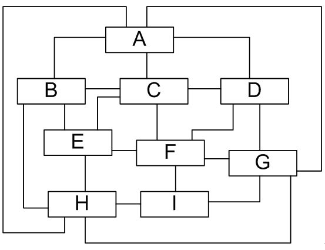
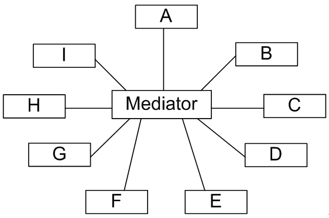
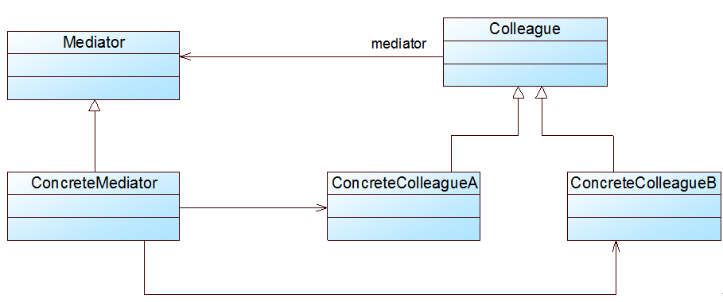

### # 中介者模式概述 

(1) 如果在一个系统中对象之间的联系呈现为网状结构，如图所示。对象之间存在大量的多对多联系，将导致系统非常复杂，这些对象既会影响别的对象，也会被别的对象所影响，这些对象称为**同事对象**，它们之间通过彼此的相互作用实现系统的行为。在网状结构中，几乎每个对象都需要与其他对象发生相互作用，而这种相互作用表现为一个对象与另外一个对象的直接耦合，这将导致一个过度耦合的系统。



(2) 中介者模式可以使对象之间的关系数量急剧减少，通过引入中介者对象，可以将系统的网状结构变成以中介者为中心的星形结构，如图所示。在这个星形结构中，同事对象不再直接与另一个对象联系，它通过中介者对象与另一个对象发生相互作用。中介者对象的存在保证了对象结构上的稳定，也就是说，系统的结构不会因为新对象的引入带来大量的修改工作。



(3) 如果在一个系统中对象之间存在多对多的相互关系，我们可以将对象之间的一些交互行为从各个对象中分离出来，并集中封装在一个中介者对象中，并由该中介者进行统一协调，这样对象之间多对多的复杂关系就转化为相对简单的一对多关系。通过引入中介者来简化对象之间的复杂交互，**中介者模式是“迪米特法则”的一个典型应用。**

(4) **中介者模式(Mediator Pattern)定义：**用一个中介对象（中介者）来封装一系列的对象交互，中介者使各对象不需要显式地相互引用，从而使其耦合松散，而且可以独立地改变它们之间的交互。中介者模式又称为调停者模式，它是一种对象行为型模式。

(5) 在中介者模式中，我们引入了用于协调其他对象/类之间相互调用的中介者类，为了让系统具有更好的灵活性和可扩展性，通常还提供了抽象中介者，其结构图如图所示：



在中介者模式结构图中包含如下几个角色：

+ Mediator（抽象中介者）：它定义一个接口，该接口用于与各同事对象之间进行通信。
+ ConcreteMediator（具体中介者）：它是抽象中介者的子类，通过协调各个同事对象来实现协作行为，它维持了对各个同事对象的引用。
+ Colleague（抽象同事类）：它定义各个同事类公有的方法，并声明了一些抽象方法来供子类实现，同时它维持了一个对抽象中介者类的引用，其子类可以通过该引用来与中介者通信。
+ ConcreteColleague（具体同事类）：它是抽象同事类的子类；每一个同事对象在需要和其他同事对象通信时，先与中介者通信，通过中介者来间接完成与其他同事类的通信；在具体同事类中实现了在抽象同事类中声明的抽象方法。

(6) 中介者模式的核心在于中介者类的引入，在中介者模式中，中介者类承担了两方面的职责：

 **① 中转作用（结构性）：**通过中介者提供的中转作用，各个同事对象就不再需要显式引用其他同事，当需要和其他同事进行通信时，可通过中介者来实现间接调用。该中转作用属于中介者在结构上的支持。

 **② 协调作用（行为性）：**中介者可以更进一步的对同事之间的关系进行封装，同事可以一致的和中介者进行交互，而不需要指明中介者需要具体怎么做，中介者根据封装在自身内部的协调逻辑，对同事的请求进行进一步处理，将同事成员之间的关系行为进行分离和封装。该协调作用属于中介者在行为上的支持。

(7) 在中介者模式中，典型的抽象中介者类代码如下所示：

```java
abstract class Mediator {
    protected ArrayList<Colleague> colleagues; //用于存储同事对象

    //注册方法，用于增加同事对象
    public void register(Colleague colleague) {
        colleagues.add(colleague);
    }

    //声明抽象的业务方法
    public abstract void operation();
}
```

在抽象中介者中可以定义一个同事类的集合，用于存储同事对象并提供注册方法，同时声明了具体中介者类所具有的方法。在具体中介者类中将实现这些抽象方法，典型的具体中介者类代码如下所示：  

```java
class ConcreteMediator extends Mediator {
    //实现业务方法，封装同事之间的调用
    public void operation() {
        ......
            ((Colleague)(colleagues.get(0))).method1(); //通过中介者调用同事类的方法
        ......
    }
}
```

在具体中介者类中将调用同事类的方法，调用时可以增加一些自己的业务代码对调用进行控制。

在抽象同事类中维持了一个抽象中介者的引用，用于调用中介者的方法，典型的抽象同事类代码如下所示：

```java
abstract class Colleague {
    protected Mediator mediator; //维持一个抽象中介者的引用

    public Colleague(Mediator mediator) {
        this.mediator=mediator;
    }

    public abstract void method1(); //声明自身方法，处理自己的行为

    //定义依赖方法，与中介者进行通信
    public void method2() {
        mediator.operation();
    }
}
```

在抽象同事类中声明了同事类的抽象方法，而在具体同事类中将实现这些方法，典型的具体同事类代码如下所示：  

```java
class ConcreteColleague extends Colleague {
    public ConcreteColleague(Mediator mediator) {
        super(mediator);
    }

    //实现自身方法
    public void method1() {
        ......
    }
}
```

在具体同事类ConcreteColleague中实现了在抽象同事类中声明的方法，其中方法method1()是同事类的**自身方法(Self-Method)**，用于处理自己的行为，而方法method2()是**依赖方法(Depend-Method)**，用于调用在中介者中定义的方法，依赖中介者来完成相应的行为，例如调用另一个同事类的相关方法。

(8) 在中介者模式的实际使用过程中，**如果需要引入新的具体同事类**，**只需要继承抽象同事类并实现其中的方法即可，由于具体同事类之间并无直接的引用关系，因此原有所有同事类无须进行任何修改，它们与新增同事对象之间的交互可以通过修改或者增加具体中介者类来实现；如果需要在原有系统中增加新的具体中介者类，只需要继承抽象中介者类（或已有的具体中介者类）并覆盖其中定义的方法即可，在新的具体中介者中可以通过不同的方式来处理对象之间的交互，也可以增加对新增同事的引用和调用。**在客户端中只需要修改少许代码（如果引入配置文件的话有时可以不修改任何代码）就可以实现中介者的更换。

### # 中介者模式总结

中介者模式**将一个网状的系统结构变成一个以中介者对象为中心的星形结构**，在这个星型结构中，使用中介者对象与其他对象的一对多关系来取代原有对象之间的多对多关系。中介者模式在事件驱动类软件中应用较为广泛，特别是基于GUI（Graphical User Interface，图形用户界面）的应用软件，此外，在类与类之间存在错综复杂的关联关系的系统中，中介者模式都能得到较好的应用。

#### 1.主要优点

(1) 中介者模式**简化了对象之间的交互**，它用中介者和同事的一对多交互代替了原来同事之间的多对多交互，一对多关系更容易理解、维护和扩展，将原本难以理解的网状结构转换成相对简单的星型结构。

(2) 中介者模式可将**各同事对象解耦**。中介者有利于各同事之间的松耦合，我们可以独立的改变和复用每一个同事和中介者，增加新的中介者和新的同事类都比较方便，更好地符合“开闭原则”。

(3) 可以**减少子类生成**，中介者将原本分布于多个对象间的行为集中在一起，改变这些行为只需生成新的中介者子类即可，这使各个同事类可被重用，无须对同事类进行扩展。

#### 2.主要缺点

在具体中介者类中包含了大量同事之间的交互细节，**可能会导致具体中介者类非常复杂**，使得系统难以维护。

#### 3.适用场景

(1) 系统中**对象之间存在复杂的引用关系**，系统结构混乱且难以理解。

(2) 一个对象由于引用了其他很多对象并且直接和这些对象通信，导致**难以复用该对象**。

(3) 想**通过一个中间类来封装多个类中的行为，而又不想生成太多的子类**。可以通过引入中介者类来实现，在中介者中定义对象交互的公共行为，如果需要改变行为则可以增加新的具体中介者类。

 


