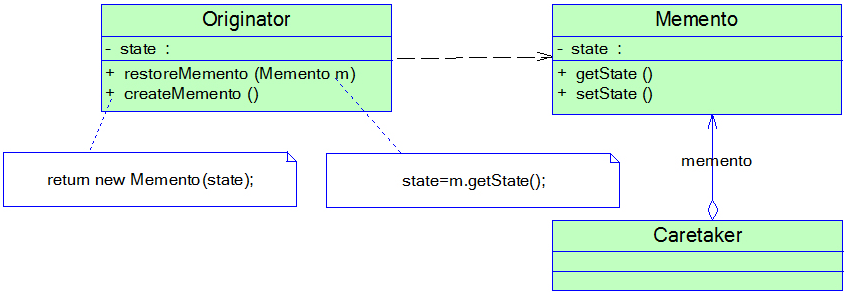
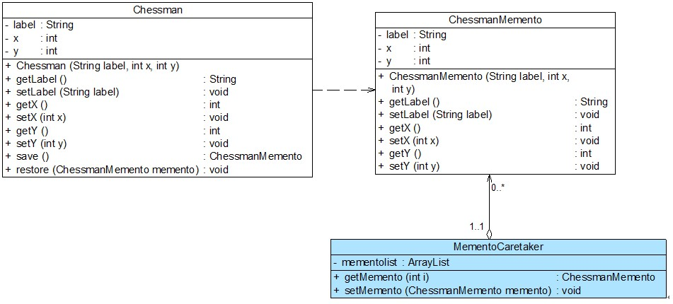

### # 备忘录模式概述

(1) 备忘录模式提供了一种状态恢复的实现机制，使得用户可以方便地回到一个特定的历史步骤，当新的状态无效或者存在问题时，可以使用暂时存储起来的备忘录将状态复原，当前很多软件都提供了撤销(Undo)操作，其中就使用了备忘录模式。

(2) **备忘录模式(Memento Pattern)定义：**在不破坏封装的前提下，捕获一个对象的内部状态，并在该对象之外保存这个状态，这样可以在以后将对象恢复到原先保存的状态。它是一种对象行为型模式，其别名为Token。

(3) 备忘录模式的核心是备忘录类以及用于管理备忘录的负责人类的设计，其结构如图所示：



在备忘录模式结构图中包含如下几个角色：

+ Originator（原发器）：它是一个普通类，可以创建一个备忘录，并存储它的当前内部状态，也可以使用备忘录来恢复其内部状态，一般将需要保存内部状态的类设计为原发器。
+ Memento（备忘录)：存储原发器的内部状态，根据原发器来决定保存哪些内部状态。备忘录的设计一般可以参考原发器的设计，根据实际需要确定备忘录类中的属性。需要注意的是，除了原发器本身与负责人类之外，备忘录对象不能直接供其他类使用，原发器的设计在不同的编程语言中实现机制会有所不同。
+ Caretaker（负责人）：负责人又称为管理者，它负责保存备忘录，但是不能对备忘录的内容进行操作或检查。在负责人类中可以存储一个或多个备忘录对象，它只负责存储对象，而不能修改对象，也无须知道对象的实现细节。

(4) 理解备忘录模式并不难，但关键在于**如何设计备忘录类和负责人类**。由于在备忘录中存储的是原发器的中间状态，因此需要防止原发器以外的其他对象访问备忘录，特别是不允许其他对象来修改备忘录。

(5) 下面我们通过简单的示例代码来说明如何使用Java语言实现备忘录模式：

在使用备忘录模式时，首先应该存在一个原发器类Originator，在真实业务中，原发器类是一个具体的业务类，它包含一些用于存储成员数据的属性，典型代码如下所示：

```java
package dp.memento;
public class Originator {
    private String state;

    public Originator(){}

    // 创建一个备忘录对象
    public Memento createMemento() {
        return new Memento(this);
    }

    // 根据备忘录对象恢复原发器状态
    public void restoreMemento(Memento m) {
        state = m.state;
    }

    public void setState(String state) {
        this.state=state;
    }

    public String getState() {
        return this.state;
    }
}
```

对于备忘录类Memento而言，它通常提供了与原发器相对应的属性（可以是全部，也可以是部分）用于存储原发器的状态，典型的备忘录类设计代码如下：  

```java
package dp.memento;
//备忘录类，默认可见性，包内可见
class Memento {
    private String state;

    public Memento(Originator o) {
        state = o.getState();
    }

    public void setState(String state) {
        this.state=state;
    }

    public String getState() {
        return this.state;
    }
}
```

在设计备忘录类时需要考虑其**封装性，除了Originator类，不允许其他类来调用备忘录类Memento的构造函数与相关方法**，如果不考虑封装性，允许其他类调用setState()等方法，将导致在备忘录中保存的历史状态发生改变，通过撤销操作所恢复的状态就不再是真实的历史状态，备忘录模式也就失去了本身的意义。

在使用Java语言实现备忘录模式时，一般通过将Memento类与Originator类定义在同一个包(package)中来实现封装，在Java语言中可使用默认访问标识符来定义Memento类，即保证其包内可见。只有Originator类可以对Memento进行访问，而限制了其他类对Memento的访问。在 Memento中保存了Originator的state值，如果Originator中的state值改变之后需撤销，可以通过调用它的restoreMemento()方法进行恢复。

对于负责人类Caretaker，它用于保存备忘录对象，并提供getMemento()方法用于向客户端返回一个备忘录对象，原发器通过使用这个备忘录对象可以回到某个历史状态。典型的负责人类的实现代码如下：

```java
package dp.memento;
public class Caretaker {
    private Memento memento;

    public Memento getMemento() {
        return memento;
    }

    public void setMemento(Memento memento) {
        this.memento=memento;
    }
}
```

在Caretaker类中不应该直接调用Memento中的状态改变方法，它的作用仅仅用于存储备忘录对象。将原发器备份生成的备忘录对象存储在其中，当用户需要对原发器进行恢复时再将存储在其中的备忘录对象取出。

### # 实现多次撤销

Sunny软件公司开发人员通过使用备忘录模式实现了中国象棋棋子的撤销操作，但是使用上述代码只能实现一次撤销，因为在负责人类中只定义一个备忘录对象来保存状态，后面保存的状态会将前一次保存的状态覆盖，但有时候用户需要撤销多步操作。如何实现多次撤销呢？本节将提供一种多次撤销的解决方案，那就是在负责人类中定义一个集合来存储多个备忘录，每个备忘录负责保存一个历史状态，在撤销时可以对备忘录集合进行逆向遍历，回到一个指定的历史状态，而且还可以对备忘录集合进行正向遍历，实现重做(Redo)操作，即取消撤销，让对象状态得到恢复。

改进之后的中国象棋棋子撤销功能结构图如图所示：



在图中，我们对负责人类MementoCaretaker进行了修改，在其中定义了一个ArrayList类型的集合对象来存储多个备忘录，其代码如下所示：  

```java
import java.util.*;

class MementoCaretaker {
    //定义一个集合来存储多个备忘录
    private ArrayList mementolist = new ArrayList();

    public ChessmanMemento getMemento(int i) {
        return (ChessmanMemento)mementolist.get(i);
    }

    public void setMemento(ChessmanMemento memento) {
        mementolist.add(memento);
    }
}
```

编写如下客户端测试代码：  

```java
class Client {
    private static int index = -1; //定义一个索引来记录当前状态所在位置
    private static MementoCaretaker mc = new MementoCaretaker();

    public static void main(String args[]) {
        Chessman chess = new Chessman("车",1,1);
        play(chess);		
        chess.setY(4);
        play(chess);
        chess.setX(5);
        play(chess);	
        undo(chess,index);
        undo(chess,index);	
        redo(chess,index);
        redo(chess,index);
    }

    //下棋
    public static void play(Chessman chess) {
        mc.setMemento(chess.save()); //保存备忘录
        index ++; 
        System.out.println("棋子" + chess.getLabel() + "当前位置为：" + "第" + chess.getX() + "行" + "第" + chess.getY() + "列。");
    }

    //悔棋
    public static void undo(Chessman chess,int i) {
        System.out.println("******悔棋******");
        index --; 
        chess.restore(mc.getMemento(i-1)); //撤销到上一个备忘录
        System.out.println("棋子" + chess.getLabel() + "当前位置为：" + "第" + chess.getX() + "行" + "第" + chess.getY() + "列。");
    }

    //撤销悔棋
    public static void redo(Chessman chess,int i) {
        System.out.println("******撤销悔棋******");	
        index ++; 
        chess.restore(mc.getMemento(i+1)); //恢复到下一个备忘录
        System.out.println("棋子" + chess.getLabel() + "当前位置为：" + "第" + chess.getX() + "行" + "第" + chess.getY() + "列。");
    }
} 
```

编译并运行程序，输出结果如下：  

```bash
棋子车当前位置为：第1行第1列。
棋子车当前位置为：第1行第4列。
棋子车当前位置为：第5行第4列。
******悔棋******
棋子车当前位置为：第1行第4列。
******悔棋******
棋子车当前位置为：第1行第1列。
******撤销悔棋******
棋子车当前位置为：第1行第4列。
******撤销悔棋******
棋子车当前位置为：第5行第4列。
```

**备注：给操作加个时代标志（该时段同一类操作给予同一个时代标识符）可以出现分支时仍能全部恢复或撤销。**

# # 再谈备忘录的封装

(1) 备忘录是一个很特殊的对象，只有原发器对它拥有控制的权力，负责人只负责管理，而其他类无法访问到备忘录，因此我们需要对备忘录进行封装。

(2) 为了实现对备忘录对象的封装，需要对备忘录的调用进行控制，对于原发器而言，它可以调用备忘录的所有信息，允许原发器访问返回到先前状态所需的所有数据；对于负责人而言，只负责备忘录的保存并将备忘录传递给其他对象；对于其他对象而言，只需要从负责人处取出备忘录对象并将原发器对象的状态恢复，而无须关心备忘录的保存细节。理想的情况是只允许生成该备忘录的那个原发器访问备忘录的内部状态。

(3) 在实际开发中，原发器与备忘录之间的关系是非常特殊的，它们要分享信息而不让其他类知道，实现的方法因编程语言的不同而有所差异，在C++中可以使用friend关键字，让原发器类和备忘录类成为友元类，互相之间可以访问对象的一些私有的属性；在Java语言中可以将原发器类和备忘录类放在一个包中，让它们之间满足默认的包内可见性，也可以将备忘录类作为原发器类的内部类，使得只有原发器才可以访问备忘录中的数据，其他对象都无法使用备忘录中的数据。

### # 备忘录模式总结

备忘录模式在很多软件的使用过程中普遍存在，但是在应用软件开发中，它的使用频率并不太高，因为现在很多基于窗体和浏览器的应用软件并没有提供撤销操作。如果需要为软件提供撤销功能，备忘录模式无疑是一种很好的解决方案。在一些字处理软件、图像编辑软件、数据库管理系统等软件中备忘录模式都得到了很好的应用。

#### 1.主要优点 

(1)它提供了一种状态恢复的实现机制，使得用户可以方便地回到一个特定的历史步骤，当新的状态无效或者存在问题时，可以使用暂时存储起来的备忘录将状态复原。

(2)备忘录实现了对信息的封装，一个备忘录对象是一种原发器对象状态的表示，不会被其他代码所改动。备忘录保存了原发器的状态，采用列表、堆栈等集合来存储备忘录对象可以实现多次撤销操作。

#### 2.主要缺点 

资源消耗过大，如果需要保存的原发器类的成员变量太多，就不可避免需要占用大量的存储空间，每保存一次对象的状态都需要消耗一定的系统资源。

#### 3.适用场景 

(1)保存一个对象在某一个时刻的全部状态或部分状态，这样以后需要时它能够恢复到先前的状态，实现撤销操作。

(2)防止外界对象破坏一个对象历史状态的封装性，避免将对象历史状态的实现细节暴露给外界对象。

 