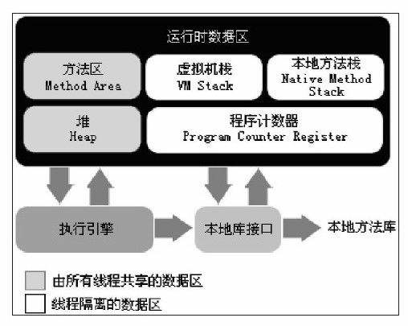
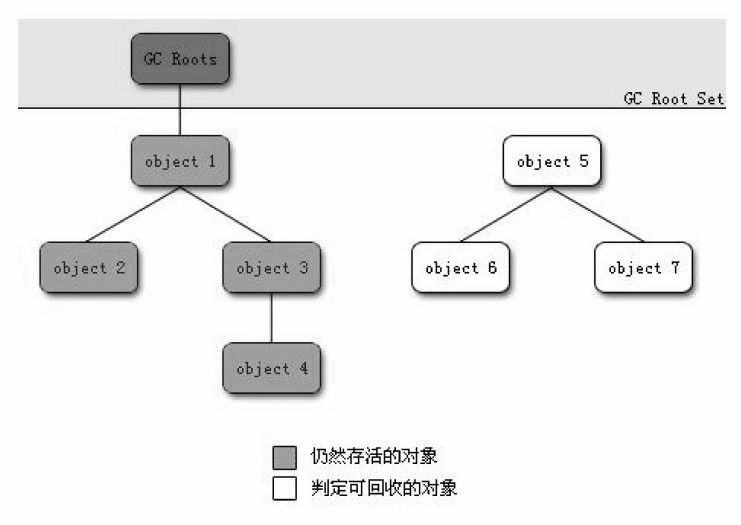
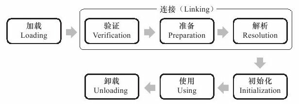
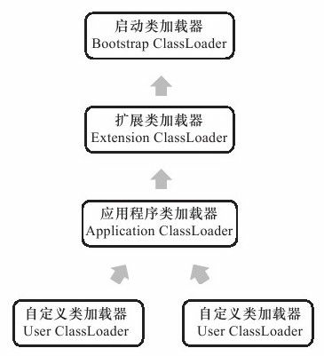

# JVM

## # Java 内存区域

> [《深入理解 Java 虚拟机》- 第 2 章 Java内存区域与内存溢出异常](https://book.douban.com/subject/24722612/)

根据《Java虚拟机规范（Java SE 7版）》的规定，Java虚拟机所管理的内存将会包括以下几个运行时数据区域，如图所示。

+ 程序计数器（Program Counter Register）是一块较小的内存空间，它可以看作是当前线程所执行的字节码的行号指示器。为了线程切换后能恢复到正确的执行位置，每条线程都需要有一个独立的程序计数器，各条线程之间计数器互不影响，独立存储，我们称这类内存区域为“线程私有”的内存。
+ Java虚拟机栈（Java Virtual Machine Stacks）也是线程私有的，它的生命周期与线程相同。虚拟机栈描述的是Java方法执行的内存模型：每个方法在执行的同时都会创建一个栈帧（Stack Frame）用于存储局部变量表、操作数栈、动态链接、方法出口等信息。每一个方法从调用直至执行完成的过程，就对应着一个栈帧在虚拟机栈中入栈到出栈的过程。
+ 本地方法栈（Native Method Stack）与虚拟机栈所发挥的作用是非常相似的，它们之间的区别不过是虚拟机栈为虚拟机执行Java方法（也就是字节码）服务，而本地方法栈则为虚拟机使用到的Native方法服务。
+ 对于大多数应用来说，Java堆（Java Heap）是Java虚拟机所管理的内存中最大的一块。Java堆是被所有线程共享的一块内存区域，在虚拟机启动时创建。此内存区域的唯一目的就是存放对象实例，几乎所有的对象实例都在这里分配内存。Java堆是垃圾收集器管理的主要区域，因此很多时候也被称做“GC堆”（Garbage Collected Heap）。
+ 方法区（Method Area）与Java堆一样，是各个线程共享的内存区域，它用于存储已被虚拟机加载的类信息、常量、静态变量、即时编译器编译后的代码等数据。

## # 垃圾收集算法

> [《深入理解 Java 虚拟机》- 第 3 章 垃圾收集器与内存分配策略](https://book.douban.com/subject/24722612/)

1.可达性分析算法

通过一系列的称为“GC Roots”的对象作为起始点，从这些节点开始向下搜索，搜索所走过的路径称为引用链（Reference Chain），当一个对象到GC Roots没有任何引用链相连（用图论的话来说，就是从GC Roots到这个对象不可达）时，则证明此对象是不可用的。如图3-1所示，对象object 5、object 6、object 7虽然互相有关联，但是它们到GC Roots是不可达的，所以它们将会被判定为是可回收的对象。

在Java语言中，可作为GC Roots的对象包括：虚拟机栈（栈帧中的本地变量表）中引用的对象；方法区中类静态属性引用的对象；方法区中常量引用的对象；本地方法栈中JNI（即一般说的Native方法）引用的对象。

2.垃圾收集算法

+ 标价-清除算法

  + 算法分为“标记”和“清除”两个阶段：首先标记出所有需要回收的对象，在标记完成后统一回收所有被标记的对象。
  + 主要不足有两个：一个是效率问题，标记和清除两个过程的效率都不高；另一个是空间问题，标记清除之后会产生大量不连续的内存碎片，空间碎片太多可能会导致以后在程序运行过程中需要分配较大对象时，无法找到足够的连续内存而不得不提前触发另一次垃圾收集动作。

+ 复制算法

  + 为了解决效率问题，一种称为“复制”（Copying）的收集算法出现了，它将可用内存按容量划分为大小相等的两块，每次只使用其中的一块。当这一块的内存用完了，就将还存活着的对象复制到另外一块上面，然后再把已使用过的内存空间一次清理掉。
  + 这样使得每次都是对整个半区进行内存回收，内存分配时也就不用考虑内存碎片等复杂情况，只要移动堆顶指针，按顺序分配内存即可，实现简单，运行高效。只是这种算法的代价是将内存缩小为了原来的一半，未免太高了一点。

+ 标记-整理算法

  + 标记过程仍然与“标记-清除”算法一样，但后续步骤不是直接对可回收对象进行清理，而是让所有存活的对象都向一端移动，然后直接清理掉端边界以外的内存。

+ 分代收集算法

  这种算法并没有什么新的思想，只是根据对象存活周期的不同将内存划分为几块。一般是把Java堆分为新生代和老年代，这样就可以根据各个年代的特点采用最适当的收集算法。在新生代中，每次垃圾收集时都发现有大批对象死去，只有少量存活，那就选用复制算法，只需要付出少量存活对象的复制成本就可以完成收集。而老年代中因为对象存活率高、没有额外空间对它进行分配担保，就必须使用“标记—清除”或者“标记—整理”算法来进行回收。

## # 类加载

> [《深入理解 Java 虚拟机》- 第 7 章 虚拟机类加载机制](https://book.douban.com/subject/24722612/)

类从被加载到虚拟机内存中开始，到卸载出内存为止，它的整个生命周期包括：加载（Loading）、验证（Verification）、准备（Preparation）、解析（Resolution）、初始化（Initialization）、使用（Using）和卸载（Unloading）7个阶段。其中验证、准备、解析3个部分统称为连接（Linking），这7个阶段的发生顺序如图所示。

+ 在加载阶段，虚拟机需要完成以下3件事情：
  + 通过一个类的全限定名来获取定义此类的二进制字节流。
  + 将这个字节流所代表的静态存储结构转化为方法区的运行时数据结构。
  + 在内存中生成一个代表这个类的java.lang.Class对象，作为方法区这个类的各种数据的访问入口。
+ 验证是连接阶段的第一步，这一阶段的目的是为了确保Class文件的字节流中包含的信息符合当前虚拟机的要求，并且不会危害虚拟机自身的安全。
+ 准备阶段是正式为类变量（被static修饰的变量）分配内存并设置类变量初始值的阶段，这些变量所使用的内存都将在方法区中进行分配。
+ 解析阶段是虚拟机将常量池内的符号引用替换为直接引用的过程。
  + 符号引用（Symbolic References）：符号引用以一组符号来描述所引用的目标，符号可以是任何形式的字面量，只要使用时能无歧义地定位到目标即可。
  + 直接引用（Direct References）：直接引用可以是直接指向目标的指针、相对偏移量或是一个能间接定位到目标的句柄。
+ 类初始化阶段是类加载过程的最后一步，到了该阶段，才真正开始执行类中定义的Java程序代码（或者说是字节码）。

## # 双亲委派模型

> [《深入理解 Java 虚拟机》- 第 7 章 虚拟机类加载机制](https://book.douban.com/subject/24722612/)

图中展示的类加载器之间的这种层次关系，称为类加载器的双亲委派模型（Parents Delegation Model）。双亲委派模型要求除了顶层的启动类加载器外，其余的类加载器都应当有自己的父类加载器。这里类加载器之间的父子关系一般不会以继承（Inheritance）的关系来实现，而是都使用组合（Composition）关系来复用父加载器的代码。

双亲委派模型的工作过程是：如果一个类加载器收到了类加载的请求，它首先不会自己去尝试加载这个类，而是把这个请求委派给父类加载器去完成，每一个层次的类加载器都是如此，因此所有的加载请求最终都应该传送到顶层的启动类加载器中，只有当父加载器反馈自己无法完成这个加载请求（它的搜索范围中没有找到所需的类）时，子加载器才会尝试自己去加载。