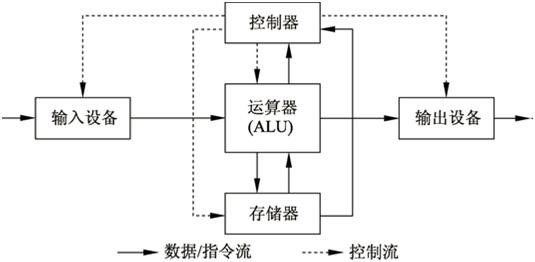

## 体系结构

(1)采用[存储程序方式](https://baike.baidu.com/item/%E5%AD%98%E5%82%A8%E7%A8%8B%E5%BA%8F%E6%96%B9%E5%BC%8F)，指令和数据不加区别混合存储在同一个[存储器](https://baike.baidu.com/item/%E5%AD%98%E5%82%A8%E5%99%A8)中，数据和程序在内存中是没有区别的,它们都是内存中的数据,当EIP[指针](https://baike.baidu.com/item/%E6%8C%87%E9%92%88)指向哪 CPU就加载那段内存中的数据,如果是不正确的[指令格式](https://baike.baidu.com/item/%E6%8C%87%E4%BB%A4%E6%A0%BC%E5%BC%8F),CPU就会发生错误中断. 在现在CPU的保护模式中,每个内存段都有其描述符,这个描述符记录着这个内存段的访问权限(可读,可写,可执行).这就变相的指定了哪些内存中存储的是指令哪些是数据）

指令和数据都可以送到[运算器](https://baike.baidu.com/item/%E8%BF%90%E7%AE%97%E5%99%A8)进行运算，即由指令组成的程序是可以修改的。

(2)存储器是按地址访问的线性[编址](https://baike.baidu.com/item/%E7%BC%96%E5%9D%80)的一维结构，每个单元的位数是固定的。

(3)指令由[操作码](https://baike.baidu.com/item/%E6%93%8D%E4%BD%9C%E7%A0%81)和地址组成。操作码指明本指令的操作类型,[地址码](https://baike.baidu.com/item/%E5%9C%B0%E5%9D%80%E7%A0%81)指明[操作数](https://baike.baidu.com/item/%E6%93%8D%E4%BD%9C%E6%95%B0)和地址。操作数本身无数据类型的标志，它的数据类型由操作码确定。

(4)通过执行指令直接发出[控制信号](https://baike.baidu.com/item/%E6%8E%A7%E5%88%B6%E4%BF%A1%E5%8F%B7)控制计算机的操作。指令在存储器中按其执行顺序存放，由指令计数器指明要执行的指令所在的[单元地址](https://baike.baidu.com/item/%E5%8D%95%E5%85%83%E5%9C%B0%E5%9D%80)。指令计数器只有一个，一般按顺序递增，但执行顺序可按运算结果或当时的外界条件而改变。

(5)以运算器为中心，I/O设备与存储器间的[数据传送](https://baike.baidu.com/item/%E6%95%B0%E6%8D%AE%E4%BC%A0%E9%80%81)都要经过运算器。

(6)数据以二进制表示。

