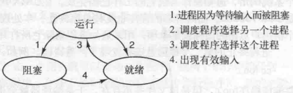

# 操作系统

## # 进程

> [《现代操作系统》- 第 2 章 进程与线程](https://book.douban.com/subject/3852290/)

### 进程模型

在进程模型中，计算机上所有可运行的软件，通常也包括操作系统，被组织成若干**顺序进程**（sequential process），简称**进程**（process）。一个进程就是一个正在执行程序的实例，包括程序计数器、寄存器和变量的当前值。

### 进程的创建

- **4 种**主要事件会导致进程的创建：
  1. 系统初始化。
  2. 正在运行的程序执行了创建进程的系统调用。
  3. 用户请求创建一个新进程。
  4. 一个批处理作业的初始化。

- 从技术上看，在以上所有情形中，新进程都是由于一个已存在的进程执行了一个用于创建进程的系统调用而创建的。

- 在 UNIX 系统中，只有一个系统调用可以用来创建新进程：fork。
- 在 Windows 中，一个 Win32 函数调用 CreateProcess 既处理进程的创建，也负责把正确的程序装入新的进程。

### 进程的终止

进程的终止，通常由下列条件引起：

+ 正常退出（自愿）
+ 出错退出（自愿）
+ 严重错误（非自愿）
+ 被其他进程杀死（非自愿）

### 进程的状态

进程的三种状态：

1. 运行态：该时刻进程实际占用 CPU。
2. 就绪态：可运行，但因为其他进程正在运行而暂时停止。
3. 阻塞态：除非某种外部事件发生，否则进程不能运行。

## # 进程之间通信方式

> [《现代操作系统》- 第 2 章 进程与线程](https://book.douban.com/subject/3852290/)
>
> [进程间通信IPC (InterProcess Communication)](https://www.jianshu.com/p/c1015f5ffa74)

### 竞争条件

两个或多个进程读写某些共享数据，而最后的结果取决于进程运行的精确时序，称为**竞争条件**（race condition）。

### 临界区

对共享内存进行访问的程序片段称作**临界区域**（critical region）或**临界区**（critical section）。如果能使两个进程不可能同时处于临界区，就能够避免竞争条件。

### 进程间通信的 7 种方式

1. **管道/匿名管道（pipe）**

   管道的实质是一个内核缓冲区，进程以先进先出的方式从缓冲区存取数据，管道一端的进程顺序的将数据写入缓冲区，另一端的进程则顺序的读出数据。

2. **有名管道（fifo）**

   有名管道不同于匿名管道之处在于它提供了一个路径名与之关联，以有名管道的文件形式存在于文件系统中，这样，即使与有名管道的创建进程不存在亲缘关系的进程，只要可以访问该路径，就能够彼此通过有名管道相互通信，因此，通过有名管道不相关的进程也能交换数据。

3. **信号（signal）**

   信号是软件层次上对中断机制的一种模拟，是一种异步通信方式。信号可以在用户空间进程和内核之间直接交互，内核可以利用信号来通知用户空间的进程发生了哪些系统事件。

4. **消息（message）队列**
   - 消息队列是消息的链表,具有特定的格式,存放在内存中并由消息队列标识符标识。
   - 消息队列允许一个或多个进程向它写入与读取消息。
   - 管道和消息队列的通信数据都是先进先出的原则。
   - 消息队列可以实现消息的随机查询，消息不一定要以先进先出的次序读取，也可以按消息的类型读取，比FIFO更有优势。
   - 消息队列克服了信号承载信息量少，管道只能承载无格式字节流以及缓冲区大小受限等缺。

5. **共享内存（share memory）**

   - 使得多个进程可以可以直接读写同一块内存空间，是最快的可用IPC形式。是针对其他通信机制运行效率较低而设计的。
   - 为了在多个进程间交换信息，内核专门留出了一块内存区，可以由需要访问的进程将其映射到自己的私有地址空间。进程就可以直接读写这一块内存而不需要进行数据的拷贝，从而大大提高效率。
   - 由于多个进程共享一段内存，因此需要依靠某种同步机制（如信号量）来达到进程间的同步及互斥。

6. **信号量（semaphore）**

   信号量是一个计数器，用于多进程对共享数据的访问，信号量的意图在于进程间同步。

7. **套接字（socket）**

   - 套接字是一种通信机制，凭借这种机制，客户/服务器（即要进行通信的进程）系统的开发工作既可以在本地单机上进行，也可以跨网络进行。也就是说它可以让不在同一台计算机但通过网络连接计算机上的进程进行通信。
   - 套接字是支持TCP/IP的网络通信的基本操作单元，可以看做是不同主机之间的进程进行双向通信的端点，简单的说就是通信的两方的一种约定，用套接字中的相关函数来完成通信过程。

## # 线程

> [《现代操作系统》- 第 2 章 进程与线程](https://book.douban.com/subject/3852290/)
>
> [线程](https://zh.wikipedia.org/wiki/%E7%BA%BF%E7%A8%8B)

### 概念

线程（thread）是操作系统能够进行运算调度的最小单位。它被包含在进程之中，是进程中的实际运作单位。一条线程指的是进程中一个单一顺序的控制流，一个进程中可以并发多个线程，每条线程并行执行不同的任务。在 Unix System V 及 SunOS 中也被称为轻量级进程（lightweight processes），但轻量级进程更多指内核线程（kernel thread），而把用户线程（user thread）称为线程。

### 使用线程的原因

+ 有了多线程之后，并行实体才拥有共享同一个地址空间和所有可用数据的能力。这是多进制模型（它们具有不同的地址空间）所无法表达的。
+ 线程比进程更轻量级，它们比进程更容易创建，也更容易撤销。
+ 如果存在大量的计算和大量的 I/O 处理，拥有多个线程允许这些活动彼此重叠运行，从而加快应用程序执行的速度。
+ 在多 CPU 系统中，多线程是有益的，这让真正的并行有了实现的可能。