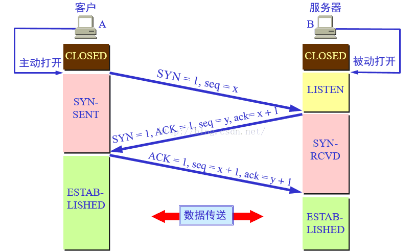
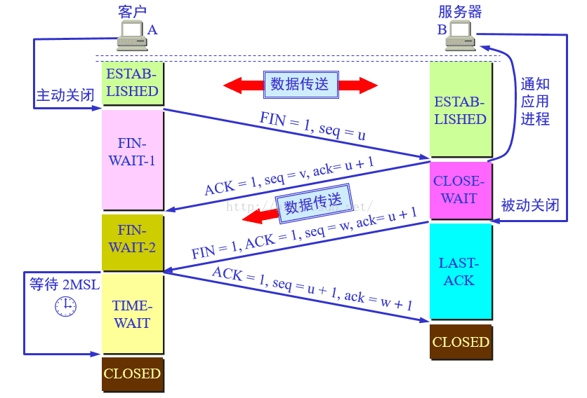

# 计算机网络机知识点

## TCP 与 UDP 各自特点及区别

> [《计算机网络》- 第 5 章 运输层](https://book.douban.com/subject/26960678/)

### UDP（User Datagram Protocol，用户数据报协议）

UDP 协议是面向无连接的用户数据报协议，在传输数据之前不需要先建立连接。远地主机的运输层收到UDP报文后，不需要给出任何确认。 

### TCP（Transmission Control Protocol，传输控制协议）

TCP 是提供面向连接的服务。在传输数据前必须先建立连接，数据传输完毕后要释放连接。 

### 区别

- 是否面向连接：TCP 向连接，UDP 是面向无连接 
- 是否可靠：TCP 可靠，UDP 尽最大努力交付，不可靠  
- 速度：TCP 的速度慢，UDP 的速度快
- 效率：TCP 是基于连接的，速度慢，有校验等，所以传送相同的数据，要比UDP发送的包多很多
- 是否能够广播：TCP 不能，UDP 能广播
- 首部大小：TCP 20 个字节，UDP 8 个字节
- 应用场合：TCP 应用于传输大量数据及数据完整性要求高的场合，UDP 用于传输少量数据及通信实时性要求高的场合

## TCP 连接与释放（三次握手与四次挥手）

> [《计算机网络》- 第 5 章 运输层](https://book.douban.com/subject/26960678/)
>
> [简述TCP连接的建立与释放（三次握手、四次挥手）](https://www.cnblogs.com/zhuwq585/p/6138775.html)

### 连接 - 三次握手

+ 第一次握手：客户端的应用进程主动打开，并向发武器发出请求报文段。其首部中：SYN=1，seq=x。

+ 第二次握手：服务器应用进程被动打开。若同意客户端的请求，则发回确认报文，其首部中：SYN=1，ACK=1，seq=y，ack=x+1。

+ 第三次握手：客户端收到确认报文之后，通知上层应用进程连接已建立，并向服务器发出确认报文，其首部：ACK=1，seq=x+1，ack=y+1。当服务器收到客户端的确认报文之后，也通知其上层应用进程连接已建立。



在这个过程中，通信双方的状态如图，各状态为：

+ CLOSED：关闭状态
+ LISTEN：监听状态
+ SYN-SENT：同步已发送
+ SYN-RCVD：同步收到
+ ESTABLISHED：连接已建立

### 释放 - 四次挥手

+ 第一次挥手：数据传输结束以后，客户端的应用进程发出连接释放报文段，并停止发送数据，其首部：FIN=1，seq=u。
+ 第二次挥手：服务器端收到连接释放报文段之后，发出确认报文，其首部：ack=u+1，seq=v。此时本次连接就进入了半关闭状态，客户端不再向服务器发送数据。而服务器端仍会继续发送。
+ 第三次挥手：若服务器已经没有要向客户端发送的数据，其应用进程就通知服务器释放TCP连接。这个阶段服务器所发出的最后一个报文的首部应为：FIN=1，ACK=1，seq=w，ack=u+1。
+ 第四次挥手：客户端收到连接释放报文段之后，必须发出确认：ACK=1，seq=u+1，ack=w+1。 再经过 2MSL（最长报文端寿命）后，本次 TCP 连接真正结束。



在这个过程中，通信双方的状态如图，其中：

+ ESTABLISHED：连接建立状态
+ FIN-WAIT-1：终止等待1状态
+ FIN-WAIT-2：终止等待2状态
+ CLOSE-WAIT：关闭等待状态
+ LAST-ACK：最后确认状态
+ TIME-WAIT：时间等待状态
+ CLOSED：关闭状态

报文中重要字段说明：

+ seq（序号）：TCP连接字节流中每一个字节都会有一个编号，而本字段的值指的是本报文段所发送数据部分第一个字节的序号。
+ ack（确认号）：表示期望收到的下一个报文段数据部分的第一个字节的编号，编号为ack-1及以前的字节已经收到。
+ SYN：当本字段为1时，表示这是一个连接请求或者连接接受报文。
+ ACK：仅当本字段为1时，确认号才有效。
+ FIN：用来释放一个连接。当本字段为1时，表示此报文段的发送端数据已发送完毕，要求释放运输连接。

## HTTP

> [《图解 HTTP》](https://book.douban.com/subject/25863515/)

### 特点

+ HTTP 是不保存状态的协议。

### 首部

+ **请求报文首部**构成：方法、URI、HTTP 版本、HTTP 首部字段

  ```http
  GET / HTTP/1.1
  Host: example.com
  User-Agent: Mozilla/5.0 (Windows NT 6.1; WOW64; rv:13.0) Gecko/20100101 Firefox/13.0
  Accept: text/html,application/xhtml+xml,application/xml;q=0.9,*/*; q=0.8
  Accept-Language: ja,en-us;q=0.7,en;q=0.3
  Accept-Encoding: gzip, deflate
  DNT: 1
  ```

+ **响应报文首部**构成：HTTP 版本、状态码（数字和原因短语）、HTTP 首部字段

  ```http
  HTTP/1.1 304 Not Modified
  Date: Thu, 07 Jun 2012 07:21:36 GMT
  Server: Apache
  Connection: close
  Etag: "45bae1-16a-46d776ac"
  ```

+ **首部字段**举例：

  | 首部字段名       | 说明                         |
  | ---------------- | ---------------------------- |
  | Cache-Control    | 控制缓存的行为               |
  | Date             | 创建报文的日期时间           |
  | Accept           | 用户代理可处理的媒体类型     |
  | Accept-Language  | 优先的语言（自然语言）       |
  | Accept-Encoding  | 优先的内容编码               |
  | Host             | 请求资源所在服务器           |
  | Location         | 令客户端重定向至指定URI      |
  | WWW-Authenticate | 服务器对客户端的认证信息     |
  | Content-Type     | 实体主体的媒体类型           |
  | Content-Length   | 实体主体的大小（单位：字节） |

### 方法

1. GET：获取资源。

   GET 方法用来请求访问已被 URI 识别的资源。指定的资源经服务器端解析后返回响应内容。

2. POST：传输实体主体。

   虽然用 GET 方法也可以传输实体的主体，但一般不用 GET 方法进行传输，而是用 POST 方法。虽说 POST 的功能与 GET 很相似，但 POST 的主要目的并不是获取响应的主体内容。

3. PUT：传输文件

   PUT 方法用来传输文件。就像 FTP 协议的文件上传一样，要求在请求报文的主体中包含文件内容，然后保存到请求 URI 指定的位置。

4. HEAD：获得报文首部

   HEAD 方法和 GET 方法一样，只是不返回报文主体部分。用于确认 URI 的有效性及资源更新的日期时间等。

5. DELETE：删除文件

   DELETE 方法用来删除文件，是与 PUT 相反的方法。DELETE 方法按请求 URI 删除指定的资源。

6. OPTIONS：询问支持的方法

   OPTIONS 方法用来查询针对请求 URI 指定的资源支持的方法。

7. TRACE：追踪路径

   TRACE 方法是让 Web 服务器端将之前的请求通信环回给客户端的方法。

8. CONNECT：要求用隧道协议连接代理

   CONNECT 方法要求在与代理服务器通信时建立隧道，实现用隧道协议进行 TCP 通信。主要使用 SSL（Secure Sockets Layer，安全套接层）和 TLS（Transport Layer Security，传输层安全）协议把通信内容加密后经网络隧道传输。

### 状态码

| 状态码 | 类别                             | 原因短语                   | 举例                                                         |
| :----: | -------------------------------- | -------------------------- | ------------------------------------------------------------ |
|  1XX   | Informational（信息性状态码）    | 接收的请求正在处理         |                                                              |
|  2XX   | Success（成功状态码）            | 请求正常处理完毕           | 200 OK - 请求成功                                            |
|  3XX   | Redirection（重定向状态码）      | 需要进行附加操作以完成请求 | 301 Moved Permanently - 永久重定向、<br />302 Found - 临死重定向 |
|  4XX   | Client Error（客户端错误状态码） | 服务器无法处理请求         | 400 Bad Request - 请求报文中存在语法错误、<br />401 Unauthorized - 请求需要认证、<br />403 Forbidden - 请求被拒绝、<br />404 Not Found - 未找到请求的资源 |
|  5XX   | Server Error（服务端错误状态码） | 服务器处理请求出错         | 500 Internal Server Error - 服务器执行请求时出现故障         |

### Cookie

Cookie 技术通过在请求和响应报文中写入 Cookie 信息来控制客户端的状态。

Cookie 会根据从服务器端发送的响应报文内的一个叫做 Set-Cookie 的首部字段信息，通知客户端保存 Cookie。当下次客户端再往该服务器发送请求时，客户端会自动在请求报文中加入 Cookie 值后发送出去。

服务器端发现客户端发送过来的 Cookie 后，会去检查究竟是从哪一个客户端发来的连接请求，然后对比服务器上的记录，最后得到之前的状态信息。