# 设计模式

> [《设计模式的艺术》](https://book.douban.com/subject/20493657/)
>
> [史上最全设计模式导学目录](https://blog.csdn.net/lovelion/article/details/17517213)

## 创建型模式

### 简单工厂模式

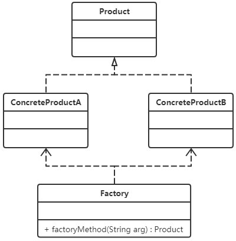

### 工厂方法模式

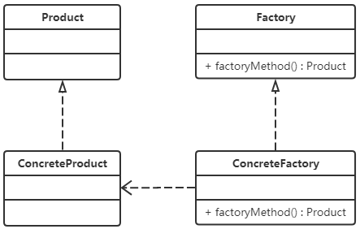

### 抽象工厂模式

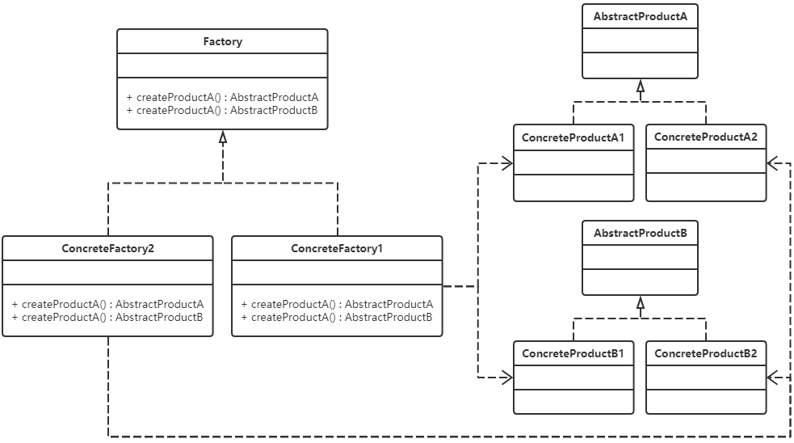

### 单例模式

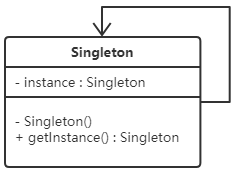

```java
/**
 * 枚举实现的单例模式，代码简洁，线程安全，枚举单例可以自己处理序列化
 */
private static enum Singleton{
    INSTANCE;
}
/**
 * 扩展写法
 */
public class EnumSingleton{
    private EnumSingleton(){}
    
    public static EnumSingleton getInstance(){
        return Singleton.INSTANCE.getInstance();
    }
    
    private static enum Singleton{
        INSTANCE;
  
        private EnumSingleton singleton;
        
        private Singleton(){
            singleton = new EnumSingleton();
        }
        
        public EnumSingleton getInstance(){
            return singleton;
        }
    }
}
```

### 原型模式

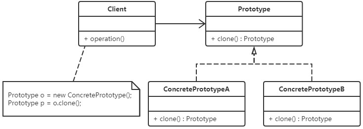

### 构建者模式

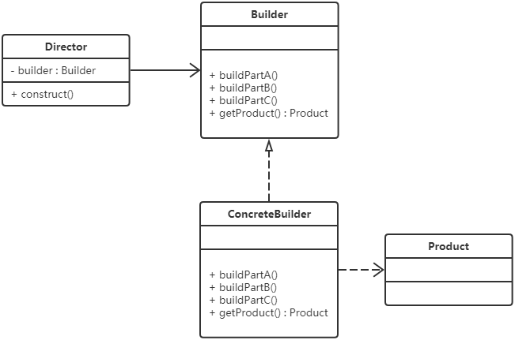

## 结构型模式

### 适配器模式

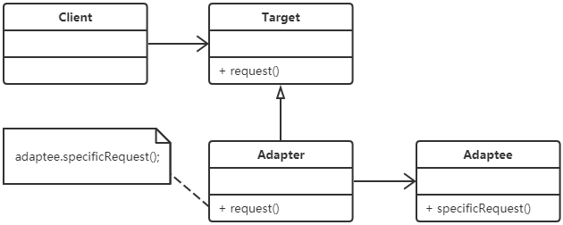

### 桥接模式

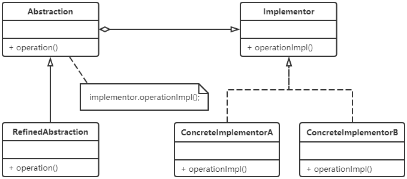

### 组合模式


### 装饰模式

### 外观模式

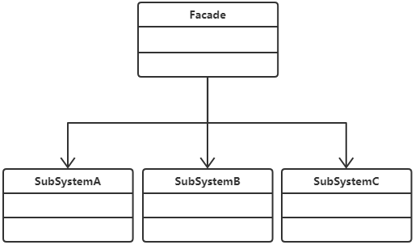

### 享元模式

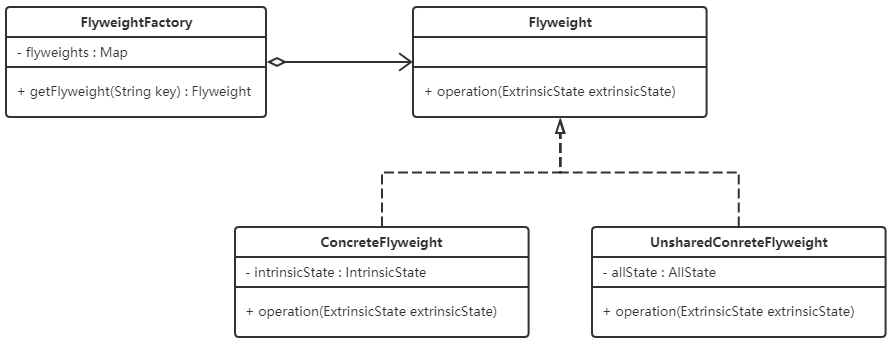

### 代理模式

## 行为型模式

### 职责链模式

### 命令模式

### 解释器模式

### 迭代器模式

### 中介者模式

### 备忘录模式

### 观察者模式

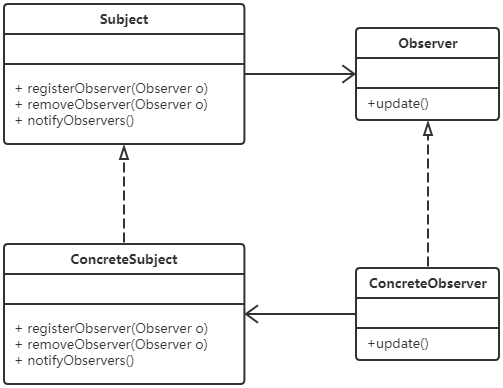

### 状态模式

### 策略模式

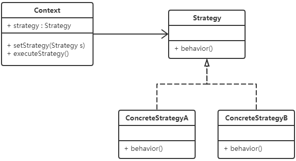

### 模板方法模式

### 访问者模式


