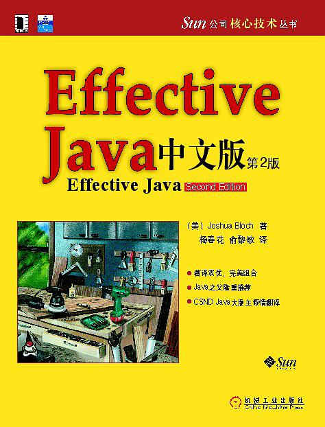

# Effective Java

> 汲取**java编程经验**，参考自书籍[《Effective Java, 2nd Edition》](https://book.douban.com/subject/3360807/)。
>
> 下载链接：<http://readfree.me/book/27047716/>

## 学习进度

- [x] 第1章 引言
- [x] 第2章 创建和销毁对象
- [x] 第3章 对于所有对象都通用的方法
- [x] 第4章 类和接口
- [x] 第5章 泛型
- [x] 第6章 枚举和注解
- [x] 第7章 方法
- [x] 第8章 通用程序设计
- [x] 第9章 异常
- [x] 第10章 并发
- [ ] 第11章 序列化
