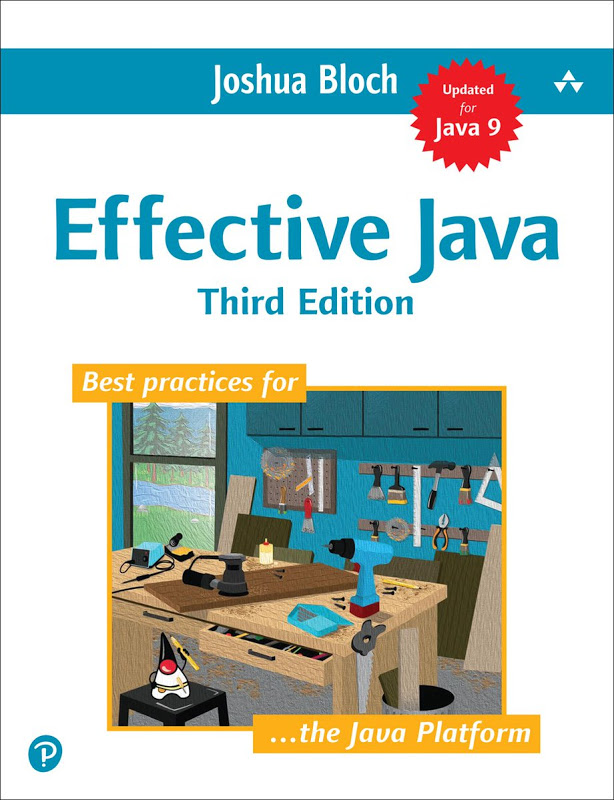

# Effective Java

> 汲取**java编程经验**，参考自书籍[《Effective Java, 3rd Edition》](https://book.douban.com/subject/27047716/)。
>
> 下载链接：<http://readfree.me/book/27047716/>

## 翻译进度

- [x] 第1章 引言
- [x] 第2章 创建和销毁对象
- [ ] 第3章 对所有对象通用的方法
