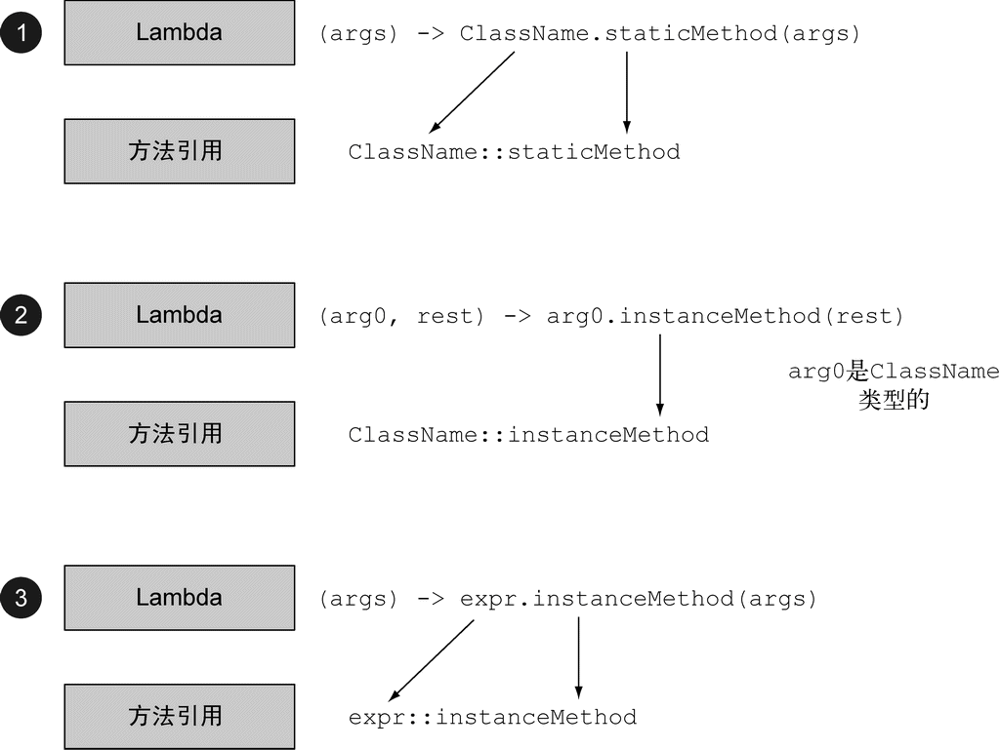

### 3.1 Lambda管中窥豹

可以把Lambda表达式理解为简洁地表示可传递的匿名函数的一种方式：它没有名称，但它 有参数列表、函数主体、返回类型，可能还有一个可以抛出的异常列表。这个定义够大的，让我们慢慢道来。

(1) 匿名——我们说匿名，是因为它不像普通的方法那样有一个明确的名称：写得少而想 得多！ 

(2) 函数——我们说它是函数，是因为Lambda函数不像方法那样属于某个特定的类。但和方 法一样，Lambda有参数列表、函数主体、返回类型，还可能有可以抛出的异常列表。 

(3) 传递——Lambda表达式可以作为参数传递给方法或存储在变量中。

(4) 简洁——无需像匿名类那样写很多模板代码。

### 3.2 在哪里以及如何使用Lambda

那到底在哪里可以使用Lambda呢？你可以在函数式接口上使用Lambda表达式。

#### 3.2.1 函数式接口

为了参数化filter方法的行为而创建的Predicate\<T>接口吗？它就 是一个函数式接口！为什么呢？因为Predicate仅仅定义了一个抽象方法： 

```java
public interface Predicate<T>{
    boolean test (T t);
}
```

(1) 一言以蔽之， 函数式接口就是只定义一个抽象方法的接口。

(2) 接口现在还可以拥有默认方法（即在类没有对方法进行实现时， 其主体为方法提供默认实现的方法）。哪怕有很多默认方法，只要接口只定义了一个抽象方法，它就仍然是一个函数式接口。

(3) Lambda表达式允许你直接以内联的形式为函数式接口的抽象 方法提供实现，并把整个表达式作为函数式接口的实例（具体说来，是函数式接口一个具体实现 的实例）。

### 3.4 使用函数式接口

#### 3.4.1 Predicate（谓词）

java.util.function.Predicate\<T>接口定义了一个名叫test的抽象方法，它接受泛型 T对象，并返回一个boolean。这恰恰和你先前创建的一样，现在就可以直接使用了。在你需要表示一个涉及类型T的布尔表达式时，就可以使用这个接口。比如，你可以定义一个接受String对象的Lambda表达式，如下所示。

```java
@FunctionalInterface
public interface Predicate<T>{
    boolean test(T t);
}
public static <T> List<T> filter(List<T> list, Predicate<T> p) {
    List<T> results = new ArrayList<>();
    for(T s: list){
        if(p.test(s)){
            results.add(s);
        }
    }
    return results;
}
Predicate<String> nonEmptyStringPredicate = (String s) -> !s.isEmpty();
List<String> nonEmpty = filter(listOfStrings, nonEmptyStringPredicate) 
```

#### 3.4.2 Consumer（消费者）

java.util.function.Consumer<T>定义了一个名叫accept的抽象方法，它接受泛型T 的对象，没有返回（ void）。你如果需要访问类型T的对象，并对其执行某些操作，就可以使用 这个接口。比如，你可以用它来创建一个forEach方法，接受一个Integers的列表，并对其中 每个元素执行操作。在下面的代码中，你就可以使用这个forEach方法，并配合Lambda来打印列表中的所有元素。

```java
@FunctionalInterface
public interface Consumer<T>{
    void accept(T t);
}
public static <T> void forEach(List<T> list, Consumer<T> c){
    for(T i: list){
        c.accept(i);
    }
}

forEach(
    Arrays.asList(1,2,3,4,5),
    (Integer i) -> System.out.println(i)
); 
```

#### 3.4.3 Function（函数）

java.util.function.Function<T, R>接口定义了一个叫作apply的方法，它接受一个 泛型T的对象，并返回一个泛型R的对象。如果你需要定义一个Lambda，将输入对象的信息映射到输出，就可以使用这个接口（比如提取苹果的重量，或把字符串映射为它的长度）。在下面的代码中，我们向你展示如何利用它来创建一个map方法，以将一个String列表映射到包含每个String长度的Integer列表。

```java
@FunctionalInterface
public interface Function<T, R>{
    R apply(T t);
}
public static <T, R> List<R> map(List<T> list,
Function<T, R> f) {
    List<R> result = new ArrayList<>();
    for(T s: list){
    result.add(f.apply(s));
    }
    return result;
}
// [7, 2, 6]
List<Integer> l = map(Arrays.asList("lambdas","in","action"),(String s) -> s.length());
```

**Java 8中的常用函数式接口**

| 函数式接口          | 函数描述符      | 原始类型特化                                                 |
| ------------------- | --------------------- | ------------------------------------------------------------ |
| Predicate\<T>     | T->boolean       | IntPredicate,<br />LongPredicate,<br />DoublePredicate  |
| Consumer\<T>      | T->void          | IntConsumer,<br />LongConsumer,<br />DoubleConsumer       |
| Function<T,R>     | T->R             | IntFunction\<R>, <br />IntToDoubleFunction, <br />IntToLongFunction,<br />LongFunction\<R>, <br />LongToDoubleFunction,<br />LongToIntFunction,<br />DoubleFunction\<R>,<br />ToIntFunction\<T>, <br />ToDoubleFunction\<T>, <br />ToLongFunction\<T> |
| Supplier\<T>      | ()->T            | BooleanSupplier,<br />IntSupplier,<br />LongSupplier, <br />DoubleSupplier |
| UnaryOperator\<T> | T->T             | IntUnaryOperator,<br />LongUnaryOperator,<br />DoubleUnaryOperator |
| BinaryOperator\<T>| (T,T)->T         | IntBinaryOperator, <br />LongBinaryOperator,<br />DoubleBinaryOperator |
| BiPredicate\<L,R> | (L,R)->boolean   |                                                              |
| BiConsumer\<T,U>  | (T,U)->void      | ObjIntConsumer\<T>,<br />ObjLongConsumer\<T>, <br />ObjDoubleConsumer\<T> |
| BiFunction\<T,U,R>| (T,U)->R         | ToIntBiFunction\<T,U>, <br />ToLongBiFunction\<T,U>, <br />ToDoubleBiFunction\<T,U> |

 

**Lambdas及函数式接口的例子**

| 使用案例              | Lambda的例子                                                 | 对应的函数式接口                                             |
| --------------------- | ------------------------------------------------------------ | ------------------------------------------------------------ |
| 布尔表达式            | (List\<String> list) -> list.isEmpty()                       | Predicate\<List\<String>>                                    |
| 创建对象              | () -> new Apple(10)                                          | Supplier\<Apple>                                             |
| 消费一个对象          | (Apple a) -> System.out.println(a.getWeight())               | Consumer\<Apple>                                             |
| 从一个对象中选择/提取 | (String s) -> s.length()                                     | Function\<String, Integer>或 <br >ToIntFunction\<String>     |
| 合并两个值            | (int a, int b) -> a * b                                      | IntBinaryOperator                                            |
| 比较两个对象          | (Apple a1, Apple a2) -> a1.getWeight().compareTo(a2.getWeight()) | Comparator\<Apple>或<br >BiFunction\<Apple, Apple, Integer>或<br >ToIntBiFunction\<Apple, Apple> |

### 3.5 类型检查、类型推断以及限制

#### 3.5.4 使用局部变量

们迄今为止所介绍的所有Lambda表达式都只用到了其主体里面的参数。但Lambda表达式 也允许使用自由变量（不是参数，而是在外层作用域中定义的变量），就像匿名类一样。 它们被 称作捕获Lambda。例如，下面的Lambda捕获了portNumber变量： 

```java
int portNumber = 1337;
Runnable r = () -> System.out.println(portNumber);
```

尽管如此，还有一点点小麻烦：关于能对这些变量做什么有一些限制。 Lambda可以没有限 制地捕获（也就是在其主体中引用）实例变量和静态变量。但局部变量必须显式声明为final，或事实上是final。换句话说，Lambda表达式只能捕获指派给它们的局部变量一次。（注：捕获 实例变量可以被看作捕获最终局部变量this。） 例如，下面的代码无法编译，因为portNumber变量被赋值两次： 

```java
int portNumber = 1337;                                错误： Lambda表达式引用的局
Runnable r = () -> System.out.println(portNumber);    部变量必须是最终的（ final）
portNumber = 31337;                                   或事实上最终的
```

**对局部变量的限制**

你可能会问自己，为什么局部变量有这些限制。

第一，实例变量和局部变量背后的实现有一 个关键不同。实例变量都存储在堆（线程之间共享）中，而局部变量则保存在栈（每个线程都有对应的）上。如果Lambda可以直接访问局部变量，而且Lambda是在一个线程中使用的，则使用Lambda的线程，可能会在分配该变量的线程将这个变量收回之后，去访问该变量。因此， Java在访问自由局部变量时，实际上是在访问它的副本，而不是访问原始变量。如果局部变量仅仅赋值一次那就没有什么区别了——因此就有了这个限制。 

第二，这一限制不鼓励你使用改变外部变量的典型命令式编程模式（我们会在以后的各章中解释，这种模式会阻碍很容易做到的并行处理）。

### 3.6 方法引用

#### 3.6.1 管中窥豹

你为什么应该关心方法引用？方法引用可以被看作仅仅调用特定方法的Lambda的一种快捷 写法。它的基本思想是，如果一个Lambda代表的只是“直接调用这个方法”，那最好还是用名称 来调用它，而不是去描述如何调用它。事实上，方法引用就是让你根据已有的方法实现来创建 Lambda表达式。

当你需要使用方法引用时 ，目 标引用 放 在 分隔符::前 ，方法 的 名 称放在 后 面 。例如 ， Apple::getWeight就是引用了Apple类中定义的方法getWeight。请记住，不需要括号，因为你没有实际调用这个方法。方法引用就是Lambda表达式(Apple a) -> a.getWeight()的快捷写法。

**Lambda及其等效方法引用的例子**

| Lambda                                     | 等效的方法引用                      |
| ------------------------------------------ | ----------------------------------- |
| (Apple a) -> a.getWeight()               | Apple::getWeight                  |
| () -> Thread.currentThread().dumpStack() | Thread.currentThread()::dumpStack |
| (str, i) -> str.substring(i)             | String::substring                 |
| (String s) -> System.out.println(s)      | System.out::println               |

**如何构建方法引用**

方法引用主要有三类。

(1) 指向静态方法的方法引用（例如Integer的parseInt方法， 写作Integer::parseInt）。

(2) 指向任意类型实例方法的方法引用 （ 例如 String 的 length 方 法 ， 写作 String::length）。 

(3) 指向现有对象的实例方法的方法引用（假设你有一个局部变量expensiveTransaction用于存放Transaction类型的对象，它支持实例方法getValue，那么你就可以写expensiveTransaction::getValue）。



#### 3.6.2 构造函数引用

对于一个现有构造函数，你可以利用它的名称和关键字new来创建它的一个引用： ClassName::new。它的功能与指向静态方法的引用类似。例如，假设有一个构造函数没有参数。 它适合Supplier的签名() -> Apple。你可以这样做：

```java
Supplier<Apple> c1 = Apple::new;    ←─构造函数引用指向默认的Apple()构造函数
Apple a1 = c1.get();    ←─调用Supplier的get方法将产生一个新的Apple
这就等价于：
Supplier<Apple> c1 = () -> new Apple();    ←─利用默认构造函数创建Apple的Lambda表达式
Apple a1 = c1.get();    ←─调用Supplier的get方法将产生一个新的Apple

如果你的构造函数的签名是Apple(Integer weight)，那么它就适合Function接口的签名，于是你可以这样写：
Function<Integer, Apple> c2 = Apple::new;    ←─指向Apple(Integer weight)的构造函数引用
Apple a2 = c2.apply(110);    ←─调用该Function函数的apply方法，并给出要求的重量，将产生一个Apple
这就等价于：
Function<Integer, Apple> c2 = (weight) -> new Apple(weight);用要求的重量创建一个Apple的Lambda表达式
Apple a2 = c2.apply(110);调用该Function函数的apply方法，并给出要求的重量，将产生一个新的Apple对象
```

### 3.10 小结

以下是应从本章中学到的关键概念。

(1) Lambda表达式可以理解为一种匿名函数：它没有名称，但有参数列表、函数主体、返回 类型，可能还有一个可以抛出的异常的列表。 

(2) Lambda表达式让你可以简洁地传递代码。

(3) 函数式接口就是仅仅声明了一个抽象方法的接口。

(4) 只有在接受函数式接口的地方才可以使用Lambda表达式。

(5) Lambda表达式允许你直接内联，为函数式接口的抽象方法提供实现，并且将整个表达式 作为函数式接口的一个实例。 

(6) Java 8自带一些常用的函数式接口，放在java.util.function包里，包括Predicate

\<T>、 Function\<T,R>、 Supplier\<T>、 Consumer\<T>和BinaryOperator\<T>.

(7) 为了避免装箱操作，对Predicate\<T>和Function\<T, R>等通用函数式接口的原始类型 特化： IntPredicate、 IntToLongFunction等。 

(8) 环绕执行模式（即在方法所必需的代码中间，你需要执行点儿什么操作，比如资源分配 和清理）可以配合Lambda提高灵活性和可重用性。 

(9) Lambda表达式所需要代表的类型称为目标类型。

(10) 方法引用让你重复使用现有的方法实现并直接传递它们。

(11) Comparator、 Predicate和Function等函数式接口都有几个可以用来结合Lambda表达 式的默认方法。

 