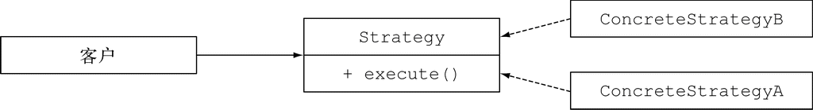
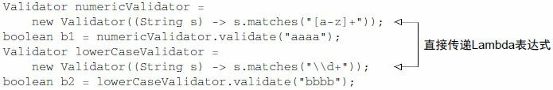
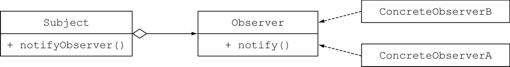
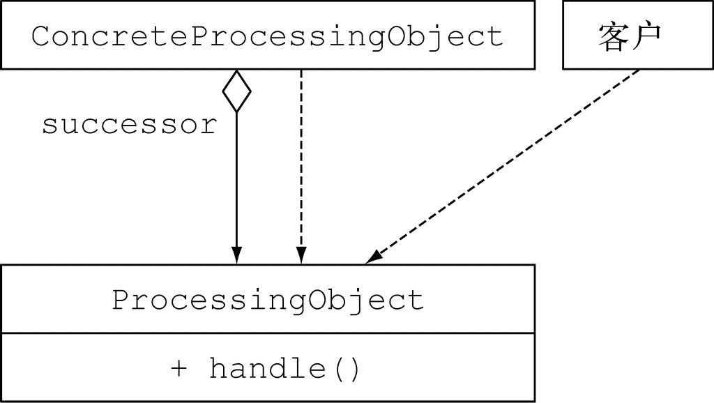
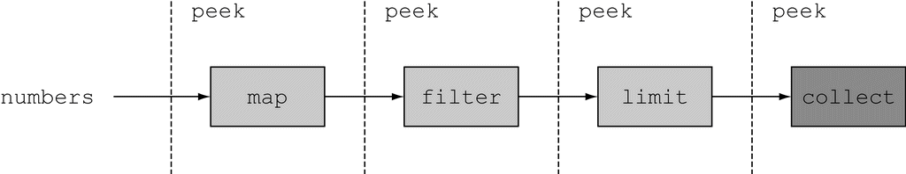

### 8.1 为改善可读性和灵活性重构代码

#### 8.1.1 改善代码的可读性

跟之前的版本相比较，Java 8的新特性也可以帮助提升代码的可读性：

+ 使用Java 8，你可以减少冗长的代码，让代码更易于理解 
+ 通过方法引用和Stream API，你的代码会变得更直观 

#### 8.1.2 从匿名类到Lambda表达式的转换

值得尝试的第一种重构，也是简单的方式，是将实现单一抽象方法的匿名类转换为Lambda表达式。

```java
Runnable r1 = new Runnable(){    ←─传统的方式，使用匿名类
    public void run(){
        System.out.println("Hello");
    }
};
Runnable r2 = () -> System.out.println("Hello");    ←─新的方式，使用Lambda表达式
```

但是某些情况下，将匿名类转换为Lambda表达式可能是一个比较复杂的过程。 首先，匿名类和Lambda表达式中的this和super的含义是不同的。在匿名类中，this代表的是类自身，但是在Lambda中，它代表的是包含类。其次，匿名类可以屏蔽包含类的变量，而Lambda表达式不能（它们会导致编译错误），譬如下面这段代码： 

```java
int a = 10;
Runnable r1 = () -> {
    int a = 2;    ←─编译错误！
    System.out.println(a);
};
Runnable r2 = new Runnable(){

    public void run(){
        int a = 2;    ←─一切正常
        System.out.println(a);
    }
};
```

最后，在涉及重载的上下文里，将匿名类转换为Lambda表达式可能导致最终的代码更加晦涩。实际上，匿名类的类型是在初始化时确定的，而Lambda的类型取决于它的上下文。

#### 8.1.3 从Lambda表达式到方法引用的转换

Lambda表达式非常适用于需要传递代码片段的场景。不过，为了改善代码的可读性，也请尽量使用方法引用。因为方法名往往能更直观地表达代码的意图。

除此之外，我们还应该尽量考虑使用静态辅助方法，比如comparing、maxBy。这些方法设计之初就考虑了会结合方法引用一起使用。

此外，很多通用的归约操作，比如sum、maximum，都有内建的辅助方法可以和方法引用结合使用。

不如尝试使用内置的集合类，它能更清晰地表达问题陈述是什么。

#### 8.1.4 从命令式的数据处理切换到Stream

建议将所有使用迭代器这种数据处理模式处理集合的代码都转换成Stream API的方式。为什么呢？Stream API能更清晰地表达数据处理管道的意图。除此之外，通过短路和延迟载入以及利用现代计算机的多核架构，我们可以对Stream进行优化。

#### 8.1.5 增加代码的灵活性

Lambda表达式有利于行为参数化。可以使用不同的 Lambda表示不同的行为，并将它们作为参数传递给函数去处理执行。这种方式可以帮助我们淡定从容地面对需求的变化。比如，我们可以用多种方式为Predicate创建筛选条件，或者使用Comparator对多种对象进行比较。

**1. 采用函数接口**

必须意识到，没有函数接口，就无法使用Lambda表达式。可以依照这两种模式重构代码，利用Lambda表达式带来的灵活性，它们分别是：**有条件的延迟执行**和**环绕执行**。

**2. 有条件的延迟执行**

如果需要频繁地从客户端代码去查询一个对象的状态，只是为了传递参数、调用该对象的一个方法，那么可以考以Lambda或者方法表达式作为参数，新方法在检查完该对象的状态之后才调用原来的方法。代码会因此而变得更易读（结构更清晰），封装性更好（对象的状态也不会暴露给客户端代码了）。

**3.环绕执行** 

如果你发现虽然你的业务代码千差万别，但是它们拥有同样的准备和清理阶段，这时，你完全可以将这部分代码用Lambda实现。这种方式的好处是可以重用准备和清理阶段的逻辑，减少重复冗余的代码。下面这段代码你在第3章中已经看过，我们再回顾一次。它在打开和关闭文件时使用了同样的逻辑，但在处理文件时可以使用不同的Lambda进行参数化。

```java
String oneLine =
    processFile((BufferedReader b) -> b.readLine());    ←─传入一个Lambda表达式
String twoLines =
    processFile((BufferedReader b) -> b.readLine() + b.readLine());    ←─传入另一个Lambda表达式

public static String processFile(BufferedReaderProcessor p) throws
     IOException {
    try(BufferedReader br = new BufferedReader(new FileReader("java8inaction/
     chap8/data.txt"))){
        return p.process(br);    ←─将BufferedReaderProcessor 作为执行参数传入
    }
}

public interface BufferedReaderProcessor{    ←─使用Lambda表达式的函数接口，该接口能够抛出一个IOException
    String process(BufferedReader b) throws IOException;
}
```

这一优化是凭借函数式接口BufferedReaderProcessor达成的，通过这个接口，你可以传递各种Lamba表达式对BufferedReader对象进行处理。 

### 8.2 使用Lambda重构面向对象的设计模式

#### 8.2.1 策略模式

策略模式包含三部分内容：

(1) 一个代表某个算法的接口（它是策略模式的接口）。

(2) 一个或多个该接口的具体实现，它们代表了算法的多种实现（比如，实体类ConcreteStrategyA或者ConcreteStrategyB）。

(3) 一个或多个使用策略对象的客户。



我们假设你希望验证输入的内容是否根据标准进行了恰当的格式化（比如只包含小写字母或数字）。你可以从定义一个验证文本（以String的形式表示）的接口入手： 

```java
public interface ValidationStrategy {
    boolean execute(String s);
}
```

**使用Lambda表达式**

ValidationStrategy是一个函数接口（除此之外，它还与Predicate<String>具有同样的函数描述）。这意味着我们不需要声明新的类来实现不同的策略，通过直接传递Lambda表达式就能达到同样的目的，并且还更简洁：



Lambda表达式实际已经对部分代码（或策略）进行了封装，而这就是创建策略设计模式的初衷。对类似的问题，应该尽量使用Lambda表达式来解决。

#### 8.2.2 模板方法

如果你需要采用某个算法的框架，同时又希望有一定的灵活度，能对它的某些部分进行改进，那么采用模板方法设计模式是比较通用的方案。好吧，这样讲听起来有些抽象。换句话说，模板方法模式在你“希望使用这个算法，但是需要对其中的某些行进行改进，才能达到希望的效果”时是非常有用的。

假设你需要编写一个简单的在线银行应用。通常，用户需要输入一个用户账户，之后应用才能从银行的数据库中得到用户的详细信息，最终完成一些让用户满意的操作。不同分行的在线银行应用让客户满意的方式可能还略有不同，比如给客户的账户发放红利，或者仅仅是少发送一些推广文件。你可能通过下面的抽象类方式来实现在线银行应用：

```java
abstract class OnlineBanking {

    public void processCustomer(int id){
        Customer c = Database.getCustomerWithId(id);
        makeCustomerHappy(c);
    }

    abstract void makeCustomerHappy(Customer c);
}
```

processCustomer方法搭建了在线银行算法的框架：获取客户提供的ID，然后提供服务让用户满意。不同的支行可以通过继承OnlineBanking类，对该方法提供差异化的实现。

**使用Lambda表达式**

使用你偏爱的Lambda表达式同样也可以解决这些问题（创建算法框架，让具体的实现插入某些部分）。你想要插入的不同算法组件可以通过Lambda表达式或者方法引用的方式实现。

这里我们向processCustomer方法引入了第二个参数，它是一个Consumer<Customer>类型的参数，与前文定义的makeCustomerHappy的特征保持一致：

```java
public void processCustomer(int id, Consumer<Customer> makeCustomerHappy){
    Customer c = Database.getCustomerWithId(id);
    makeCustomerHappy.accept(c);
}
```

现在，你可以很方便地通过传递Lambda表达式，直接插入不同的行为，不再需要继承OnlineBanking类了：

```java
new OnlineBankingLambda().processCustomer(1337, (Customer c) ->
    System.out.println("Hello " + c.getName());
```

#### 8.2.3 观察者模式

观察者模式是一种比较常见的方案，某些事件发生时（比如状态转变），如果一个对象（通常我们称之为主题）需要自动地通知其他多个对象（称为观察者），就会采用该方案。创建图形用户界面（GUI）程序时，你经常会使用该设计模式。这种情况下，你会在图形用户界面组件（比如按钮）上注册一系列的观察者。如果点击按钮，观察者就会收到通知，并随即执行某个特定的行为。 但是观察者模式并不局限于图形用户界面。比如，观察者设计模式也适用于股票交易的情形，多个券商可能都希望对某一支股票价格（主题）的变动做出响应。



让我们写点儿代码来看看观察者模式在实际中多么有用。你需要为Twitter这样的应用设计并实现一个定制化的通知系统。想法很简单：好几家报纸机构，比如《纽约时报》《卫报》以及《世界报》都订阅了新闻，他们希望当接收的新闻中包含他们感兴趣的关键字时，能得到特别通知。

首先，你需要一个观察者接口，它将不同的观察者聚合在一起。它仅有一个名为notify的方法，一旦接收到一条新的新闻，该方法就会被调用：

```java
interface Observer {
    void notify(String tweet);
}
```

现在，你可以声明不同的观察者（比如，这里是三家不同的报纸机构），依据新闻中不同的关键字分别定义不同的行为： 

```java
class NYTimes implements Observer{
    public void notify(String tweet) {
        if(tweet != null && tweet.contains("money")){
            System.out.println("Breaking news in NY! " + tweet);
        }
    }
}
class Guardian implements Observer{
    public void notify(String tweet) {
        if(tweet != null && tweet.contains("queen")){
            System.out.println("Yet another news in London... " + tweet);
        }
    }
}
class LeMonde implements Observer{
    public void notify(String tweet) {
        if(tweet != null && tweet.contains("wine")){
            System.out.println("Today cheese, wine and news! " + tweet);
        }
    }
}
```

你还遗漏了最重要的部分：Subject！让我们为它定义一个接口： 

```java
interface Subject{
    void registerObserver(Observer o);
    void notifyObservers(String tweet);
}
```

Subject使用registerObserver方法可以注册一个新的观察者，使用notifyObservers方法通知它的观察者一个新闻的到来。让我们更进一步，实现Feed类： 

```java
class Feed implements Subject{

    private final List<Observer> observers = new ArrayList<>();

    public void registerObserver(Observer o) {
        this.observers.add(o);
    }

    public void notifyObservers(String tweet) {
        observers.forEach(o -> o.notify(tweet));
    }
}
```

这是一个非常直观的实现：Feed类在内部维护了一个观察者列表，一条新闻到达时，它就进行通知。 

```java
Feed f = new Feed();
f.registerObserver(new NYTimes());
f.registerObserver(new Guardian());
f.registerObserver(new LeMonde());
f.notifyObservers("The queen said her favourite book is Java 8 in Action!");
```

**使用Lambda表达式**

Observer接口的所有实现类都提供了一个方法：notify。新闻到达时，它们都只是对同一段代码封装执行。Lambda表达式的设计初衷就是要消除这样的僵化代码。

```java
f.registerObserver((String tweet) -> {
    if(tweet != null && tweet.contains("money")){
        System.out.println("Breaking news in NY! " + tweet);
    }
});

f.registerObserver((String tweet) -> {
    if(tweet != null && tweet.contains("queen")){
        System.out.println("Yet another news in London... " + tweet);
    }
});
```

上述例子适用于观察者行为较为简单时，当观察者的逻辑十分复杂，或是持有状态，抑或定义了多个方法，诸如此类。在这些情形下，还是应该继续使用类的方式。

#### 8.2.4 责任链模式

责任链模式是一种创建处理对象序列（比如操作序列）的通用方案。一个处理对象可能需要在完成一些工作之后，将结果传递给另一个对象，这个对象接着做一些工作，再转交给下一个处理对象，以此类推。

通常，这种模式是通过定义一个代表处理对象的抽象类来实现的，在抽象类中会定义一个字段来记录后续对象。一旦对象完成它的工作，处理对象就会将它的工作转交给它的后继。代码中，这段逻辑看起来是下面这样：

```java
public abstract class ProcessingObject<T> {

    protected ProcessingObject<T> successor;
    public void setSuccessor(ProcessingObject<T> successor){
        this.successor = successor;
    }

    public T handle(T input){
        T r = handleWork(input);
        if(successor != null){
            return successor.handle(r);
        }
        return r;
    }

    abstract protected T handleWork(T input);
}
```



可以创建两个处理对象，它们的功能是进行一些文本处理工作，这样就可以将这两个处理对象结合起来，构造一个操作序列！ 

```java
public class HeaderTextProcessing extends ProcessingObject<String> {
    public String handleWork(String text){
        return "From Raoul, Mario and Alan: " + text;
    }
}

public class SpellCheckerProcessing extends ProcessingObject<String> {
    public String handleWork(String text){
        return text.replaceAll("labda", "lambda");    ←─糟糕，我们漏掉了Lambda中的m字符
    }
}

ProcessingObject<String> p1 = new HeaderTextProcessing();
ProcessingObject<String> p2 = new SpellCheckerProcessing();

p1.setSuccessor(p2);                               ←─将两个处理对象链接起来

String result = p1.handle("Aren't labdas really sexy?!!");
System.out.println(result);                        ←─打印输出“From Raoul, Marioand Alan: Aren't lambdas reallysexy?!!”
```

**使用Lambda表达式**

稍等！这个模式看起来像是在链接（也即是构造） 函数。你可以将处理对象作为函数的一个实例，或者更确切地说作为UnaryOperator<String>的一个实例。为了链接这些函数，你需要使用andThen方法对其进行构造。

```java
UnaryOperator<String> headerProcessing =
    (String text) -> "From Raoul, Mario and Alan: " + text;    ←─第一个处理对象

UnaryOperator<String> spellCheckerProcessing =
    (String text) -> text.replaceAll("labda", "lambda");    ←─第二个处理对象

Function<String, String> pipeline =
    headerProcessing.andThen(spellCheckerProcessing);    ←─将两个方法结合起来，结果就是一个操作链

String result = pipeline.apply("Aren't labdas really sexy?!!");
```

#### 8.2.5 工厂模式

使用工厂模式，你无需向客户暴露实例化的逻辑就能完成对象的创建。比如，我们假定你为一家银行工作，他们需要一种方式创建不同的金融产品：贷款、期权、股票，等等。

通常，你会创建一个工厂类，它包含一个负责实现不同对象的方法，如下所示：

```java
public class ProductFactory {
    public static Product createProduct(String name){
        switch(name){
            case "loan": return new Loan();
            case "stock": return new Stock();
            case "bond": return new Bond();
            default: throw new RuntimeException("No such product " + name);
        }
    }
}
```

这里贷款（Loan）、股票（Stock）和债券（Bond）都是产品（Product）的子类。createProduct方法可以通过附加的逻辑来设置每个创建的产品。但是带来的好处也显而易见，你在创建对象时不用再担心会将构造函数或者配置暴露给客户，这使得客户创建产品时更加简单： 

```java
Product p = ProductFactory.createProduct("loan");
```

**使用Lambda表达式**

我们已经知道可以像引用方法一样引用构造函数。比如，下面就是一个引用贷款（Loan）构造函数的示例：

```java
final static Map<String, Supplier<Product>> map = new HashMap<>();
static {
    map.put("loan", Loan::new);
    map.put("stock", Stock::new);
    map.put("bond", Bond::new);
}
```

现在，你可以像之前使用工厂设计模式那样，利用这个Map来实例化不同的产品。 

```java
public static Product createProduct(String name){
    Supplier<Product> p = map.get(name);
    if(p != null) return p.get();
    throw new IllegalArgumentException("No such product " + name);
}
```

如果工厂方法createProduct需要接收多个传递给产品构造方法的参数，这种方式的扩展性不是很好。

### 8.3 测试Lambda表达式

#### 8.3.1 测试可见的Lambda函数的行为

有些时候，你可以借助某个字段访问Lambda函数，这种情况，你可以利用这些字段，通过它们对封装在Lambda函数内的逻辑进行测试。比如，我们假设你在Point类中添加了静态字段compareByXAndThenY，通过该字段，使用方法引用你可以访问Comparator对象：

```java
public class Point{
    public final static Comparator<Point> compareByXAndThenY =
        comparing(Point::getX).thenComparing(Point::getY);
    ...
}
```

还记得吗，Lambda表达式会生成函数接口的一个实例。由此，你可以测试该实例的行为。这个例子中，我们可以使用不同的参数，对Comparator对象类型实例compareByXAndThenY的compare方法进行调用，验证它们的行为是否符合预期： 

```java
@Test
public void testComparingTwoPoints() throws Exception {
    Point p1 = new Point(10, 15);
    Point p2 = new Point(10, 20);
    int result = Point.compareByXAndThenY.compare(p1 , p2);
    assertEquals(-1, result);
}
```

#### 8.3.2 测试使用Lambda方法的行为

Lambda的初衷是将一部分逻辑封装起来给另一个方法使用。从这个角度出发，你不应该将Lambda表达式声明为public，它们仅是具体的实现细节。相反，我们需要对使用Lambda表达式的方法进行测试。比如下面这个方法moveAllPointsRightBy：

```java
public static List<Point> moveAllPointsRightBy(List<Point> points, int x){
    return points.stream()
                 .map(p -> new Point(p.getX() + x, p.getY()))
                 .collect(toList());
}
```

我们没必要对Lambda表达式p -> new Point(p.getX() + x,p.getY())进行测试，它只是moveAllPointsRightBy内部的实现细节。我们更应该关注的是方法moveAllPointsRightBy的行为： 

```java
@Test
public void testMoveAllPointsRightBy() throws Exception{
    List<Point> points =
        Arrays.asList(new Point(5, 5), new Point(10, 5));
    List<Point> expectedPoints =
        Arrays.asList(new Point(15, 5), new Point(20, 5));

    List<Point> newPoints = Point.moveAllPointsRightBy(points, 10);
    assertEquals(expectedPoints, newPoints);
}
```

注意，上面的单元测试中，Point类恰当地实现equals方法非常重要，否则该测试的结果就取决于Object类的默认实现。

#### 8.3.3 将复杂的Lambda表达式分到不同的方法

可能你会碰到非常复杂的Lambda表达式，包含大量的业务逻辑，比如需要处理复杂情况的定价算法。你无法在测试程序中引用Lambda表达式，这种情况该如何处理呢？一种策略是将Lambda表达式转换为方法引用（这时你往往需要声明一个新的常规方法）。这之后，你可以用常规的方式对新的方法进行测试。

#### 8.3.4 高阶函数的测试

接受函数作为参数的方法或者返回一个函数的方法（“高阶函数”，higher-order function）更难测试。如果一个方法接受Lambda表达式作为参数，你可以采用的一个方案是使用不同的Lambda表达式对它进行测试。比如，你可以使用不同的谓词进行测试。

```java
@Test
public void testFilter() throws Exception{
    List<Integer> numbers = Arrays.asList(1, 2, 3, 4);
    List<Integer> even = filter(numbers, i -> i % 2 == 0);
    List<Integer> smallerThanThree = filter(numbers, i -> i < 3);
    assertEquals(Arrays.asList(2, 4), even);
    assertEquals(Arrays.asList(1, 2), smallerThanThree);
}
```

如果被测试方法的返回值是另一个方法，可以把它当成一个函数接口，对它的功能进行测试。

### 8.4 调试

调试有问题的代码时，程序员的兵器库里有两大老式武器，分别是：

(1) 查看栈跟踪 

(2) 输出日志

#### 8.4.1 查看栈跟踪

**Lambda表达式和栈跟踪**

当错误发生在Lambda表达式内部。由于Lambda表达式没有名字，所以编译器只能为它们指定一个名字，而这些名字看起来非常不直观。如果使用了大量的类，其中又包含多个Lambda表达式，这就成了一个非常头痛的问题。即使使用了方法引用，还是有可能出现栈无法显示使用的方法名的情况。如果方法引用指向的是同一个类中声明的方法，那么它的名称是可以在栈跟踪中显示的。

我们需要特别注意，涉及Lambda表达式的栈跟踪可能非常难理解。这是Java编译器未来版本可以改进的一个方面。

#### 8.4.2 使用日志调试

peek的设计初衷就是在流的每个元素运行之前，插入执行一个动作。但是它不像forEach那样更新整个流的运行（forEach是终端操作），而是在一个元素上完成操作之后，它只会将操作顺承到流水线中的下一个操作。

```java
List<Integer> numbers = Arrays.asList(2, 3, 4, 5);

// forEach
numbers.stream()
       .map(x -> x + 17)
       .filter(x -> x % 2 == 0)
       .limit(3)
       .forEach(System.out::println);

// peek
List<Integer> result =
  numbers.stream()
         .peek(x -> System.out.println("from stream: " + x))    ←─输出来自数据源的当前元素值
         .map(x -> x + 17)
         .peek(x -> System.out.println("after map: " + x))    ←─输出map 操作的结果
         .filter(x -> x % 2 == 0)
         .peek(x -> System.out.println("after filter: " + x))    ←─输出经过filter操作之后，剩下的元素个数
         .limit(3)
         .peek(x -> System.out.println("after limit: " + x))    ←─输出经过limit操作之后，剩下的元素个数
         .collect(toList());
```



通过peek操作我们能清楚地了解流水线操作中每一步的输出结果：

```java
from stream: 2
after map: 19
from stream: 3
after map: 20
after filter: 20
after limit: 20
from stream: 4
after map: 21
from stream: 5
after map: 22
after filter: 22
after limit: 22
```

### 8.5 小结

(1) Lambda表达式能提升代码的可读性和灵活性。

(2) 如果你的代码中使用了匿名类，尽量用Lambda表达式替换它们，但是要注意二者间语义的微妙差别，比如关键字this，以及变量隐藏。

(3) 跟Lambda表达式比起来，方法引用的可读性更好 。

(4) 尽量使用Stream API替换迭代式的集合处理。

(5) Lambda表达式有助于避免使用面向对象设计模式时容易出现的僵化的模板代码，典型的比如策略模式、模板方法、观察者模式、责任链模式，以及工厂模式。

(6) 即使采用了Lambda表达式，也同样可以进行单元测试，但是通常你应该关注使用了Lambda表达式的方法的行为。

(7) 尽量将复杂的Lambda表达式抽象到普通方法中。

(8) Lambda表达式会让栈跟踪的分析变得更为复杂。

(9) 流提供的peek方法在分析Stream流水线时，能将中间变量的值输出到日志中，是非常有用的工具。


