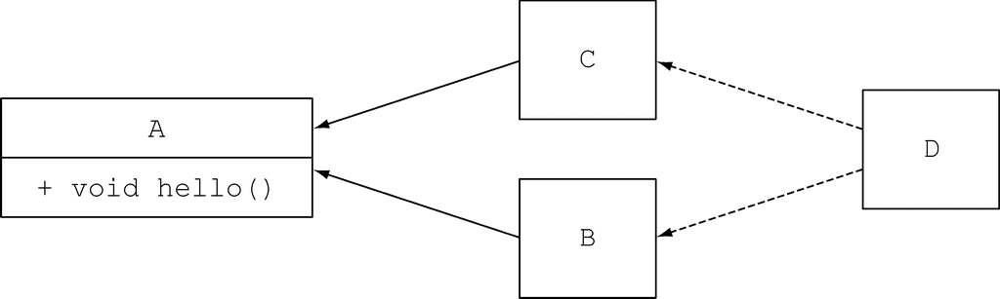

Java 8中的接口现在支持在声明方法的同时提供实现，通过两种方式可以完成这种操作：

(1) 其一，Java 8允许在接口内声明静态方法。

(2) 其二，Java 8引入了一个新功能，叫默认方法，通过默认方法你可以指定接口方法的默认实现。

默认方法的主要目标用户是类库的设计者，默认方法的引入就是为了以兼容的方式解决像Java API这样的类库的演进问题的：


**静态方法及接口**

同时定义接口以及工具辅助类（companion class）是Java语言常用的一种模式，工具类定义了与接口实例协作的很多静态方法。比如，Collections就是处理Collection对象的辅助类。由于静态方法可以存在于接口内部，你代码中的这些辅助类就没有了存在的必要，你可以把这些静态方法转移到接口内部。为了保持后向的兼容性，这些类依然会存在于Java应用程序的接口之中。

### 9.1 不断演进的API

#### 9.1.1 初始版本

#### 9.1.2 第二版API

**不同类型的兼容性：二进制、源代码和函数行为**

变更对Java程序的影响大体可以分成三种类型的兼容性，分别是：二进制级的兼容、源代码级的兼容，以及函数行为的兼容向接口添加新方法是二进制级的兼容，但最终编译实现接口的类时却会发生编译错误。

(1) 二进制级的兼容性表示现有的二进制执行文件能无缝持续链接（包括验证、准备和解析）和运行。比如，为接口添加一个方法就是二进制级的兼容，这种方式下，如果新添加的方法不被调用，接口已经实现的方法可以继续运行，不会出现错误。

(2) 简单地说，源代码级的兼容性表示引入变化之后，现有的程序依然能成功编译通过。比如，向接口添加新的方法就不是源码级的兼容，因为遗留代码并没有实现新引入的方法，所以它们无法顺利通过编译。

(3) 最后，函数行为的兼容性表示变更发生之后，程序接受同样的输入能得到同样的结果。比如，为接口添加新的方法就是函数行为兼容的，因为新添加的方法在程序中并未被调用（抑或该接口在实现中被覆盖了）。

### 9.2 概述默认方法

现在，接口包含的方法签名在它的实现类中也可以不提供实现。？实际上，缺失的方法实现会作为接口的一部分由实现类继承（所以命名为默认实现），而无需由实现类提供。

**Java 8中的抽象类和抽象接口**

那么抽象类和抽象接口之间的区别是什么呢？它们不都能包含抽象方法和包含方法体的实现吗？

(1) 首先，一个类只能继承一个抽象类，但是一个类可以实现多个接口。

(2) 其次，一个抽象类可以通过实例变量（字段）保存一个通用状态，而接口是不能有实例变量的。

### 9.3 默认方法的使用模式

默认方法的两种用例：**可选方法**和**行为的多继承**。

#### 9.3.1 可选方法

你很可能也碰到过这种情况，类实现了接口，不过却刻意地将一些方法的实现留白。我们以Iterator接口为例来说。Iterator接口定义了hasNext、next，还定义了remove方法。Java 8之前，由于用户通常不会使用该方法，remove方法常被忽略。因此，实现Interator接口的类通常会为remove方法放置一个空的实现，这些都是些毫无用处的模板代码。

采用默认方法之后，你可以为这种类型的方法提供一个默认的实现，这样实体类就无需在自己的实现中显式地提供一个空方法。比如，在Java 8中，Iterator接口就为remove方法提供了一个默认实现，如下所示：

```java
interface Iterator<T> {
    boolean hasNext();
    T next();
    default void remove() {
        throw new UnsupportedOperationException();
    }
}
```

#### 9.3.2 行为的多继承

行为的多继承是一种让类从多个来源重用代码的能力。Java的类只能继承单一的类，但是一个类可以实现多接口。引入默认方法后，就可以实现行为的多继承。


**1.类型的多继承**

这个例子中ArrayList继承了一个类，实现了六个接口。因此ArrayList实际是七个类型的直接子类，分别是：AbstractList、List、RandomAccess、Cloneable、Serializable、Iterable和Collection。所以，在某种程度上，我们早就有了类型的多继承。

**2.利用正交方法的精简接口**

**3.组合接口**

**关于继承的一些错误观点**

继承不应该成为你一谈到代码复用就试图倚靠的万精油。比如，从一个拥有100个方法及字段的类进行继承就不是个好主意，因为这其实会引入不必要的复杂性。你完全可以使用代理有效地规避这种窘境，即创建一个方法通过该类的成员变量直接调用该类的方法。这就是为什么有的时候我们发现有些类被刻意地声明为final类型：声明为final的类不能被其他的类继承，避免发生这样的反模式，防止核心代码的功能被污染。注意，有的时候声明为final的类都会有其不同的原因，比如，String类被声明为final，因为我们不希望有人对这样的核心功能产生干扰。

这种思想同样也适用于使用默认方法的接口。通过精简的接口，你能获得最有效的组合，因为你可以只选择你需要的实现。

### 9.4 解决冲突的规则

我们知道Java语言中一个类只能继承一个父类，但是一个类可以实现多个接口。随着默认方法在Java 8中引入，有可能出现一个类继承了多个方法而它们使用的却是同样的函数签名。这种情况下，类会选择使用哪一个函数？在实际情况中，像这样的冲突可能极少发生，但是一旦发生这样的状况，必须要有一套规则来确定按照什么样的约定处理这些冲突。

#### 9.4.1 解决问题的三条规则

如果一个类使用相同的函数签名从多个地方（比如另一个类或接口）继承了方法，通过三条规则可以进行判断。

(1) 类中的方法优先级最高。类或父类中声明的方法的优先级高于任何声明为默认方法的优先级。

(2) 如果无法依据第一条进行判断，那么子接口的优先级更高：函数签名相同时，优先选择拥有最具体实现的默认方法的接口，即如果B继承了A，那么B就比A更加具体。

(3) 最后，如果还是无法判断，继承了多个接口的类必须通过显式覆盖和调用期望的方法，显式地选择使用哪一个默认方法的实现。

#### 9.4.2 选择提供了最具体实现的默认方法的接口

#### 9.4.3 冲突及如何显式地消除歧义


解决这种两个可能的有效方法之间的冲突，没有太多方案；你只能显式地决定你希望在C中使用哪一个方法。为了达到这个目的，你可以覆盖类C中的hello方法，在它的方法体内显式地调用你希望调用的方法。Java 8中引入了一种新的语法X.super.m(…)，其中X是你希望调用的m方法所在的父接口。举例来说，如果你希望C使用来自于B的默认方法，它的调用方式看起来就如下所示： 

```java
public class C implements B, A {
    void hello(){
        B.super.hello();    ←─显式地选择调用接口B中的方法
    }
}
```

#### 9.4.4 棱形继承问题

让我们考虑最后一种场景，它亦是C++里中最令人头痛的难题。

```java
public interface A{
    default void hello(){
        System.out.println("Hello from A");
    }
}

public interface B extends A { }

public interface C extends A { }

public class D implements B, C {
    public static void main(String... args) {
        new D().hello();              ←─猜猜打印输出的是什么？
    }
}
```



这种问题叫“菱形问题”，因为类的继承关系图形状像菱形。这种情况下类D中的默认方法到底继承自什么地方 ——源自B的默认方法，还是源自C的默认方法？实际上只有一个方法声明可以选择。只有A声明了一个默认方法。由于这个接口是D的父接口，代码会打印输出“Hello from A”。

如果B中也提供了一个默认的hello方法，并且函数签名跟A中的方法也完全一致，这时会发生什么情况呢？根据规则(2)，编译器会选择提供了更具体实现的接口中的方法。由于B比A更加具体，所以编译器会选择B中声明的默认方法。如果B和C都使用相同的函数签名声明了hello方法，就会出现冲突，正如我们之前所介绍的，你需要显式地指定使用哪个方法。 

顺便提一句，如果你在C接口中添加一个抽象的hello方法（这次添加的不是一个默认方法），会发生什么情况呢？你可能也想知道答案。

```java
public interface C extends A {
    void hello();
}
```

这个新添加到C接口中的抽象方法hello比由接口A继承而来的hello方法拥有更高的优先级，因为C接口更加具体。因此，类D现在需要为hello显式地添加实现，否则该程序无法通过编译。

如果一个类的默认方法使用相同的函数签名继承自多个接口，解决冲突的机制其实相当简单。只需要遵守下面这三条准则就能解决所有可能的冲突。

(1) 首先，类或父类中显式声明的方法，其优先级高于所有的默认方法。

(2) 如果用第一条无法判断，方法签名又没有区别，那么选择提供最具体实现的默认方法的接口。

(3) 最后，如果冲突依旧无法解决，你就只能在你的类中覆盖该默认方法，显式地指定在你的类中使用哪一个接口中的方法。

### 9.5 小结

(1) Java 8中的接口可以通过默认方法和静态方法提供方法的代码实现。

(2) 默认方法的开头以关键字default修饰，方法体与常规的类方法相同。

(3) 向发布的接口添加抽象方法不是源码兼容的。

(4) 默认方法的出现能帮助库的设计者以后向兼容的方式演进API。

(5) 默认方法可以用于创建可选方法和行为的多继承。

(6) 我们有办法解决由于一个类从多个接口中继承了拥有相同函数签名的方法而导致的冲突。

(7) 类或者父类中声明的方法的优先级高于任何默认方法。如果前一条无法解决冲突，那就选择同函数签名的方法中实现得最具体的那个接口的方法。

(8) 两个默认方法都同样具体时，你需要在类中覆盖该方法，显式地选择使用哪个接口中提供的默认方法。