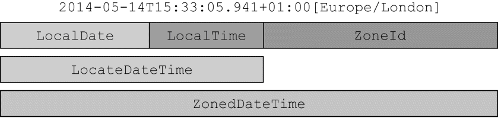

### 12.1 LocalDate、LocalTime、Instant、Duration以及Period

java.time包中提供了很多新的类可以帮你解决问题，它们是LocalDate、LocalTime、Instant、Duration和Period。

#### 12.1.1 使用LocalDate和LocalTime

```java
// 创建一个LocalDate对象并读取其值
LocalDate date = LocalDate.of(2014, 3, 18);    ←─2014-03-18
int year = date.getYear();    ←─2014
Month month = date.getMonth();    ←─MARCH
int day = date.getDayOfMonth();    ←─18
DayOfWeek dow = date.getDayOfWeek();    ←─TUESDAY
int len = date.lengthOfMonth();    ←─31 (days in March)
boolean leap = date.isLeapYear();    ←─false (not a leap year)
// 还可以使用工厂方法从系统时钟中获取当前的日期
LocalDate today = LocalDate.now();
```

还可以通过传递一个TemporalField参数给get方法拿到同样的信息。TemporalField是一个接口，它定义了如何访问temporal对象某个字段的值。ChronoField枚举实现了这一接口，所以你可以很方便地使用get方法得到枚举元素的值。 

```java
int year = date.get(ChronoField.YEAR);
int month = date.get(ChronoField.MONTH_OF_YEAR);
int day = date.get(ChronoField.DAY_OF_MONTH);
```

类似地，一天中的时间，比如13:45:20，可以使用LocalTime类表示。你可以使用of重载的两个工厂方法创建LocalTime的实例。第一个重载函数接收小时和分钟，第二个重载函数同时还接收秒。同LocalDate一样，LocalTime类也提供了一些getter方法访问这些变量的值。 

```java
LocalTime time = LocalTime.of(13, 45, 20);    ←─13:45:20
int hour = time.getHour();             ←─13
int minute = time.getMinute();    ←─45
int second = time.getSecond();    ←─20

// LocalDate和LocalTime都可以通过解析代表它们的字符串创建
LocalDate date = LocalDate.parse("2014-03-18");
LocalTime time = LocalTime.parse("13:45:20");
// 可以向parse方法传递一个DateTimeFormatter。该类的实例定义了如何格式化一个日期或者时间对象。
```

#### 12.1.2 合并日期和时间

这个复合类名叫LocalDateTime，是LocalDate和LocalTime的合体。它同时表示了日期和时间，但不带有时区信息，你可以直接创建，也可以通过合并日期和时间对象构造。

```java
// 直接创建LocalDateTime对象，或者通过合并日期和时间的方式创建
// 2014-03-18T13:45:20
LocalDateTime dt1 = LocalDateTime.of(2014, Month.MARCH, 18, 13, 45, 20);
LocalDateTime dt2 = LocalDateTime.of(date, time);
LocalDateTime dt3 = date.atTime(13, 45, 20);
LocalDateTime dt4 = date.atTime(time);
LocalDateTime dt5 = time.atDate(date);
```

通过它们各自的atTime或者atDate方法，向LocalDate传递一个时间对象，或者向LocalTime传递一个日期对象的方式，你可以创建一个LocalDateTime对象。你也可以使用toLocalDate或者toLocalTime方法，从LocalDateTime中提取LocalDate或者LocalTime组件： 

```java
LocalDate date1 = dt1.toLocalDate();    ←─2014-03-18
LocalTime time1 = dt1.toLocalTime();    ←─13:45:20
```

#### 12.1.3 机器的日期和时间格式

作为人，我们习惯于以星期几、几号、几点、几分这样的方式理解日期和时间。毫无疑问，这种方式对于计算机而言并不容易理解。从计算机的角度来看，建模时间最自然的格式是表示一个持续时间段上某个点的单一大整型数。这也是新的java.time.Instant类对时间建模的方式，基本上它是以Unix元年时间（传统的设定为UTC时区1970年1月1日午夜时分）开始所经历的秒数进行计算。

你可以通过向静态工厂方法ofEpochSecond传递一个代表秒数的值创建一个该类的实例。静态工厂方法ofEpochSecond还有一个增强的重载版本，它接收第二个以纳秒为单位的参数值，对传入作为秒数的参数进行调整。重载的版本会调整纳秒参数，确保保存的纳秒分片在0到999 999 999之间。这意味着下面这些对ofEpochSecond工厂方法的调用会返回几乎同样的Instant对象：

```java
Instant.ofEpochSecond(3);
Instant.ofEpochSecond(3, 0);
Instant.ofEpochSecond(2, 1_000_000_000);    ←─2 秒之后再加上100万纳秒（1秒）
Instant.ofEpochSecond(4, -1_000_000_000);    ←─4秒之前的100万纳秒（1秒）

// Instant类也支持静态工厂方法now，它能够帮你获取当前时刻的时间戳
Instant.now();
```

#### 12.1.4 定义Duration或Period

目前为止，你看到的所有类都实现了Temporal接口，Temporal接口定义了如何读取和操纵为时间建模的对象的值。之前的介绍中，我们已经了解了创建Temporal实例的几种方法。很自然地你会想到，我们需要创建两个Temporal对象之间的duration。Duration类的静态工厂方法between就是为这个目的而设计的。你可以创建两个LocalTimes对象、两个LocalDateTimes对象，或者两个Instant对象之间的duration，如下所示：

```java
Duration d1 = Duration.between(time1, time2);
Duration d1 = Duration.between(dateTime1, dateTime2);
Duration d2 = Duration.between(instant1, instant2);
```

如果你需要以年、月或者日的方式对多个时间单位建模，可以使用Period类。使用该类的工厂方法between，你可以使用得到两个LocalDate之间的时长，如下所示： 

```java
Period tenDays = Period.between(LocalDate.of(2014, 3, 8),
                                LocalDate.of(2014, 3, 18));
```

最后，Duration和Period类都提供了很多非常方便的工厂类，直接创建对应的实例；换句话说，就像下面这段代码那样，不再是只能以两个temporal对象的差值的方式来定义它们的对象。 

```java
Duration threeMinutes = Duration.ofMinutes(3);
Duration threeMinutes = Duration.of(3, ChronoUnit.MINUTES);

Period tenDays = Period.ofDays(10);
Period threeWeeks = Period.ofWeeks(3);
Period twoYearsSixMonthsOneDay = Period.of(2, 6, 1);
```

**日期-时间类中表示时间间隔的通用方法**

| 方法名         | 是否是静态方法 | 方法描述                                                 |
| -------------- | -------------- | -------------------------------------------------------- |
| `between`      | 是             | 创建两个时间点之间的interval                             |
| `from`         | 是             | 由一个临时时间点创建interval                             |
| `of`           | 是             | 由它的组成部分创建interval的实例                         |
| `parse`        | 是             | 由字符串创建interval的实例                               |
| `addTo`        | 否             | 创建该interval的副本，并将其叠加到某个指定的temporal对象 |
| `get`          | 否             | 读取该interval的状态                                     |
| `isNegative`   | 否             | 检查该interval是否为负值，不包含零                       |
| `isZero`       | 否             | 检查该interval的时长是否为零                             |
| `minus`        | 否             | 通过减去一定的时间创建该interval的副本                   |
| `multipliedBy` | 否             | 将interval的值乘以某个标量创建该interval的副本           |
| `negated`      | 否             | 以忽略某个时长的方式创建该interval的副本                 |
| `plus`         | 否             | 以增加某个指定的时长的方式创建该interval的副本           |
| `subtractFrom` | 否             | 从指定的temporal对象中减去该interval                     |

### 12.2 操纵、解析和格式化日期

如果你已经有一个LocalDate对象，想要创建它的一个修改版，最直接也最简单的方法是使用withAttribute方法。withAttribute方法会创建对象的一个副本，并按照需要修改它的属性。注意，下面的这段代码中所有的方法都返回一个修改了属性的对象。它们都不会修改原来的对象！

```java
LocalDate date1 = LocalDate.of(2014, 3, 18);    ←─2014-03-18
LocalDate date2 = date1.withYear(2011);    ←─2011-03-18
LocalDate date3 = date2.withDayOfMonth(25);    ←─2011-03-25
LocalDate date4 = date3.with(ChronoField.MONTH_OF_YEAR, 9);    ←─2011-09-25
```

甚至能以声明的方式操纵LocalDate对象。比如，你可以像下面这段代码那样加上或者减去一段时间。 

```java
LocalDate date1 = LocalDate.of(2014, 3, 18);    ←─2014-03-18
LocalDate date2 = date1.plusWeeks(1);    ←─2014-03-25
LocalDate date3 = date2.minusYears(3);    ←─2011-03-25
LocalDate date4 = date3.plus(6, ChronoUnit.MONTHS);    ←─2011-09-25
```

像LocalDate、LocalTime、LocalDateTime以及Instant这样表示时间点的日期-时间类提供了大量通用的方法。

**表示时间点的日期-时间类的通用方法**

| 方法名     | 是否是静态方法 | 描述                                                         |
| ---------- | -------------- | ------------------------------------------------------------ |
| `from`     | 是             | 依据传入的`Temporal`对象创建对象实例                         |
| `now`      | 是             | 依据系统时钟创建`Temporal`对象                               |
| `of`       | 是             | 由`Temporal`对象的某个部分创建该对象的实例                   |
| `parse`    | 是             | 由字符串创建`Temporal`对象的实例                             |
| `atOffset` | 否             | 将`Temporal`对象和某个时区偏移相结合                         |
| `atZone`   | 否             | 将`Temporal`对象和某个时区相结合                             |
| `format`   | 否             | 使用某个指定的格式器将`Temporal`对象转换为字符串（`Instant`类不提供该方法） |
| `get`      | 否             | 读取`Temporal`对象的某一部分的值                             |
| `minus`    | 否             | 创建`Temporal`对象的一个副本，通过将当前`Temporal`对象的值减去一定的时长创建该副本 |
| `plus`     | 否             | 创建`Temporal`对象的一个副本，通过将当前`Temporal`对象的值加上一定的时长创建该副本 |
| `with`     | 否             | 以该`Temporal`对象为模板，对某些状态进行修改创建该对象的副本 |

```java
// 经过下面这些操作，date变量的值是什么？
LocalDate date = LocalDate.of(2014, 3, 18);
date = date.with(ChronoField.MONTH_OF_YEAR, 9);
date = date.plusYears(2).minusDays(10);
date.withYear(2011);

答案：2016-09-08。
```

#### 12.2.1 使用TemporalAdjuster

截至目前，你所看到的所有日期操作都是相对比较直接的。有的时候，你需要进行一些更加复杂的操作，比如，将日期调整到下个周日、下个工作日，或者是本月的最后一天。这时，你可以使用重载版本的with方法，向其传递一个提供了更多定制化选择的TemporalAdjuster对象，更加灵活地处理日期。对于最常见的用例，日期和时间API已经提供了大量预定义的TemporalAdjuster。你可以通过TemporalAdjuster类的静态工厂方法访问它们，如下所示。

```java
// 使用预定义的TemporalAdjuster
import static java.time.temporal.TemporalAdjusters.*;

LocalDate date1 = LocalDate.of(2014, 3, 18);    ←─2014-03-18
LocalDate date2 = date1.with(nextOrSame(DayOfWeek.SUNDAY));    ←─2014-03-23
LocalDate date3 = date2.with(lastDayOfMonth());    ←─2014-03-31
```

**TemporalAdjuster类中的工厂方法**

| 方法名                      | 描述                                                         |
| --------------------------- | ------------------------------------------------------------ |
| `dayOfWeekInMonth`          | 创建一个新的日期，它的值为同一个月中每一周的第几天           |
| `firstDayOfMonth`           | 创建一个新的日期，它的值为当月的第一天                       |
| `firstDayOfNextMonth`       | 创建一个新的日期，它的值为下月的第一天                       |
| `firstDayOfNextYear`        | 创建一个新的日期，它的值为明年的第一天                       |
| `firstDayOfYear`            | 创建一个新的日期，它的值为当年的第一天                       |
| `firstInMonth`              | 创建一个新的日期，它的值为同一个月中，第一个符合星期几要求的值 |
| `lastDayOfMonth`            | 创建一个新的日期，它的值为下月的最后一天                     |
| `lastDayOfNextMonth`        | 创建一个新的日期，它的值为下月的最后一天                     |
| `lastDayOfNextYear`         | 创建一个新的日期，它的值为明年的最后一天                     |
| `lastDayOfYear`             | 创建一个新的日期，它的值为今年的最后一天                     |
| `lastInMonth`               | 创建一个新的日期，它的值为同一个月中，最后一个符合星期几要求的值 |
| `next/previous`             | 创建一个新的日期，并将其值设定为日期调整后或者调整前，第一个符合指定星期几要求的日期 |
| `nextOrSame/previousOrSame` | 创建一个新的日期，并将其值设定为日期调整后或者调整前，第一个符合指定星期几要求的日期，如果该日期已经符合要求，直接返回该对象 |

TemporalAdjuster接口只声明了单一的一个方法（这使得它成为了一个函数式接口），定义如下： 

```java
@FunctionalInterface
public interface TemporalAdjuster {
    Temporal adjustInto(Temporal temporal);
}
```

#### 12.2.2 打印输出及解析日期-时间对象

处理日期和时间对象时，格式化以及解析日期-时间对象是另一个非常重要的功能。新的java.time.format包就是特别为这个目的而设计的。这个包中，最重要的类是DateTimeFormatter。创建格式器最简单的方法是通过它的静态工厂方法以及常量。像BASIC_ISO_DATE和ISO_LOCAL_DATE这样的常量是DateTimeFormatter类的预定义实例。所有的DateTimeFormatter实例都能用于以一定的格式创建代表特定日期或时间的字符串。比如，下面的这个例子中，我们使用了两个不同的格式器生成了字符串：

```java
LocalDate date = LocalDate.of(2014, 3, 18);
String s1 = date.format(DateTimeFormatter.BASIC_ISO_DATE);    ←─20140318
String s2 = date.format(DateTimeFormatter.ISO_LOCAL_DATE);    ←─2014-03-18
```

你也可以通过解析代表日期或时间的字符串重新创建该日期对象。所有的日期和时间API都提供了表示时间点或者时间段的工厂方法，你可以使用工厂方法parse达到重创该日期对象的目的： 

```java
LocalDate date1 = LocalDate.parse("20140318", DateTimeFormatter.BASIC_ISO_DATE);
LocalDate date2 = LocalDate.parse("2014-03-18", DateTimeFormatter.ISO_LOCAL_DATE);
```

和老的java.util.DateFormat相比较，所有的DateTimeFormatter实例都是线程安全的。所以，你能够以单例模式创建格式器实例，就像DateTimeFormatter所定义的那些常量，并能在多个线程间共享这些实例。DateTimeFormatter类还支持一个静态工厂方法，它可以按照某个特定的模式创建格式器，代码清单如下： 

```java
DateTimeFormatter formatter = DateTimeFormatter.ofPattern("dd/MM/yyyy");
LocalDate date1 = LocalDate.of(2014, 3, 18);
String formattedDate = date1.format(formatter);
LocalDate date2 = LocalDate.parse(formattedDate, formatter);

// 创建一个本地化的DateTimeFormatter
DateTimeFormatter italianFormatter =
               DateTimeFormatter.ofPattern("d. MMMM yyyy", Locale.ITALIAN);
LocalDate date1 = LocalDate.of(2014, 3, 18);
String formattedDate = date.format(italianFormatter); // 18. marzo 2014
LocalDate date2 = LocalDate.parse(formattedDate, italianFormatter);
```

最后，如果你还需要更加细粒度的控制，DateTimeFormatterBuilder类还提供了更复杂的格式器，你可以选择恰当的方法，一步一步地构造自己的格式器。另外，它还提供了非常强大的解析功能，比如区分大小写的解析、柔性解析（允许解析器使用启发式的机制去解析输入，不精确地匹配指定的模式）、填充，以及在格式器中指定可选节。 

```java
DateTimeFormatter italianFormatter = new DateTimeFormatterBuilder()
        .appendText(ChronoField.DAY_OF_MONTH)
        .appendLiteral(". ")
        .appendText(ChronoField.MONTH_OF_YEAR)
        .appendLiteral(" ")
        .appendText(ChronoField.YEAR)
        .parseCaseInsensitive()
        .toFormatter(Locale.ITALIAN);
```

### 12.3 处理不同的时区和历法

之前你看到的日期和时间的种类都不包含时区信息。时区的处理是新版日期和时间API新增加的重要功能，使用新版日期和时间API时区的处理被极大地简化了。新的java.time.ZoneId类是老版java.util.TimeZone的替代品。它的设计目标就是要让你无需为时区处理的复杂和繁琐而操心，比如处理日光时（Daylight Saving Time，DST）这种问题。跟其他日期和时间类一样，ZoneId类也是无法修改的。

时区是按照一定的规则将区域划分成的标准时间相同的区间。在ZoneRules这个类中包含了40个这样的实例。你可以简单地通过调用ZoneId的getRules()得到指定时区的规则。每个特定的ZoneId对象都由一个地区ID标识，比如：

```java
ZoneId romeZone = ZoneId.of("Europe/Rome");
```

地区ID都为“{区域}/{城市}”的格式，这些地区集合的设定都由英特网编号分配机构（IANA）的时区数据库提供。你可以通过Java 8的新方法toZoneId将一个老的时区对象转换为ZoneId： 

```java
ZoneId zoneId = TimeZone.getDefault().toZoneId();
```

一旦得到一个ZoneId对象，你就可以将它与LocalDate、LocalDateTime或者是Instant对象整合起来，构造为一个ZonedDateTime实例，它代表了相对于指定时区的时间点，代码清单如下所示。 

```java
LocalDate date = LocalDate.of(2014, Month.MARCH, 18);
ZonedDateTime zdt1 = date.atStartOfDay(romeZone);

LocalDateTime dateTime = LocalDateTime.of(2014, Month.MARCH, 18, 13, 45);
ZonedDateTime zdt2 = dateTime.atZone(romeZone);

Instant instant = Instant.now();
ZonedDateTime zdt3 = instant.atZone(romeZone);
```



#### 12.3.1 利用和UTC/格林尼治时间的固定偏差计算时区

另一种比较通用的表达时区的方式是利用当前时区和UTC/格林尼治的固定偏差。比如，基于这个理论，你可以说“纽约落后于伦敦5小时”。这种情况下，你可以使用ZoneOffset类，它是ZoneId的一个子类，表示的是当前时间和伦敦格林尼治子午线时间的差异。

#### 12.3.2 使用别的日历系统 

ISO-8601日历系统是世界文明日历系统的事实标准。但是，Java 8中另外还提供了4种其他的日历系统。这些日历系统中的每一个都有一个对应的日志类，分别是ThaiBuddhistDate、MinguoDate、JapaneseDate以及HijrahDate。所有这些类以及LocalDate都实现了ChronoLocalDate接口，能够对公历的日期进行建模。利用LocalDate对象，你可以创建这些类的实例。更通用地说，使用它们提供的静态工厂方法，你可以创建任何一个Temporal对象的实例。

### 12.4 小结

(1) Java 8之前老版的java.util.Date类以及其他用于建模日期时间的类有很多不一致及设计上的缺陷，包括易变性以及糟糕的偏移值、默认值和命名。

(2) 新版的日期和时间API中，日期-时间对象是不可变的。

(3) 新的API提供了两种不同的时间表示方式，有效地区分了运行时人和机器的不同需求。

(4) 你可以用绝对或者相对的方式操纵日期和时间，操作的结果总是返回一个新的实例，老的日期时间对象不会发生变化。

(5) TemporalAdjuster让你能够用更精细的方式操纵日期，不再局限于一次只能改变它的一个值，并且你还可按照需求定义自己的日期转换器。

(6) 你现在可以按照特定的格式需求，定义自己的格式器，打印输出或者解析日期-时间对象。这些格式器可以通过模板创建，也可以自己编程创建，并且它们都是线程安全的。

(7) 你可以用相对于某个地区/位置的方式，或者以与UTC/格林尼治时间的绝对偏差的方式表示时区，并将其应用到日期-时间对象上，对其进行本地化。

(8) 你现在可以使用不同于ISO-8601标准系统的其他日历系统了。

 


