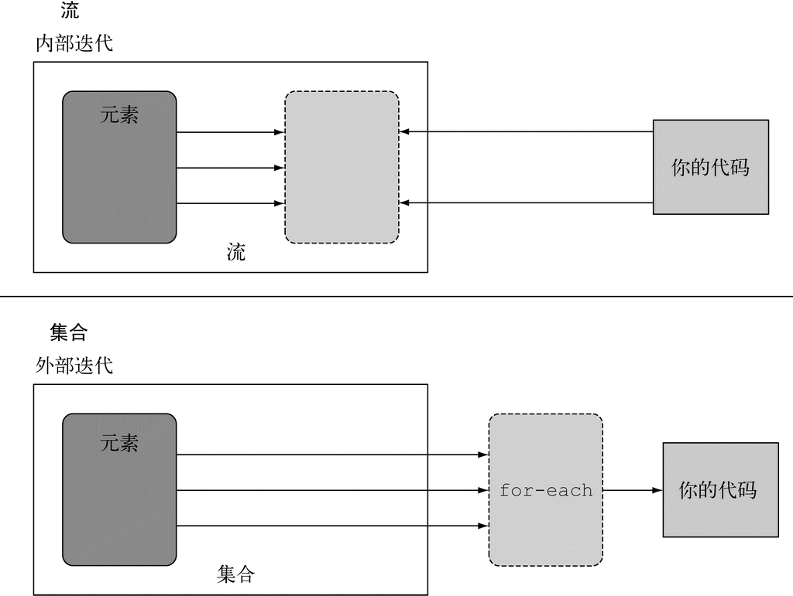

### 4.1 流是什么

流是Java API的新成员，它允许你以声明性方式处理数据集合（通过查询语句来表达，而不是临时编写一个实现）。就现在来说，你可以把它们看成遍历数据集的高级迭代器。此外，流还可以透明地并行处理，你无需写任何多线程代码了！

### 4.2 流简介

Java 8中的集合支持一个新的 stream方法，它会返回一个流（接口定义在java.util.stream.Stream里）。流到底是什么呢？简短的定义就是“从支持数据处理操作的源生成的元素序列”。

**对其进一步剖析：**

+ 元素序列——就像集合一样，流也提供了一个接口，可以访问特定元素类型的一组有序值。因为集合是数据结构，所以它的主要目的是以特定的时间/空间复杂度存储和访问元素（如ArrayList 与LinkedList）。但流的目的在于表达计算，比如前面见到的 filter、 sorted和map。集合讲的是数据，流讲的是计算。
+ 源——流会使用一个提供数据的源，如集合、数组或输入/输出资源。 请注意，从有序集合生成流时会保留原有的顺序。由列表生成的流，其元素顺序与列表一致。
+ 数据处理操作——流的数据处理功能支持类似于数据库的操作，以及函数式编程语言中的常用操作，如filter、 map、 reduce、 find、 match、 sort等。流操作可以顺序执行，也可并行执行。

**流操作特点**：

+ 流水线——很多流操作本身会返回一个流，这样多个操作就可以链接起来，形成一个大的流水线。这让我们下一章中的一些优化成为可能，如延迟和短路。流水线的操作可以看作对数据源进行数据库式查询。
+ 内部迭代——与使用迭代器显式迭代的集合不同，流的迭代操作是在背后进行的。

### 4.3 流与集合

(1) 粗略地说，集合与流之间的差异就在于什么时候进行计算。集合是一个内存中的数据结构，它包含数据结构中目前所有的值——集合中的每个元素都得先算出来才能添加到集合中。（你可以往集合里加东西或者删东西，但是不管什么时候，集合中的每个元素都是放在内存里的，元素都得先算出来才能成为集合的一部分。） 

(2) 相比之下，流则是在概念上固定的数据结构（你不能添加或删除元素），其元素则是按需计

算的。 这对编程有很大的好处。

(3) 流就 像是一个延迟创建的集合：只有在消费者要求的时候才会计算值（用管理学的话说这就是需求驱动，甚至是实时制造)。 

(4) 与此相反，集合则是急切创建的（供应商驱动：先把仓库装满，再开始卖，就像那些昙花一现的圣诞新玩意儿一样）。

#### 4.3.1 只能遍历一次

和迭代器类似，流只能遍历一次。遍历完之后，我们就说这个流已经被消费掉了。 你可以从原始数据源那里再获得一个新的流来重新遍历一遍，就像迭代器一样（这里假设它是集合之类的可重复的源，如果是I/O通道就没戏了）。

#### 4.3.2 外部迭代和内部迭代

使用Collection接口需要用户去做迭代（比如用for-each），这称为外部迭代。 相反， Streams库使用内部迭代——它帮你把迭代做了，还把得到的流值存在了某个地方，你只要给出一个函数说要干什么就可以了。



### 4.4 流操作

java.util.stream.Stream中的Stream接口定义了许多操作。它们可以分为两大类。我们再来看一下前面的例子：

```java
List<String> names = menu.stream()    ←─从菜单获得流
                         .filter(d -> d.getCalories() > 300)    ←─中间操作
                         .map(Dish::getName)    ←─中间操作
                         .limit(3)    ←─中间操作
                         .collect(toList());    ←─将Stream转换为List
```

可以看到两类操作：

(1) filter、 map和limit可以连成一条流水线；

(2) collect触发流水线执行并关闭它。

可以连接起来的流操作称为中间操作，关闭流的操作称为终端操作。 

#### 4.4.1 中间操作

诸如filter或sorted等中间操作会返回另一个流。这让多个操作可以连接起来形成一个查 询。重要的是，除非流水线上触发一个终端操作，否则中间操作不会执行任何处理——它们很懒。 这是因为中间操作一般都可以合并起来，在终端操作时一次性全部处理。

#### 4.4.2 终端操作

终端操作会从流的流水线生成结果。其结果是任何不是流的值，比如List、 Integer，甚 至void。

#### 4.4.3 使用流

总而言之，流的使用一般包括三件事：

(1) 一个数据源（如集合）来执行一个查询；

(2) 一个中间操作链，形成一条流的流水线；

(3) 一个终端操作，执行流水线，并能生成结果。

**中间操作**

| 操作       | 类型 | 返回类型    | 操作参数         | 函数描述符      |
| ---------- | ---- | ----------- | ---------------- | --------------- |
| `filter`   | 中间 | `Stream<T>` | `Predicate<T>`   | `T -> boolean`  |
| `map`      | 中间 | `Stream<R>` | `Function<T, R>` | `T -> R`        |
| `limit`    | 中间 | `Stream<T>` |                  |                 |
| `sorted`   | 中间 | `Stream<T>` | `Comparator<T>`  | `(T, T) -> int` |
| `distinct` | 中间 | `Stream<T>` |                  |                 |

**终端操作** 

| 操作      | 类型 | 目的                                                   |
| --------- | ---- | ------------------------------------------------------ |
| `forEach` | 终端 | 消费流中的每个元素并对其应用Lambda。这一操作返回`void` |
| `count`   | 终端 | 返回流中元素的个数。这一操作返回`long`                 |
| `collect` | 终端 | 把流归约成一个集合，比如`List`、`Map`甚至是`Integer`   |


### 4.5 小结

(1) 流是“从支持数据处理操作的源生成的一系列元素”。

(2) 流利用内部迭代：迭代通过filter、 map、 sorted等操作被抽象掉了。

(3) 流操作有两类：中间操作和终端操作。

(4) filter和map等中间操作会返回一个流，并可以链接在一起。可以用它们来设置一条流 水线，但并不会生成任何结果。 

(5) forEach和count等终端操作会返回一个非流的值，并处理流水线以返回结果。

(6) 流中的元素是按需计算的。


