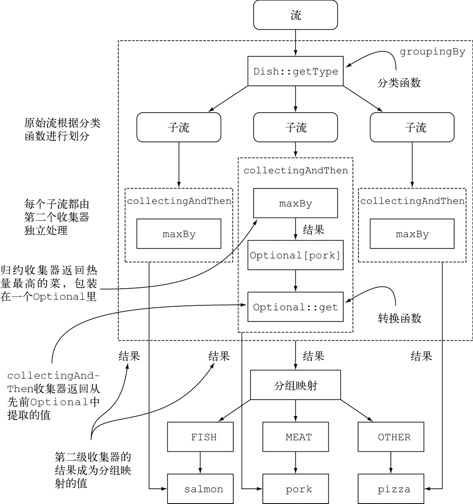
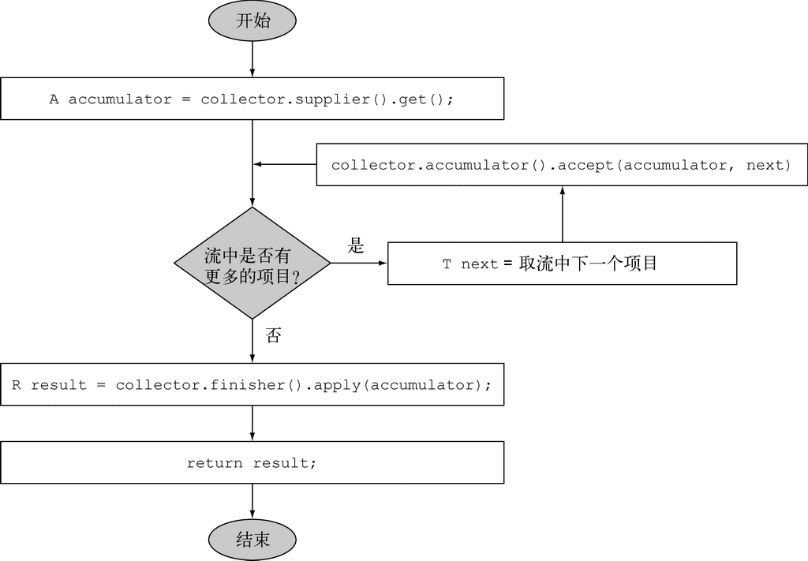
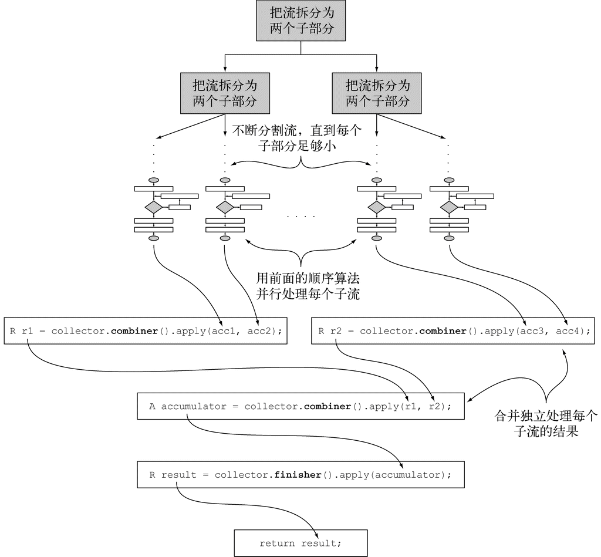

### 6.1 收集器简介

上一章里的toList只是说“按顺序给每个元素生成一个列表”；在本例中，groupingBy说的是“生成一个Map，它的键是（货币）桶，值则是桶中那些元素的列表”。

#### 6.1.1 收集器用作高级归约

对流调用collect方法将对流中的元素触发一个归约操作（由Collector来参数化）。一般来说，Collector会对元素应用一个转换函数（很多时候是不体现任何效果的恒等转换，例如toList），并将结果累积在一个数据结构中，从而产生这一过程的最终输出。

#### 6.1.2 预定义收集器

预定义收集器，也就是那些可以从Collectors类提供的工厂方法（例如groupingBy）创建的收集器。它们主要提供了三大功能：

+ 将流元素归约和汇总为一个值
+ 元素分组 
+ 元素分区 —— 分组的特殊情况“分区”，即使用谓词（返回一个布尔值的单参数函数）作为分组函数。

### 6.2 归约和汇总

利用counting工厂方法返回的收集器，数一数菜单里有多少种菜：

```java
long howManyDishes = menu.stream().collect(Collectors.counting());

// 这还可以写得更为直接：
long howManyDishes = menu.stream().count();
```

#### 6.2.1 查找流中的最大值和最小值

假设你想要找出菜单中热量最高的菜。你可以使用两个收集器，Collectors.maxBy和Collectors.minBy，来计算流中的最大或最小值。这两个收集器接收一个Comparator参数来比较流中的元素。你可以创建一个Comparator来根据所含热量对菜肴进行比较，并把它传递给Collectors.maxBy：

```java
Comparator<Dish> dishCaloriesComparator = Comparator.comparingInt(Dish::getCalories);

Optional<Dish> mostCalorieDish = menu
    .stream()
    .collect(maxBy(dishCaloriesComparator));
```

#### 6.2.2 汇总

Collectors类专门为汇总提供了一个工厂方法：Collectors.summingInt。它可接受一个把对象映射为求和所需int的函数，并返回一个收集器；该收集器在传递给普通的collect方法后即执行我们需要的汇总操作。举个例子来说，你可以这样求出菜单列表的总热量：

```java
int totalCalories = menu.stream().collect(summingInt(Dish::getCalories));
```

Collectors.summingLong和Collectors.summingDouble方法的作用完全一样，可以用于求和字段为long或double的情况。

但汇总不仅仅是求和；还有Collectors.averagingInt，连同对应的averagingLong和averagingDouble可以计算数值的平均数：

```java
double avgCalories =
    menu.stream().collect(averagingInt(Dish::getCalories));
```

可以使用summarizingInt工厂方法返回的收集器。通过一次summarizing操作你可以就数出菜单中元素的个数，并得到菜肴热量总和、平均值、最大值和最小值： 

```java
IntSummaryStatistics menuStatistics =
    menu.stream().collect(summarizingInt(Dish::getCalories));
```

这个收集器会把所有这些信息收集到一个叫作IntSummaryStatistics的类里，它提供了方便的取值（getter）方法来访问结果。打印menuStatisticobject会得到以下输出： 

```java
IntSummaryStatistics{count=9, sum=4300, min=120, average=477.777778, max=800}
```

相应的summarizingLong和summarizingDouble工厂方法有相关的LongSummaryStatistics和DoubleSummaryStatistics类型，适用于收集的属性是原始类型long或double的情况。 

#### 6.2.3 连接字符串

joining工厂方法返回的收集器会把对流中每一个对象应用toString方法得到的所有字符串连接成一个字符串。这意味着你把菜单中所有菜肴的名称连接起来，如下所示：

```java
// joining在内部使用了StringBuilder来把生成的字符串逐个追加起来
String shortMenu = menu.stream().map(Dish::getName).collect(joining());

// 如果Dish类有一个toString方法来返回菜肴的名称，那无需用提取每一道菜名称的函数
String shortMenu = menu.stream().collect(joining());

// joining工厂方法有一个重载版本可以接受元素之间的分界符
String shortMenu = menu.stream().map(Dish::getName).collect(joining(", "));
```

#### 6.2.4 广义的归约汇总

事实上，我们已经讨论的所有收集器，都是一个可以用reducing工厂方法定义的归约过程的特殊情况而已。Collectors.reducing工厂方法是所有这些特殊情况的一般化。例如，可以用reducing方法创建的收集器来计算你菜单的总热量，如下所示：

```java
int totalCalories = menu.stream().collect(
    reducing(0, Dish::getCalories, (i, j) -> i + j));
```

它需要三个参数：

+ 第一个参数是归约操作的起始值，也是流中没有元素时的返回值，所以很显然对于数值和而言0是一个合适的值。
+ 第二个参数就是使用的函数，将菜肴转换成一个表示其所含热量的int。
+ 第三个参数是一个BinaryOperator，将两个项目累积成一个同类型的值。这里它就是对两个int求和。

同样，可以使用下面这样单参数形式的reducing来找到热量最高的菜： 

```java
Optional<Dish> mostCalorieDish =
    menu.stream().collect(
    reducing((d1, d2) -> d1.getCalories() > d2.getCalories() ? d1 : d2));
```

**1.收集框架的灵活性：以不同的方式执行同样的操作**

以进一步简化前面使用reducing收集器的求和例子——引用Integer类的sum方法，而不用去写一个表达同一操作的Lambda表达式。这会得到以下程序：

```java
int totalCalories = menu.stream().collect(reducing(0,    ←─初始值
                              Dish::getCalories,    ←─转换函数
                              Integer::sum));    ←─累积函数
```

还有另一种方法不使用收集器也能执行相同操作——将菜肴流映射为每一道菜的热量，然后用前一个版本中使用的方法引用来归约得到的流： 

```java
int totalCalories =
    menu.stream().map(Dish::getCalories).reduce(Integer::sum).get();

// 更简洁的方法是把流映射到一个IntStream，然后调用sum方法
int totalCalories = menu.stream().mapToInt(Dish::getCalories).sum();
```

**2.根据情况选择最佳解决方案**

收集器在某种程度上比Stream接口上直接提供的方法用起来更复杂，但好处在于它们能提供更高水平的抽象和概括，也更容易重用和自定义。

尽可能为手头的问题探索不同的解决方案，但在通用的方案里面，始终选择最专门化的一个。无论是从可读性还是性能上看，这一般都是最好的决定。

### 6.3 分组

用Collectors.groupingBy工厂方法返回的收集器就可以轻松地完成分组操作：

```java
Map<Dish.Type, List<Dish>> dishesByType = // groupingBy方法中的Function叫作分类函数
    menu.stream().collect(groupingBy(Dish::getType));

// 其结果是下面的Map
{FISH=[prawns, salmon], OTHER=[french fries, rice, season fruit, pizza],
 MEAT=[pork, beef, chicken]}
```

分组操作的结果是一个Map，把分组函数返回的值作为映射的键，把流中所有具有这个分类值的项目的列表作为对应的映射值。普通的单参数groupingBy(f)（其中f是分类函数）实际上是groupingBy(f, toList())的简便写法。

#### 6.3.1 多级分组

要实现多级分组，我们可以使用一个由双参数版本的Collectors.groupingBy工厂方法创建的收集器，它除了普通的分类函数之外，还可以接受collector类型的第二个参数。那么要进行二级分组的话，我们可以把一个内层groupingBy传递给外层groupingBy，并定义一个为流中项目分类的二级标准：

```java
Map<Dish.Type, Map<CaloricLevel, List<Dish>>> dishesByTypeCaloricLevel = 
    menu.stream().collect(
    groupingBy(Dish::getType,    ←─一级分类函数
         groupingBy(dish -> {    ←─二级分类函数
            if (dish.getCalories() <= 400) return CaloricLevel.DIET;
                else if (dish.getCalories() <= 700) return CaloricLevel.NORMAL;
           else return CaloricLevel.FAT;
          } )
              )
);
```

#### 6.3.2 按子组收集数据

进一步说，传递给第一个groupingBy的第二个收集器可以是任何类型，而不一定是另一个groupingBy。例如，要数一数菜单中每类菜有多少个，可以传递counting收集器作为groupingBy收集器的第二个参数：

```java
Map<Dish.Type, Long> typesCount = menu.stream().collect(
    groupingBy(Dish::getType, counting()));

// 输出结果
{MEAT=3, FISH=2, OTHER=4}
```

**1.把收集器的结果转换为另一种类型**

因为分组操作的Map结果中的每个值上包装的Optional没什么用，所以你可能想要把它们去掉。要做到这一点，或者更一般地来说，把收集器返回的结果转换为另一种类型，你可以使用Collectors.collectingAndThen工厂方法返回的收集器：

```java
Map<Dish.Type, Dish> mostCaloricByType =
    menu.stream()
    .collect(groupingBy(Dish::getType,    ←─分类函数
                 collectingAndThen(
                     maxBy(comparingInt(Dish::getCalories)),    ←─包装后的收集器
                 Optional::get)));    ←─转换函数
```

这个工厂方法接受两个参数——要转换的收集器以及转换函数，并返回另一个收集器。这个收集器相当于旧收集器的一个包装，collect操作的最后一步就是将返回值用转换函数做一个映射。在这里，被包起来的收集器就是用maxBy建立的那个，而转换函数Optional::get则把返回的Optional中的值提取出来。

把好几个收集器嵌套起来很常见，它们之间到底发生了什么可能不那么明显。下图可以直观地展示它们是怎么工作的。从最外层开始逐层向里，注意以下几点。

(1) 收集器用虚线表示，因此groupingBy是最外层，根据菜肴的类型把菜单流分组，得到三个子流。

(2) groupingBy收集器包裹着collectingAndThen收集器，因此分组操作得到的每个子流都用这第二个收集器做进一步归约。 

(3) collectingAndThen收集器又包裹着第三个收集器maxBy。 

(4) 随后由归约收集器进行子流的归约操作，然后包含它的collectingAndThen收集器会对其结果应用Optional:get转换函数。 

(5) 对三个子流分别执行这一过程并转换而得到的三个值，也就是各个类型中热量最高的Dish，将成为groupingBy收集器返回的Map中与各个分类键（Dish的类型）相关联的值。



**2.与groupingBy联合使用的其他收集器的例子**

一般来说，通过groupingBy工厂方法的第二个参数传递的收集器将会对分到同一组中的所有流元素执行进一步归约操作。

```java
Map<Dish.Type, Integer> totalCaloriesByType =
    menu.stream().collect(groupingBy(Dish::getType,
                                     summingInt(Dish::getCalories)));
```

然而常常和groupingBy联合使用的另一个收集器是mapping方法生成的。这个方法接受两个参数：一个函数对流中的元素做变换，另一个则将变换的结果对象收集起来。其目的是在累加之前对每个输入元素应用一个映射函数，这样就可以让接受特定类型元素的收集器适应不同类型的对象。 

```java
Map<Dish.Type, Set<CaloricLevel>> caloricLevelsByType =
    menu.stream().collect(
    groupingBy(Dish::getType, mapping(
        dish -> { if (dish.getCalories()g <= 400) return CaloricLevel.DIET;
                 else if (dish.getCalories() <= 700) return CaloricLevel.NORMAL;
                 else return CaloricLevel.FAT; },
        toSet() )));
// 输出结果
{OTHER=[DIET, NORMAL], MEAT=[DIET, NORMAL, FAT], FISH=[DIET, NORMAL]}

// 通过使用toCollection，你就可以有更多的控制。例如，你可以给它传递一个构造函数引用来要求HashSet
Map<Dish.Type, Set<CaloricLevel>> caloricLevelsByType =
    menu.stream().collect(
    groupingBy(Dish::getType, mapping(
        dish -> { if (dish.getCalories() <= 400) return CaloricLevel.DIET;
                 else if (dish.getCalories() <= 700) return CaloricLevel.NORMAL;
                 else return CaloricLevel.FAT; },
        toCollection(HashSet::new) )));
```

### 6.4 分区

分区是分组的特殊情况：由一个谓词（返回一个布尔值的函数）作为分类函数，它称分区函数。

```java
Map<Boolean, List<Dish>> partitionedMenu =
    menu.stream().collect(partitioningBy(Dish::isVegetarian));    ←─分区函数
// 输出结果
{false=[pork, beef, chicken, prawns, salmon], 
true=[french fries, rice, season fruit, pizza]}

// 用同样的分区谓词，对菜单List创建的流作筛选，然后把结果收集到另外一个List中也可以获得相同的结果
List<Dish> vegetarianDishes =
    menu.stream().filter(Dish::isVegetarian).collect(toList());
```

#### 6.4.1 分区的优势

分区的好处在于保留了分区函数返回true或false的两套流元素列表。partitioningBy工厂方法有一个重载版本，可以像下面这样传递第二个收集器：

```java
Map<Boolean, Map<Dish.Type, List<Dish>>> vegetarianDishesByType =
    menu.stream().collect(
    partitioningBy(Dish::isVegetarian,    ←─分区函数
                       groupingBy(Dish::getType)));    ←─第二个收集器

// 可以重用前面的代码来找到素食和非素食中热量最高的菜：
Map<Boolean, Dish> mostCaloricPartitionedByVegetarian =
    menu.stream().collect(
    partitioningBy(Dish::isVegetarian,
                   collectingAndThen(
                       maxBy(comparingInt(Dish::getCalories)),
                       Optional::get)));
```

#### 6.4.2 将数字按质数和非质数分区

假设你要写一个方法，它接受参数int n，并将前 n 个自然数分为质数和非质数。但首先，找出能够测试某一个待测数字是否是质数的谓词会很有帮助：

```java
public boolean isPrime(int candidate) {
    return IntStream.range(2, candidate)    ←─产生一个自然数范围，从2开始，直至但不包括待测数
        .noneMatch(i -> candidate % i == 0);    ←─如果待测数字不能被流中任何数字整除则返回true
}

// 一个简单的优化是仅测试小于等于待测数平方根的因子
public boolean isPrime(int candidate) {
    int candidateRoot = (int) Math.sqrt((double) candidate);
    return IntStream.rangeClosed(2, candidateRoot)
        .noneMatch(i -> candidate % i == 0);
}
```

为了把前n个数字分为质数和非质数，只要创建一个包含这n个数的流，用刚刚写的isPrime方法作为谓词，再给partitioningBy收集器归约就好了： 

```java
public Map<Boolean, List<Integer>> partitionPrimes(int n) {
    return IntStream.rangeClosed(2, n).boxed()
        .collect(partitioningBy(candidate -> isPrime(candidate)));
```

下表将Collectors类的静态工厂方法汇总到一起，给出了它们应用到Stream\<T>上返回的类型，以及它们用于一个叫作menuStream的Stream\<Dish>上的实际例子。 

  

| 工厂方法            | 返回类型               | 用于                                                         | 使用示例                                                     |
| ------------------- | ---------------------- | ------------------------------------------------------------ | ------------------------------------------------------------ |
| `toList`            | `List<T>`              | 把流中所有项目收集到一个`List`                               | `List<Dish> dishes = menuStream.collect(toList());`          |
| `toSet`             | `Set<T>`               | 把流中所有项目收集到一个`Set`，删除重复项                    | `Set<Dish> dishes = menuStream.collect(toSet());`            |
| `toCollection`      | `Collection<T>`        | 把流中所有项目收集到给定的供应源创建的集合                   | `Collection<Dish> dishes = menuStream.collect(toCollection(), ArrayList::new);` |
| `counting`          | `Long`                 | 计算流中元素的个数                                           | `long howManyDishes = menuStream.collect(counting());`       |
| `summingInt`        | `Integer`              | 对流中项目的一个整数属性求和                                 | `int totalCalories = menuStream.collect(summingInt(Dish::getCalories));` |
| `averagingInt`      | `Double`               | 计算流中项目`Integer`属性的平均值                            | `double avgCalories = menuStream.collect(averagingInt(Dish::getCalories));` |
| `summarizingInt`    | `IntSummaryStatistics` | 收集关于流中项目`Integer`属性的统计值，例如最大、最小、总和与平均值 | `IntSummaryStatistics menuStatistics = menuStream.collect(summarizingInt(Dish::getCalories));` |
| `joining`           | `String`               | 连接对流中每个项目调用`toString`方法所生成的字符串           | `String shortMenu = menuStream.map(Dish::getName).collect(joining(", "));` |
| `maxBy`             | `Optional<T>`          | 一个包裹了流中按照给定比较器选出的最大元素的`Optional`，或如果流为空则为`Optional.empty()` | `Optional<Dish> fattest = menuStream.collect(maxBy(comparingInt(Dish::getCalories)));` |
| `minBy`             | `Optional<T>`          | 一个包裹了流中按照给定比较器选出的最小元素的`Optional`，或如果流为空则为`Optional.empty()` | `Optional<Dish> lightest = menuStream.collect(minBy(comparingInt(Dish::getCalories)));` |
| `reducing`          | 归约操作产生的类型     | 从一个作为累加器的初始值开始，利用`BinaryOperator`与流中的元素逐个结合，从而将流归约为单个值 | `int totalCalories = menuStream.collect(reducing(0, Dish::getCalories, Integer::sum));` |
| `collectingAndThen` | 转换函数返回的类型     | 包裹另一个收集器，对其结果应用转换函数                       | `int howManyDishes = menuStream.collect(collectingAndThen(toList(), List::size));` |
| `groupingBy`        | `Map<K, List<T>>`      | 根据项目的一个属性的值对流中的项目作问组，并将属性值作为结果`Map`的键 | `Map<Dish.Type,List<Dish>> dishesByType = menuStream.collect(groupingBy(Dish::getType));` |
| `partitioningBy`    | `Map<Boolean,List<T>>` | 根据对流中每个项目应用谓词的结果来对项目进行分区             | `Map<Boolean,List<Dish>> vegetarianDishes = menuStream.collect(partitioningBy(Dish::isVegetarian));` |

### 6.5 收集器接口

Collector接口：前四个方法都会返回一个会被collect方法调用的函数，而第五个方法characteristics则提供了一系列特征，也就是一个提示列表，告诉collect方法在执行归约操作的时候可以应用哪些优化（比如并行化）。

```java
public interface Collector<T, A, R> {
    Supplier<A> supplier();
    BiConsumer<A, T> accumulator();
    Function<A, R> finisher();
    BinaryOperator<A> combiner();
    Set<Characteristics> characteristics();
}
```

本列表适用以下定义：

(1) T是流中要收集的项目的泛型。 

(2) A是累加器的类型，累加器是在收集过程中用于累积部分结果的对象。

(3) R是收集操作得到的对象（通常但并不一定是集合）的类型。

#### 6.5.1 理解Collector接口声明的方法

**1.建立新的结果容器：supplier方法 （supplier 供应商）**

supplier方法必须返回一个结果为空的Supplier，也就是一个无参数函数，在调用时它会创建一个空的累加器实例，供数据收集过程使用：

```java
public Supplier<List<T>> supplier() {
    return () -> new ArrayList<T>();
}
// 也可以只传递一个构造函数引用
public Supplier<List<T>> supplier() {
    return ArrayList::new;
}
```

**2.将元素添加到结果容器：accumulator方法（accumulator 累加器）**

accumulator方法会返回执行归约操作的函数。当遍历到流中第 n 个元素时，这个函数执行时会有两个参数：保存归约结果的累加器（已收集了流中的前 n-1 个项目），还有第 n 个元素本身：

```java
public BiConsumer<List<T>, T> accumulator() {
    return (list, item) -> list.add(item);
}
// 这里也可以使用方法引用
public BiConsumer<List<T>, T> accumulator() {
    return List::add;
}
```

**3.对结果容器进行最终装换：finisher方法（finisher 整理工）**

在遍历完流后，finisher方法必须返回在累积过程的最后要调用的一个函数，以便将累加器对象转换为整个集合操作的最终结果。通常，就像ToListCollector的情况一样，累加器对象恰好符合预期的最终结果，因此无需进行转换。所以finisher方法只需返回identity函数：

```java
public Function<List<T>, List<T>> finisher() {
    return Function.identity();
}
```



**4.合并两个结果容器：combiner方法（combiner 组合器）**

四个方法中的最后一个——combiner方法会返回一个供归约操作使用的函数，它定义了对流的各个子部分进行并行处理时，各个子部分归约所得的累加器要如何合并。对于toList而言，这个方法的实现非常简单，只要把从流的第二个部分收集到的项目列表加到遍历第一部分时得到的列表后面就行了：

```java
public BinaryOperator<List<T>> combiner() {
    return (list1, list2) -> {
        list1.addAll(list2);
        return list1;
    };
}
```



**5.characteristics方法**

最后一个方法——characteristics会返回一个不可变的Characteristics集合，它定义了收集器的行为——尤其是关于流是否可以并行归约，以及可以使用哪些优化的提示。Characteristics是一个包含三个项目的枚举。

(1) UNORDERED——归约结果不受流中项目的遍历和累积顺序的影响。

(2) CONCURRENT——accumulator函数可以从多个线程同时调用，且该收集器可以并行归约流。如果收集器没有标为UNORDERED，那它仅在用于无序数据源时才可以并行归约。 

(3) IDENTITY_FINISH——这表明完成器方法返回的函数是一个恒等函数，可以跳过。这种情况下，累加器对象将会直接用作归约过程的最终结果。这也意味着，将累加器A不加检查地转换为结果R是安全的。

#### 6.5.2 全部融合在一起

```java
import java.util.*;
import java.util.function.*;
import java.util.stream.Collector;
import static java.util.stream.Collector.Characteristics.*;

public class ToListCollector<T> implements Collector<T, List<T>, List<T>> {

    @Override
    public Supplier<List<T>> supplier() {
        return ArrayList::new;    ←─创建集合操作的起始点
    }

    @Override
    public BiConsumer<List<T>, T> accumulator() {
        return List::add;    ←─累积遍历过的项目，原位修改累加器
    }

    @Override
    public Function<List<T>, List<T>> finisher() {
        return Function.indentity();    ←─恒等函数
    }

    @Override
    public BinaryOperator<List<T>> combiner() {
        return (list1, list2) -> {
            list1.addAll(list2);    ←─修改第一个累加器，将其与第二个累加器的内容合并
                return list1;    ←─返回修改后的第一个累加器
        };
    }

    @Override
    public Set<Characteristics> characteristics() {
        return Collections.unmodifiableSet(EnumSet.of(
            IDENTITY_FINISH, CONCURRENT));    ←─为收集器添加IDENTITY_FINISH和CONCURRENT标志
    }
}

// 具体应用
List<Dish> dishes = menuStream.collect(new ToListCollector<Dish>());
```

**进行自定义收集而不去实现Collector**

对于IDENTITY_FINISH的收集操作，还有一种方法可以得到同样的结果而无需从头实现新的Collectors接口。Stream有一个重载的collect方法可以接受另外三个函数——supplier、accumulator和combiner，其语义和Collector接口的相应方法返回的函数完全相同。所以比如说，我们可以像下面这样把菜肴流中的项目收集到一个List中：

```java
List<Dish> dishes = menuStream.collect(
                        ArrayList::new,    ←─供应源
                        List::add,    ←─累加器
                        List::addAll);    ←─组合器
// 备注：第二种形式虽然比前一个写法更为紧凑和简洁，却不那么易读
// 第二个collect方法不能传递任何Characteristics，所以它永远都是一个IDENTITY_FINISH和CONCURRENT但并非UNORDERED的收集器。
```

### 6.6 开发你自己的收集器以获得更好的性能

#### 6.6.1 仅用质数做除数

对于之前的质数判断，一个可能的优化是仅仅看看被测试数是不是能够被质数整除。要是除数本身都不是质数就用不着测了。

假设已有这个质数列表，那就可以把它传给isPrime方法，将方法重写如下：

```java
public static boolean isPrime(List<Integer> primes, int candidate) {
    return primes.stream().noneMatch(i -> candidate % i == 0);
}
```

再次优化，只需在质数大于被测数平方根的时候停下来就可以了。因此，我们会创建一个名为takeWhile的方法，给定一个排序列表和一个谓词，它会返回元素满足谓词的最长前缀，也就是返回一个子列表，该列表中的所有数的小于除数的平方根： 

```java
public static <A> List<A> takeWhile(List<A> list, Predicate<A> p) {
    int i = 0;
    for (A item : list) {
        if (!p.test(item)) {    ←─检查列表中的当前项目是否满足谓词
            return list.subList(0, i);    ←─如果不满足，返回该项目之前的前缀子列表
        }
        i++;
    }
    return list;    ←─列表中的所有项目都满足谓词，因此返回列表本身
}
```

利用这个方法，就可以优化isPrime方法，只用不大于被测数平方根的质数去测试了： 

```java
public static boolean isPrime(List<Integer> primes, int candidate){
    int candidateRoot = (int) Math.sqrt((double) candidate);
    return takeWhile(primes, i -> i <= candidateRoot)
        .stream()
        .noneMatch(p -> candidate % p == 0);
}
```

有了这个新的isPrime方法在手，就可以实现自己的自定义收集器了。首先要声明一个实现Collector接口的新类，然后要开发Collector接口所需的五个方法。

**1.第一步：定义义Collector类的签名**

```java
// 其中T、A和R分别是流中元素的类型、用于累积部分结果的对象类型，以及collect操作最终结果的类型。
public interface Collector<T, A, R> 

// 这里应该收集Integer流，而累加器和结果类型则都是Map<Boolean, List<Integer>>
public class PrimeNumbersCollector
    implements Collector<Integer,    ←─流中元素的类型
                         Map<Boolean, List<Integer>>,    ←─累加器类型
                         Map<Boolean, List<Integer>>>    ←─collect操作的结果类型
```

**2.第二步：实现归约过程** 

```java
public Supplier<Map<Boolean, List<Integer>>> supplier() {
    return () -> new HashMap<Boolean, List<Integer>>() {{
        put(true, new ArrayList<Integer>());
        put(false, new ArrayList<Integer>());
    }};
}

public BiConsumer<Map<Boolean, List<Integer>>, Integer> accumulator() {
    return (Map<Boolean, List<Integer>> acc, Integer candidate) -> {
        acc.get( isPrime(acc.get(true), candidate) )    ←─根据isPrime的结果，获取质数或非质数列表
            .add(candidate);    ←─将被测数添加到相应的列表中
    };
}
```

**3.第三步：让收集器并行工作（如果可能）**  

```java
public BinaryOperator<Map<Boolean, List<Integer>>> combiner() {
    return (Map<Boolean, List<Integer>> map1,
            Map<Boolean, List<Integer>> map2) -> {
                map1.get(true).addAll(map2.get(true));
                map1.get(false).addAll(map2.get(false));
                return map1;
           };
}
```

**4. 第四步：finisher方法和收集器的characteristics方法** 

```java
public Function<Map<Boolean, List<Integer>>,
                Map<Boolean, List<Integer>>> finisher() {
        return Function.identity();
}

public Set<Characteristics> characteristics() {
    return Collections.unmodifiableSet(EnumSet.of(IDENTITY_FINISH));
}
```

#### 6.6.2 比较收集器的性能

科学的测试方法是用一个诸如**JMH**的框架。

### 6.7 小结

(1) collect是一个终端操作，它接受的参数是将流中元素累积到汇总结果的各种方式（称为收集器）。

(2) 预定义收集器包括将流元素归约和汇总到一个值，例如计算最小值、最大值或平均值等。

(3) 预定义收集器可以用groupingBy对流中元素进行分组，或用partitioningBy进行分区。

(4) 收集器可以高效地复合起来，进行多级分组、分区和归约。

(5) 可以实现Collector接口中定义的方法来开发你自己的收集器。

