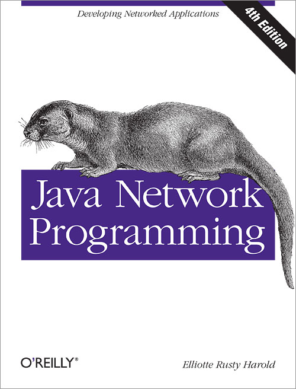

## Java Network Programming

> 记录学习**java网络编程**的历程，参考自书籍[《Java Network Programming,Fourth Edition（Java网络编程，第四版）》](https://book.douban.com/subject/26259017/)。

 

## 目录

+ [第01章_基本网络概念](第01章_基本网络概念.md  )
+ [第02章_流](第02章_流.md )
+ [第03章_线程](第03章_线程.md )
+ [第04章_Internet地址](第04章_Internet地址.md )
+ [第05章_URL和URI](第05章_URL和URI.md)
+ [第06章_HTTP](第06章_HTTP.md )

