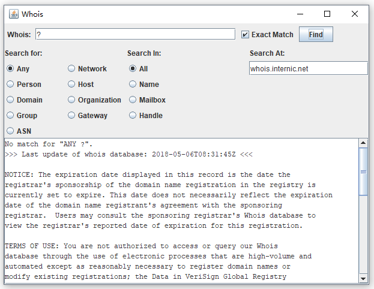

## 使用Socket

Socket允许程序员将网络连接看做是另外一个可以读/写字节的流。Socket对程序员掩盖了网络的底层细节，如错误检测、包大小、包分解、包重传、网络地址等。

Socket是两台主机之间的一个连接。它可以完成7个基本操作：

+ Connect to a remote machine（连接远程主机）
+ Send data（发送数据）
+ Receive data（接收数据）
+ Close a connection（关闭连接）
+ Bind to a port（绑定端口）
+ Listen for incoming data（监听入站数据）
+ Accept connections from remote machines on the bound port（在绑定端口上接收来自远程主机的连接）

Java的Socket类（客户端和服务器都可以使用）提供了对应前4个操作的方法。后面3个操作仅服务器需要，即等待客户端的连接。这些操作由ServerSocket类实现。Java程序通常采用以下方式使用客户端socket：

+ The program creates a new socket with a constructor.（程序用构造函数创建一个新的socket）
+ The socket attempts to connect to the remote host.（socket尝试连接远程主机）

一旦建立连接，本地和远程主机就会从这个socket中得到输入流和输出流，使用这两个流互相发送数据。连接是全双工的（full-duplex），两台主机都可以同时发送和接收数据。

### 用Socket从服务器读取

```java
// Daytime协议客户端
import java.net.*;
import java.io.*;

public class DaytimeClient {

    public static void main(String[] args) {

        String hostname = args.length > 0 ? args[0] : "time.nist.gov";
        Socket socket = null;
        try {
            socket = new Socket(hostname, 13);
            socket.setSoTimeout(15000);
            InputStream in = socket.getInputStream();
            StringBuilder time = new StringBuilder();
            InputStreamReader reader = new InputStreamReader(in, "ASCII");
            for (int c = reader.read(); c != -1; c = reader.read()) {
                time.append((char) c);
            }
            System.out.println(time);
        } catch (IOException ex) {
            System.err.println(ex);
        } finally {
            if (socket != null) {
                try {
                    socket.close();
                } catch (IOException ex) {
                    // ignore
                }
            }
        }
    }
}
```

```
58244 18-05-06 04:35:31 50 0 0 717.4 UTC(NIST) * 
```

### 用Socket写入服务器

```java
// 一个基于网络的英语-拉丁语翻译程序
import java.io.*;
import java.net.*;

public class DictClient {

    public static final String SERVER = "dict.org";
    public static final int PORT = 2628;
    public static final int TIMEOUT = 15000;

    public static void main(String[] args) {

        Socket socket = null;
        try {
            socket = new Socket(SERVER, PORT);
            socket.setSoTimeout(TIMEOUT);
            // 获取输出流，写入数据到服务器
            OutputStream out = socket.getOutputStream();
            Writer writer = new OutputStreamWriter(out, "UTF-8");
            writer = new BufferedWriter(writer);
            InputStream in = socket.getInputStream();
            BufferedReader reader = new BufferedReader(
                    new InputStreamReader(in, "UTF-8"));

            for (String word : args) {
                define(word, writer, reader);
            }

            writer.write("quit\r\n");
            writer.flush();
        } catch (IOException ex) {
            System.err.println(ex);
        } finally { // dispose
            if (socket != null) {
                try {
                    socket.close();
                } catch (IOException ex) {
                    // ignore
                }
            }
        }
    }

    static void define(String word, Writer writer, BufferedReader reader)
            throws IOException, UnsupportedEncodingException {
        writer.write("DEFINE eng-lat " + word + "\r\n");
        writer.flush();

        for (String line = reader.readLine(); line != null; line = reader.readLine()) {
            if (line.startsWith("250 ")) { // OK
                return;
            } else if (line.startsWith("552 ")) { // no match
                System.out.println("No definition found for " + word);
                return;
            } else if (line.matches("\\d\\d\\d .*")) continue;
            else if (line.trim().equals(".")) continue;
            else System.out.println(line);
        }
    }
}
```

#### 半关闭Socket

close()方法同时关闭Socket的输入和输出。shutdownInput()和shutdownOutput()方法可以只关闭连接的一半。isInputShutdown()和isOutputShutdown()方法分别指出输入流和输出流是打开的还是关闭的。

## 构造和连接Socket

java.net.Socket类是Java完成客户端TCP操作的基础类。其他建立TCP网络连接的面向客户端的类（如URL、URLConnection、Applet和JEditorPane）最终都会调用这个类的方法。这个类本身使用原生代码与主机操作系统的TCP栈进行通信。

### 基本构造函数

每个Socket构造函数指定要连接的主机和端口。主机可以指定为InetAddress或Strin，远程端口指定为1到65535之间的int值：

```java
public Socket(String host, int port) throws UnknownHostException, IOException
public Socket(InetAddress host, int port) throws IOException
```

```java
// 查看指定主机前1024个端口中哪些安装有TCP服务器
import java.net.*;
import java.io.*;

public class LowPortScanner {

    public static void main(String[] args) {

        String host = args.length > 0 ? args[0] : "localhost";

        for (int i = 1; i < 1024; i++) {
            try {
                Socket s = new Socket(host, i);
                System.out.println("There is a server on port " + i + " of "
                        + host);
                s.close();
            } catch (UnknownHostException ex) {
                System.err.println(ex);
                break;
            } catch (IOException ex) {
                // must not be a server on this port
            }
        }
    }
}
```

有3个构造函数可以创建未连接的Socket。这些构造函数对于底层Socket的行为提供了更多控制，例如，可以选择一个不同的代理服务器或者一个加密机制：

```java
public Socket()
public Socket(Proxy proxy)
protected Socket(SocketImpl impl)
```

### 选择从哪个本地接口连接

有两个构造函数可以指定要连接的主机和端口，以及从哪个接口和端口连接：

```java
public Socket(String host, int port, InetAddress interface, int localPort) throws IOException, UnknownHostException
public Socket(InetAddress host, int port, InetAddress interface, int localPort) throws IOException
```

该Socket连接到前两个参数指定的主机和端口，后两个参数则指定它的本地网络接口和端口。网路接口可以是物理接口（例如，一个以太网卡），也可以是虚拟接口（一个有多个IP地址的多宿主主机）。如果localPort参数传入0，Java会随机选择1024到65535之间的一个可用端口。

## GUI应用的中Socket

### 网络客户库

```java
// whois类
import java.net.*;
import java.io.*;

public class Whois {

    public final static int DEFAULT_PORT = 43;
    public final static String DEFAULT_HOST = "whois.internic.net";

    private int port = DEFAULT_PORT;
    private InetAddress host;

    public Whois(InetAddress host, int port) {
        this.host = host;
        this.port = port;
    }

    public Whois(InetAddress host) {
        this(host, DEFAULT_PORT);
    }

    public Whois(String hostname, int port)
            throws UnknownHostException {
        this(InetAddress.getByName(hostname), port);
    }

    public Whois(String hostname) throws UnknownHostException {
        this(InetAddress.getByName(hostname), DEFAULT_PORT);
    }

    public Whois() throws UnknownHostException {
        this(DEFAULT_HOST, DEFAULT_PORT);
    }

    // 搜索的条目
    public enum SearchFor {
        ANY("Any"), NETWORK("Network"), PERSON("Person"), HOST("Host"),
        DOMAIN("Domain"), ORGANIZATION("Organization"), GROUP("Group"),
        GATEWAY("Gateway"), ASN("ASN");

        private String label;

        private SearchFor(String label) {
            this.label = label;
        }
    }

    // 搜索的类别
    public enum SearchIn {
        ALL(""), NAME("Name"), MAILBOX("Mailbox"), HANDLE("!");

        private String label;

        private SearchIn(String label) {
            this.label = label;
        }
    }

    public String lookUpNames(String target, SearchFor category,
                              SearchIn group, boolean exactMatch) throws IOException {

        String suffix = "";
        if (!exactMatch) suffix = ".";

        String prefix = category.label + " " + group.label;
        String query = prefix + target + suffix;

        Socket socket = new Socket();
        try {
            SocketAddress address = new InetSocketAddress(host, port);
            socket.connect(address);
            Writer out
                    = new OutputStreamWriter(socket.getOutputStream(), "ASCII");
            BufferedReader in = new BufferedReader(new
                    InputStreamReader(socket.getInputStream(), "ASCII"));
            out.write(query + "\r\n");
            out.flush();

            StringBuilder response = new StringBuilder();
            String theLine = null;
            while ((theLine = in.readLine()) != null) {
                response.append(theLine);
                response.append("\r\n");
            }
            return response.toString();
        } finally {
            socket.close();
        }
    }

    public InetAddress getHost() {
        return this.host;
    }

    public void setHost(String host)
            throws UnknownHostException {
        this.host = InetAddress.getByName(host);
    }
}
```

```java
// 图形化whois客户端界面
import java.awt.*;
import java.awt.event.*;
import java.net.*;
import javax.swing.*;

public class WhoisGUI extends JFrame {

    private JTextField searchString = new JTextField(30);
    private JTextArea names = new JTextArea(15, 80);
    private JButton findButton = new JButton("Find");
    ;
    private ButtonGroup searchIn = new ButtonGroup();
    private ButtonGroup searchFor = new ButtonGroup();
    private JCheckBox exactMatch = new JCheckBox("Exact Match", true);
    private JTextField chosenServer = new JTextField();
    private Whois server;

    public WhoisGUI(Whois whois) {
        super("Whois");
        this.server = whois;
        Container pane = this.getContentPane();

        Font f = new Font("Monospaced", Font.PLAIN, 12);
        names.setFont(f);
        names.setEditable(false);

        JPanel centerPanel = new JPanel();
        centerPanel.setLayout(new GridLayout(1, 1, 10, 10));
        JScrollPane jsp = new JScrollPane(names);
        centerPanel.add(jsp);
        pane.add("Center", centerPanel);

        // You don't want the buttons in the south and north
        // to fill the entire sections so add Panels there
        // and use FlowLayouts in the Panel
        JPanel northPanel = new JPanel();
        JPanel northPanelTop = new JPanel();
        northPanelTop.setLayout(new FlowLayout(FlowLayout.LEFT));
        northPanelTop.add(new JLabel("Whois: "));
        northPanelTop.add("North", searchString);
        northPanelTop.add(exactMatch);
        northPanelTop.add(findButton);
        northPanel.setLayout(new BorderLayout(2, 1));
        northPanel.add("North", northPanelTop);
        JPanel northPanelBottom = new JPanel();
        northPanelBottom.setLayout(new GridLayout(1, 3, 5, 5));
        northPanelBottom.add(initRecordType());
        northPanelBottom.add(initSearchFields());
        northPanelBottom.add(initServerChoice());
        northPanel.add("Center", northPanelBottom);

        pane.add("North", northPanel);

        ActionListener al = new LookupNames();
        findButton.addActionListener(al);
        searchString.addActionListener(al);
    }

    private JPanel initRecordType() {
        JPanel p = new JPanel();
        p.setLayout(new GridLayout(6, 2, 5, 2));
        p.add(new JLabel("Search for:"));
        p.add(new JLabel(""));

        JRadioButton any = new JRadioButton("Any", true);
        any.setActionCommand("Any");
        searchFor.add(any);
        p.add(any);

        p.add(this.makeRadioButton("Network"));
        p.add(this.makeRadioButton("Person"));
        p.add(this.makeRadioButton("Host"));
        p.add(this.makeRadioButton("Domain"));
        p.add(this.makeRadioButton("Organization"));
        p.add(this.makeRadioButton("Group"));
        p.add(this.makeRadioButton("Gateway"));
        p.add(this.makeRadioButton("ASN"));

        return p;
    }

    private JRadioButton makeRadioButton(String label) {
        JRadioButton button = new JRadioButton(label, false);
        button.setActionCommand(label);
        searchFor.add(button);
        return button;
    }

    private JRadioButton makeSearchInRadioButton(String label) {
        JRadioButton button = new JRadioButton(label, false);
        button.setActionCommand(label);
        searchIn.add(button);
        return button;
    }

    private JPanel initSearchFields() {
        JPanel p = new JPanel();
        p.setLayout(new GridLayout(6, 1, 5, 2));
        p.add(new JLabel("Search In: "));

        JRadioButton all = new JRadioButton("All", true);
        all.setActionCommand("All");
        searchIn.add(all);
        p.add(all);

        p.add(this.makeSearchInRadioButton("Name"));
        p.add(this.makeSearchInRadioButton("Mailbox"));
        p.add(this.makeSearchInRadioButton("Handle"));

        return p;
    }

    private JPanel initServerChoice() {
        final JPanel p = new JPanel();
        p.setLayout(new GridLayout(6, 1, 5, 2));
        p.add(new JLabel("Search At: "));

        chosenServer.setText(server.getHost().getHostName());
        p.add(chosenServer);
        chosenServer.addActionListener(new ActionListener() {
            @Override
            public void actionPerformed(ActionEvent event) {
                try {
                    server = new Whois(chosenServer.getText());
                } catch (UnknownHostException ex) {
                    JOptionPane.showMessageDialog(p,
                            ex.getMessage(), "Alert", JOptionPane.ERROR_MESSAGE);
                }
            }
        });

        return p;
    }

    private class LookupNames implements ActionListener {

        @Override
        public void actionPerformed(ActionEvent event) {
            names.setText("");
            SwingWorker<String, Object> worker = new Lookup();
            worker.execute();
        }
    }

    private class Lookup extends SwingWorker<String, Object> {

        @Override
        protected String doInBackground() throws Exception {
            Whois.SearchIn group = Whois.SearchIn.ALL;
            Whois.SearchFor category = Whois.SearchFor.ANY;

            String searchForLabel = searchFor.getSelection().getActionCommand();
            String searchInLabel = searchIn.getSelection().getActionCommand();

            if (searchInLabel.equals("Name")) group = Whois.SearchIn.NAME;
            else if (searchInLabel.equals("Mailbox")) {
                group = Whois.SearchIn.MAILBOX;
            } else if (searchInLabel.equals("Handle")) {
                group = Whois.SearchIn.HANDLE;
            }

            if (searchForLabel.equals("Network")) {
                category = Whois.SearchFor.NETWORK;
            } else if (searchForLabel.equals("Person")) {
                category = Whois.SearchFor.PERSON;
            } else if (searchForLabel.equals("Host")) {
                category = Whois.SearchFor.HOST;
            } else if (searchForLabel.equals("Domain")) {
                category = Whois.SearchFor.DOMAIN;
            } else if (searchForLabel.equals("Organization")) {
                category = Whois.SearchFor.ORGANIZATION;
            } else if (searchForLabel.equals("Group")) {
                category = Whois.SearchFor.GROUP;
            } else if (searchForLabel.equals("Gateway")) {
                category = Whois.SearchFor.GATEWAY;
            } else if (searchForLabel.equals("ASN")) {
                category = Whois.SearchFor.ASN;
            }

            server.setHost(chosenServer.getText());
            return server.lookUpNames(searchString.getText(),
                    category, group, exactMatch.isSelected());
        }

        @Override
        protected void done() {
            try {
                names.setText(get());
            } catch (Exception ex) {
                JOptionPane.showMessageDialog(WhoisGUI.this,
                        ex.getMessage(), "Lookup Failed", JOptionPane.ERROR_MESSAGE);
            }
        }
    }

    public static void main(String[] args) {
        try {
            Whois server = new Whois();
            WhoisGUI a = new WhoisGUI(server);
            a.setDefaultCloseOperation(WindowConstants.EXIT_ON_CLOSE);
            a.pack();
            EventQueue.invokeLater(new FrameShower(a));
        } catch (UnknownHostException ex) {
            JOptionPane.showMessageDialog(null, "Could not locate default host "
                    + Whois.DEFAULT_HOST, "Error", JOptionPane.ERROR_MESSAGE);
        }
    }

    private static class FrameShower implements Runnable {

        private final Frame frame;

        FrameShower(Frame frame) {
            this.frame = frame;
        }

        @Override
        public void run() {
            frame.setVisible(true);
        }
    }
}
```




