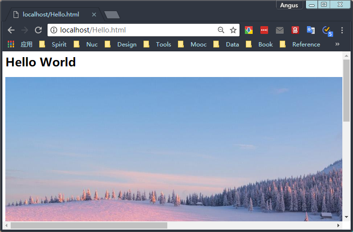

## 使用ServerSocket

ServerSocket类包含了使用Java编写服务器所需的全部内容。其中包括创建ServerSocket对象的构造函数、在指定端口监听连接的方法、配置各个服务器的Socket选项的方法，以及其他一些常见的方法。

在Java中，服务器程序的基本生命周期如下：

1. A new ServerSocket is created on a particular port using a ServerSocket() constructor.

   使用一个ServerSocket()构造函数在一个特定端口个创建一个新的ServerSocket。

2. The ServerSocket listens for incoming connection attempts on that port using its accept() method. accept() blocks until a client attempts to make a connection, at which point accept() returns a Socket object connecting the client and the server.

   ServerSocket使用其accept()方法监听这个端口的入站连接。accept()会一直阻塞，直到一个客户端尝试连接，此时accept()将返回一个连接客户端和服务器的Socket对象。

3. Depending on the type of server, either the Socket’s getInputStream() method, getOutputStream() method, or both are called to get input and output streams that communicate with the client.

   根据服务器的类型，会调用Socket的getInputStream()方法或getOutputStream()方法，或是这两个方法都调用，以获得与客户端通信的输入和输出流。

4. The server and the client interact according to an agreed-upon protocol until it is time to close the connection.

   服务器和客户端根据已协商的协议交互，直到要关闭连接。

5. The server, the client, or both close the connection.

   服务端，客户端或二者关闭连接

6. The server returns to step 2 and waits for the next connection.    

   服务器返回步骤2，等待下一次连接。

```java
// 模拟的Daytime服务器
import java.net.*;
import java.io.*;
import java.util.Date;

public class DaytimeServer {

    public final static int PORT = 13;

    public static void main(String[] args) {
        try (ServerSocket server = new ServerSocket(PORT)) {
            while (true) {
                try (Socket connection = server.accept()) {
                    Writer out = new OutputStreamWriter(connection.getOutputStream());
                    Date now = new Date();
                    out.write(now.toString() + "\r\n");
                    out.flush();
                    connection.close();
                } catch (IOException ex) {
                }
            }
        } catch (IOException ex) {
            System.err.println(ex);
        }
    }
} 

// 请求获取daytime的客户端
import java.net.*;
import java.io.*;

public class DaytimeClient {

    public static void main(String[] args) {

        String hostname = args.length > 0 ? args[0] : "localhost";
        Socket socket = null;
        try {
            socket = new Socket(hostname, 13);
            socket.setSoTimeout(15000);
            InputStream in = socket.getInputStream();
            StringBuilder time = new StringBuilder();
            InputStreamReader reader = new InputStreamReader(in, "ASCII");
            for (int c = reader.read(); c != -1; c = reader.read()) {
                time.append((char) c);
            }
            System.out.println(time);
        } catch (IOException ex) {
            System.err.println(ex);
        } finally {
            if (socket != null) {
                try {
                    socket.close();
                } catch (IOException ex) {
                    // ignore
                }
            }
        }
    }
}
```

### 多线程服务器

```java
// 多线程daytime服务器
import java.net.*;
import java.io.*;
import java.util.Date;

public class MultithreadedDaytimeServer {

    public final static int PORT = 13;

    public static void main(String[] args) {
        try (ServerSocket server = new ServerSocket(PORT)) {
            while (true) {
                try {
                    Socket connection = server.accept();
                    Thread task = new DaytimeThread(connection);
                    task.start();
                } catch (IOException ex) {
                }
            }
        } catch (IOException ex) {
            System.err.println("Couldn't start server");
        }
    }

    private static class DaytimeThread extends Thread {

        private Socket connection;

        DaytimeThread(Socket connection) {
            this.connection = connection;
        }

        @Override
        public void run() {
            try {
                Writer out = new OutputStreamWriter(connection.getOutputStream());
                Date now = new Date();
                out.write(now.toString() + "\r\n");
                out.flush();
            } catch (IOException ex) {
                System.err.println(ex);
            } finally {
                try {
                    connection.close();
                } catch (IOException e) {
                    // ignore;
                }
            }
        }
    }
}

// 使用线程池的daytime服务器
import java.io.*;
import java.net.*;
import java.util.*;
import java.util.concurrent.*;

public class PooledDaytimeServer {

    public final static int PORT = 13;

    public static void main(String[] args) {

        ExecutorService pool = Executors.newFixedThreadPool(50);

        try (ServerSocket server = new ServerSocket(PORT)) {
            while (true) {
                try {
                    Socket connection = server.accept();
                    Callable<Void> task = new DaytimeTask(connection);
                    pool.submit(task);
                } catch (IOException ex) {
                }
            }
        } catch (IOException ex) {
            System.err.println("Couldn't start server");
        }
    }

    private static class DaytimeTask implements Callable<Void> {

        private Socket connection;

        DaytimeTask(Socket connection) {
            this.connection = connection;
        }

        @Override
        public Void call() {
            try {
                Writer out = new OutputStreamWriter(connection.getOutputStream());
                Date now = new Date();
                out.write(now.toString() + "\r\n");
                out.flush();
            } catch (IOException ex) {
                System.err.println(ex);
            } finally {
                try {
                    connection.close();
                } catch (IOException e) {
                    // ignore;
                }
            }
            return null;
        }
    }
}
```

### 用Socket写入服务器

```java
// echo服务器
import java.nio.*;
import java.nio.channels.*;
import java.net.*;
import java.util.*;
import java.io.IOException;

public class EchoServer {

    public static int DEFAULT_PORT = 7;

    public static void main(String[] args) {

        int port;
        try {
            port = Integer.parseInt(args[0]);
        } catch (RuntimeException ex) {
            port = DEFAULT_PORT;
        }
        System.out.println("Listening for connections on port " + port);

        ServerSocketChannel serverChannel;
        Selector selector;
        try {
            serverChannel = ServerSocketChannel.open();
            ServerSocket ss = serverChannel.socket();
            InetSocketAddress address = new InetSocketAddress(port);
            ss.bind(address);
            serverChannel.configureBlocking(false);
            selector = Selector.open();
            serverChannel.register(selector, SelectionKey.OP_ACCEPT);
        } catch (IOException ex) {
            ex.printStackTrace();
            return;
        }

        while (true) {
            try {
                selector.select();
            } catch (IOException ex) {
                ex.printStackTrace();
                break;
            }

            Set<SelectionKey> readyKeys = selector.selectedKeys();
            Iterator<SelectionKey> iterator = readyKeys.iterator();
            while (iterator.hasNext()) {
                SelectionKey key = iterator.next();
                iterator.remove();
                try {
                    if (key.isAcceptable()) {
                        ServerSocketChannel server = (ServerSocketChannel) key.channel();
                        SocketChannel client = server.accept();
                        System.out.println("Accepted connection from " + client);
                        client.configureBlocking(false);
                        SelectionKey clientKey = client.register(
                                selector, SelectionKey.OP_WRITE | SelectionKey.OP_READ);
                        ByteBuffer buffer = ByteBuffer.allocate(100);
                        clientKey.attach(buffer);
                    }
                    if (key.isReadable()) {
                        SocketChannel client = (SocketChannel) key.channel();
                        ByteBuffer output = (ByteBuffer) key.attachment();
                        client.read(output);
                    }
                    if (key.isWritable()) {
                        SocketChannel client = (SocketChannel) key.channel();
                        ByteBuffer output = (ByteBuffer) key.attachment();
                        output.flip();
                        client.write(output);
                        output.compact();
                    }
                } catch (IOException ex) {
                    key.cancel();
                    try {
                        key.channel().close();
                    } catch (IOException cex) {
                    }
                }
            }
        }
    }
}
```

## 构造服务器Socket

有4个公共的ServerSocket构造函数：

```java
public ServerSocket(int port) throws BindException, IOException
public ServerSocket(int port, int queueLength) throws BindException, IOException
public ServerSocket(int port, int queueLength, InetAddress bindAddress) throws IOException
public ServerSocket() throws IOException
```

这些构造函数可以指定端口、保存入站连接请求所用的队列长度，以及要绑定的本地网络接口。

```java
// 查找本地端口
import java.io.*;
import java.net.*;

public class LocalPortScanner {

    public static void main(String[] args) {

        for (int port = 1; port <= 65535; port++) {
            try {
                // 如果这个端口上已经有服务器在运行，就会抛出异常
                ServerSocket server = new ServerSocket(port);
            } catch (IOException ex) {
                System.out.println("There is a server on port " + port + ".");
            }
        }
    }
}
```

## 获得服务器Socket的有关信息

```java
// 随机端口
import java.io.*;
import java.net.*;

public class RandomPort {

    public static void main(String[] args) {
        try {
            // 构造ServerSocket时，为其端口参数传入，系统会自动分配一个未占用的端口
            ServerSocket server = new ServerSocket(0); 
            System.out.println("This server runs on port "
                    + server.getLocalPort()); // 未绑定端口时，返回-1
        } catch (IOException ex) {
            System.err.println(ex);
        }
    }
}
```

## HTTP服务器

### 单文件服务器

```java
// 提供单一文件的HTTP服务器
import java.io.*;
import java.net.*;
import java.nio.charset.Charset;
import java.nio.file.*;
import java.util.concurrent.*;
import java.util.logging.*;

public class SingleFileHTTPServer {

    private static final Logger logger = Logger.getLogger("SingleFileHTTPServer");

    private final byte[] content;
    private final byte[] header;
    private final int port;
    private final String encoding;

    public SingleFileHTTPServer(String data, String encoding,
                                String mimeType, int port) throws UnsupportedEncodingException {
        this(data.getBytes(encoding), encoding, mimeType, port);
    }

    public SingleFileHTTPServer(
            byte[] data, String encoding, String mimeType, int port) {
        this.content = data;
        this.port = port;
        this.encoding = encoding;
        String header = "HTTP/1.0 200 OK\r\n"
                + "Server: OneFile 2.0\r\n"
                + "Content-length: " + this.content.length + "\r\n"
                + "Content-type: " + mimeType + "; charset=" + encoding + "\r\n\r\n";
        this.header = header.getBytes(Charset.forName("US-ASCII"));
    }

    public void start() {
        ExecutorService pool = Executors.newFixedThreadPool(100);
        try (ServerSocket server = new ServerSocket(this.port)) {
            logger.info("Accepting connections on port " + server.getLocalPort());
            logger.info("Data to be sent:");
            logger.info(new String(this.content, encoding));

            while (true) {
                try {
                    Socket connection = server.accept();
                    pool.submit(new HTTPHandler(connection));
                } catch (IOException ex) {
                    logger.log(Level.WARNING, "Exception accepting connection", ex);
                } catch (RuntimeException ex) {
                    logger.log(Level.SEVERE, "Unexpected error", ex);
                }
            }
        } catch (IOException ex) {
            logger.log(Level.SEVERE, "Could not start server", ex);
        }
    }

    private class HTTPHandler implements Callable<Void> {
        private final Socket connection;

        HTTPHandler(Socket connection) {
            this.connection = connection;
        }

        @Override
        public Void call() throws IOException {
            try {
                OutputStream out = new BufferedOutputStream(
                        connection.getOutputStream()
                );
                InputStream in = new BufferedInputStream(
                        connection.getInputStream()
                );
                // 只读取第一行，这是我们需要的全部内容
                StringBuilder request = new StringBuilder(80);
                while (true) {
                    int c = in.read();
                    if (c == '\r' || c == '\n' || c == -1) break;
                    request.append((char) c);
                }
                // 如果是HTTP/1.0或以后版本，这发送一个MIME首部
                if (request.toString().contains("HTTP/")) {
                    out.write(header);
                }
                out.write(content);
                out.flush();
            } catch (IOException ex) {
                logger.log(Level.WARNING, "Error writing to client", ex);
            } finally {
                connection.close();
            }
            return null;
        }
    }

    public static void main(String[] args) {

        args = new String[]{"D:\\Temp\\1.html"};
        // 设置要监听的窗口
        int port;
        try {
            port = Integer.parseInt(args[1]);
            if (port < 1 || port > 65535) port = 80;
        } catch (RuntimeException ex) {
            port = 80;
        }

        String encoding = "UTF-8";
        if (args.length > 2) encoding = args[2];

        try {
            Path path = Paths.get(args[0]);
            byte[] data = Files.readAllBytes(path);

            String contentType = URLConnection.getFileNameMap().getContentTypeFor(args[0]);
            SingleFileHTTPServer server = new SingleFileHTTPServer(data, encoding,
                    contentType, port);
            server.start();

        } catch (ArrayIndexOutOfBoundsException ex) {
            System.out.println(
                    "Usage: java SingleFileHTTPServer filename port encoding");
        } catch (IOException ex) {
            logger.severe(ex.getMessage());
        }
    }
}
```

### 重定向器Redirector

```java
import java.io.*;
import java.net.*;
import java.util.*;
import java.util.logging.*;

public class Redirector {

    private static final Logger logger = Logger.getLogger("Redirector");

    private final int port;
    private final String newSite;

    public Redirector(String newSite, int port) {
        this.port = port;
        this.newSite = newSite;
    }

    public void start() {
        try (ServerSocket server = new ServerSocket(port)) {
            logger.info("Redirecting connections on port "
                    + server.getLocalPort() + " to " + newSite);

            while (true) {
                try {
                    Socket s = server.accept();
                    Thread t = new RedirectThread(s);
                    t.start();
                } catch (IOException ex) {
                    logger.warning("Exception accepting connection");
                } catch (RuntimeException ex) {
                    logger.log(Level.SEVERE, "Unexpected error", ex);
                }
            }
        } catch (BindException ex) {
            logger.log(Level.SEVERE, "Could not start server.", ex);
        } catch (IOException ex) {
            logger.log(Level.SEVERE, "Error opening server socket", ex);
        }
    }

    private class RedirectThread extends Thread {

        private final Socket connection;

        RedirectThread(Socket s) {
            this.connection = s;
        }

        public void run() {
            try {
                Writer out = new BufferedWriter(
                        new OutputStreamWriter(
                                connection.getOutputStream(), "US-ASCII"
                        )
                );
                Reader in = new InputStreamReader(
                        new BufferedInputStream(
                                connection.getInputStream()
                        )
                );

                // 只读取第一行
                StringBuilder request = new StringBuilder(80);
                while (true) {
                    int c = in.read();
                    if (c == '\r' || c == '\n' || c == -1) break;
                    request.append((char) c);
                }

                String get = request.toString();
                String[] pieces = get.split("\\w*");
                String theFile = pieces[1];

                // 如果是HTTP/1.0或以后版本，则发送一个MIME首部
                if (get.indexOf("HTTP") != -1) {
                    out.write("HTTP/1.0 302 FOUND\r\n");
                    Date now = new Date();
                    out.write("Date: " + now + "\r\n");
                    out.write("Server: Redirector 1.1\r\n");
                    out.write("Location: " + newSite + theFile + "\r\n");
                    out.write("Content-type: text/html\r\n\r\n");
                    out.flush();
                }
                // 并不是所有浏览器都支持重定向，所以需要生成html指出文档转移到哪里
                out.write("<HTML><HEAD><TITLE>Document moved</TITLE></HEAD>\r\n");
                out.write("<BODY><H1>Document moved</H1>\r\n");
                out.write("The document " + theFile
                        + " has moved to\r\n<A HREF=\"" + newSite + theFile + "\">"
                        + newSite + theFile
                        + "</A>.\r\n Please update your bookmarks<P>");
                out.write("</BODY></HTML>\r\n");
                out.flush();
                logger.log(Level.INFO,
                        "Redirected " + connection.getRemoteSocketAddress());
            } catch (IOException ex) {
                logger.log(Level.WARNING,
                        "Error talking to " + connection.getRemoteSocketAddress(), ex);
            } finally {
                try {
                    connection.close();
                } catch (IOException ex) {
                }
            }
        }
    }

    public static void main(String[] args) {

        // 指定重定向到的新网址
        args = new String[]{"http://www.baidu.com"}; 

        int thePort;
        String theSite;

        try {
            theSite = args[0];
            // 删除末尾的斜线
            if (theSite.endsWith("/")) {
                theSite = theSite.substring(0, theSite.length() - 1);
            }
        } catch (RuntimeException ex) {
            System.out.println(
                    "Usage: java Redirector http://www.newsite.com/ port");
            return;
        }

        try {
            thePort = Integer.parseInt(args[1]);
        } catch (RuntimeException ex) {
            thePort = 80;
        }

        Redirector redirector = new Redirector(theSite, thePort);
        redirector.start();
    }
}
```

### 功能完备的HTTP服务器

```java
// JHTTP Web服务器
import java.io.*;
import java.net.*;
import java.util.concurrent.*;
import java.util.logging.*;

public class JHTTP {

    private static final Logger logger = Logger.getLogger(
            JHTTP.class.getCanonicalName());
    private static final int NUM_THREADS = 50;
    private static final String INDEX_FILE = "index.html";

    private final File rootDirectory;
    private final int port;

    public JHTTP(File rootDirectory, int port) throws IOException {

        if (!rootDirectory.isDirectory()) {
            throw new IOException(rootDirectory
                    + " does not exist as a directory");
        }
        this.rootDirectory = rootDirectory;
        this.port = port;
    }

    public void start() throws IOException {
        ExecutorService pool = Executors.newFixedThreadPool(NUM_THREADS);
        try (ServerSocket server = new ServerSocket(port)) {
            logger.info("Accepting connections on port " + server.getLocalPort());
            logger.info("Document Root: " + rootDirectory);

            while (true) {
                try {
                    Socket request = server.accept();
                    Runnable r = new RequestProcessor(
                            rootDirectory, INDEX_FILE, request);
                    pool.submit(r);
                } catch (IOException ex) {
                    logger.log(Level.WARNING, "Error accepting connection", ex);
                }
            }
        }
    }

    public static void main(String[] args) {

        // 获得文档根目录
        args = new String[]{"D:\\Temp"};
        File docroot;
        try {
            docroot = new File(args[0]);
        } catch (ArrayIndexOutOfBoundsException ex) {
            System.out.println("Usage: java JHTTP docroot port");
            return;
        }

        // 设置要监听的窗口
        int port;
        try {
            port = Integer.parseInt(args[1]);
            if (port < 0 || port > 65535) port = 80;
        } catch (RuntimeException ex) {
            port = 80;
        }

        try {
            JHTTP webserver = new JHTTP(docroot, port);
            webserver.start();
        } catch (IOException ex) {
            logger.log(Level.SEVERE, "Server could not start", ex);
        }
    }
}

// 处理HTTP请求的runnable类
import java.io.*;
import java.net.*;
import java.nio.file.Files;
import java.util.*;
import java.util.logging.*;

public class RequestProcessor implements Runnable {

    private final static Logger logger = Logger.getLogger(
            RequestProcessor.class.getCanonicalName());

    private File rootDirectory;
    private String indexFileName = "index.html";
    private Socket connection;

    public RequestProcessor(File rootDirectory,
                            String indexFileName, Socket connection) {

        if (rootDirectory.isFile()) {
            throw new IllegalArgumentException(
                    "rootDirectory must be a directory, not a file");
        }
        try {
            rootDirectory = rootDirectory.getCanonicalFile();
        } catch (IOException ex) {
        }
        this.rootDirectory = rootDirectory;

        if (indexFileName != null) this.indexFileName = indexFileName;
        this.connection = connection;
    }

    @Override
    public void run() {
        // 安全检查
        String root = rootDirectory.getPath();
        try {
            OutputStream raw = new BufferedOutputStream(
                    connection.getOutputStream()
            );
            Writer out = new OutputStreamWriter(raw);
            Reader in = new InputStreamReader(
                    new BufferedInputStream(
                            connection.getInputStream()
                    ), "US-ASCII"
            );
            StringBuilder requestLine = new StringBuilder();
            while (true) {
                int c = in.read();
                if (c == '\r' || c == '\n') break;
                requestLine.append((char) c);
            }

            String get = requestLine.toString();

            logger.info(connection.getRemoteSocketAddress() + " " + get);

            String[] tokens = get.split("\\s+");
            String method = tokens[0];
            String version = "";
            if (method.equals("GET")) {
                String fileName = tokens[1];
                if (fileName.endsWith("/")) fileName += indexFileName;
                String contentType =
                        URLConnection.getFileNameMap().getContentTypeFor(fileName);
                if (tokens.length > 2) {
                    version = tokens[2];
                }

                File theFile = new File(rootDirectory,
                        fileName.substring(1, fileName.length()));

                if (theFile.canRead()
                        // 不让客户端超出文档根之外
                        && theFile.getCanonicalPath().startsWith(root)) {
                    byte[] theData = Files.readAllBytes(theFile.toPath());
                    if (version.startsWith("HTTP/")) { // 发送一个MIME首部
                        sendHeader(out, "HTTP/1.0 200 OK", contentType, theData.length);
                    }

                    // 文件可能是一个图像或是其他的二进制数据，故而raw为底层输出流
                    raw.write(theData);
                    raw.flush();
                } else { // 无法找到文件
                    String body = new StringBuilder("<HTML>\r\n")
                            .append("<HEAD><TITLE>File Not Found</TITLE>\r\n")
                            .append("</HEAD>\r\n")
                            .append("<BODY>")
                            .append("<H1>HTTP Error 404: File Not Found</H1>\r\n")
                            .append("</BODY></HTML>\r\n").toString();
                    if (version.startsWith("HTTP/")) { // send a MIME header
                        sendHeader(out, "HTTP/1.0 404 File Not Found",
                                "text/html; charset=utf-8", body.length());
                    }
                    out.write(body);
                    out.flush();
                }
            } else { // 不是GET方法，服务器暂不支持
                String body = new StringBuilder("<HTML>\r\n")
                        .append("<HEAD><TITLE>Not Implemented</TITLE>\r\n")
                        .append("</HEAD>\r\n")
                        .append("<BODY>")
                        .append("<H1>HTTP Error 501: Not Implemented</H1>\r\n")
                        .append("</BODY></HTML>\r\n").toString();
                if (version.startsWith("HTTP/")) { // send a MIME header
                    sendHeader(out, "HTTP/1.0 501 Not Implemented",
                            "text/html; charset=utf-8", body.length());
                }
                out.write(body);
                out.flush();
            }
        } catch (IOException ex) {
            logger.log(Level.WARNING,
                    "Error talking to " + connection.getRemoteSocketAddress(), ex);
        } finally {
            try {
                connection.close();
            } catch (IOException ex) {
            }
        }
    }

    private void sendHeader(Writer out, String responseCode,
                            String contentType, int length)
            throws IOException {
        out.write(responseCode + "\r\n");
        Date now = new Date();
        out.write("Date: " + now + "\r\n");
        out.write("Server: JHTTP 2.0\r\n");
        out.write("Content-length: " + length + "\r\n");
        out.write("Content-type: " + contentType + "\r\n\r\n");
        out.flush();
    }
}
```




