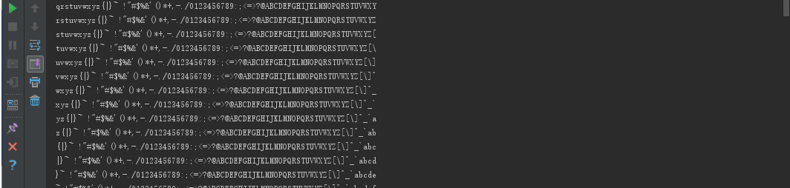

## 一个示例客户端

```java
// 一个基于通道的chargen客户端
import java.nio.*;
import java.nio.channels.*;
import java.net.*;
import java.io.IOException;

public class ChargenClient {

    public static int DEFAULT_PORT = 19;

    public static void main(String[] args) {
        
        // args = new String[]{"127.0.0.1"};
        
        if (args.length == 0) {
            System.out.println("Usage: java ChargenClient host [port]");
            return;
        }

        int port;
        try {
            port = Integer.parseInt(args[1]);
        } catch (RuntimeException ex) {
            port = DEFAULT_PORT;
        }

        try {
            SocketAddress address = new InetSocketAddress(args[0], port);
            // 开启指向指定主机及端口号的通道
            SocketChannel client = SocketChannel.open(address);
            // 指定缓冲区大小，通道会把数据写入到缓冲区中，或者从缓冲区读取数据
            ByteBuffer buffer = ByteBuffer.allocate(74);
            // 构造一个输出流（写）通道
            WritableByteChannel out = Channels.newChannel(System.out);
            // 从Socket通道读取数据放入到缓冲区
            while (client.read(buffer) != -1) {
                // 缓冲区反转，确保输出流从缓冲区起始位置操作数据
                buffer.flip();
                // 将缓冲区中的数据写入到输出通道
                out.write(buffer);
                // 清空缓冲区
                buffer.clear();
            }
        } catch (IOException ex) {
            ex.printStackTrace();
        }
    }
}
```

## 一个示例服务器

```java
// 一个非阻塞的chargen服务器
import java.nio.*;
import java.nio.channels.*;
import java.net.*;
import java.util.*;
import java.io.IOException;

public class ChargenServer {

    public static int DEFAULT_PORT = 19;

    public static void main(String[] args) {

        int port;
        try {
            port = Integer.parseInt(args[0]);
        } catch (RuntimeException ex) {
            port = DEFAULT_PORT;
        }
        System.out.println("Listening for connections on port " + port);

        byte[] rotation = new byte[95 * 2];
        // ASCII码中，空格对应十进制32，‘~’对应十进制126
        // 填充数组，用于稍后传输用数据
        for (byte i = ' '; i <= '~'; i++) {
            rotation[i - ' '] = i;
            rotation[i + 95 - ' '] = i;
        }

        ServerSocketChannel serverChannel;
        Selector selector;
        try {
            // 开启ServerSocketChannel（服务端Socket通道）
            serverChannel = ServerSocketChannel.open();
            // 获得ServerSocketChannel的对等（peer）ServerSocket对象，用于绑定监听端口
            // ServerSocket ss = serverChannel.socket();
            // InetSocketAddress address = new InetSocketAddress(port);
            // ss.bind(address);
            // Java7之后可以直接通过ServerSocketChannel绑定监听端口
            serverChannel.bind(new InetSocketAddress(port));
            // 设置服务端Socket通道处于非阻塞模式（默认为阻塞），若没有入栈连接，返回null
            serverChannel.configureBlocking(false);
            // 创建一个Selector，以允许程序迭代处理所有准备好的连接
            selector = Selector.open();
            // 将服务端Socket通道注册到Selector中
            // 并指定其关心操作为SelectionKey.OP_ACCEPT，也就是服务端Socket通道是否准备好接收一个新连接
            serverChannel.register(selector, SelectionKey.OP_ACCEPT);
        } catch (IOException ex) {
            ex.printStackTrace();
            return;
        }

        // 服务器需要长期运行，因此放在无限循环中
        while (true) {
            try {
                // 通过Selector对象的select()方法，检查是否有可操作的数据
                selector.select();
            } catch (IOException ex) {
                ex.printStackTrace();
                break;
            }

            // 获取所有就绪通道的SelectionKey（Set集合）
            Set<SelectionKey> readyKeys = selector.selectedKeys();
            // 获取迭代器，通过遍历，对所有的就绪通道进行操作
            Iterator<SelectionKey> iterator = readyKeys.iterator();
            while (iterator.hasNext()) {
                SelectionKey key = iterator.next();
                // 从集合中删除这个SelectionKey，确保其不会被处理两次
                iterator.remove();
                try {
                    if (key.isAcceptable()) {
                        // 从key中获取服务端Socket通道对象
                        ServerSocketChannel server = (ServerSocketChannel) key.channel();
                        // 服务端Socket通道接收入栈连接获得SocketChannel（客户端Socket通道）对象
                        SocketChannel client = server.accept();
                        System.out.println("Accepted connection from " + client);
                        // 将客户端Socket通道设置为非阻塞，以允许服务器处理多个并发连接
                        client.configureBlocking(false);
                        // 将客户端Socket通道注册到Selector中
                        // 并指定其关心操作为SelectionKey.OP_WRITE，即表明是否已经准备好数据写入通道
                        SelectionKey key2 = client.register(selector, SelectionKey.OP_WRITE);
                        // 为客户端建立缓冲区
                        ByteBuffer buffer = ByteBuffer.allocate(74);
                        buffer.put(rotation, 0, 72);
                        buffer.put((byte) '\r');
                        buffer.put((byte) '\n');
                        buffer.flip();
                        // 将缓冲区作为客户端Socket通道对应的SelectionKey的附件
                        key2.attach(buffer);
                    } else if (key.isWritable()) {
                        // 从key中获取客户端Socket通道对象
                        SocketChannel client = (SocketChannel) key.channel();
                        // 从附件中获取缓冲区
                        ByteBuffer buffer = (ByteBuffer) key.attachment();
                        // 调用ByteBuffer的hasRemaining()方法，检查缓冲区中是否还有剩余数据未写
                        if (!buffer.hasRemaining()) {
                            // 将缓冲区的position设为0，limit不变，重新填充缓冲区
                            buffer.rewind();
                            // 得到缓冲区上一次的首字符
                            int first = buffer.get();
                            // 将缓冲区的position设为0，重新填充缓冲区
                            buffer.rewind();
                            // 寻找rotation中新的首字符位置
                            int position = first - ' ' + 1;
                            // 将数据从rotation复制到缓冲区
                            buffer.put(rotation, position, 72);
                            // 在缓冲区末尾存储一个行分割符
                            buffer.put((byte) '\r');
                            buffer.put((byte) '\n');
                            // 将缓冲区的limit设为position，position设为0，准备进行写入
                            buffer.flip();
                        }
                        // 将缓冲区的内容写入到客户端Socket通道
                        client.write(buffer);
                    }
                } catch (IOException ex) {
                    // 客户端中断（关闭）Socket时，会抛出一个异常
                    // 此时应该关闭客户端Socket通道，并将其从Selector中取消注册
                    try {
                        key.channel().close();
                    } catch (IOException ignored) {
                    }
                    key.cancel();
                }
            }
        }
    }
}
```



## 缓冲区

Java的所有基本数据类型都有特定的Buffer子类：ByteBuffer、CharBuffer、ShortBuffer、IntBuffer、LongBuffer、FloatBuffer和DoubleBuffer。网络程序几乎只会使用ByteBuffer（适用于所所有数据类型），但偶尔会使用其他类型来取代ByteBuffer。

除了数据列表外，每个缓冲区都记录了信息的4个关键部分。无论缓冲区是何种类型，都有相同的方法来获取和设置这些值：

+ position（位置）

  缓冲区中将读取或写入的下一个位置。这个位置从0开始记，最大值等于缓冲区的大小。可以通过下面两个方法获取和设置：

  ```java
  public final int position()
  public final Buffer position(int newPosition)
  ```

+ capacity（容量）

  缓冲区可以保存的元素的最大数目。容量值在创建缓冲区时设置，此后不能改变。可用下面的方法读取：

  ```java
  public final int capacity()
  ```

+ limit（限度）

  缓冲区可访问数据的末尾位置。只要不改变限度，就无法读/写超过这个位置的数据，即使缓冲区有更大的容量也没有用。限度可以用下面两个方法获取和设置：

  ```java
  public final int limit()
  public final Buffer limit(int newLimit)
  ```

+ mark（标记）

  缓冲区中客户端指定的索引。调用mark()方法可以将标记设置为当前位置（position），而调用reset()方法可以将position设置为之前所标记的位置（mark）：

  ```java
  public final Buffer mark()
  public final Buffer reset()
  ```

  如果将position设置为小于现有mark，则该mark将被丢弃（设为-1）。同理，当mark大于limit时，也将被丢弃。


