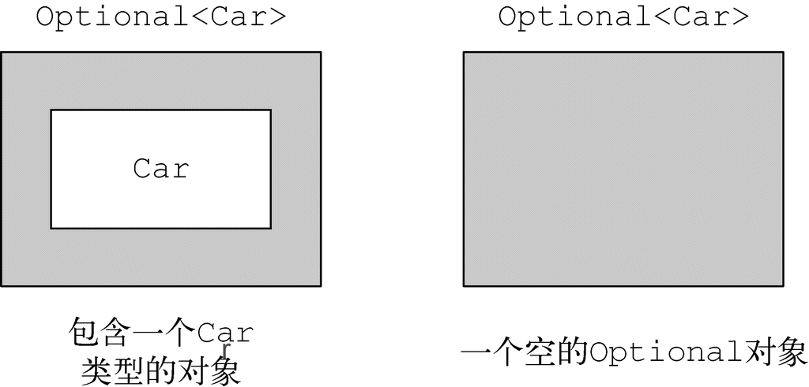
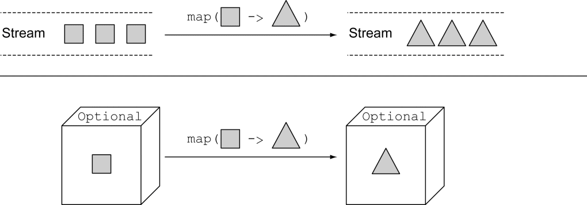
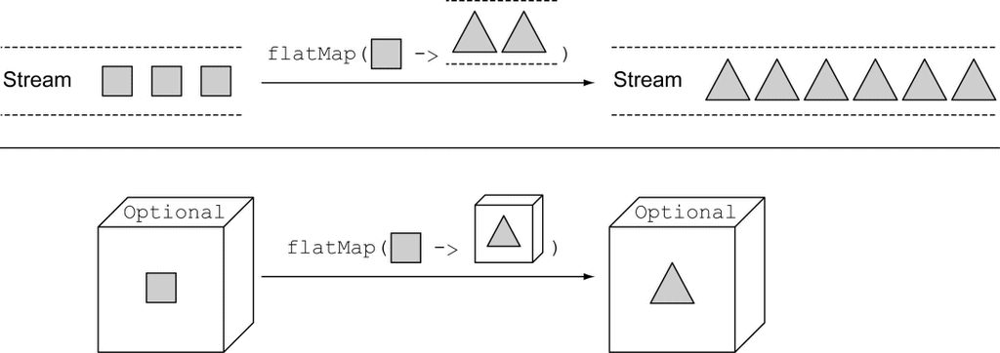
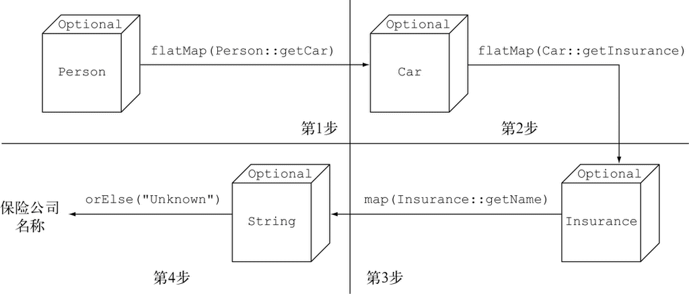

### 10.1 如何为缺失的值建模

#### 10.1.1 采用防御式检查减少NullPointerException

怎样做才能避免这种不期而至的NullPointerException呢？通常，你可以在需要的地方添加null的检查（过于激进的防御式检查甚至会在不太需要的地方添加检测代码），并且添加的方式往往各有不同。

每次你不确定一个变量是否为null时，都需要添加一个进一步嵌套的if块，也增加了代码缩进的层数。很明显，这种方式不具备扩展性，同时还牺牲了代码的可读性。

#### 10.1.2 null带来的种种问题

在Java程序开发中使用null会带来理论和实际操作上的种种问题：

(1) 它是错误之源。NullPointerException是目前Java程序开发中最典型的异常。 

(2) 它会使你的代码膨胀。 它让你的代码充斥着深度嵌套的null检查，代码的可读性糟糕透顶。 

(3) 它自身是毫无意义的。null自身没有任何的语义，尤其是，它代表的是在静态类型语言中以一种错误的方式对缺失变量值的建模。 

(4) 它破坏了Java的哲学。 Java一直试图避免让程序员意识到指针的存在，唯一的例外是：null指针。 

(5) 它在Java的类型系统上开了个口子。 null并不属于任何类型，这意味着它可以被赋值给任意引用类型的变量。这会导致问题，原因是当这个变量被传递到系统中的另一个部分后，你将无法获知这个null变量最初的赋值到底是什么类型。

#### 10.1.3 其他语言中null的替代品

近年来出现的语言，比如Groovy，通过引入安全导航操作符（Safe Navigation Operator，标记为?）可以安全访问可能为null的变量。

### 10.2 Optional类入门

汲取Haskell和Scala的灵感，Java 8中引入了一个新的类java.util.Optional<T>。这是一个封装Optional值的类。举例来说，使用新的类意味着，如果你知道一个人可能有也可能没有车，那么Person类内部的car变量就不应该声明为Car，遭遇某人没有车时把null引用赋值给它，而是应该像图那样直接将其声明为Optional<Car>类型。



变量存在时，Optional类只是对类简单封装。变量不存在时，缺失的值会被建模成一个“空”的Optional对象，由方法Optional.empty()返回。Optional.empty()方法是一个静态工厂方法，它返回Optional类的特定单一实例。你可能还有疑惑，null引用和Optional.empty()有什么本质的区别吗？从语义上，你可以把它们当作一回事儿，但是实际中它们之间的差别非常大：如果你尝试解引用一个null，一定会触发NullPointerException，不过使用Optional.empty()就完全没事儿，它是Optional类的一个有效对象，多种场景都能调用，非常有用。

使用Optional而不是null的一个非常重要而又实际的语义区别是，第一个例子中，我们在声明变量时使用的是Optional<Car>类型，而不是Car类型，这句声明非常清楚地表明了这里发生变量缺失是允许的。与此相反，使用Car这样的类型，可能将变量赋值为null，这意味着你需要独立面对这些，你只能依赖你对业务模型的理解，判断一个null是否属于该变量的有效范畴。

使用Optional重新定义Person/Car/Insurance的数据模型 

```java
public class Person {
    private Optional<Car> car;    ←─人可能有车，也可能没有车，因此将这个字段声明为Optional
    public Optional<Car> getCar() { return car; }
}

public class Car {
    private Optional<Insurance> insurance;  ←─车可能进行了保险，也可能没有保险，所以将这个字段声明为Optional
    public Optional<Insurance> getInsurance() { return insurance; }
}

public class Insurance {
    private String name;    ←─保险公司必须有名字
    public String getName() { return name; }
}
```

### 10.3 应用Optional的几种模式

#### 10.3.1 创建Optional对象

**1.声明一个空的Optional**

可以通过静态工厂方法Optional.empty，创建一个空的Optional对象：

```java
Optional<Car> optCar = Optional.empty();
```

**2.依据一个非空值创建Optional**

还可以使用静态工厂方法Optional.of，依据一个非空值创建一个Optional对象：

```java
// 如果car是一个null，这段代码会立即抛出一个NullPointerException，而不是等到你试图访问car的属性值时才返回一个错误
Optional<Car> optCar = Optional.of(car);
```

**3.接收null的Optional**

最后，使用静态工厂方法Optional.ofNullable，可以创建一个允许null值的Optional对象：

```java
// 如果car是null，那么得到的Optional对象就是个空对象
Optional<Car> optCar = Optional.ofNullable(car); 
```

#### 10.3.2 使用map从Optional对象中提取和转换值

Optional提供了一个map方法，它的工作方式如下：

```java
Optional<Insurance> optInsurance = Optional.ofNullable(insurance);
Optional<String> name = optInsurance.map(Insurance::getName);
```

可以把Optional对象看成一种特殊的集合数据，它至多包含一个元素。如果Optional包含一个值，那函数就将该值作为参数传递给map，对该值进行转换。如果Optional为空，就什么也不做。 



#### 10.3.3 使用flatMap链接Optional对象

由于我们刚刚学习了如何使用map，第一反应可能是我们可以利用map重写之前的代码：

```java
Optional<Person> optPerson = Optional.of(person);
Optional<String> name =
    optPerson.map(Person::getCar)
             .map(Car::getInsurance)
             .map(Insurance::getName);
```

不幸的是，这段代码无法通过编译。为什么呢？optPerson是Optional\<Person>类型的变量， 调用map方法应该没有问题。但getCar返回的是一个Optional\<Car>类型的对象（如代码清单10-4所示），这意味着map操作的结果是一个Optional<Optional\<Car>>类型的对象。因此，它对getInsurance的调用是非法的，因为最外层的optional对象包含了另一个optional对象的值，而它当然不会支持getInsurance方法。图10-3说明了你会遭遇的嵌套式optional结构。

对于上述方法，我们可以借鉴对流进行处理时，运用的flatMap方法。传递给流的flatMap方法会将每个正方形转换为另一个流中的两个三角形。那么，map操作的结果就包含有三个新的流，每一个流包含两个三角形，但flatMap方法会将这种两层的流合并为一个包含六个三角形的单一流。类似地，传递给optional的flatMap方法的函数会将原始包含正方形的optional对象转换为包含三角形的optional对象。如果将该方法传递给map方法，结果会是一个Optional对象，而这个Optional对象中包含了三角形；但flatMap方法会将这种两层的Optional对象转换为包含三角形的单一Optional对象。



**1.使用Optional获取car的保险公司名称** 

```java
public String getCarInsuranceName(Optional<Person> person) {
    return person.flatMap(Person::getCar)
                 .flatMap(Car::getInsurance)
        // 由于Insurance.getName()方法的返回类型为String，这里就不再需要进行flapMap操作了
                 .map(Insurance::getName)
                 .orElse("Unknown");    ←─如果Optional的结果值为空，设置默认值
}
```

**2.使用Optional解引用串接的Person/Car/Insurance对象**

由Optional<Person>对象，我们可以结合使用之前介绍的map和flatMap方法，从Person中解引用出Car，从Car中解引用出Insurance，从Insurance对象中解引用出包含insurance公司名称的字符串。



**在域模型中使用Optional，以及为什么它们无法序列化**

Optional类设计者的初衷并非如此，他们构思时怀揣的是另一个用例。这一点，Java语言的架构师Brian Goetz曾经非常明确地陈述过，Optional的设计初衷仅仅是要支持能返回Optional对象的语法。

由于Optional类设计时就没特别考虑将其作为类的字段使用，所以它也并未实现Serializable接口。由于这个原因，如果你的应用使用了某些要求序列化的库或者框架，在域模型中使用Optional，有可能引发应用程序故障。

Optional声明域模型中的某些类型是个不错的主意，尤其是你需要遍历有可能全部或部分为空，或者可能不存在的对象时。如果你一定要实现序列化的域模型，作为替代方案，我们建议你像下面这个例子那样，提供一个能访问声明为Optional、变量值可能缺失的接口，代码清单如下：

```java
public class Person {
    private Car car;
    public Optional<Car> getCarAsOptional() {
        return Optional.ofNullable(car);
    }
}
```

#### 10.3.4 默认行为及解引用Optional对象

我们决定采用orElse方法读取这个变量的值，使用这种方式你还可以定义一个默认值，遭遇空的Optional变量时，默认值会作为该方法的调用返回值。Optional类提供了多种方法读取Optional实例中的变量值。

(1) get()是这些方法中最简单但又最不安全的方法。如果变量存在，它直接返回封装的变量值，否则就抛出一个NoSuchElementException异常。所以，除非你非常确定Optional变量一定包含值，否则使用这个方法是个相当糟糕的主意。此外，这种方式即便相对于嵌套式的null检查，也并未体现出多大的改进。 

(2) orElse(T other)允许你在Optional对象不包含值时提供一个默认值。

(3) orElseGet(Supplier<? extends T> other)是orElse方法的延迟调用版，Supplier方法只有在Optional对象不含值时才执行调用。如果创建默认值是件耗时费力的工作，你应该考虑采用这种方式（借此提升程序的性能），或者你需要非常确定某个方法仅在Optional为空时才进行调用，也可以考虑该方式（这种情况有严格的限制条件）。 

(4) orElseThrow(Supplier<? extends X> exceptionSupplier)和get方法非常类似，它们遭遇Optional对象为空时都会抛出一个异常，但是使用orElseThrow你可以定制希望抛出的异常类型。 

(5) ifPresent(Consumer<? super T>)让你能在变量值存在时执行一个作为参数传入的方法，否则就不进行任何操作。

#### 10.3.5 两个Optional对象的组合

**以不解包的方式组合两个Optional对象**

```java
public Optional<Insurance> nullSafeFindCheapestInsurance(
                              Optional<Person> person, Optional<Car> car) {
    if (person.isPresent() && car.isPresent()) {
        return Optional.of(findCheapestInsurance(person.get(), car.get()));
    } else {
        return Optional.empty();
    }
}

// 用一行语句重新实现之前出现的nullSafeFindCheapestInsurance()方法
public Optional<Insurance> nullSafeFindCheapestInsurance(
                              Optional<Person> person, Optional<Car> car) {
    return person.flatMap(p -> car.map(c -> findCheapestInsurance(p, c)));
}
```

这段代码中，你对第一个Optional对象调用flatMap方法，如果它是个空值，传递给它的Lambda表达式不会执行，这次调用会直接返回一个空的Optional对象。反之，如果person对象存在，这次调用就会将其作为函数Function的输入，并按照与flatMap方法的约定返回一个Optional<Insurance>对象。这个函数的函数体会对第二个Optional对象执行map操作，如果第二个对象不包含car，函数Function就返回一个空的Optional对象，整个nullSafeFindCheapestInsuranc方法的返回值也是一个空的Optional对象。最后，如果person和car对象都存在，作为参数传递给map方法的Lambda表达式能够使用这两个值安全地调用原始的findCheapestInsurance方法，完成期望的操作。 

#### 10.3.6 使用filter剔除特定的值

```java
Insurance insurance = ...;
if(insurance != null && "CambridgeInsurance".equals(insurance.getName())){
   System.out.println("ok");
}

// 使用Optional对象的filter方法，这段代码可以重构如下
Optional<Insurance> optInsurance = ...;
optInsurance.filter(insurance ->
                        "CambridgeInsurance".equals(insurance.getName()))
            .ifPresent(x -> System.out.println("ok"));
```

filter方法接受一个谓词作为参数。如果Optional对象的值存在，并且它符合谓词的条件，filter方法就返回其值；否则它就返回一个空的Optional对象。如果你还记得我们可以将Optional看成最多包含一个元素的Stream对象，这个方法的行为就非常清晰了。如果Optional对象为空，它不做任何操作，反之，它就对Optional对象中包含的值施加谓词操作。如果该操作的结果为true，它不做任何改变，直接返回该Optional对象，否则就将该值过滤掉，将Optional的值置空。

**Optional类的方法**

| 方法          | 描述                                                         |
| ------------- | ------------------------------------------------------------ |
| `empty`       | 返回一个空的`Optional`实例                                   |
| `filter`      | 如果值存在并且满足提供的谓词，就返回包含该值的`Optional`对象；否则返回一个空的`Optional`对象 |
| `flatMap`     | 如果值存在，就对该值执行提供的mapping函数调用，返回一个`Optional`类型的值，否则就返回一个空的`Optional`对象 |
| `get`         | 如果该值存在，将该值用`Optional`封装返回，否则抛出一个`NoSuchElementException`异常 |
| `ifPresent`   | 如果值存在，就执行使用该值的方法调用，否则什么也不做         |
| `isPresent`   | 如果值存在就返回`true`，否则返回`false`                      |
| `map`         | 如果值存在，就对该值执行提供的mapping函数调用                |
| `of`          | 将指定值用`Optional`封装之后返回，如果该值为`null`，则抛出一个`NullPointerException`异常 |
| `ofNullable`  | 将指定值用`Optional`封装之后返回，如果该值为`null`，则返回一个空的`Optional`对象 |
| `orElse`      | 如果有值则将其返回，否则返回一个默认值                       |
| `orElseGet`   | 如果有值则将其返回，否则返回一个由指定的`Supplier`接口生成的值 |
| `orElseThrow` | 如果有值则将其返回，否则抛出一个由指定的`Supplier`接口生成的异常 |

### 10.4 使用Optional的实战示例

#### 10.4.1 用Optional封装可能为null的值

现存Java API几乎都是通过返回一个null的方式来表示需要值的缺失，或者由于某些原因计算无法得到该值。比如，如果Map中不含指定的键对应的值，它的get方法会返回一个null。

```java
Object value = map.get("key");
```

使用Optional封装map的返回值，可以采用Optional.ofNullable方法： 

```java
Optional<Object> value = Optional.ofNullable(map.get("key"));
```

#### 10.4.2 异常与Optional的对比

由于某种原因，函数无法返回某个值，这时除了返回null，Java API比较常见的替代做法是抛出一个异常。这种情况比较典型的例子是使用静态方法Integer.parseInt(String)，将String转换为int。在这个例子中，如果String无法解析到对应的整型，该方法就抛出一个NumberFormatException。

你也可以用空的Optional对象，对遭遇无法转换的String时返回的非法值进行建模，这时你期望parseInt的返回值是一个optional。

```java
public static Optional<Integer> stringToInt(String s) {
    try {
        return Optional.of(Integer.parseInt(s));    ←─如果String能转换为对应的Integer，将其封装在Optioal对象中返回
    } catch (NumberFormatException e) {
        return Optional.empty();    ←─否则返回一个空的Optional对象
    }
}
```

可以将多个类似的方法封装到一个工具类中，让我们称之为OptionalUtility。通过这种方式，你以后就能直接调用OptionalUtility.stringToInt方法，将String转换为一个Optional<Integer>对象，而不再需要封装笨拙的try/catch的逻辑了。

**基础类型的Optional对象，以及为什么应该避免使用它们**

与Stream对象一样，Optional也提供了类似的基础类型——OptionalInt、OptionalLong以及OptionalDouble。但是基础类型的Optional不支持map、flatMap以及filter方法，而这些却是Optional类最有用的方法。此外，与Stream一样，Optional对象无法由基础类型的Optional组合构成，所以，如果代码返回的是OptionalInt类型的对象，就不能将其作为方法引用传递给另一个Optional对象的flatMap方法。

#### 10.4.3 把所有内容整合起来

```java
public int readDuration(Properties props, String name) {
    String value = props.getProperty(name);
    if (value != null) {                 ←─确保名称对应的属性存在
        try {
            int i = Integer.parseInt(value);    ←─将String属性转换为数字类型
            if (i > 0) {           ←─检查返回的数字是否为正数
                return i;
            }
        } catch (NumberFormatException nfe) { }
    }
    return 0;    ←─如果前述的条件都不满足，返回0
}

// 使用Optional从属性中读取duration
public int readDuration(Properties props, String name) {
    return Optional.ofNullable(props.getProperty(name))
                   .flatMap(OptionalUtility::stringToInt)
                   .filter(i -> i > 0)
                   .orElse(0);
}
```

### 10.5 小结

(1) null引用在历史上被引入到程序设计语言中，目的是为了表示变量值的缺失。

(2) Java 8中引入了一个新的类java.util.Optional<T>，对存在或缺失的变量值进行建模。

(3) 你可以使用静态工厂方法Optional.empty、Optional.of以及Optional.ofNullable创建Optional对象。 

(3) Optional类支持多种方法，比如map、flatMap、filter，它们在概念上与Stream类中对应的方法十分相似。

(4) 使用Optional会迫使你更积极地解引用Optional对象，以应对变量值缺失的问题，最终，你能更有效地防止代码中出现不期而至的空指针异常。

(5) 使用Optional能帮助你设计更好的API，用户只需要阅读方法签名，就能了解该方法是否接受一个Optional类型的值。

 

