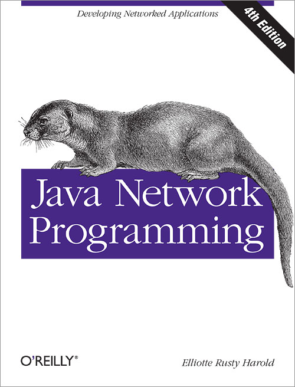

## Java Network Programming

> 记录学习**java网络编程**的历程，参考自书籍[《Java Network Programming, Fourth Edition》](https://book.douban.com/subject/26259017/)。
>
> 下载链接：<http://readfree.me/book/26259017/>

 

## 目录

+ [第01章_基本网络概念](第01章_基本网络概念.md  )
+ [第02章_流](第02章_流.md )
+ [第03章_线程](第03章_线程.md )
+ [第04章_Internet地址](第04章_Internet地址.md )
+ [第05章_URL和URI](第05章_URL和URI.md)
+ [第06章_HTTP](第06章_HTTP.md )
+ [第07章_URLConnection](第07章_URLConnection.md)
+ [第08章_客户端Socket](第08章_客户端Socket.md)
+ [第09章_服务器Socket](第09章_服务器Socket.md)
+ [第10章_安全Socket](第10章_安全Socket.md)
+ [第11章_非阻塞IO](第11章_非阻塞IO.md)
+ [第12章_UDP](第12章_UDP.md )
+ [第13章_IP组播](第13章_IP组播.md )

