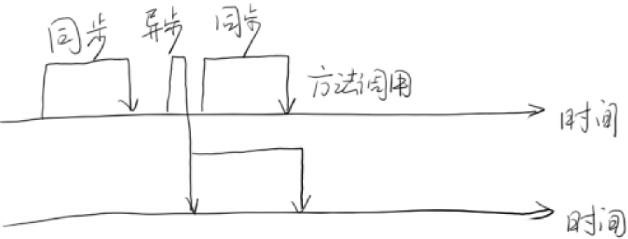
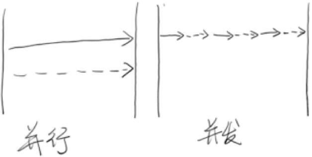
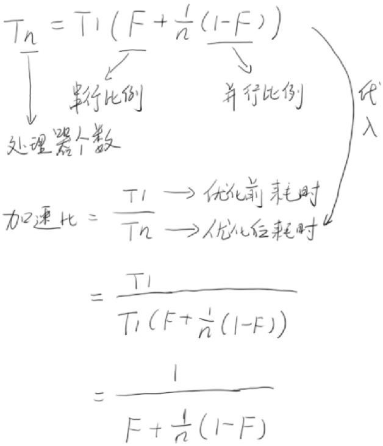
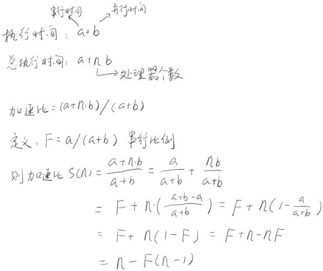
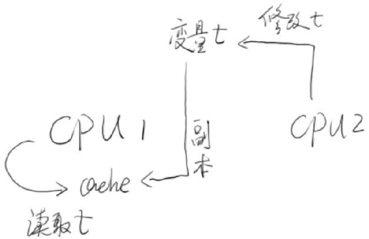

## 1.1 何去何从的并行计算

### 1.1.1 忘掉那该死的并行

LInus给并行计算浇了一碰冷水，但是却侧面肯定了并行计算在图像处理和服务端程序方面的大量应用。

### 1.1.2 可怕的现实：摩尔定律的失效

我们的制造工艺已经到了纳米了。1纳米是10-9米，也就是10亿分之一米。这已经是一个相当小的数字了。就目前的科技水平而言，如果无法在物质分子层面以下进行工作，那么也许4GHz的芯片就已经接近了理论极限。因为即使一个水分子，它的直径也有0.4纳米。再往下发展就显得有些困难。

### 1.1.3 柳暗花明：不断地前进

从2005年开始，我们已经不再追求单核的计算速度，而着迷于研究如何将多个独立的计算单元整合到单独的CPU中，也就是我们所说的多核CPU。也就是说，摩尔定律在另外一个侧面又生效了。不过，这样硬件设计者就可以把摩尔定律失效的原因推脱给软件开发者了。

### 1.1.4 光明或是黑暗

让多个CPU有效并且正确地工作成为了一门技术，甚至是很大的学问。比如，多线程间如何保证线程安全，如何正确理解线程间的无序性、可见性，如何尽可能提高并行程序的设计，又如何将串行程序改造为并行程序。而对并行计算的研究，也就是希望在这片黑暗中带来光明。

## 1.2 你必须知道的几个概念

### 1.2.1 同步（Synchronous）和异步（Asynchronous）

同步和异步通常用来形容一次方法调用。

(1) 同步方法调用一旦开始，调用者必须等到方法调用返回后，才能继续后续的行为。

(2) 异步方法调用更像一个消息传递，一旦开始，方法调用就会立即返回，调用者就可以继续后续的操作。而异步方法通常会在另外一个线程中“真实”地执行。整个过程，不会阻碍调用者的工作。对于调用者来说，异步调用似乎是一瞬间就完成的。如果异步调用需要返回结果，那么当这个异步调用真实完成时，则会通知调用者。

### 1.2.2 并发（Concurrency）和并行（Parallelism）

发和并行是两个非常容易被混淆的概念。它们都可以表示两个或者多个任务一起执行，但是偏重点有些不同。

(1) 并发偏重于多个任务交替执行，而多个任务之间有可能还是串行的。

(2) 而并行是真正意义上的“同时执行”。

严格意义上来说，并行的多个任务是真实的同时执行，而对于并发来说，这个过程只是交替的，一会儿运行任务A一会儿执行任务B，系统会不停地在两者间切换。但对于外部观察者来说，即使多个任务之间是串行并发的，也会造成多任务间是并行执行的错觉。

### 1.2.3 临界区

临界区用来表示一种公共资源或者说是共享数据，可以被多个线程使用。但是每一次，只能有一个线程使用它，一旦临界区资源被占用，其他线程要想使用这个资源，就必须等待。

在并行程序中，临界区资源是保护的对象，如果意外出现打印机同时执行两个打印任务，那么最可能的结果就是打印出来的文件就会是损坏的文件。

### 1.2.4 阻塞（Blocking）和非阻塞（Non-Blocking）

阻塞和非阻塞通常用来形容多线程间的相互影响。

(1) 比如一个线程占用了临界区资源，那么其他所有需要这个资源的线程就必须在这个临界区中进行等待。等待会导致线程挂起，这种情况就是阻塞。此时，如果占用资源的线程一直不愿意释放资源，那么其他所有阻塞在这个临界区上的线程都不能工作。

(2) 非阻塞的意思与之相反，它强调没有一个线程可以妨碍其他线程执行。所有的线程都会尝试不断前向执行。

### 1.2.5 死锁（Deadlock）、饥饿（Starvation）和活锁（Livelock）

死锁、饥饿和活锁都属于多线程的活跃性问题。如果发现上述几种情况，那么相关线程可能就不再活跃，也就说它可能很难再继续往下执行了。

(1) 死锁应该是最糟糕的一种情况了，线程之间相互占用了他人所需的资源，如果大家都不愿意释放，那么这个状态将永远维持下去，谁都不可能执行下去。

(2) 饥饿是指某一个或者多个线程因为种种原因无法获得所需要的资源，导致一直无法执行。比如它的线程优先级可能太低，而高优先级的线程不断抢占它需要的资源，导致低优先级线程无法工作。另外一种可能是，某一个线程一直占着关键资源不放，导致其他需要这个资源的线程无法正常执行，这种情况也是饥饿的一种。与死锁相比，饥饿还是有可能在未来一段时间内解决的（比如高优先级的线程已经完成任务，不再疯狂的执行）。

(3) 活锁是一种非常有趣的情况。线程之间需要同样的资源，但都秉承着“谦让”的原则，主动将资源释放给他人使用，此时就会出现资源不断在两个线程中跳动，而没有一个线程可以同时拿到所有资源而正常执行。这种情况就是活锁。

## 1.3 并发级别

由于临界区的存在，多线程之间的并发必须受到控制。根据控制并发的策略，我们可以把并发的级别进行分类，大致上可以分为阻塞、无饥饿、无障碍、无锁、无等待几种。

### 1.3.1 阻塞（Blocking） 

一个线程是阻塞的，那么在其他线程释放资源之前，当前线程无法继续执行。当我们使用synchronized关键字，或者重入锁时，我们得到的就是阻塞的线程。

### 1.3.2 无饥饿（Starvation-Free）

如果线程之间是有优先级的，那么线程调度的时候总是会倾向于满足高优先级的线程。但如果锁是公平的，满足先来后到，那么饥饿就不会产生，不管新来的线程优先级多高，要想获得资源，就必须乖乖排队。那么所有的线程都有机会执行。

### 1.3.3 无障碍（Obstruction-Free） 

无障碍是一种最弱的非阻塞调度。两个线程如果是无障碍的执行，那么他们不会因为临界区的问题导致一方被挂起。对于无障碍的线程来说，一旦检测到因为修改共享数据出现错误，它就会立即对自己所做的修改进行回滚，确保数据安全。但如果没有数据竞争发生，那么线程就可以顺利完成自己的工作，走出临界区。

一种可行的无障碍实现可以依赖一个“一致性标记”来实现。线程在操作之前，先读取并保存这个标记，在操作完成后，再次读取，检查这个标记是否被更改过，如果两者是一致的，则说明资源访问没有冲突。如果不一致，则说明资源可能在操作过程中与其他写线程冲突，需要重试操作。而任何对资源有修改操作的线程，在修改数据前，都需要更新这个一致性标记，表示数据不再安全。

### 1.3.4 无锁（Lock-Free）

无锁的并行都是无障碍的。在无锁的情况下，所有的线程都能尝试对临界区进行访问，但不同的是，无锁的并发保证必然有一个线程能够在有限步内完成操作离开临界区。但对于临界区中竞争失败的线程，可能出现饥饿现象，导致线程停滞不前。

### 1.3.5 无等待（Wait-Free）

无锁只要求有一个线程可以在有限步内完成操作，而无等待则在无锁的基础上更进一步进行扩展。它要求所有的线程都必须在有限步内完成，这样就不会引起饥饿问题。如果限制这个步骤上限，还可以进一步分解为有界无等待和线程数无关的无等待几种，它们之间的区别只是对循环次数的限制不同。

一种典型的无等待结构就是RCU（Read-Copy-Update）。它的基本思想是，对数据的读可以不加控制。因此，所有的读线程都是无等待的，它们既不会被锁定等待也不会引起任何冲突。但在写数据的时候，先取得原始数据的副本，接着只修改副本数据（这就是为什么读可以不加控制），修改完成后，在合适的时机回写数据。

## 1.4 有关并行的两个重要定律

有关为什么要使用并行程序的问题，最重要的应该是出于两个目的：

(1) 第一，为了获得更好的性能；

(2) 第二，由于业务模型的需要，确实需要多个执行实体。

### 1.4.1 Amdahl定律 

Amdahl定律是计算机科学中非常重要的定律。它定义了串行系统并行化后的加速比的计算公式和理论上限。

**加速比定义：加速比 = 优化前系统耗时 / 优化后系统耗时**

注意：根据Amdahl定律，使用多核CPU对系统进行优化，优化的效果取决于CPU的数量以及系统中的串行化程序的比重。CPU数量越多，串行化比重越低，则优化效果越好。仅提高CPU数量而不降低程序的串行化比重，也无法提高系统性能。

### 1.4.2 Gustafson定律

Gustafson定律也试图说明处理器个数、串行比例和加速比之间的关系，但是Gustafson定律和Amdahl定律的角度不同。同样，加速比都定义为优化前的系统耗时除以优化后的系统耗时。

可以看到，由于切入角度的不同，Gustafson定律的公式和Amdahl定律的公式截然不同。从Gustafson定律中，我们可以更容易地发现，如果串行化比例很小，并行化比例很大，那么加速比就是处理器的个数。只要你不断地累加处理器，就能获得更快的速度。

### 1.4.3 Amdahl定律和Gustafson定律是否相互矛盾

两者的差异其实是因为这两个定律对同一个客观事实从不同角度去审视后的结果，它们的偏重点有所不同。

(1) Amdahl强调：当串行比例一定时，加速比是有上限的，不管你堆叠多少个CPU参与计算，都不能突破这个上限！

(2) Gustafson定律关心的是：如果可被并行化的代码所占比重足够多，那么加速比就能随着CPU的数量线性增长。

这两个定律并不矛盾。从极端角度来说，如果系统中没有可被串行化的代码（即F=1），那么对于这两个定律，其加速比都是1。反之，如果系统中可串行化代码比重达到100%，那么这两个定律得到加速比都是n（处理器个数）。

## 1.5 回到Java：JMM

Java的内存模型（JMM）都是围绕多线程的原子性、可见性和有序性来简历的

### 1.5.1 原子性（Atomicity） 

原子性是指一个操作是不可中断的。即使是在多个线程一起执行的时候，一个操作一旦开始，就不会被其他线程干扰。

### 1.5.2 可见性（Visibility）

可见性是指当一个线程修改了某一个共享变量的值，其他线程是否能够立即知道这个修改。显然，对于串行程序来说，可见性问题是不存在的。因为你在任何一个操作步骤中修改了某个变量，那么在后续的步骤中，读取这个变量的值，一定是修改后的新值。

但是这个问题在并行程序中就不见得了。如果一个线程修改了某一个全局变量，那么其他线程未必可以马上知道这个改动。

### 1.5.3 有序性（Ordering）

序性问题可能是三个问题中最难理解的了。对于一个线程的执行代码而言，我们总是习惯地认为代码的执行是从先往后，依次执行的。这么理解也不能说完全错误，因为就一个线程内而言，确实会表现成这样。但是，在并发时，程序的执行可能就会出现乱序。给人直观的感觉就是：写在前面的代码，会在后面执行。有序性问题的原因是因为程序在执行时，可能会进行指令重排（为了提高效率），重排后的指令与原指令的顺序未必一致。

### 1.5.4 哪些指令不能重排：Happen-Before规则

虽然Java虚拟机和执行系统会对指令进行一定的重排，但是指令重排是有原则的，并非所有的指令都可以随便改变执行位置，以下罗列了一些基本原则，这些原则是指令重排不可违背的：

(1) 程序顺序原则：一个线程内保证语义的串行性

(2) volatile规则：volatile变量的写，先发生于读，这保证了volatile变量的可见性

(3) 锁规则：解锁（unlock）必然发生在随后的加锁（lock）前

(4) 传递性：A先于B，B先于C，那么A必然先于C

(5) 线程的start()方法先于它的每一个动作

(6) 线程的所有操作先于线程的终结（Thread.join()）

(7) 线程的中断（interrupt()）先于被中断线程的代码

(8) 对象的构造函数执行、结束先于finalize()方法

 