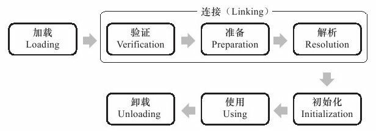

### # 类加载的时机

类从被加载到虚拟机内存中开始，到卸载出内存为止，它的整个生命周期包括：**加载（Loading）、验证（Verification）、准备（Preparation）、解析（Resolution）、初始化（Initialization）、使用（Using）和卸载（Unloading）**7个阶段。其中**验证、准备、解析3个部分统称为连接（Linking）**，这7个阶段的发生顺序如图所示。



加载、验证、准备、初始化和卸载这5个阶段的顺序是确定的，类的加载过程必须按照这种顺序按部就班地开始，而解析阶段则不一定：它在某些情况下可以在初始化阶段之后再开始，这是为了支持Java语言的运行时绑定（也称为动态绑定或晚期绑定）。注意，这里笔者写的是按部就班地“开始”，而不是按部就班地“进行”或“完成”，强调这点是因为这些阶段通常都是互相交叉地混合式进行的，通常会在一个阶段执行的过程中调用、激活另外一个阶段。

什么情况下需要开始类加载过程的第一个阶段：加载？Java虚拟机规范中并没有进行强制约束，这点可以交给虚拟机的具体实现来自由把握。但是对于初始化阶段，虚拟机规范则是严格规定了有且只有5种情况必须立即对类进行“初始化”（而加载、验证、准备自然需要在此之前开始）：

1）遇到new、getstatic、putstatic或invokestatic这4条字节码指令时，如果类没有进行过初始化，则需要先触发其初始化。生成这4条指令的最常见的Java代码场景是：使用new关键字实例化对象的时候、读取或设置一个类的静态字段（被final修饰、已在编译期把结果放入常量池的静态字段除外）的时候，以及调用一个类的静态方法的时候。

2）使用java.lang.reflect包的方法对类进行反射调用的时候，如果类没有进行过初始化，则需要先触发其初始化。

3）当初始化一个类的时候，如果发现其父类还没有进行过初始化，则需要先触发其父类的初始化。

4）当虚拟机启动时，用户需要指定一个要执行的主类（包含main（）方法的那个类），虚拟机会先初始化这个主类。

5）当使用JDK 1.7的动态语言支持时，如果一个java.lang.invoke.MethodHandle实例最后的解析结果REF_getStatic、REF_putStatic、REF_invokeStatic的方法句柄，并且这个方法句柄所对应的类没有进行过初始化，则需要先触发其初始化。

### # 类加载的过程

#### 1.加载

“加载”是“类加载”（Class Loading）过程的一个阶段，希望读者没有混淆这两个看起来很相似的名词。在加载阶段，虚拟机需要完成以下3件事情：

1）通过一个类的全限定名来获取定义此类的二进制字节流。

2）将这个字节流所代表的静态存储结构转化为方法区的运行时数据结构。

3）在内存中生成一个代表这个类的java.lang.Class对象，作为方法区这个类的各种数据的访问入口。

对于数组类而言，情况就有所不同，数组类本身不通过类加载器创建，它是由Java虚拟机直接创建的。但数组类与类加载器仍然有很密切的关系，因为数组类的元素类型（Element Type，指的是数组去掉所有维度的类型）最终是要靠类加载器去创建，一个数组类（下面简称为C）创建过程就遵循以下规则：

如果数组的组件类型（Component Type，指的是数组去掉一个维度的类型）是引用类型，那就递归采用本节中定义的加载过程去加载这个组件类型，数组C将在加载该组件类型的类加载器的类名称空间上被标识（一个类必须与类加载器一起确定唯一性）。

如果数组的组件类型不是引用类型（例如int[]数组），Java虚拟机将会把数组C标记为与引导类加载器关联。

数组类的可见性与它的组件类型的可见性一致，如果组件类型不是引用类型，那数组类的可见性将默认为public。

#### 2.验证

验证是连接阶段的第一步，这一阶段的目的是为了确保Class文件的字节流中包含的信息符合当前虚拟机的要求，并且不会危害虚拟机自身的安全。

Java语言本身是相对安全的语言（依然是相对于C/C++来说），使用纯粹的Java代码无法做到诸如访问数组边界以外的数据、将一个对象转型为它并未实现的类型、跳转到不存在的代码行之类的事情，如果这样做了，编译器将拒绝编译。但前面已经说过，Class文件并不一定要求用Java源码编译而来，可以使用任何途径产生，甚至包括用十六进制编辑器直接编写来产生Class文件。在字节码语言层面上，上述Java代码无法做到的事情都是可以实现的，至少语义上是可以表达出来的。虚拟机如果不检查输入的字节流，对其完全信任的话，很可能会因为载入了有害的字节流而导致系统崩溃，所以验证是虚拟机对自身保护的一项重要工作。

验证阶段是非常重要的，这个阶段是否严谨，直接决定了Java虚拟机是否能承受恶意代码的攻击，从执行性能的角度上讲，验证阶段的工作量在虚拟机的类加载子系统中又占了相当大的一部分。《Java虚拟机规范（第2版）》对这个阶段的限制、指导还是比较笼统的，规范中列举了一些Class文件格式中的静态和结构化约束，如果验证到输入的字节流不符合Class文件格式的约束，虚拟机就应抛出一个java.lang.VerifyError异常或其子类异常，但具体应当检查哪些方面，如何检查，何时检查，都没有足够具体的要求和明确的说明。直到2011年发布的《Java虚拟机规范（Java SE 7版）》，大幅增加了描述验证过程的篇幅（从不到10页增加到130页），这时约束和验证规则才变得具体起来。受篇幅所限，本书无法逐条规则去讲解，但从整体上看，验证阶段大致上会完成下面4个阶段的检验动作：文件格式验证、元数据验证、字节码验证、符号引用验证。

1.文件格式验证

第一阶段要验证字节流是否符合Class文件格式的规范，并且能被当前版本的虚拟机处理。这一阶段可能包括下面这些验证点：

是否以魔数0xCAFEBABE开头。

主、次版本号是否在当前虚拟机处理范围之内。

常量池的常量中是否有不被支持的常量类型（检查常量tag标志）。

指向常量的各种索引值中是否有指向不存在的常量或不符合类型的常量。

CONSTANT_Utf8_info型的常量中是否有不符合UTF8编码的数据。

Class文件中各个部分及文件本身是否有被删除的或附加的其他信息。

……

实际上，第一阶段的验证点还远不止这些，上面这些只是从HotSpot虚拟机源码[1]中摘抄的一小部分内容，该验证阶段的主要目的是保证输入的字节流能正确地解析并存储于方法区之内，格式上符合描述一个Java类型信息的要求。这阶段的验证是基于二进制字节流进行的，只有通过了这个阶段的验证后，字节流才会进入内存的方法区中进行存储，所以后面的3个验证阶段全部是基于方法区的存储结构进行的，不会再直接操作字节流。

2.元数据验证

第二阶段是对字节码描述的信息进行语义分析，以保证其描述的信息符合Java语言规范的要求，这个阶段可能包括的验证点如下：

这个类是否有父类（除了java.lang.Object之外，所有的类都应当有父类）。

这个类的父类是否继承了不允许被继承的类（被final修饰的类）。

如果这个类不是抽象类，是否实现了其父类或接口之中要求实现的所有方法。

类中的字段、方法是否与父类产生矛盾（例如覆盖了父类的final字段，或者出现不符合规则的方法重载，例如方法参数都一致，但返回值类型却不同等）。

……

第二阶段的主要目的是对类的元数据信息进行语义校验，保证不存在不符合Java语言规范的元数据信息。

3.字节码验证

第三阶段是整个验证过程中最复杂的一个阶段，主要目的是通过数据流和控制流分析，确定程序语义是合法的、符合逻辑的。在第二阶段对元数据信息中的数据类型做完校验后，这个阶段将对类的方法体进行校验分析，保证被校验类的方法在运行时不会做出危害虚拟机安全的事件，例如：

保证任意时刻操作数栈的数据类型与指令代码序列都能配合工作，例如不会出现类似这样的情况：在操作栈放置了一个int类型的数据，使用时却按long类型来加载入本地变量表中。

保证跳转指令不会跳转到方法体以外的字节码指令上。

保证方法体中的类型转换是有效的，例如可以把一个子类对象赋值给父类数据类型，这是安全的，但是把父类对象赋值给子类数据类型，甚至把对象赋值给与它毫无继承关系、完全不相干的一个数据类型，则是危险和不合法的。

……

如果一个类方法体的字节码没有通过字节码验证，那肯定是有问题的；但如果一个方法体通过了字节码验证，也不能说明其一定就是安全的。即使字节码验证之中进行了大量的检查，也不能保证这一点。这里涉及了离散数学中一个很著名的问题“Halting Problem”：通俗一点的说法就是，通过程序去校验程序逻辑是无法做到绝对准确的——不能通过程序准确地检查出程序是否能在有限的时间之内结束运行。

#### 3.准备

准备阶段是正式为类变量分配内存并设置类变量初始值的阶段，这些变量所使用的内存都将在方法区中进行分配。这个阶段中有两个容易产生混淆的概念需要强调一下，首先，这时候进行内存分配的仅包括类变量（被static修饰的变量），而不包括实例变量，实例变量将会在对象实例化时随着对象一起分配在Java堆中。其次，这里所说的初始值“通常情况”下是数据类型的零值，假设一个类变量的定义为：

```java
public static int value=123;
```

那变量value在准备阶段过后的初始值为0而不是123，因为这时候尚未开始执行任何Java方法，而把value赋值为123的putstatic指令是程序被编译后，存放于类构造器＜clinit＞（）方法之中，所以把value赋值为123的动作将在初始化阶段才会执行。

上面提到，在“通常情况”下初始值是零值，那相对的会有一些“特殊情况”：如果类字段的字段属性表中存在ConstantValue属性，那在准备阶段变量value就会被初始化为ConstantValue属性所指定的值，假设上面类变量value的定义变为：

```java
public static final int value=123;
```

编译时Javac将会为value生成ConstantValue属性，在准备阶段虚拟机就会根据ConstantValue的设置将value赋值为123。 

#### 4.解析

解析阶段是虚拟机将常量池内的符号引用替换为直接引用的过程，符号引用在前一章讲解Class文件格式的时候已经出现过多次，在Class文件中它以CONSTANT_Class_info、CONSTANT_Fieldref_info、CONSTANT_Methodref_info等类型的常量出现，那解析阶段中所说的直接引用与符号引用又有什么关联呢？

符号引用（Symbolic References）：符号引用以一组符号来描述所引用的目标，符号可以是任何形式的字面量，只要使用时能无歧义地定位到目标即可。符号引用与虚拟机实现的内存布局无关，引用的目标并不一定已经加载到内存中。各种虚拟机实现的内存布局可以各不相同，但是它们能接受的符号引用必须都是一致的，因为符号引用的字面量形式明确定义在Java虚拟机规范的Class文件格式中。

直接引用（Direct References）：直接引用可以是直接指向目标的指针、相对偏移量或是一个能间接定位到目标的句柄。直接引用是和虚拟机实现的内存布局相关的，同一个符号引用在不同虚拟机实例上翻译出来的直接引用一般不会相同。如果有了直接引用，那引用的目标必定已经在内存中存在。

解析动作主要针对类或接口、字段、类方法、接口方法、方法类型、方法句柄和调用点限定符7类符号引用进行，分别对应于常量池的CONSTANT_Class_info、CONSTANT_Fieldref_info、CONSTANT_Methodref_info、CONSTANT_InterfaceMethodref_info、CONSTANT_MethodType_info、CONSTANT_MethodHandle_info和CONSTANT_InvokeDynamic_info 7种常量类型[1]。下面将讲解前面4种引用的解析过程：

1.类或接口的解析

假设当前代码所处的类为D，如果要把一个从未解析过的符号引用N解析为一个类或接口C的直接引用，那虚拟机完成整个解析的过程需要以下3个步骤：

1）如果C不是一个数组类型，那虚拟机将会把代表N的全限定名传递给D的类加载器去加载这个类C。在加载过程中，由于元数据验证、字节码验证的需要，又可能触发其他相关类的加载动作，例如加载这个类的父类或实现的接口。一旦这个加载过程出现了任何异常，解析过程就宣告失败。

2）如果C是一个数组类型，并且数组的元素类型为对象，也就是N的描述符会是类似“[Ljava/lang/Integer”的形式，那将会按照第1点的规则加载数组元素类型。如果N的描述符如前面所假设的形式，需要加载的元素类型就是“java.lang.Integer”，接着由虚拟机生成一个代表此数组维度和元素的数组对象。

3）如果上面的步骤没有出现任何异常，那么C在虚拟机中实际上已经成为一个有效的类或接口了，但在解析完成之前还要进行符号引用验证，确认D是否具备对C的访问权限。如果发现不具备访问权限，将抛出java.lang.IllegalAccessError异常。

2.字段解析

要解析一个未被解析过的字段符号引用，首先将会对字段表内class_index[项中索引的CONSTANT_Class_info符号引用进行解析，也就是字段所属的类或接口的符号引用。如果在解析这个类或接口符号引用的过程中出现了任何异常，都会导致字段符号引用解析的失败。如果解析成功完成，那将这个字段所属的类或接口用C表示，虚拟机规范要求按照如下步骤对C进行后续字段的搜索。

1）如果C本身就包含了简单名称和字段描述符都与目标相匹配的字段，则返回这个字段的直接引用，查找结束。

2）否则，如果在C中实现了接口，将会按照继承关系从下往上递归搜索各个接口和它的父接口，如果接口中包含了简单名称和字段描述符都与目标相匹配的字段，则返回这个字段的直接引用，查找结束。

3）否则，如果C不是java.lang.Object的话，将会按照继承关系从下往上递归搜索其父类，如果在父类中包含了简单名称和字段描述符都与目标相匹配的字段，则返回这个字段的直接引用，查找结束。

4）否则，查找失败，抛出java.lang.NoSuchFieldError异常。

如果查找过程成功返回了引用，将会对这个字段进行权限验证，如果发现不具备对字段的访问权限，将抛出java.lang.IllegalAccessError异常。

在实际应用中，虚拟机的编译器实现可能会比上述规范要求得更加严格一些，如果有一个同名字段同时出现在C的接口和父类中，或者同时在自己或父类的多个接口中出现，那编译器将可能拒绝编译。在代码清单7-4中，如果注释了Sub类中的“public static int A=4；”，接口与父类同时存在字段A，那编译器将提示“The field Sub.A is ambiguous”，并且拒绝编译这段代码。

3.类方法解析

类方法解析的第一个步骤与字段解析一样，也需要先解析出类方法表的class_index项中索引的方法所属的类或接口的符号引用，如果解析成功，我们依然用C表示这个类，接下来虚拟机将会按照如下步骤进行后续的类方法搜索。

1）类方法和接口方法符号引用的常量类型定义是分开的，如果在类方法表中发现class_index中索引的C是个接口，那就直接抛出java.lang.IncompatibleClassChangeError异常。

2）如果通过了第1步，在类C中查找是否有简单名称和描述符都与目标相匹配的方法，如果有则返回这个方法的直接引用，查找结束。

3）否则，在类C的父类中递归查找是否有简单名称和描述符都与目标相匹配的方法，如果有则返回这个方法的直接引用，查找结束。

4）否则，在类C实现的接口列表及它们的父接口之中递归查找是否有简单名称和描述符都与目标相匹配的方法，如果存在匹配的方法，说明类C是一个抽象类，这时查找结束，抛出java.lang.AbstractMethodError异常。

5）否则，宣告方法查找失败，抛出java.lang.NoSuchMethodError。

最后，如果查找过程成功返回了直接引用，将会对这个方法进行权限验证，如果发现不具备对此方法的访问权限，将抛出java.lang.IllegalAccessError异常。

4.接口方法解析

接口方法也需要先解析出接口方法表的class_index项中索引的方法所属的类或接口的符号引用，如果解析成功，依然用C表示这个接口，接下来虚拟机将会按照如下步骤进行后续的接口方法搜索。

1）与类方法解析不同，如果在接口方法表中发现class_index中的索引C是个类而不是接口，那就直接抛出java.lang.IncompatibleClassChangeError异常。

2）否则，在接口C中查找是否有简单名称和描述符都与目标相匹配的方法，如果有则返回这个方法的直接引用，查找结束。

3）否则，在接口C的父接口中递归查找，直到java.lang.Object类（查找范围会包括Object类）为止，看是否有简单名称和描述符都与目标相匹配的方法，如果有则返回这个方法的直接引用，查找结束。

4）否则，宣告方法查找失败，抛出java.lang.NoSuchMethodError异常。

由于接口中的所有方法默认都是public的，所以不存在访问权限的问题，因此接口方法的符号解析应当不会抛出java.lang.IllegalAccessError异常。

#### 5.初始化

类初始化阶段是类加载过程的最后一步，前面的类加载过程中，除了在加载阶段用户应用程序可以通过自定义类加载器参与之外，其余动作完全由虚拟机主导和控制。到了初始化阶段，才真正开始执行类中定义的Java程序代码（或者说是字节码）。

在准备阶段，变量已经赋过一次系统要求的初始值，而在初始化阶段，则根据程序员通过程序制定的主观计划去初始化类变量和其他资源，或者可以从另外一个角度来表达：初始化阶段是执行类构造器＜clinit＞（）方法的过程。我们在下文会讲解＜clinit＞（）方法是怎么生成的，在这里，我们先看一下＜clinit＞（）方法执行过程中一些可能会影响程序运行行为的特点和细节，这部分相对更贴近于普通的程序开发人员。

＜clinit＞（）方法是由编译器自动收集类中的所有类变量的赋值动作和静态语句块（static{}块）中的语句合并产生的，编译器收集的顺序是由语句在源文件中出现的顺序所决定的，静态语句块中只能访问到定义在静态语句块之前的变量，定义在它之后的变量，在前面的静态语句块可以赋值，但是不能访问。

＜clinit＞（）方法与类的构造函数（或者说实例构造器＜init＞（）方法）不同，它不需要显式地调用父类构造器，虚拟机会保证在子类的＜clinit＞（）方法执行之前，父类的＜clinit＞（）方法已经执行完毕。因此在虚拟机中第一个被执行的＜clinit＞（）方法的类肯定是java.lang.Object。

＜clinit＞（）方法对于类或接口来说并不是必需的，如果一个类中没有静态语句块，也没有对变量的赋值操作，那么编译器可以不为这个类生成＜clinit＞（）方法。

接口中不能使用静态语句块，但仍然有变量初始化的赋值操作，因此接口与类一样都会生成＜clinit＞（）方法。但接口与类不同的是，执行接口的＜clinit＞（）方法不需要先执行父接口的＜clinit＞（）方法。只有当父接口中定义的变量使用时，父接口才会初始化。另外，接口的实现类在初始化时也一样不会执行接口的＜clinit＞（）方法。

虚拟机会保证一个类的＜clinit＞（）方法在多线程环境中被正确地加锁、同步，如果多个线程同时去初始化一个类，那么只会有一个线程去执行这个类的＜clinit＞（）方法，其他线程都需要阻塞等待，直到活动线程执行＜clinit＞（）方法完毕。如果在一个类的＜clinit＞（）方法中有耗时很长的操作，就可能造成多个进程阻塞[2]，在实际应用中这种阻塞往往是很隐蔽的。

### # 类加载器

虚拟机设计团队把类加载阶段中的“通过一个类的全限定名来获取描述此类的二进制字节流”这个动作放到Java虚拟机外部去实现，以便让应用程序自己决定如何去获取所需要的类。实现这个动作的代码模块称为“类加载器”。

类加载器可以说是Java语言的一项创新，也是Java语言流行的重要原因之一，它最初是为了满足Java Applet的需求而开发出来的。虽然目前Java Applet技术基本上已经“死掉”，但类加载器却在类层次划分、OSGi、热部署、代码加密等领域大放异彩，成为了Java技术体系中一块重要的基石，可谓是失之桑榆，收之东隅。

#### 1.类与类加载器

 