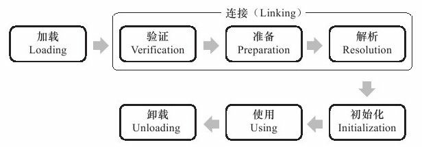

# JVM 相关知识点总结

### 类加载

> 《深入理解 Java 虚拟机》- 第 7 章 虚拟机类加载机制

类从被加载到虚拟机内存中开始，到卸载出内存为止，它的整个生命周期包括：加载（Loading）、验证（Verification）、准备（Preparation）、解析（Resolution）、初始化（Initialization）、使用（Using）和卸载（Unloading）7个阶段。其中验证、准备、解析3个部分统称为连接（Linking），这7个阶段的发生顺序如图所示。

+ 在加载阶段，虚拟机需要完成以下3件事情：
  + 通过一个类的全限定名来获取定义此类的二进制字节流。
  + 将这个字节流所代表的静态存储结构转化为方法区的运行时数据结构。
  + 在内存中生成一个代表这个类的java.lang.Class对象，作为方法区这个类的各种数据的访问入口。
+ 验证是连接阶段的第一步，这一阶段的目的是为了确保Class文件的字节流中包含的信息符合当前虚拟机的要求，并且不会危害虚拟机自身的安全。
+ 准备阶段是正式为类变量（被static修饰的变量）分配内存并设置类变量初始值的阶段，这些变量所使用的内存都将在方法区中进行分配。
+ 解析阶段是虚拟机将常量池内的符号引用替换为直接引用的过程。
  + 符号引用（Symbolic References）：符号引用以一组符号来描述所引用的目标，符号可以是任何形式的字面量，只要使用时能无歧义地定位到目标即可。
  + 直接引用（Direct References）：直接引用可以是直接指向目标的指针、相对偏移量或是一个能间接定位到目标的句柄。
+ 类初始化阶段是类加载过程的最后一步，到了该阶段，才真正开始执行类中定义的Java程序代码（或者说是字节码）。