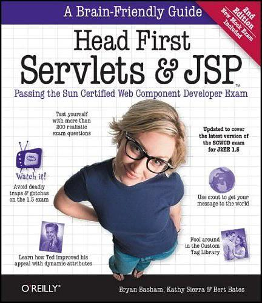

## Head First Servlets & JSP 2nd Edition

> 回顾**Java EE基础知识**，参考自书籍[《Head First Servlets & JSP 2nd Edition（深入浅出Servlets和JSP）》](https://book.douban.com/subject/4604858/)，部分内容根据Java EE新规范进行了更新。
>
> 下载链接：<http://readfree.me/book/4604858/>

 

## 目录

+ [第01章_为什么使用Servlet&JSP：前言与概述](第01章_为什么使用Servlet&JSP：前言与概述.md)
+ [第02章_Web应用体系结构：高层概述](第02章_Web应用体系结构：高层概述.md)
+ [第03章_MVC迷你教程：MVC实战.md](第03章_MVC迷你教程：MVC实战.md)

