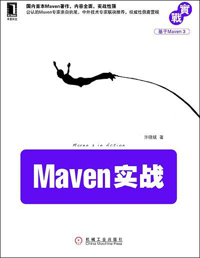

## Maven实战

> 记录学习**Maven**的历程，参考自书籍[《Maven实战》](https://book.douban.com/subject/5345682/)，部分内容根据**Maven**最新版`Apache Maven 3.5.3 `进行了更新。
>
> 下载链接：<http://readfree.me/book/5345682/>

## 目录

+ [第01章_本章内容](第01章_本章内容.md )
+ [第02章_Maven的安装和配置](第02章_Maven的安装和配置.md )
+ [第03章_Maven使用入门](第03章_Maven使用入门.md )
+ [第04章_背景案例](第04章_背景案例.md )
+ [第05章_坐标和依赖](第05章_坐标和依赖.md)
+ [第06章_仓库](第06章_仓库.md )
+ 

