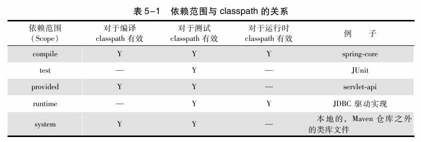

### 5.1 何为Maven坐标

Maven定义了这样一组规则：世界上任何一个构件都可以使用Maven坐标唯一标识，Maven坐标的元素包括groupId、artifactId、version、packaging、classifier。

Maven内置了一个中央仓库的地址<http://repo1.maven.org/maven2>，该中央仓库包含了世界上大部分流行的开源项目构件，Maven会在需要的时候去那里下载。

在我们开发自己项目的时候，也需要为其定义适当的坐标，这是Maven强制要求的。在这个基础上，其他Maven项目才能引用该项目生成的构件。

### 5.2 坐标详解

Maven坐标为各种构件引入了秩序，任何一个构件都必须明确定义自己的坐标，而一组Maven坐标是通过一些元素定义的，它们是groupId、artifactId、version、packaging、classifier：

```xml
<!-- groupId：定义当前Maven项目隶属的实际项目 -->
<!-- groupId的表示方式与Java包名的表示方式类似，通常与域名反向一一对应 -->
<groupId>org.sonatype.nexus</groupId>
<!-- artifactId：该元素定义实际项目中的一个Maven项目（模块） -->
<!-- 推荐的做法是使用实际项目名称作为artifactId的前缀（Maven生成的构件，其文件名会以artifactId作为开头，方便查找） -->
<artifactId>nexus-indexer</artifactId>
<!-- version：该元素定义Maven项目当前所处的版本 -->
<version>2.0.0</version>
<!-- packaging：该元素定义Maven项目的打包方式（不定义时，默认值为jar） -->
<packaging>jar</packaging>
<!-- classifier：该元素用来帮助定义构建输出的一些附属构件 -->
<!-- 如nexus-indexer-2.0.0-javadoc.jar、nexus-indexer-2.0.0-sources.jar这样一些附属构件，其包含了Java文档和源代码 -->
```

上述5个元素中，groupId、artifactId、version是必须定义的，packaging是可选的（默认为jar），而classifier是不能直接定义的。

同时，项目构件的文件名是与坐标相对应的，一般的规则为artifactId-version[-classifi-er].packaging。

### 5.3 account-email

### 5.4 依赖的配置

一个依赖声明可以包含如下的一些元素：

```xml
<project>
    ...
    <!-- 根元素project下的dependencies可以包含一个或者多个dependency元素，以声明一个或者多个项目依赖 -->
    <dependencies>
        <dependency>
            <!-- groupId、artifactId和version：依赖的基本坐标，对于任何一个依赖来说，基本坐标是最重要的，Maven根据坐标才能找到需要的依赖。 -->
            <groupId>...</groupId>
            <artifactId>...</artifactId>
            <version>...</version>
            <!-- type：依赖的类型，对应于项目坐标定义的packaging。大部分情况下，该元素不必声明，其默认值为jar -->
            <type>...</type>
            <!-- scope：依赖的范围 -->
            <scope>...</scope>
            <!-- optional：标记依赖是否可选 -->
            <optional>...</optional>
            <!-- exclusions：用来排除传递性依赖 -->
            <excutions>
                <excution>...</excution>
                ...
            </excutions>
        </dependency> 
        ...
    </dependencies>
    ...
</project>
```

### 5.5 依赖范围

依赖范围就是用来控制依赖与这三种classpath（编译classpath、测试classpath、运行classpath）的关系，Maven有以下几种依赖范围：

+ compile：编译依赖范围。如果没有指定，就会默认使用该依赖范围。使用此依赖范围的Maven依赖，对于编译、测试、运行三种classpath都有效。典型的例子是spring-core，在编译、测试和运行的时候都需要使用该依赖。
+ test：测试依赖范围。使用此依赖范围的Maven依赖，只对于测试classpath有效，在编译主代码或者运行项目的使用时将无法使用此类依赖。典型的例子是JUnit，它只有在编译测试代码及运行测试的时候才需要。
+ provided：已提供依赖范围。使用此依赖范围的Maven依赖，对于编译和测试class-path有效，但在运行时无效。典型的例子是servlet-api，编译和测试项目的时候需要该依赖，但在运行项目的时候，由于容器已经提供，就不需要Maven重复地引入一遍。
+ runtime：运行时依赖范围。使用此依赖范围的Maven依赖，对于测试和运行class-path有效，但在编译主代码时无效。典型的例子是JDBC驱动实现，项目主代码的编译只需要JDK提供的JDBC接口，只有在执行测试或者运行项目的时候才需要实现上述接口的具体JDBC驱动。
+ system：系统依赖范围。该依赖与三种classpath的关系，和provided依赖范围完全一致。但是，使用system范围的依赖时必须通过systemPath元素显式地指定依赖文件的路径。由于此类依赖不是通过Maven仓库解析的，而且往往与本机系统绑定，可能造成构建的不可移植，因此应该谨慎使用。systemPath元素可以引用环境变量。
+ import：导入依赖范围。该依赖范围不会对三种classpath产生实际的影响。



### 5.6 传递性依赖