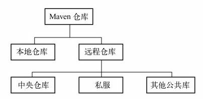

### 6.1 何为Maven仓库

得益于坐标机制，任何Maven项目使用任何一个构件的方式都是完全相同的。在此基础上，Maven可以在某个位置统一存储所有Maven项目共享的构件，这个统一的位置就是**仓库**。

实际的Maven项目将不再各自存储其依赖文件，它们只需要声明这些依赖的坐标，在需要的时候，Maven会自动根据坐标找到仓库中的构件，并使用它们。

### 6.2 仓库的布局

任何一个构件都有其唯一的坐标，根据这个坐标可以定义其在仓库中的唯一存储路径，这便是Maven的仓库布局方式。例如，log4j:log4j:1.2.15这一依赖，其对应的仓库路径为log4j/log4j/1.2.15/log4j-1.2.15.jar，该路径与坐标的大致对应关系为groupId/artifactId/version/artifactId-version.packaging。

### 6.3 仓库的分类

对于Maven来说，仓库只分为两类：本地仓库和远程仓库（中央仓库、公开远程仓库、私服）。当Maven根据坐标寻找构件的时候，它首先会查看本地仓库，如果本地仓库存在此构件，则直接使用；如果本地仓库不存在此构件，或者需要查看是否有更新的构件版本，Maven就会去远程仓库查找，发现需要的构件之后，下载到本地仓库再使用。



#### 6.3.1 本地仓库

默认情况下，不管是在Windows还是Linux上，每个用户在自己的用户目录下都有一个路径名为.m2/repository/的仓库目录。也可以自定义：

```xml
<!-- 默认情况下，～/.m2/settings.xml文件是不存在的，
     需要从Maven安装目录复制$M2_HOME/conf/settings.xml文件再进行编辑 -->
<settings>
    <!-- 自定义本地仓库的地址 -->
    <localRepository>D:\java\repository\</localRepository>
</settings>
```

一个构件只有在本地仓库中之后，才能由其他Maven项目使用。最常见的是Maven从远程仓库将构件下载到本地仓库中。还有一种常见的情况是，使用`mvn clean install`命令将本地项目的构件安装到Maven仓库中。

#### 6.3.2 远程仓库

安装好Maven后，如果不执行任何Maven命令，本地仓库目录是不存在的。当用户输入第一条Maven命令之后，Maven才会创建本地仓库，然后根据配置和需要，从远程仓库下载构件至本地仓库。

#### 6.3.2 中央仓库

中央仓库就是一个默认的远程仓库，Maven的安装文件自带了中央仓库的配置。

#### 6.3.3 私服

### 6.4 远程仓库的配置

#### 6.4.1 远程仓库的认证

#### 6.4.2 部署至远程仓库

在POM中配置构件部署地址：

```xml
<project>
    ...
    <!-- 命令行运行mvn clean deploy,Maven就会将项目构建输出的构件部署到配置对应的远程仓库，
         如果项目当前的版本是快照版本，则部署到快照版本仓库地址，否则就部署到发布版本仓库地址 -->
    <distributionManagement>
        <repository>
            <!-- 仓库id -->
            <id>proj-releases</id>
            <!-- 仓库name，方便人阅读 -->
            <name>Proj Release Repository</name>
            <!-- 仓库url -->
            <url>http://192.168.1.100/content/repositories/proj-releases</url>
        </repository>
        <snapshotRepository>
            <id>proj-snapshots</id>
            <name>Proj Snapshot Repository</name>
            <url>http://192.168.1.100/content/repositories/proj-snapshots</url>
        </snapshotRepository>
    </distributionManagement>
    ...
</project＞
```

### 6.5 快照版本

Maven的快照版本机制保证了依赖该构件的项目可以及时获取最近版本（根据其时间戳区别。Maven会自动检查更新，或者使用`mvn clean install -U`强制检查更新），但是一旦确定发布，就应该讲构件改为发布版，保证引用它的项目的稳定性。

### 6.6 从仓库解析依赖的机制

当本地仓库没有依赖构件的时候，Maven会自动从远程仓库下载；当依赖版本为快照版本的时候，Maven会自动找到最新的快照。这背后的依赖解析机制可以概括如下：

1. 当依赖的范围是system的时候，Maven直接从本地文件系统解析构件。
2. 根据依赖坐标计算仓库路径后，尝试直接从本地仓库寻找构件，如果发现相应构件，则解析成功。
3. 在本地仓库不存在相应构件的情况下，如果依赖的版本是显式的发布版本构件，如1.2、2.1-beta-1等，则遍历所有的远程仓库，发现后，下载并解析使用。
4. 如果依赖的版本是RELEASE或者LATEST（Maven3已不再支持，版本不写时为RELEASE），则基于更新策略读取所有远程仓库的元数据groupId/artifactId/maven-metadata.xml，将其与本地仓库的对应元数据合并后，计算出RELEASE或者LATEST真实的值，然后基于这个真实的值检查本地和远程仓库，如步骤2和3。
5. 如果依赖的版本是SNAPSHOT，则基于更新策略读取所有远程仓库的元数据groupId/artifactId/version/maven-metadata.xml，将其与本地仓库的对应元数据合并后，得到最新快照版本的值，然后基于该值检查本地仓库，或者从远程仓库下载。
6. 如果最后解析得到的构件版本是时间戳格式的快照，如1.4.1-20091104.121450-121，则复制其时间戳格式的文件至非时间戳格式，如SNAPSHOT，并使用该非时间戳格式的构件。

### 6.7 镜像

### 6.8 仓库搜索服务

#### 6.8.1 Sonatype Nexus

Nexus是当前最流行的开源Maven仓库管理软件，Nexus提供了关键字搜索、类名搜索、坐标搜索、校验和搜索等功能：<http://repository.sonatype.org/>

#### 6.8.2 MVNrepository

MVNrepository的界面比较清新，它提供了基于关键字的搜索、依赖声明代码片段、构件下载、依赖与被依赖关系信息、构件所含包信息等功能：<http://mvnrepository.com/>

### 6.9 小结

本章深入阐述了仓库这一Maven核心概念。首先介绍了仓库的由来；接着直接剖析了一段Maven源码，介绍仓库的布局，以方便读者将仓库与实际文件联系起来；而仓库的分类这一部分则分别介绍了本地仓库、远程仓库、中央仓库以及私服等概念；基于这些概念，又详细介绍了仓库的配置；在此基础上，我们再深入仓库的内部工作机制，并同时解释了Maven中快照的概念。本章还解释了镜像的概念及用法。最后，本章介绍了一些常用的仓库搜索服务，以方便读者的日常开发工作。


