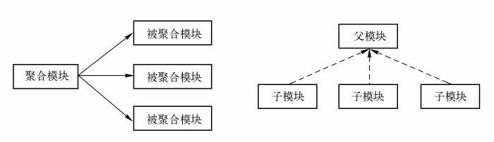

### 8.1 account-persist

#### 8.1.1 account-persist的POM

```xml
<?xml version="1.0" encoding="UTF-8"?>
<project xmlns="http://maven.apache.org/POM/4.0.0"
         xmlns:xsi="http://www.w3.org/2001/XMLSchema-instance"
         xsi:schemaLocation="http://maven.apache.org/POM/4.0.0 http://maven.apache.org/xsd/maven-4.0.0.xsd">
    <modelVersion>4.0.0</modelVersion>

    <groupId>com.angus.mvnbook</groupId>
    <artifactId>account-persist</artifactId>
    <version>1.0-SNAPSHOT</version>

    <dependencies>
        <dependency>
            <groupId>dom4j</groupId>
            <artifactId>dom4j</artifactId>
            <version>1.6.1</version>
        </dependency>
        <dependency>
            <groupId>org.springframework</groupId>
            <artifactId>spring-core</artifactId>
            <version>5.0.5.RELEASE</version>
        </dependency>
        <dependency>
            <groupId>org.springframework</groupId>
            <artifactId>spring-beans</artifactId>
            <version>5.0.5.RELEASE</version>
        </dependency>
        <dependency>
            <groupId>org.springframework</groupId>
            <artifactId>spring-context</artifactId>
            <version>5.0.5.RELEASE</version>
        </dependency>
        <dependency>
            <groupId>junit</groupId>
            <artifactId>junit</artifactId>
            <version>4.12</version>
            <scope>test</scope>
        </dependency>
    </dependencies>

    <build>
        <testResources>
            <testResource>
                <directory>src/test/resources</directory>
                <filtering>true</filtering>
            </testResource>
        </testResources>

        <plugins>
            <plugin>
                <groupId>org.apache.maven.plugins</groupId>
                <artifactId>maven-compiler-plugin</artifactId>
                <configuration>
                    <source>1.8</source>
                    <target>1.8</target>
                </configuration>
            </plugin>

            <plugin>
                <groupId>org.apache.maven.plugins</groupId>
                <artifactId>maven-resources-plugin</artifactId>
                <configuration>
                    <encoding>UTF-8</encoding>
                </configuration>
            </plugin>
        </plugins>
    </build>
</project>
```

#### 8.1.2 account-persist的主代码

#### 8.1.3 account-persist的测试代码

### 8.2 聚合

为了能够使用一条命令就能构建account-email和account-persist两个模块，我们需要创建一个额外的名为account-aggregator的模块，然后通过该模块构建整个项目的所有模块。account-aggregator本身作为一个Maven项目，它必须要有自己的POM，不过，同时作为一个聚合项目，其POM又有特殊的地方：

```xml
<project xmlns="http://maven.apache.org/POM/4.0.0" xmlns:xsi="http://www.w3.org/2001/XMLSchema-instance"
	xsi:schemaLocation="http://maven.apache.org/POM/4.0.0 http://maven.apache.org/maven-v4_0_0.xsd">
	<modelVersion>4.0.0</modelVersion>
    
	<groupId>com.angus.mvnbook.account</groupId>
	<artifactId>account-aggregator</artifactId>
	<version>1.0.0-SNAPSHOT</version>
    <!-- 对于聚合模块来说，其打包方式packaging的值必须为pom，否则就无法构建 -->
	<packaging>pom</packaging>
	<name>Account Aggregator</name>
    
    <!-- 用户可以通过在一个打包方式为pom的Maven项目中声明任意数量的module元素来实现模块的聚合。
         这里每个module的值都是一个当前POM的相对目录 -->
	<modules>
        <!-- 一般而言，为了快速定位，模块所处的位置应该与其artifactId一致 -->
		<module>account-email</module>
		<module>account-persist</module>
	</modules>
</project>
```

### 8.3 继承

在Maven中，POM的继承机制能让我们抽取出重复的配置。

#### 8.3.1 account-parent

面向对象设计中，程序员可以建立一种类的父子结构，然后在父类中声明一些字段和方法供子类继承，这样就可以做到“一处声明，多处使用”。类似地，我们需要创建POM的父子结构，然后在父POM中声明一些配置供子POM继承，以实现“一处声明，多处使用”的目的。

在account-aggregator下创建一个名为account-parent的子目录，然后在该子目录下建立一个所有除account-aggregator之外模块的父模块。为此，在该子目录创建一个pom.xml文件：

```xml
<project xmlns="http://maven.apache.org/POM/4.0.0" xmlns:xsi="http://www.w3.org/2001/XMLSchema-instance"
	xsi:schemaLocation="http://maven.apache.org/POM/4.0.0 http://maven.apache.org/maven-v4_0_0.xsd">
	<modelVersion>4.0.0</modelVersion>

    <!-- 使用与其他模块一致的groupId和version -->
	<groupId>com.angus.mvnbook.account</groupId>
	<artifactId>account-parent</artifactId>
	<version>1.0.0-SNAPSHOT</version>
	<!-- packaging为pom，与聚合模块一致，作为父模块，必须为pom -->
	<packaging>pom</packaging>
	<name>Account Parent</name>
	...
</project>
```

有了父模块，就需要让其他模块来继承它。首先将account-email与account-persist的POM修改如下：

```xml
<!-- account-emaill pom.xml -->
<?xml version="1.0" encoding="UTF-8"?>
<project xmlns="http://maven.apache.org/POM/4.0.0"
         xmlns:xsi="http://www.w3.org/2001/XMLSchema-instance"
         xsi:schemaLocation="http://maven.apache.org/POM/4.0.0 http://maven.apache.org/xsd/maven-4.0.0.xsd">
    <modelVersion>4.0.0</modelVersion>

    <!-- 继承父模块 -->
    <!-- 使用parent声明父模块，并指定父模块坐标 -->
    <parent>
        <groupId>com.angus.mvnbook.account</groupId>
        <artifactId>account-parent</artifactId>
        <version>1.0.0-SNAPSHOT</version>
        <!-- relativePath表示父模块POM的相对路径，Maven默认父模块在上一层目录下（../pom.xml） -->
        <relativePath>../account-parent/pom.xml</relativePath>
    </parent>

    <!-- 不再声明groupId和version，隐式继承自父模块 -->
    <!-- 为了防止坐标冲突，artifactId应该显示声明 -->
    <artifactId>account-email</artifactId>
    <name>Account Email</name>
    ...
</project>
```

```xml
<!-- account-persist pom.xml -->
<?xml version="1.0" encoding="UTF-8"?>
<project xmlns="http://maven.apache.org/POM/4.0.0"
         xmlns:xsi="http://www.w3.org/2001/XMLSchema-instance"
         xsi:schemaLocation="http://maven.apache.org/POM/4.0.0 http://maven.apache.org/xsd/maven-4.0.0.xsd">
    <modelVersion>4.0.0</modelVersion>

    <!-- 继承父模块 -->
    <!-- 使用parent声明父模块，并指定父模块坐标 -->
    <parent>
        <groupId>com.angus.mvnbook.account</groupId>
        <artifactId>account-parent</artifactId>
        <version>1.0.0-SNAPSHOT</version>
        <!-- relativePath表示父模块POM的相对路径，Maven默认父模块在上一层目录下（../pom.xml） -->
        <relativePath>../account-parent/pom.xml</relativePath>
    </parent>

    <!-- 不再声明groupId和version，隐式继承自父模块 -->
    <!-- 为了防止坐标冲突，artifactId应该显示声明 -->
    <artifactId>account-persist</artifactId>
    <name>Account Persist</name>
    ...
</project>
```

最后，同样还需要把account-parent加入到聚合模块account-aggregator中：

```xml
<project xmlns="http://maven.apache.org/POM/4.0.0" xmlns:xsi="http://www.w3.org/2001/XMLSchema-instance"
	xsi:schemaLocation="http://maven.apache.org/POM/4.0.0 http://maven.apache.org/maven-v4_0_0.xsd">
	<modelVersion>4.0.0</modelVersion>

	<groupId>com.juvenxu.mvnbook.account</groupId>
	<artifactId>account-aggregator</artifactId>
	<version>1.0.0-SNAPSHOT</version>
	<packaging>pom</packaging>
	<name>Account Aggregator</name>

	<modules>
		<module>account-parent</module>
		<module>account-email</module>
		<module>account-persist</module>
	</modules>
	
</project>
```

#### 8.3.2 可继承的POM元素

以下是可以继承的POM元素：

+ groupId：项目组ID，项目坐标的核心元素。
+ version：项目版本，项目坐标的核心元素。
+ description：项目的描述信息。
+ organization：项目的组织信息。
+ inceptionYear：项目的创始年份。
+ url：项目的URL地址。
+ developers：项目的开发者信息。
+ contributors：项目的贡献者信息。
+ distributionManagement：项目的部署配置。
+ issueManagement：项目的缺陷跟踪系统信息。
+ ciManagement：项目的持续集成系统信息。
+ scm：项目的版本控制系统信息。
+ mailingLists：项目的邮件列表信息。
+ properties：自定义的Maven属性。
+ dependencies：项目的依赖配置。
+ dependencyManagement：项目的依赖管理配置。
+ repositories：项目的仓库配置。
+ build：包括项目的源码目录配置、输出目录配置、插件配置、插件管理配置等。
+ reporting：包括项目的报告输出目录配置、报告插件配置等。

#### 8.3.3 依赖管理

Maven提供的dependencyManagement元素既能让子模块继承到父模块的依赖配置，又能保证子模块依赖使用的灵活性。在dependencyManagement元素下的依赖声明不会引入实际的依赖，不过它能够约束dependencies下的依赖使用。例如，可以在account-parent中加入这样的dependencyManagement配置：

```xml
<project xmlns="http://maven.apache.org/POM/4.0.0" xmlns:xsi="http://www.w3.org/2001/XMLSchema-instance"
	xsi:schemaLocation="http://maven.apache.org/POM/4.0.0 http://maven.apache.org/maven-v4_0_0.xsd">
	<modelVersion>4.0.0</modelVersion>

    <!-- 使用与其他模块一致的groupId和version -->
	<groupId>com.angus.mvnbook.account</groupId>
	<artifactId>account-parent</artifactId>
	<version>1.0.0-SNAPSHOT</version>
	<!-- packaging为pom，与聚合模块一致，作为父模块，必须为pom -->
	<packaging>pom</packaging>
	<name>Account Parent</name>

	<properties>
        <!-- 将springframwork和junit依赖的版本以Maven变量的形式提取出来 -->
        <springframework.version>5.0.5.RELEASE</springframework.version>
        <junit.version>4.12</junit.version>
	</properties>
	
    <!-- 使用dependencyManagement声明的依赖不会给account-parent引入依赖，也不会给它的子模块引入依赖 -->
    <!-- 该配置是可以继承的 -->
    <dependencyManagement>
		<dependencies>
			<dependency>
				<groupId>org.springframework</groupId>
				<artifactId>spring-core</artifactId>
				<version>${springframework.version}</version>
			</dependency>
			<dependency>
				<groupId>org.springframework</groupId>
				<artifactId>spring-beans</artifactId>
				<version>${springframework.version}</version>
			</dependency>
			<dependency>
				<groupId>org.springframework</groupId>
				<artifactId>spring-context</artifactId>
				<version>${springframework.version}</version>
			</dependency>
			<dependency>
				<groupId>org.springframework</groupId>
				<artifactId>spring-context-support</artifactId>
				<version>${springframework.version}</version>
			</dependency>
			<dependency>
				<groupId>junit</groupId>
				<artifactId>junit</artifactId>
				<version>${junit.version}</version>
				<scope>test</scope>
			</dependency>
		</dependencies>
	</dependencyManagement>
</project>
```

继承了dependencyManagement的account-email的POM：

```xml
<properties>
    <javax.mail.version>1.4.7</javax.mail.version>
    <greenmail.version>1.5.7</greenmail.version>
</properties>

<dependencies>
    <!-- 因为account-email继承了account-parent中的dependencyManage-ment配置 -->
    <!-- 所有的springframework依赖只配置了groupId和artifactId，省去了version -->
    <dependency>
        <groupId>org.springframework</groupId>
        <artifactId>spring-core</artifactId>
    </dependency>
    <dependency>
        <groupId>org.springframework</groupId>
        <artifactId>spring-beans</artifactId>
    </dependency>
    <dependency>
        <groupId>org.springframework</groupId>
        <artifactId>spring-context</artifactId>
    </dependency>
    <dependency>
        <groupId>org.springframework</groupId>
        <artifactId>spring-context-support</artifactId>
    </dependency>
    <!-- junit依赖不仅省去了version，还省去了依赖范围scope -->
    <dependency>
        <groupId>junit</groupId>
        <artifactId>junit</artifactId>
    </dependency>
    <dependency>
        <groupId>javax.mail</groupId>
        <artifactId>mail</artifactId>
        <version>${javax.mail.version}</version>
    </dependency>
    <dependency>
        <groupId>com.icegreen</groupId>
        <artifactId>greenmail</artifactId>
        <version>${greenmail.version}</version>
        <scope>test</scope>
    </dependency>
</dependencies>
```

继承了dependencyManagement的account-persist的POM：

```xml
<properties>
    <dom4j.version>1.6.1</dom4j.version>
</properties>

<dependencies>
    <!-- 这里没有声明spring-context-support，那么该依赖就不会被引入 -->
    <dependency>
        <groupId>org.springframework</groupId>
        <artifactId>spring-core</artifactId>
    </dependency>
    <dependency>
        <groupId>org.springframework</groupId>
        <artifactId>spring-beans</artifactId>
    </dependency>
    <dependency>
        <groupId>org.springframework</groupId>
        <artifactId>spring-context</artifactId>
    </dependency>
    <dependency>
        <groupId>junit</groupId>
        <artifactId>junit</artifactId>
    </dependency>
    <dependency>
        <groupId>dom4j</groupId>
        <artifactId>dom4j</artifactId>
        <version>${dom4j.version}</version>
    </dependency>
</dependencies>
```

想要在另外一个模块中使用其他POM中的dependencyManagement配置，除了复制配置或者继承这两种方式之外，还可以使用import范围依赖将这一配置导入：

```xml
<!-- 在待引入的模块中的POM中加上如下配置 -->
<dependencyManagement>
    <dependencies>
        <dependency>
            <groupId>com.angus.mvnbook.account</groupId>
            <artifactId>account-parent</artifactId>
            <version>1.0.0-SNAPSHOT</version>
            <!-- 依赖的type值为pom,import范围依赖由于其特殊性，一般都是指向打包类型为pom的模块 -->
            <type>pom</type>
            <scope>import</scope>
        </dependency>
    </dependencies>
</dependencyManagement>
```

#### 8.3.4 插件管理

Maven提供了dependencyManagement元素帮助管理依赖，类似地，Maven也提供了pluginManagement元素帮助管理插件。在该元素中配置的依赖不会造成实际的插件调用行为，当POM中配置了真正的plugin元素，并且其groupId和artifactId与pluginManagement中配置的插件匹配时，pluginManagement的配置才会影响实际的插件行为。

在父POM中配置pluginManagement：

```xml
<build>
    <pluginManagement>
        <plugins>
            <plugin>
                <groupId>org.apache.maven.plugins</groupId>
                <artifactId>maven-source-plugin</artifactId>
                <version>3.0.1</version>
                <executions>
                    <execution>
                        <id>attach-sources</id>
                        <phase>verify</phase>
                        <goals>
                            <goal>jar-no-fork</goal>
                        </goals>
                    </execution>
                </executions>
            </plugin>
        </plugins>
    </pluginManagement>
</build>
```

当子模块需要生成源码包的时候，只需要如下简单的配置：

```xml
<build>
    <plugins>
        <!-- 子模块声明使用了maven-source-plugin插件，同时又继承了父模块的pluginManagement配置，
             两者基于groupId和artifactId匹配合并之后就相当于完整的插件配置 -->
        <!-- 如果子模块不需要使用父模块中pluginManagement配置的插件，可以尽管将其忽略。
             如果子模块需要不同的插件配置，则可以自行配置以覆盖父模块的pluginManagement配置 -->
        <plugin>
            <groupId>org.apache.maven.plugins</groupId>
            <artifactId>maven-source-plugin</artifactId>
        </plugin>
    </plugins>
</build>
```

### 8.4 聚合和继承的关系

多模块中的聚合与继承的目的是不同的，前者主要是为了方便快速构建项目，后者主要是为了消除重复配置。共同点是它们的packaging都必须是pom，并且除了POM之外没有实际的内容。



在现有的实际项目中，往往会一个POM既是聚合POM，又是父POM，这么做主要是为了方便。一般来说，融合使用聚合与继承也没有什么问题：

```xml
<project xmlns="http://maven.apache.org/POM/4.0.0" xmlns:xsi="http://www.w3.org/2001/XMLSchema-instance"
	xsi:schemaLocation="http://maven.apache.org/POM/4.0.0 http://maven.apache.org/maven-v4_0_0.xsd">
	<modelVersion>4.0.0</modelVersion>

	<groupId>com.angus.mvnbook.account</groupId>
	<artifactId>account-parent</artifactId>
	<version>1.0.0-SNAPSHOT</version>
	<packaging>pom</packaging>
	<name>Account Parent</name>

    <!-- 将父模块同时作为聚合模块（置于子模块上一层） -->
	<modules>
		<module>account-email</module>
		<module>account-persist</module>
	</modules>

	<properties>
		<springframework.version>5.0.5.RELEASE</springframework.version>
		<junit.version>4.12</junit.version>
	</properties>
	
	<dependencyManagement>
		...
	</dependencyManagement>
	<build>
		...
	</build>
</project>
```

### 8.5 约定优于配置

Maven提倡“约定优于配置”（Convention Over Configuration），这是Maven最核心的设计理念之一。故而在Maven中，已经设置了很多默认配置（在超级POM中可以查阅），如非必要，只需要遵循即可。

### 8.6 反应堆

在一个多模块的Maven项目中，反应堆（Reactor）是指所有模块组成的一个构建结构。对于单模块的项目，反应堆就是该模块本身，但对于多模块项目来说，反应堆就包含了各模块之间继承与依赖的关系，从而能够自动计算出合理的模块构建顺序。

#### 8.6.1 反应堆的构建顺序

Maven按序读取POM，如果该POM没有依赖模块，那么就构建该模块，否则就先构建其依赖模块，如果该依赖还依赖于其他模块，则进一步先构建依赖的依赖。

模块间的依赖关系会将反应堆构成一个有向非循环图（Directed Acyclic Graph,DAG），各个模块是该图的节点，依赖关系构成了有向边。这个图不允许出现循环，因此，当出现模块A依赖于B，而B又依赖于A的情况时，Maven就会报错。

#### 8.6.2 裁剪反应堆

有些时候，会想要仅仅构建完整反应堆中的某些个模块。换句话说，需要实时地裁剪反应堆。

Maven提供很多的命令行选项支持裁剪反应堆，输入mvn -h可以看到这些选项：

+ -pl，——-projects＜arg＞构建指定的模块，模块间用逗号分隔

  ```bash
  $ mvn install -pl account-email,account-persist
  ...
  [INFO] ------------------------------------------------------------------------
  [INFO] Reactor Build Order:
  [INFO]
  [INFO] Account Email                                                      [jar]
  [INFO] Account Persist                                                    [jar]
  [INFO] ------------------------------------------------------------------------
  ...
  ```

+ -am，——also-make同时构建所列模块的依赖模块

  ```bash
  $ mvn install -pl account-email,account-persist -am
  ...
  [INFO] ------------------------------------------------------------------------
  [INFO] Reactor Build Order:
  [INFO]
  [INFO] Account Parent                                                     [pom]
  [INFO] Account Email                                                      [jar]
  [INFO] Account Persist                                                    [jar]
  [INFO]
  [INFO] ------------------------------------------------------------------------
  ...
  ```

+ -amd，——-also-make-dependents同时构建依赖于所列模块的模块

  ```bash
  $ mvn clean install -pl account-parent -amd
  ...
  [INFO] ------------------------------------------------------------------------
  [INFO] Reactor Build Order:
  [INFO]
  [INFO] Account Parent                                                     [pom]
  [INFO] Account Email                                                      [jar]
  [INFO] Account Persist                                                    [jar]
  [INFO] ------------------------------------------------------------------------
  ...
  ```

+ -rf，——-resume-from＜arg＞从指定的模块恢复/开始反应堆

  ```bash
  $ mvn clean install -rf account-email
  ...
  [INFO] ------------------------------------------------------------------------
  [INFO] Reactor Build Order:
  [INFO]
  [INFO] Account Email                                                      [jar]
  [INFO] Account Persist                                                    [jar]
  [INFO] Account Aggregator                                                 [pom]
  [INFO] ------------------------------------------------------------------------
  ...
  ```

+ 最后，在-pl -am或者-pl -amd的基础上，还能应用-rf参数，以对裁剪后的反应堆再次裁剪。例如：

  ```bash
  # 该命令中的-pl和-amd参数会裁剪出一个account-parent、account-email和account-persist的反应堆
  # 在此基础上，-rf参数指定从account-email模块开始构建
  $ mvn clean install -pl account-parent -amd -rf account-email
  ...
  [INFO] ------------------------------------------------------------------------
  [INFO] Reactor Build Order:
  [INFO]
  [INFO] Account Email                                                      [jar]
  [INFO] Account Persist                                                    [jar]
  [INFO] ------------------------------------------------------------------------
  ...
  ```

### 8.7 小结

本章介绍并实现了账户注册服务的第二个模块account-persist。基于这一模块和第5章实现的account-email，Maven的聚合特性得到了介绍和使用，从而产生了account-aggregator模块。除了聚合之外，继承也是多模块项目不可不用的特性。account-parent模块伴随着继承的概念被一并引入，有了继承，项目的依赖和插件配置也得以大幅优化。

Maven的一大设计理念“约定优于配置”得以阐述，可以了解到这个概念是通过超级POM的方式实现的。最后介绍了多模块构建的反应堆，包括其构建的顺序，以及可以通过怎样的方式裁剪反应堆。


