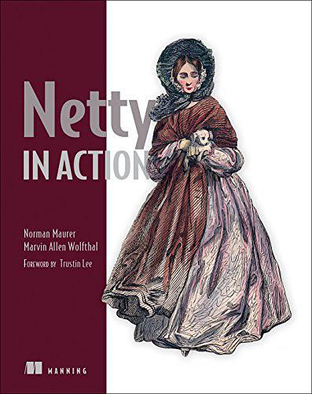

## Netty In Action

> 记录学习**Netty**的历程，参考自书籍[《Netty In Action》](https://book.douban.com/subject/27038538/)。
>
> 下载链接：<http://readfree.me/book/27038538/> 

 

## 目录

+ [第01章_Netty——异步和事件驱动](第01章_Netty——异步和事件驱动.md )
+ [第02章_你的第一款Netty应用程序](第02章_你的第一款Netty应用程序.md )
+ [第03章_Netty的组件和设计](第03章_Netty的组件和设计.md )
+ [第04章_传输](第04章_传输.md )
+ [第05章_ByteBuf](第05章_ByteBuf.md)
+ [第06章_ChannelHandler和ChannelPipeLine](第06章_ChannelHandler和ChannelPipeLine.md)

