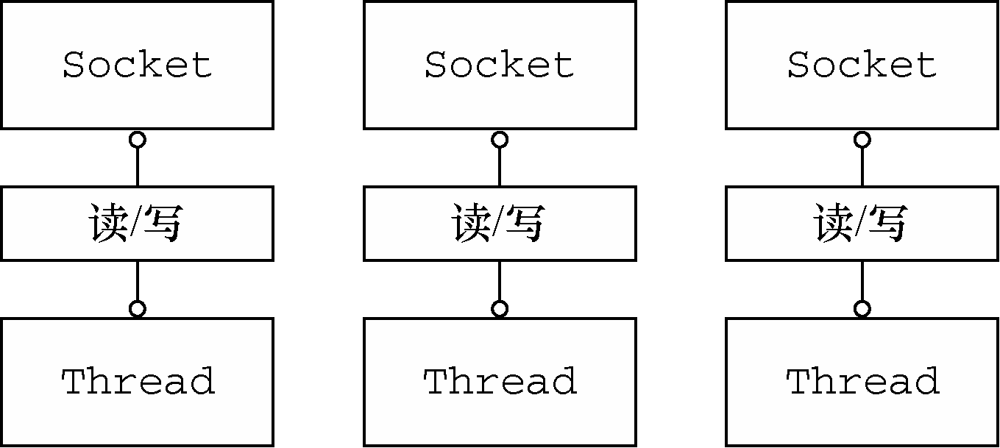
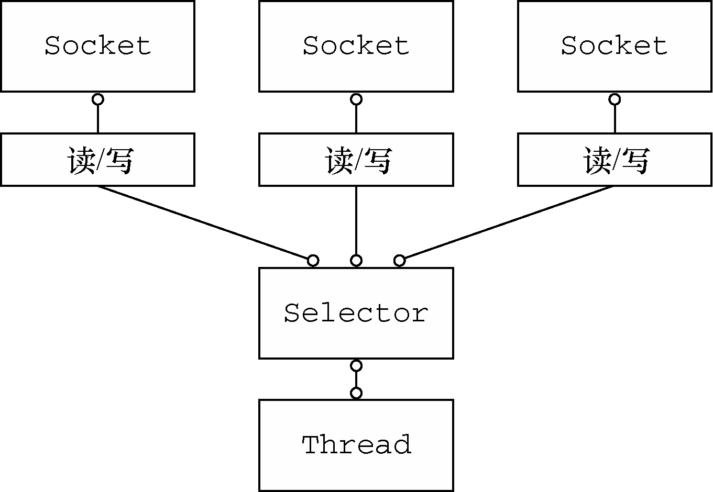

# 1.1 Java网络编程

最早期的Java API（java.net）只支持由本地系统套接字库提供的所谓的阻塞函数。

## 1.1.1 Java NIO

NIO代表非阻塞I/O（Non-blocking I/O）。

- 可以使用setsockopt()方法配置套接字，以便读/写调用在没有数据的时候立即返回，也就是说，如果是一个阻塞调用应该已经被阻塞了；
- 可以使用操作系统的事件通知API注册一组非阻塞套接字，以确定它们中是否有任何的套接字已经有数据可供读写。

## 1.1.2 选择器

class java.nio.channels.Selector是Java的非阻塞I/O实现的关键。它使用了事件通知API以确定在一组非阻塞套接字中有哪些已经就绪能够进行I/O相关的操作。因为可以在任何的时间检查任意的读操作或者写操作的完成状态，所以一个单一的线程便可以处理多个并发的连接。

---

# 1.2 Netty简介

**Netty特性总结**

| 分类     | Netty的特性                                                  |
| -------- | ------------------------------------------------------------ |
| 设计     | 统一的API，支持多种传输类型，阻塞的和非阻塞的简单而强大的线程模型真正的无连接数据报套接字支持链接逻辑组件以支持复用 |
| 易于使用 | 详实的Javadoc和大量的示例集不需要超过JDK 1.6+[[7\]](#anchor17)的依赖。（一些可选的特性可能需要Java 1.7+和/或额外的依赖） |
| 性能     | 拥有比Java的核心API更高的吞吐量以及更低的延迟得益于池化和复用，拥有更低的资源消耗最少的内存复制 |
| 健壮性   | 不会因为慢速、快速或者超载的连接而导致`OutOfMemoryError`消除在高速网络中NIO应用程序常见的不公平读/写比率 |
| 安全性   | 完整的SSL/TLS以及StartTLS支持可用于受限环境下，如Applet和OSGI |
| 社区驱动 | 发布快速而且频繁                                             |

## 1.2.1 谁在使用Netty

大型公司，如Apple、Twitter、Facebook、Google、Square和Instagram，还有流行的开源项目，如Infinispan、HornetQ、Vert.x、Apache Cassandra和Elasticsearch等。

## 1.2.2 异步和事件驱动

