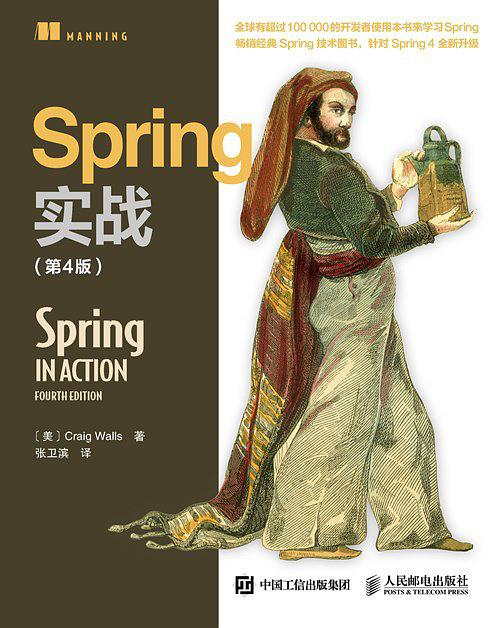

## Spring In Action

> 记录学习**Spring**的历程，方便以后查阅，参考自书籍[《Spring In Action》](https://book.douban.com/subject/26767354/)。
>
> 下载链接：<http://readfree.me/book/26767354/> 

 

## 目录

+ [第01章_Spring之旅](第01章_Spring之旅.md)
+ [第02章_装配Bean](第02章_装配Bean.md)
+ [第03章_高级装配](第03章_高级装配.md)
+ [第04章_面向切面的Spring](第04章_面向切面的Spring.md)
+ [第05章_构建Spring_Web应用程序](第05章_构建Spring_Web应用程序.md)
+ [第06章_渲染Wen视图](第06章_渲染Wen视图.md)
+ [第07章_Spring_MVC的高级技术](第07章_Spring_MVC的高级技术.md)
+ [第08章_使用Spring_Web_Flow](第08章_使用Spring_Web_Flow.md)
+ [第09章_保护Web应用](第09章_保护Web应用.md)
+ [第10章_通过Spring和JDBC征服数据库](第10章_通过Spring和JDBC征服数据库.md)

