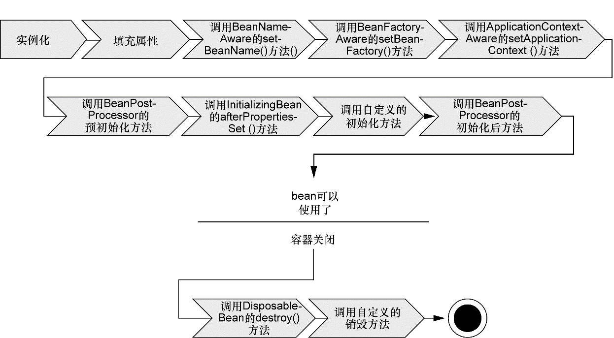
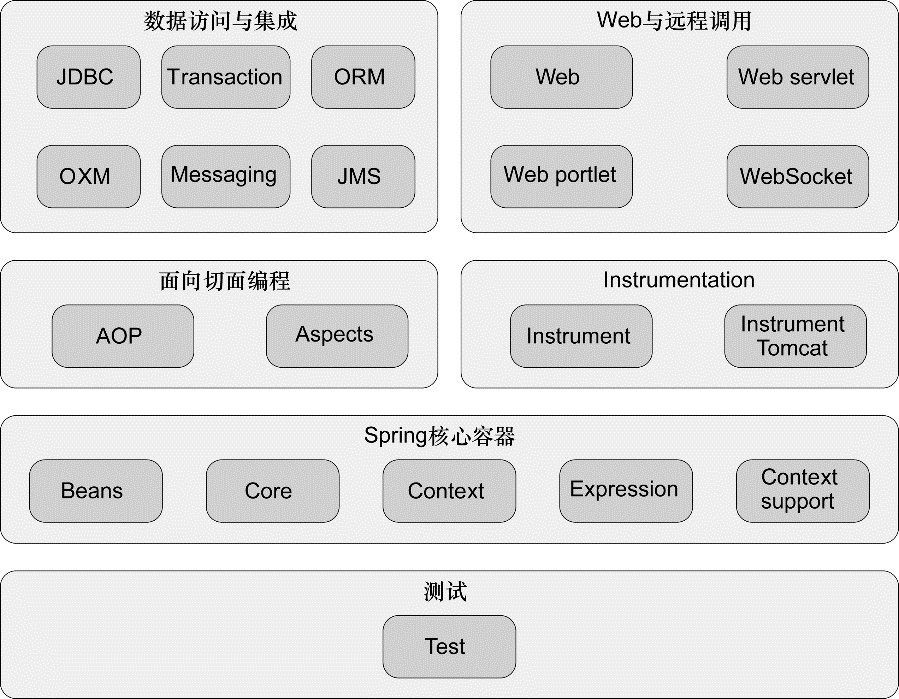

### 1.1 简化Java开发

为了降低Java开发的复杂性，Spring采取了以下4种关键策略：

+ 基于POJO的轻量级和最小侵入性编程；
+ 通过依赖注入和面向接口实现松耦合；
+ 基于切面和惯例进行声明式编程；
+ 通过切面和模板减少样板式代码。

#### 1.1.1 激发POJO的潜能

在基于Spring构建的应用中，类通常没有任何痕迹表明使用了Spring。最坏的场景是，一个类或许会使用Spring注解，但它依旧是POJO。

Spring的非侵入编程模型意味着POJO类在Spring应用和非Spring应用中都可以发挥同样的作用。Spring赋予POJO魔力的方式之一就是通过DI来装配它们。

#### 1.1.2 依赖注入

Spring支持使用注解或是XML文件的方式实现依赖注入。通过依赖注入，将降低类之间的耦合，方便扩展和测试。

#### 1.1.3 应用切面

DI能够让相互协作的软件组件保持松散耦合，而面向切面编程（aspect-oriented programming，AOP）则允许把遍布应用各处的功能分离出来形成可重用的组件。

面向切面编程往往被定义为促使软件系统实现关注点的分离一项技术。系统由许多不同的组件组成，每一个组件各负责一块特定功能。除了实现自身核心的功能之外，这些组件还经常承担着额外的职责。诸如日志、事务管理和安全这样的系统服务经常融入到自身具有核心业务逻辑的组件中去，这些系统服务通常被称为横切关注点，因为它们会跨越系统的多个组件。

AOP能够使这些服务模块化，并以声明的方式将它们应用到它们需要影响的组件中去。这些组件会具有更高的内聚性并且会更加关注自身的业务，完全不需要了解涉及系统服务所带来复杂性。总之，AOP能够确保POJO的简单性。

#### 1.1.3 使用模板消除样板式代码

Spring旨在通过模板封装来消除样板式代码，让代码更关注于自身的职责。Spring的JdbcTemplate使得执行数据库操作时，避免传统的JDBC样板代码成为了可能。

### 1.2 容纳你的Bean 

在基于Spring的应用中，对象生存于Spring容器（container）中。Spring容器负责创建对象，装配它们，配置它们并管理它们的整个生命周期，从生存到死亡（在这里，可能就是new到finalize()）。

容器是Spring框架的核心。Spring容器使用DI管理构成应用的组件，它会创建相互协作的组件之间的关联。毫无疑问，这些对象更简单干净，更易于理解，更易于重用并且更易于进行单元测试。

Spring容器并不是只有一个。Spring自带了多个容器实现，可以归为两种不同的类型。

(1) bean工厂（由org.springframework. beans. factory.eanFactory接口定义）是最简单的容器，提供基本的DI支持。

(2) 应用上下文（由org.springframework.context.ApplicationContext接口定义）基于BeanFactory构建，并提供应用框架级别的服务，例如从属性文件解析文本信息以及发布应用事件给感兴趣的事件监听者。 对大多数应用来说，功能更强大的应用上下文更受欢迎。

#### 1.2.1 使用应用上下问 

Spring自带了多种类型的应用上下文，下面是几个常见的：

(1) AnnotationConfigApplicationContext：从一个或多个基于Java的配置类中加载Spring应用上下文。

(2) AnnotationConfigWebApplicationContext：从一个或多个基于Java的配置类中加载Spring Web应用上下文。

(3) ClassPathXmlApplicationContext：从类路径下的一个或多个XML配置文件中加载上下文定义，把应用上下文的定义文件作为类资源。

(4) FileSystemXmlapplicationcontext：从文件系统下的一个或多个XML配置文件中加载上下文定义。

(5) XmlWebApplicationContext：从Web应用下的一个或多个XML配置文件中加载上下文定义。

#### 1.2.2 bean的生命周期

在传统的Java应用中，bean的生命周期很简单。使用Java关键字new进行bean实例化，然后该bean就可以使用了。一旦该bean不再被使用，则由Java自动进行垃圾回收。

相比之下，Spring容器中的bean的生命周期就显得相对复杂多了。正确理解Spring bean的生命周期非常重要，我们或许要利用Spring提供的扩展点来自定义bean的创建过程。下图展示了bean装载到Spring应用上下文中的一个典型的生命周期过程。

在bean准备就绪之前，bean工厂执行了若干启动步骤：

(1) Spring对bean进行实例化；

(2) Spring将值和bean的引用注入到bean对应的属性中；

(3) 如果bean实现了BeanNameAware接口，Spring将bean的ID传递给setBean-Name()方法；

(4) 如果bean实现了BeanFactoryAware接口，Spring将调用setBeanFactory()方法，将BeanFactory容器实例传入；

(5) 如果bean实现了ApplicationContextAware接口，Spring将调用setApplicationContext()方法，将bean所在的应用上下文的引用传入进来；

(6) 如果bean实现了BeanPostProcessor接口，Spring将调用它们的post-ProcessBeforeInitialization()方法；

(7) 如果bean实现了InitializingBean接口，Spring将调用它们的after-PropertiesSet()方法。类似地，如果bean使用init-method声明了初始化方法，该方法也会被调用；

(8) 如果bean实现了BeanPostProcessor接口，Spring将调用它们的post-ProcessAfterInitialization()方法；

(9) 此时，bean已经准备就绪，可以被应用程序使用了，它们将一直驻留在应用上下文中，直到该应用上下文被销毁；

(10) 如果bean实现了DisposableBean接口，Spring将调用它的destroy()接口方法。同样，如果bean使用destroy-method声明了销毁方法，该方法也会被调用。

### 1.3 俯瞰Spring风景线

#### 1.3.1 Spring模块

在Spring 4.0中，Spring框架的发布版本包括了20个不同的模块（5.0为21个），每个模块会有3个JAR文件（二进制类库、源码的JAR文件以及JavaDoc的JAR文件）。

这些模块依据其所属的功能可以划分为6类不同的功能，这些模块为开发企业级应用提供了所需的一切。Spring提供了与其他第三方框架和类库的集成点，当Spring不能满足需求时，完全可以考虑其他选择。

**Spring核心容器**

容器是Spring框架最核心的部分，它管理着Spring应用中bean的创建、配置和管理。在该模块中，包括了Spring bean工厂，它为Spring提供了DI的功能。基于bean工厂，我们还会发现有多种Spring应用上下文的实现，每一种都提供了配置Spring的不同方式。 除了bean工厂和应用上下文，该模块也提供了许多企业服务，例如E-mail、JNDI访问、EJB集成和调度。 所有的Spring模块都构建于核心容器之上。

**Spring的AOP模块**

在AOP模块中，Spring对面向切面编程提供了丰富的支持。这个模块是Spring应用系统中开发切面的基础。与DI一样，AOP可以帮助应用对象解耦。借助于AOP，可以将遍布系统的关注点（例如事务和安全）从它们所应用的对象中解耦出来。

**数据访问与集成**

使用JDBC编写代码通常会导致大量的样板式代码，例如获得数据库连接、创建语句、处理结果集到最后关闭数据库连接。Spring的JDBC和DAO（Data Access Object）模块抽象了这些样板式代码，使我们的数据库代码变得简单明了，还可以避免因为关闭数据库资源失败而引发的问题。该模块在多种数据库服务的错误信息之上构建了一个语义丰富的异常层，以后我们再也不需要解释那些隐晦专有的SQL错误信息了！

Spring提供了ORM模块。Spring的ORM模块建立在对DAO的支持之上，并为多个ORM框架提供了一种构建DAO的简便方式。

本模块同样包含了在JMS（Java Message Service）之上构建的Spring抽象层，它会使用消息以异步的方式与其他应用集成。从Spring 3.0开始，本模块还包含对象到XML映射的特性，它最初是Spring Web Service项目的一部分。

除此之外，本模块会使用Spring AOP模块为Spring应用中的对象提供事务管理服务。

**Web与远程调用**

Spring的Web和远程调用模块自带了一个强大的MVC框架，有助于在Web层提升应用的松耦合水平。

除了面向用户的Web应用，该模块还提供了多种构建与其他应用交互的远程调用方案。Spring远程调用功能集成了RMI（Remote Method Invocation）、Hessian、Burlap、JAX-WS，同时Spring还自带了一个远程调用框架：HTTP invoker。Spring还提供了暴露和使用REST API的良好支持。

**Instrumentation**

Spring的Instrumentation（Instrumentation 使用仪器；乐器法；仪表化）模块提供了为JVM添加代理（agent）的功能。具体来讲，它为Tomcat提供了一个织入代理，能够为Tomcat传递类文件，就像这些文件是被类加载器加载的一样。

**测试**

鉴于开发者自测的重要性，Spring提供了测试模块以致力于Spring应用的测试。Spring为使用JNDI、Servlet和Portlet编写单元测试提供了一系列的mock对象实现。对于集成测试，该模块为加载Spring应用上下文中的bean集合以及与Spring上下文中的bean进行交互提供了支持。、

#### 1.3.2 Spring Portfolio

**Spring Web Flow**

Spring Web Flow建立于Spring MVC框架之上，它为基于流程的会话式Web应用（可以想一下购物车或者向导功能）提供了支持。

**Spring Web Service**

虽然核心的Spring框架提供了将Spring bean以声明的方式发布为Web Service的功能，但是这些服务是基于一个具有争议性的架构（拙劣的契约后置模型）之上而构建的。这些服务的契约由bean的接口来决定。 Spring Web Service提供了契约优先的Web Service模型，服务的实现都是为了满足服务的契约而编写的。

**Spring Security**

安全对于许多应用都是一个非常关键的切面。利用Spring AOP，Spring Security为Spring应用提供了声明式的安全机制。

**Spring Integration**

许多企业级应用都需要与其他应用进行交互。Spring Integration提供了多种通用应用集成模式的Spring声明式风格实现。

**Spring Batch**

当我们需要对数据进行大量操作时，没有任何技术可以比批处理更胜任这种场景。如果需要开发一个批处理应用，你可以通过Spring Batch，使用Spring强大的面向POJO的编程模型。

**Spring Data**

Spring Data使得在Spring中使用任何数据库都变得非常容易。尽管关系型数据库统治企业级应用多年，但是现代化的应用正在认识到并不是所有的数据都适合放在一张表中的行和列中。一种新的数据库种类，通常被称之为NoSQL数据库，提供了使用数据的新方法，这些方法会比传统的关系型数据库更为合适。

不管你使用文档数据库，如MongoDB，图数据库，如Neo4j，还是传统的关系型数据库，Spring Data都为持久化提供了一种简单的编程模型。这包括为多种数据库类型提供了一种自动化的Repository机制，它负责为你创建Repository的实现。

**Spring Social**

Spring Social，是Spring的一个社交网络扩展模块。社交网络是互联网领域中新兴的一种潮流，越来越多的应用正在融入社交网络网站，例如Facebook或者Twitter。

不过，Spring Social并不仅仅是tweet和好友。尽管名字是这样，但Spring Social更多的是关注连接（connect），而不是社交（social）。它能够帮助你通过REST API连接Spring应用，其中有些Spring应用可能原本并没有任何社交方面的功能目标。

**Spring Mobile**

与Spring Mobile相关的是Spring Android项目。这个新项目，旨在通过Spring框架为开发基于Android设备的本地应用提供某些简单的支持。最初，这个项目提供了Spring RestTemplate的一个可以用于Android应用之中的版本。它还能与Spring Social协作，使得原生应用可以通过REST API进行社交网络的连接。

**Spring Boot**

Spring极大地简化了众多的编程任务，减少甚至消除了很多样板式代码，如果没有Spring的话，在日常工作中你不得不编写这样的样板代码。Spring Boot是一个崭新的令人兴奋的项目，它以Spring的视角，致力于简化Spring本身。

Spring Boot大量依赖于自动配置技术，它能够消除大部分（在很多场景中，甚至是全部）Spring配置。它还提供了多个Starter项目，不管你使用Maven还是Gradle，这都能减少Spring工程构建文件的大小。

### 1.4 Spring的新功能

#### 1.4.1 Spring 3.1新特性

Spring 3.1带来了多项有用的新特性和增强，其中有很多都是关于如何简化和改善配置的。除此之外，Spring 3.1还提供了声明式缓存的支持以及众多针对Spring MVC的功能增强。下面的列表展现了Spring 3.1重要的功能升级：

(1) 为了解决各种环境下（如开发、测试和生产）选择不同配置的问题，Spring 3.1引入了环境profile功能。借助于profile，就能根据应用部署在什么环境之中选择不同的数据源bean；

(2) 在Spring 3.0基于Java的配置之上，Spring 3.1添加了多个enable注解，这样就能使用这个注解启用Spring的特定功能；

(3) 添加了Spring对声明式缓存的支持，能够使用简单的注解声明缓存边界和规则，这与你以前声明事务边界很类似；

(4) 新添加的用于构造器注入的c命名空间，它类似于Spring 2.0所提供的面向属性的p命名空间，p命名空间用于属性注入，它们都是非常简洁易用的；

(5) Spring开始支持Servlet 3.0，包括在基于Java的配置中声明Servlet和Filter，而不再借助于web.xml；

(6) 改善Spring对JPA的支持，使得它能够在Spring中完整地配置JPA，不必再使用persistence.xml文件。

Spring 3.1还包含了多项针对Spring MVC的功能增强：

(1) 自动绑定路径变量到模型属性中；

(2) 提供了@RequestMappingproduces和consumes属性，用于匹配请求中的Accept和Content-Type头部信息；

(3) 提供了@RequestPart注解，用于将multipart请求中的某些部分绑定到处理器的方法参数中；

(4) 支持Flash属性（在redirect请求之后依然能够存活的属性）以及用于在请求间存放flash属性的RedirectAttributes类型。

#### 1.4.2 Spring 3.2新特性

Spring 3.1在很大程度上聚焦于配置改善以及其他的一些增强，包括Spring MVC的增强，而Spring 3.2是主要关注Spring MVC的一个发布版本。Spring MVC 3.2带来了如下的功能提升：

(1) Spring 3.2的控制器（Controller）可以使用Servlet 3.0的异步请求，允许在一个独立的线程中处理请求，从而将Servlet线程解放出来处理更多的请求；

(2) 尽管从Spring 2.5开始，Spring MVC控制器就能以POJO的形式进行很便利地测试，但是Spring 3.2引入了Spring MVC测试框架，用于为控制器编写更为丰富的测试，断言它们作为控制器的行为行为是否正确，而且在使用的过程中并不需要Servlet容器；

(3) 除了提升控制器的测试功能，Spring 3.2还包含了基于RestTemplate的客户端的测试支持，在测试的过程中，不需要往真正的REST端点上发送请求；

(4) @ControllerAdvice注解能够将通用的@ExceptionHandler、@ InitBinder和@ModelAttributes方法收集到一个类中，并应用到所有控制器上；

(5) 在Spring 3.2之前，只能通过ContentNegotiatingViewResolver使用完整的内容协商（full content negotiation）功能。但是在Spring 3.2中，完整的内容协商功能可以在整个Spring MVC中使用，即便是依赖于消息转换器（message converter）使用和产生内容的控制器方法也能使用该功能；

(6) Spring MVC 3.2包含了一个新的@MatrixVariable注解，这个注解能够将请求中的矩阵变量（matrix variable）绑定到处理器的方法参数中；

(7) 基础的抽象类AbstractDispatcherServletInitializer能够非常便利地配置DispatcherServlet，而不必再使用web.xml。与之类似，当你希望通过基于Java的方式来配置Spring的时候，可以使用Abstract- Annotat ionConfigDispatcherServletInitializer的子类；

(8) 新增了ResponseEntityExceptionHandler，可以用来替代Default- HandlerException Resolver。ResponseEntityExceptionHandler方法会返回ResponseEntity<Object>，而不是ModelAndView；

(9) RestTemplate和@RequestBody的参数可以支持范型；

(10) RestTemplate和@RequestMapping可以支持HTTP PATCH方法；

(11) 在拦截器匹配时，支持使用URL模式将其排除在拦截器的处理功能之外。

虽然Spring MVC是Spring 3.2改善的核心内容，但是它依然还增加了多项非MVC的功能改善。下面列出了Spring 3.2中几项最为有意思的新特性：

(1) @Autowired、@Value和@Bean注解能够作为元注解，用于创建自定义的注入和bean声明注解；

(2) @DateTimeFormat注解不再强依赖JodaTime。如果提供了JodaTime，就会使用它，否则的话，会使用SimpleDateFormat；

(3) Spring的声明式缓存提供了对JCache 0.5的支持；

(4) 支持定义全局的格式来解析和渲染日期与时间；

(5) 在集成测试中，能够配置和加载WebApplicationContext；

(6) 在集成测试中，能够针对request和session作用域的bean进行测试。

#### 1.4.3 Spring 4.0新特性

在Spring 4.0中包含了很多令人兴奋的新特性，包括：

(1) Spring提供了对WebSocket编程的支持，包括支持JSR-356——Java API for WebSocket；

(2) 鉴于WebSocket仅仅提供了一种低层次的API，急需高层次的抽象，因此Spring 4.0在WebSocket之上提供了一个高层次的面向消息的编程模型，该模型基于SockJS，并且包含了对STOMP协议的支持；

(3) 新的消息（messaging）模块，很多的类型来源于Spring Integration项目。这个消息模块支持Spring的SockJS/STOMP功能，同时提供了基于模板的方式发布消息；

(4) Spring是第一批（如果不说是第一个的话）支持Java 8特性的Java框架，比如它所支持的lambda表达式。别的暂且不说，这首先能够让使用特定的回调接口（如RowMapper和JdbcTemplate）更加简洁，代码更加易读；

(5) 与Java 8同时得到支持的是JSR-310——Date与Time API，在处理日期和时间时，它为开发者提供了比java.util.Date或java.util.Calendar更丰富的API；

(6) 为Groovy开发的应用程序提供了更加顺畅的编程体验，尤其是支持非常便利地完全采用Groovy开发Spring应用程序。随这些一起提供的是来自于Grails的BeanBuilder，借助它能够通过Groovy配置Spring应用；

(7) 添加了条件化创建bean的功能，在这里只有开发人员定义的条件满足时，才会创建所声明的bean；

(8) Spring 4.0包含了Spring RestTemplate的一个新的异步实现，它会立即返回并且允许在操作完成后执行回调；

(9) 添加了对多项JEE规范的支持，包括JMS 2.0、JTA 1.2、JPA 2.1和Bean Validation 1.1。

### 1.5 小结

(1) Spring致力于简化企业级Java开发，促进代码的松散耦合。成功的关键在于依赖注入DI和面向切面编程AOP。

(2) DI是组装应用对象的一种方式，借助这种方式对象无需知道依赖来自何处或者依赖的实现方式。不同于自己获取依赖对象，对象会在运行期赋予它们所依赖的对象。依赖对象通常会通过接口了解所注入的对象，这样的话就能确保低耦合。

(3) AOP可以帮助应用将散落在各处的逻辑汇集于一处——切面。当Spring装配bean的时候，这些切面能够在运行期编织起来，这样就能非常有效地赋予bean新的行为。

 