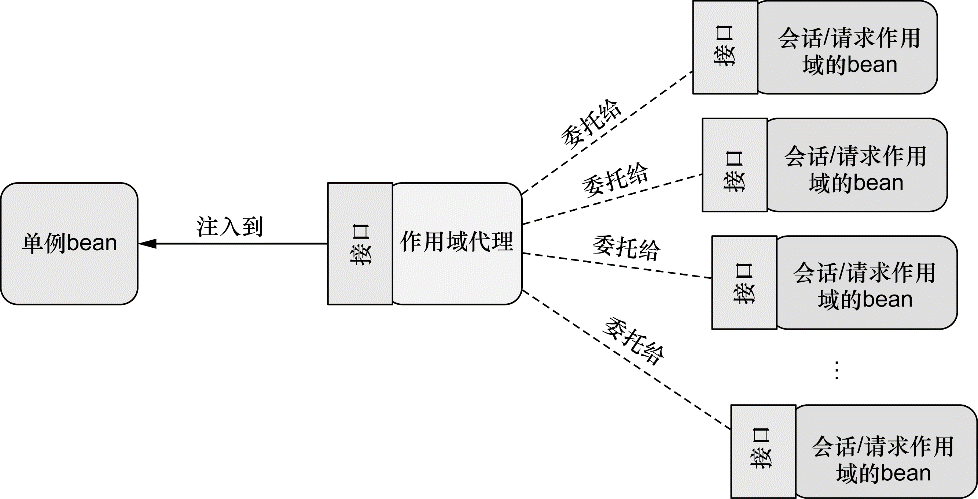

### 3.1 环境与profile

在开发软件的时候，有一个很大的挑战就是将应用程序从一个环境迁移到另外一个环境。开发阶段中，某些环境相关做法可能并不适合迁移到生产环境中，甚至即便迁移过去也无法正常工作。数据库配置、加密算法以及与外部系统的集成是跨环境部署时会发生变化的几个典型例子。

比如，考虑一下数据库配置。在开发环境中，我们可能会使用嵌入式数据库，并预先加载测试数据。例如，在Spring配置类中，我们可能会在一个带有@Bean注解的方法上使用EmbeddedDatabaseBuilder：

```java
// 创建一个类型为javax.sql.Datsource的bean
@Bean(destroyMethod = "shutdown")
public DataSource embeddedDataSource() {
    // EmbeddedDatabaseBuilder会搭建一个嵌入式的Hypersonic数据库，
    // 它的模式（schema）定义在schema.sql中，测试数据则是通过test-data.sql加载的。
    return new EmbeddedDatabaseBuilder() 
        .setType(EmbeddedDatabaseType.H2)
        .addScript("classpath:schema.sql")
        .addScript("classpath:test-data.sql")
        .build();
}
```

尽管EmbeddedDatabaseBuilder创建的DataSource非常适于开发环境，但是对于生产环境来说，可能会希望使用JNDI从容器中获取一个DataSource：

```java
@Bean
public DataSource jndiDataSource() {
    JndiObjectFactoryBean jndiObjectFactoryBean = new JndiObjectFactoryBean();
    jndiObjectFactoryBean.setJndiName("jdbc/myDS");
    jndiObjectFactoryBean.setResourceRef(true);
    jndiObjectFactoryBean.setProxyInterface(DataSource.class);
    return (DataSource) jndiObjectFactoryBean.getObject();
}
```

显然，这里展现的两个版本的dataSource()方法互不相同。虽然它们都会生成一个类型为javax.sql.DataSource的bean，但它们的相似点也仅限于此了。每个方法都使用了完全不同的策略来生成DataSource bean。

我们必须要有一种方法来配置DataSource，使其在每种环境下都会选择最为合适的配置。其中一种方式就是在单独的配置类（或XML文件）中配置每个bean，然后在构建阶段（可能会使用Maven的profiles）确定要将哪一个配置编译到可部署的应用中。这种方式的问题在于要为每种环境重新构建应用。值得庆幸的是，Spring所提供的解决方案并不需要重新构建。

#### 3.1.1 配置profile bean

Spring需要根据环境决定该创建哪个bean和不创建哪个bean。不过Spring并不是在构建的时候做出这样的决策，而是等到运行时再来确定。这样的结果就是同一个部署单元（可能会是WAR文件）能够适用于所有的环境，没有必要进行重新构建。

要使用profile，首先要将所有不同的bean定义整理到一个或多个profile之中，在将应用部署到每个环境时，要确保对应的profile处于激活（active）的状态：

```java
package com.angus.profiles;
import javax.sql.DataSource;
import org.springframework.context.annotation.Bean;
import org.springframework.context.annotation.Configuration;
import org.springframework.context.annotation.Profile;
import org.springframework.jdbc.datasource.embedded.EmbeddedDatabaseBuilder;
import org.springframework.jdbc.datasource.embedded.EmbeddedDatabaseType;

@Configuration
// @Profile注解指定某个bean属于哪一个profile，
// 应用在类级别上时，这个配置类中的bean只有在dev profile激活时才会创建，否者会被忽略
@Profile("dev") 
public class DevelopmentProfileConfig {
    @Bean(destroyMethod = "shutdown")
    public DataSource embeddedDataSource() {
        return new EmbeddedDatabaseBuilder()
                .setType(EmbeddedDatabaseType.H2)
                .addScript("classpath:schema.sql")
                .addScript("classpath:test-data.sql")
                .build();
    }
}
```

同理，可以配置一个适用于生产环境的配置：

```java
package com.angus.profiles;
import org.springframework.context.annotation.Bean;
import org.springframework.context.annotation.Configuration;
import org.springframework.context.annotation.Profile;
import org.springframework.jndi.JndiObjectFactoryBean;
import javax.sql.DataSource;

@Configuration
@Profile("prod") // 只有在prod profile激活的时候，才会创建对应的bean
public class ProductionProfileConfig {
    @Bean
    public DataSource jndiDataSource() {
        JndiObjectFactoryBean jndiObjectFactoryBean = new JndiObjectFactoryBean();
        jndiObjectFactoryBean.setJndiName("jdbc/myDS");
        jndiObjectFactoryBean.setResourceRef(true);
        jndiObjectFactoryBean.setProxyInterface(DataSource.class);
        return (DataSource) jndiObjectFactoryBean.getObject();
    }
}

```

也可以在方法级别上使用@Profile注解，与@Bean注解一同使用。这样的话，就能将这两个bean的声明放到同一个配置类中：

```java
package com.angus.profiles;

import javax.sql.DataSource;

import org.springframework.context.annotation.Bean;
import org.springframework.context.annotation.Configuration;
import org.springframework.context.annotation.Profile;
import org.springframework.jdbc.datasource.embedded.EmbeddedDatabaseBuilder;
import org.springframework.jdbc.datasource.embedded.EmbeddedDatabaseType;
import org.springframework.jndi.JndiObjectFactoryBean;

@Configuration
public class DataSourceConfig {
	// 尽管每个Datasource bean都被声明在一个配置类中，只有当规定的profile激活时，相应的bean才会被创建
    // 没有指定profile的bean始终都会被创建，与激活哪个profile没有关系
    @Bean(destroyMethod = "shutdown")
    @Profile("dev") // 为dev profile装配的bean
    public DataSource embeddedDataSource() {
        return new EmbeddedDatabaseBuilder()
                .setType(EmbeddedDatabaseType.H2)
                .addScript("classpath:schema.sql")
                .addScript("classpath:test-data.sql")
                .build();
    }

    @Bean
    @Profile("prod") // 为prod profile装配的bean
    public DataSource jndiDataSource() {
        JndiObjectFactoryBean jndiObjectFactoryBean = new JndiObjectFactoryBean();
        jndiObjectFactoryBean.setJndiName("jdbc/myDS");
        jndiObjectFactoryBean.setResourceRef(true);
        jndiObjectFactoryBean.setProxyInterface(DataSource.class);
        return (DataSource) jndiObjectFactoryBean.getObject();
    }

}
```

**在XML中配置profile**

也可以通过\<beans>元素的profile属性，在XML中配置profile bean：

```xml
<?xml version="1.0" encoding="UTF-8"?>
<beans xmlns="http://www.springframework.org/schema/beans"
       xmlns:xsi="http://www.w3.org/2001/XMLSchema-instance"
       xmlns:jdbc="http://www.springframework.org/schema/jdbc"
       xsi:schemaLocation="http://www.springframework.org/schema/beans 
       http://www.springframework.org/schema/beans/spring-beans.xsd 
       http://www.springframework.org/schema/jdbc 
       http://www.springframework.org/schema/jdbc/spring-jdbc.xsd"
       profile="dev">

    <jdbc:embedded-database id="dataSource">
        <jdbc:script location="classpath:schema.sql"/>
        <jdbc:script location="classpath:test-data.sql"/>
    </jdbc:embedded-database>

</beans>
```

与之类似，也可以将profile设置为prod，创建适用于生产环境的从JNDI获取的DataSource bean。同样，可以创建基于连接池定义的DataSource bean，将其放在另外一个XML文件中，并标注为qaprofile。所有的配置文件都会放到部署单元之中（如WAR文件），但是只有profile属性与当前激活profile相匹配的配置文件才会被用到。

还可以在根\<beans>元素中嵌套定义\<beans>元素，而不是为每个环境都创建一个profile XML文件。这能够将所有的profile bean定义放到同一个XML文件中：

```xml
<?xml version="1.0" encoding="UTF-8"?>
<beans xmlns="http://www.springframework.org/schema/beans"
       xmlns:xsi="http://www.w3.org/2001/XMLSchema-instance"
       xmlns:jdbc="http://www.springframework.org/schema/jdbc"
       xmlns:jee="http://www.springframework.org/schema/jee"
       xmlns:p="http://www.springframework.org/schema/p"
       xsi:schemaLocation="http://www.springframework.org/schema/jee
                           http://www.springframework.org/schema/jee/spring-jee.xsd
                           http://www.springframework.org/schema/jdbc
                           http://www.springframework.org/schema/jdbc/spring-jdbc.xsd
                           http://www.springframework.org/schema/beans
                           http://www.springframework.org/schema/beans/spring-beans.xsd">

    <!-- dev profile的bean -->
    <beans profile="dev">
        <jdbc:embedded-database id="dataSource" type="H2">
            <jdbc:script location="classpath:schema.sql"/>
            <jdbc:script location="classpath:test-data.sql"/>
        </jdbc:embedded-database>
    </beans>

    <!-- prod profile的bean -->
    <beans profile="prod">
        <jee:jndi-lookup id="dataSource"
                         lazy-init="true"
                         jndi-name="jdbc/myDatabase"
                         resource-ref="true"
                         proxy-interface="javax.sql.DataSource"/>
    </beans>
</beans>
```

#### 3.1.2 激活profile

Spring在确定哪个profile处于激活状态时，需要依赖两个独立的属性：spring.profiles.active和spring.profiles.default。如果设置了spring.profiles.active属性的话，那么它的值就会用来确定哪个profile是激活的。但如果没有设置spring.profiles.active属性的话，那Spring将会查找spring.profiles.default的值。如果spring.profiles.active和spring.profiles.default均没有设置的话，那就没有激活的profile，因此只会创建那些没有定义在profile中的bean。

有多种方式来设置这两个属性：

+ 作为DispatcherServlet的初始化参数；
+ 作为Web应用的上下文参数；
+ 作为JNDI条目；
+ 作为环境变量；
+ 作为JVM的系统属性；
+ 在集成测试类上，使用@ActiveProfiles注解设置。

**使用profie进行测试**

Spring提供了@ActiveProfiles注解，可以使用它来指定运行测试时要激活哪个profile：

```java
@RunWith(SpringJUnit4ClassRunner.class)
@ContextConfiguration(classes=DataSourceConfig.class)
@ActiveProfiles("dev") // 使用@ActiveProfile注解指定激活dev profile
public static class DevDataSourceTest {
    @Autowired
    private DataSource dataSource;

    @Test
    public void shouldBeEmbeddedDatasource() {
        assertNotNull(dataSource);
        JdbcTemplate jdbc = new JdbcTemplate(dataSource);
        List<String> results = jdbc.query("select id, name from Things", new RowMapper<String>() {
            @Override
            public String mapRow(ResultSet rs, int rowNum) throws SQLException {
                return rs.getLong("id") + ":" + rs.getString("name");
            }
        });

        assertEquals(1, results.size());
        assertEquals("1:A", results.get(0));
    }
}
```

### 3.2 条件化的bean

Spring 4引入了一个新的@Conditional注解，它可以用到带有@Bean注解的方法上。如果给定的条件计算结果为true，就会创建这个bean，否则的话，这个bean会被忽略。

假设有一个名为MagicBean的类，只有设置了magic环境属性的时候，Spring才会实例化这个类。如果环境中没有这个属性，那么MagicBean将会被忽略：

```java
// 条件化地创建bean
@Bean
// @Conditional给定了一个Class，指明了条件
@Conditional({MagicExistsCondition.class}) 
public MagicBean magicBean() {
    return new MagicBean();
}
```

设置给@Conditional的类可以是任意实现了Condition接口的类型：

```java
package com.angus.conditional;

import org.springframework.context.annotation.Condition;
import org.springframework.context.annotation.ConditionContext;
import org.springframework.core.env.Environment;
import org.springframework.core.type.AnnotatedTypeMetadata;

public class MagicExistsCondition implements Condition {

    // 接口的实现很简单，只需要提供matches()方法的实现即可
    // 如果matches()方法返回true，就会创建带有@Conditional注解的bean，反之则不会
    @Override
    public boolean matches(ConditionContext context, AnnotatedTypeMetadata metadata) {
        // AnnotatedTypeMetadata则能够让我们检查带有@Bean注解的方法上还有什么其他的注解
        // 通过给定的ConditionContext对象得到Environment对象
        Environment env = context.getEnvironment();
        // 通过Environment对象检查环境中是否存在名为magic的环境属性
        return env.containsProperty("magic");
    }

}
```

ConditionContext是一个接口，大致如下所示：

```java
public interface ConditionContext {
	BeanDefinitionRegistry getRegistry();
	ConfigurableListableBeanFactory getBeanFactory();
	Environment getEnvironment();
	ResourceLoader getResourceLoader();
	ClassLoader getClassLoader();
}

```

通过ConditionContext，可以做到以下几点：

+ 借助getRegistry()返回的BeanDefinitionRegistry检查bean定义；
+ 借助getBeanFactory()返回的ConfigurableListableBeanFactory检查bean是否存在，甚至探查bean的属性；
+ 借助getEnvironment()返回的Environment检查环境变量是否存在以及它的值是什么；
+ 读取并探查getResourceLoader()返回的ResourceLoader所加载的资源；
+ 借助getClassLoader()返回的ClassLoader加载并检查类是否存在。

### 3.3 处理自动装配的歧义性

当发生歧义性的时候，Spring提供了多种可选方案来解决这样的问题。可以将可选bean中的某一个设为首选（primary）的bean，或者使用限定符（qualifier）来帮助Spring将可选的bean的范围缩小到只有一个bean。

#### 3.3.1 标示首选的bean

在声明bean的时候，通过将其中一个可选的bean设置为首选（primary）bean能够避免自动装配时的歧义性。当遇到歧义性的时候，Spring将会使用首选的bean，而不是其他可选的bean。

```java
@Component
@Primary
public class Cookies implements Dessert {
    ...
}

// 或者通过Java配置显式声明
@Bean
@Primary
public Dessert cookies() {
    return new Cookies();
}
```

使用XML配置，同样可以实现此功能：

```xml
<bean id="iceCream" class="com.angus.autowired.IceCream" primary="true"/>
```

#### 3.3.2 限定自动装配的bean

@Qualifier注解是使用限定符的主要方式。它可以与@Autowired和@Inject协同使用，在注入的时候指定想要注入进去的是哪个bean。例如，确保要将IceCream注入到setDessert()之中：

```java
@Autowired
@Qualifier("iceCream") // 为@Qualifier注解所设置的参数就是想要注入的bean的ID
public void setDessert(Dessert dessert) {
    System.out.println(dessert.display());
    this.dessert = dessert;
}
```

更准确地讲，@Qualifier("iceCream")所引用的bean要具有String类型的“iceCream”作为限定符。如果没有指定其他的限定符的话，所有的bean都会给定一个默认的限定符，这个限定符与bean的ID相同。

**创建自定义的限定符**

可以为bean设置自己的限定符，而不是依赖于将bean ID作为限定符。在这里所需要做的就是在bean声明上添加@Qualifier注解：

```java
@Bean
// 使用自定义限定符，可以降低耦合度，更改代码时更方便
@Qualifier("littleCookies") // 还可以与@Component组合使用
public Dessert cookies(){
    return new Cookies();
}
```

**使用自定义的限定符注解**

可以创建自定义的限定符注解，借助这样的注解来表达bean所希望限定的特性：

```java
package com.angus.autowired;

import org.springframework.beans.factory.annotation.Qualifier;

import java.lang.annotation.*;

@Target({ElementType.CONSTRUCTOR, 
         ElementType.FIELD, ElementType.METHOD, ElementType.TYPE})
@Retention(RetentionPolicy.RUNTIME)
@Qualifier
public @interface Cold {
}
```

```java
@Bean
@Cold
public Dessert cookies(){
    return new Cookies();
}

@Autowired
@Cold
public void setDessert(Dessert dessert) {
    System.out.println(dessert.display());
    this.dessert = dessert;
}
```

通过声明自定义的限定符注解，可以同时使用多个限定符，不会再有Java编译器的限制或错误。与此同时，相对于使用原始的@Qualifier并借助String类型来指定限定符，自定义的注解也更为类型安全。

### 3.4 bean的作用域

Spring定义了多种作用域，可以基于这些作用域创建bean，包括：

+ 单例（Singleton）：在整个应用中，只创建bean的一个实例。（默认情况）
+ 原型（Prototype）：每次注入或者通过Spring应用上下文获取的时候，都会创建一个新的bean实例。
+ 会话（Session）：在Web应用中，为每个会话创建一个bean实例。
+ 请求（Request）：在Web应用中，为每个请求创建一个bean实例。

单例是默认的作用域，如果要选择其他作用域，可以在bean的类上使用@Scope注解，将其声明为Prototype bean：

```java
@Component
@Scope(ConfigurableBeanFactory.SCOPE_PROTOTYPE) // 也可以写成@Scope("prototype")，但不是太安全
public class Notepad {
    ...
}

```

Java配置中也可以声明：

```java
@Bean
@Scope(ConfigurableBeanFactory.SCOPE_PROTOTYPE)
public Notepad notepad() {
    return new Notepad();
}
```

同样，也可以正在XML中进行配置：

```xml
<bean class="com.myapp.Notepad" scope="prototype" />
```

#### 3.4.1 使用会话和请求作用域

在典型的电子商务应用中，可能会有一个bean代表用户的购物车。如果购物车是单例的话，那么将会导致所有的用户都会向同一个购物车中添加商品。另一方面，如果购物车是原型作用域的，那么在应用中某一个地方往购物车中添加商品，在应用的另外一个地方可能就不可用了，因为在这里注入的是另外一个原型作用域的购物车。

就购物车bean来说，会话作用域是最为合适的，因为它与给定的用户关联性最大。要指定会话作用域，我们可以使用@Scope注解，它的使用方式与指定原型作用域是相同的：

```java
package com.angus.scopedbeans;
import org.springframework.context.annotation.Scope;
import org.springframework.context.annotation.ScopedProxyMode;
import org.springframework.stereotype.Component;
import org.springframework.web.context.WebApplicationContext;

// 将value设置成了WebApplicationContext中的SCOPE_SESSION常量（它的值是session）
// 这会告诉Spring为Web应用中的每个会话创建一个ShoppingCart(对于当前会话，相当于是单例)
@Component
@Scope(value = WebApplicationContext.SCOPE_SESSION, 
       proxyMode = ScopedProxyMode.INTERFACES)
public class ShoppingCart {
    ...
}
```

@Scope同时还有一个proxyMode属性，它被设置成了ScopedProxyMode.INTERFACES，这个属性解决了将会话或请求作用域的bean注入到单例bean中所遇到的问题。假设我们要将ShoppingCart bean注入到单例StoreService bean的Setter方法中：

```java
@Component
public class StoreService {
    private ShoppingCart cart;

    @Autowired
    public void setShoppingCart(ShoppingCart cart) {
        this.cart = cart;
    }
    
    ...
}
```

因为StoreService是一个单例的bean，Spring并不会将实际的ShoppingCart bean注入到StoreService中，Spring会注入一个到ShoppingCart bean的代理。这个代理会暴露与ShoppingCart相同的方法，当StoreService调用ShoppingCart的方法时，代理会对其进行懒解析并将调用委托给会话作用域内真正的ShoppingCart bean。

proxyMode属性被设置成了ScopedProxyMode.INTERFACES，这表明这个代理要实现ShoppingCart接口（也是最为理想的情况），并将调用委托给实现bean。

如果ShoppingCart是一个具体的类的话，Spring就没有办法创建基于接口的代理了。此时，它必须使用CGLib来生成基于类的代理。继而必须将proxyMode属性设置为ScopedProxyMode.TARGET_CLASS。

请求作用域的bean会面临相同的装配问题，因而请求作用域的bean应该也以作用域代理的方式进行注入。



#### 3.4.2 在XML中声明作用域代理

XML中要设置代理模式，需要使用Spring aop命名空间的一个新元素：

```xml
<?xml version="1.0" encoding="UTF-8"?>
<beans xmlns="http://www.springframework.org/schema/beans"
       xmlns:xsi="http://www.w3.org/2001/XMLSchema-instance"
       xmlns:aop="http://www.springframework.org/schema/aop"
       xsi:schemaLocation="http://www.springframework.org/schema/beans
       http://www.springframework.org/schema/beans/spring-beans.xsd
       http://www.springframework.org/schema/aop
       http://www.springframework.org/schema/aop/spring-aop.xsd">

    <bean id="cart" class="com.angus.scopedbeans.ShoppingCart" scope="session">
        <aop:scoped-proxy proxy-target-class="false"/>
    </bean>

</beans>
```

\<aop:scoped-proxy>是与@Scope注解的proxyMode属性功能相同的Spring XML配置元素。它会告诉Spring为bean创建一个作用域代理。默认情况下使用CGLib创建目标类的代理，也可以将proxy-target-class属性设置为false，进而要求它生成基于接口的代理：

```xml
<bean id="cart" class="com.angus.scopedbeans.ShoppingCart" scope="session">
    <aop:scoped-proxy proxy-target-class="false"/>
</bean>
```

### 3.5 运行时值注入

Spring提供了两种在运行时求值的方式：

+ 属性占位符（Property placeholder）
+ Spring表达式语言（SpEL）

#### 3.5.1 注入外部的值

在Spring中，处理外部值的最简单方式就是声明属性源并通过Spring的Environment来检索属性：

```java
package com.angus.externals;
import org.springframework.beans.factory.annotation.Autowired;
import org.springframework.context.annotation.Bean;
import org.springframework.context.annotation.Configuration;
import org.springframework.context.annotation.PropertySource;
import org.springframework.core.env.Environment;

@Configuration
@PropertySource("classpath:app.properties")
public class EnvironmentConfig {

    @Autowired
    Environment env;

    @Bean
    public BlankDisc disc() {
        return new BlankDisc(
            // 调用Environment的getProperty()方法从属性文件中获取参数注入
            env.getProperty("disc.title"), 
            env.getProperty("disc.artist"));
    }
}

```

@PropertySource引用了类路径中一个名为app.properties的文件，这个属性文件会加载到Spring的Environment中，稍后可以从这里检索属性：

```properties
disc.title=Sgt. Peppers Lonely Hearts Club Band
disc.artist=The Beatles
```

**深入学习Spring的Environment**

getProperty()方法有四个重载的变种形式：

+ String getProperty(String key);
+ String getProperty(String key, String defaultValue);
+ \<T> T getProperty(String key, Class\<T> targetType);
+ \<T> T getProperty(String key, Class\<T> targetType, T defaultValue);

在使用getProperty()方法的时候没有指定默认值，并且这个属性没有定义的话，获取到的值是null。如果希望这个属性必须要定义，那么可以使用getRequiredProperty()方法。这样属性当属性没有定义时，会抛出IllegalStateException异常：

+ String getRequiredProperty(String key) throws IllegalStateException;
+ \<T> T getRequiredProperty(String key, Class\<T> targetType) throws IllegalStateException;

如果想检查一下某个属性是否存在的话，那么可以调用Environment的containsProperty()方法：

+ boolean containsProperty(String key);

如果想将属性解析为类的话，可以使用getPropertyAsClass()方法：

+ \<T> Class\<T> getPropertyAsClass(String key, Class\<T> targetType);

除了属性相关的功能以外，Environment还提供了一些方法来检查哪些profile处于激活状态：

+ String[] getActiveProfiles()：返回激活profile名称的数组；
+ String[] getDefaultProfiles()：返回默认profile名称的数组；
+ boolean acceptsProfiles(String... profiles)：如果environment支持给定profile的话，就返回true。

**解析属性占位符**

Spring一直支持将属性定义到外部的属性的文件中，并使用占位符值将其插入到Spring bean中。在Spring装配中，占位符的形式为使用“${ ... }”包装的属性名称：

```xml
<?xml version="1.0" encoding="UTF-8"?>
<beans xmlns="http://www.springframework.org/schema/beans"
       xmlns:xsi="http://www.w3.org/2001/XMLSchema-instance"
       xmlns:context="http://www.springframework.org/schema/context"
       xmlns:c="http://www.springframework.org/schema/c"
       xsi:schemaLocation="http://www.springframework.org/schema/beans 
       http://www.springframework.org/schema/beans/spring-beans.xsd 
       http://www.springframework.org/schema/context 
       http://www.springframework.org/schema/context/spring-context.xsd">

    <context:property-placeholder location="classpath:app.properties"/>

    <bean id="disc" class="com.angus.externals.BlankDisc"
          c:_0="${disc.title}"
          c:_1="${disc.artist}"/>

</beans>
```

如果依赖于组件扫描和自动装配来创建和初始化应用组件的话，可以使用@Value注解，它的使用方式与@Autowired注解非常相似。比如，在BlankDisc类中，构造器可以改成如下所示：

```java
public BlankDisc(@Value("${disc.title}") String title, @Value("${disc.artist}")String artist) {
    this.title = title;
    this.artist = artist;
}
```

为了使用占位符，必须要配置一个PropertyPlaceholderConfigurer bean或PropertySourcesPlaceholderConfigurer bean。推荐使用PropertySourcesPlaceholderConfigurer，因为它能够基于Spring Environment及其属性源来解析占位符。

如下的@Bean方法在Java中配置了PropertySourcesPlaceholderConfigurer：

```java
@Bean
public PropertySourcesPlaceholderConfigurer placeholderConfigurer(){
    return new PropertySourcesPlaceholderConfigurer();
}
```

使用XML配置的话，Spring context命名空间中的\<context:propertyplaceholder>元素将会生成PropertySourcesPlaceholderConfigurer bean：

```xml
<?xml version="1.0" encoding="UTF-8"?>
<beans xmlns="http://www.springframework.org/schema/beans"
       xmlns:xsi="http://www.w3.org/2001/XMLSchema-instance"
       xmlns:context="http://www.springframework.org/schema/context"
       xmlns:c="http://www.springframework.org/schema/c"
       xsi:schemaLocation="http://www.springframework.org/schema/beans
       http://www.springframework.org/schema/beans/spring-beans.xsd
       http://www.springframework.org/schema/context
       http://www.springframework.org/schema/context/spring-context.xsd">

    <context:property-placeholder/>

</beans>
```

#### 3.5.2 使用Spring表达式语言进行装配

Spring 3引入了Spring表达式语言（Spring Expression Language，SpEL），它能够以一种强大和简洁的方式将值装配到bean属性和构造器参数中，在这个过程中所使用的表达式会在运行时计算得到值。

SpEL拥有很多属性，包括：

+ 使用bean的ID来应用bean；
+ 调用方法和访问对象的属性；
+ 对值进行算术、关系和逻辑运算；
+ 正则表达式匹配；
+ 集合操作。

**SpEl样例**

SpEL表达式要放到“#{ ... }”之中，这与属性占位符有些类似，属性占位符需要放到“${ ... }”之中。

```xml
<!-- 该表达式计算结果就是数字1 -->
#{1}

<!-- 计算表达式的那一刻当前时间的毫秒数，T()表达式会将java.lang.System视为Java中对应的类型 -->
#{T(System).currentTimeMillis()} 

<!--  -->
```


