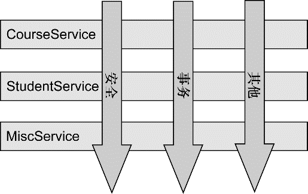

### 4.1 什么是面向切面编程

在软件开发中，散布于应用中多处的功能被称为横切关注点（cross-cutting concern）。通常来讲，这些横切关注点从概念上是与应用的业务逻辑相分离的。把这些横切关注点与业务逻辑相分离正是面向切面编程（AOP）所要解决的问题。

切面能帮助我们模块化横切关注点。简而言之，横切关注点可以被描述为影响应用多处的功能。例如，安全就是一个横切关注点，应用中的许多方法都会涉及到安全规则。

如果要重用通用功能的话，最常见的面向对象技术是继承（inheritance）或委托（delegation）。但是，如果在整个应用中都使用相同的基类，继承往往会导致一个脆弱的对象体系；而使用委托可能需要对委托对象进行复杂的调用。

切面提供了取代继承和委托的另一种可选方案，而且在很多场景下更清晰简洁。在使用面向切面编程时，我们仍然在一个地方定义通用功能，但是可以通过声明的方式定义这个功能要以何种方式在何处应用，而无需修改受影响的类。横切关注点可以被模块化为特殊的类，这些类被称为切面（aspect）。这样做有两个好处：

+ 首先，现在每个关注点都集中于一个地方，而不是分散到多处代码中；
+ 其次，服务模块更简洁，因为它们只包含主要关注点（或核心功能）的代码，而次要关注点的代码被转移到切面中了。

#### 4.1.1 定义AOP术语

描述切面的常用术语有通知（advice）、切点（pointcut）和连接点（join point）。

**通知（Advice）**

在AOP术语中，切面的工作被称为通知，其定义了切面是什么以及如何使用。

Spring切面可以应用5种类型的通知：

+ 前置通知（Before）：在目标方法被调用之前调用通知功能；
+ 后置通知（After）：在目标方法被调用之后调用通知，此时不关心方法的输出是什么；
+ 返回通知（After-returning）：在目标方法成功执行之后调用通知；
+ 异常通知（After-throwing）：在目标方法抛出异常之后调用通知；
+ 环绕通知（Around）：通知包裹了被通知的方法，在被通知的方法调用之前和调用之后执行自定义的行为。

**连接点（Join Point）**

连接点是在应用执行过程中能够插入切面的一个点。这个点可以是调用方法时、抛出异常时、甚至修改一个字段时。切面代码可以利用这些点插入到应用的正常流程中，并添加新的行为。

**切点（Pointcut）**

如果说通知定义了切面的“什么”和“何时”的话，那么切点就定义了“何处”。切点的定义会匹配通知所要织入的一个或多个连接点。我们通常使用明确的类和方法名称，或是利用正则表达式定义所匹配的类和方法名称来指定这些切点。

**切面（Aspect）**

切面是通知和切点的结合。通知和切点共同定义了切面的全部内容——它是什么，在何时和何处完成其功能。

**引入（Introduction）**

引入允许我们向现有的类添加新方法或属性。例如，可以创建一个Auditable通知类，该类记录了对象最后一次修改时的状态。这很简单，只需一个方法，setLastModified(Date)，和一个实例变量来保存这个状态。然后，这个新方法和实例变量就可以被引入到现有的类中，从而可以在无需修改这些现有的类的情况下，让它们具有新的行为和状态。

**织入（Weaving）**

织入是把切面应用到目标对象并创建新的代理对象的过程。切面在指定的连接点被织入到目标对象中。在目标对象的生命周期里有多个点可以进行织入：

+ 编译期：切面在目标类编译时被织入。这种方式需要特殊的编译器。AspectJ的织入编译器就是以这种方式织入切面的。
+ 类加载期：切面在目标类加载到JVM时被织入。这种方式需要特殊的类加载器（ClassLoader），它可以在目标类被引入应用之前增强该目标类的字节码。AspectJ 5的加载时织入（load-time weaving，LTW）就支持以这种方式织入切面。
+ 运行期：切面在应用运行的某个时刻被织入。一般情况下，在织入切面时，AOP容器会为目标对象动态地创建一个代理对象。Spring AOP就是以这种方式织入切面的。

#### 4.1.2 Spring对AOP的支持

Spring提供了4种类型的AOP支持：

+ 基于代理的经典Spring AOP；
+ 纯POJO切面；
+ @