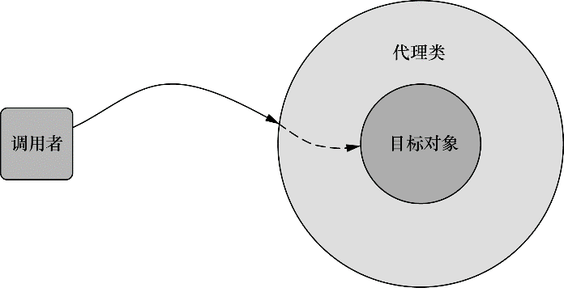
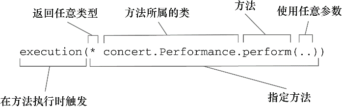
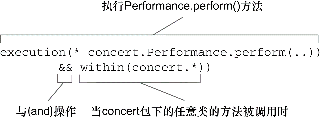
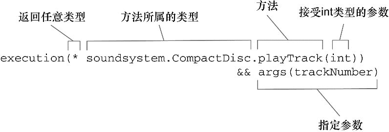
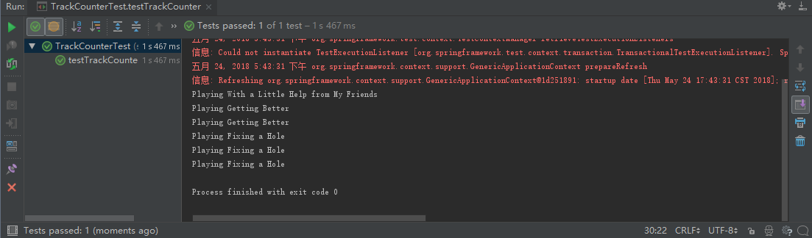
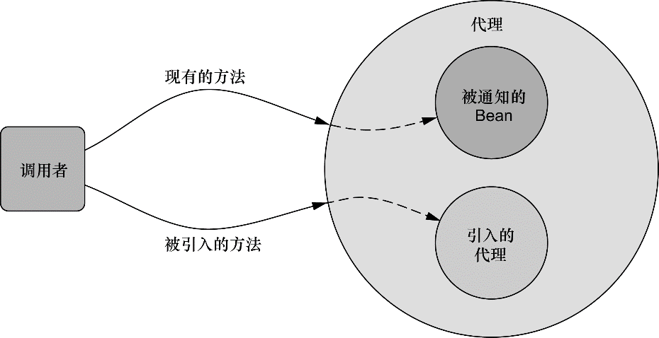
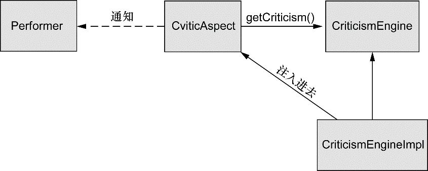

### 4.1 什么是面向切面编程

在软件开发中，散布于应用中多处的功能被称为横切关注点（cross-cutting concern）。通常来讲，这些横切关注点从概念上是与应用的业务逻辑相分离的。把这些横切关注点与业务逻辑相分离正是面向切面编程（AOP）所要解决的问题。

切面能帮助我们模块化横切关注点。简而言之，横切关注点可以被描述为影响应用多处的功能。例如，安全就是一个横切关注点，应用中的许多方法都会涉及到安全规则。


如果要重用通用功能的话，最常见的面向对象技术是继承（inheritance）或委托（delegation）。但是，如果在整个应用中都使用相同的基类，继承往往会导致一个脆弱的对象体系；而使用委托可能需要对委托对象进行复杂的调用。

切面提供了取代继承和委托的另一种可选方案，而且在很多场景下更清晰简洁。在使用面向切面编程时，我们仍然在一个地方定义通用功能，但是可以通过声明的方式定义这个功能要以何种方式在何处应用，而无需修改受影响的类。横切关注点可以被模块化为特殊的类，这些类被称为切面（aspect）。这样做有两个好处：

+ 首先，现在每个关注点都集中于一个地方，而不是分散到多处代码中；
+ 其次，服务模块更简洁，因为它们只包含主要关注点（或核心功能）的代码，而次要关注点的代码被转移到切面中了。

#### 4.1.1 定义AOP术语

描述切面的常用术语有通知（advice）、切点（pointcut）和连接点（join point）。


**通知（Advice）**

在AOP术语中，切面的工作被称为通知，其定义了切面是什么以及如何使用。

Spring切面可以应用5种类型的通知：

+ 前置通知（Before）：在目标方法被调用之前调用通知功能；
+ 后置通知（After）：在目标方法被调用之后调用通知，此时不关心方法的输出是什么；
+ 返回通知（After-returning）：在目标方法成功执行之后调用通知；
+ 异常通知（After-throwing）：在目标方法抛出异常之后调用通知；
+ 环绕通知（Around）：通知包裹了被通知的方法，在被通知的方法调用之前和调用之后执行自定义的行为。

**连接点（Join Point）**

连接点是在应用执行过程中能够插入切面的一个点。这个点可以是调用方法时、抛出异常时、甚至修改一个字段时。切面代码可以利用这些点插入到应用的正常流程中，并添加新的行为。

**切点（Pointcut）**

如果说通知定义了切面的“什么”和“何时”的话，那么切点就定义了“何处”。切点的定义会匹配通知所要织入的一个或多个连接点。我们通常使用明确的类和方法名称，或是利用正则表达式定义所匹配的类和方法名称来指定这些切点。

**切面（Aspect）**

切面是通知和切点的结合。通知和切点共同定义了切面的全部内容——它是什么，在何时和何处完成其功能。

**引入（Introduction）**

引入允许我们向现有的类添加新方法或属性。例如，可以创建一个Auditable通知类，该类记录了对象最后一次修改时的状态。这很简单，只需一个方法，setLastModified(Date)，和一个实例变量来保存这个状态。然后，这个新方法和实例变量就可以被引入到现有的类中，从而可以在无需修改这些现有的类的情况下，让它们具有新的行为和状态。

**织入（Weaving）**

织入是把切面应用到目标对象并创建新的代理对象的过程。切面在指定的连接点被织入到目标对象中。在目标对象的生命周期里有多个点可以进行织入：

+ 编译期：切面在目标类编译时被织入。这种方式需要特殊的编译器。AspectJ的织入编译器就是以这种方式织入切面的。
+ 类加载期：切面在目标类加载到JVM时被织入。这种方式需要特殊的类加载器（ClassLoader），它可以在目标类被引入应用之前增强该目标类的字节码。AspectJ 5的加载时织入（load-time weaving，LTW）就支持以这种方式织入切面。
+ 运行期：切面在应用运行的某个时刻被织入。一般情况下，在织入切面时，AOP容器会为目标对象动态地创建一个代理对象。Spring AOP就是以这种方式织入切面的。

#### 4.1.2 Spring对AOP的支持

Spring提供了4种类型的AOP支持：

+ 基于代理的经典Spring AOP；
+ 纯POJO切面；
+ @AspectJ注解驱动的切面；
+ 注入式AspectJ切面（适用于Spring各版本）。

**Spring通知是Java编写的**

Spring所创建的通知都是用标准的Java类编写的，而且，定义通知所应用的切点通常会使用注解或在Spring配置文件里采用XML来编写。

**Spring在运行时通知对象**

通过在代理类中包裹切面，Spring在运行期把切面织入到Spring管理的bean中。代理类封装了目标类，并拦截被通知方法的调用，再把调用转发给真正的目标bean。当代理拦截到方法调用时，在调用目标bean方法之前，会执行切面逻辑。直到应用需要被代理的bean时，Spring才创建代理对象。



**Spring只支持方法级别的连接点**

因为Spring基于动态代理，所以Spring只支持方法连接点。如果需要方法拦截之外的连接点拦截功能，那么我们可以利用Aspect来补充Spring AOP的功能。

### 4.2 通过切点来选择连接点

在Spring AOP中，要使用AspectJ的切点表达式语言来定义切点。但Spring仅支持AspectJ切点指示器（pointcut designator）的一个子集：

| AspectJ指示器 | 描述                                                         |
| ------------- | ------------------------------------------------------------ |
| arg()         | 限制连接点匹配参数为指定类型的执行方法                       |
| @args()       | 限制连接点匹配参数由指定注解标注的执行方法                   |
| execution()   | 用于匹配连接点的执行方法                                     |
| this()        | 限制连接点匹配AOP代理的bean引用为指定类型的类                |
| target        | 限制连接点匹配目标对象为指定类型的类                         |
| @target()     | 限制连接点匹配特定的执行对象，这些对象对应的类要具有指定类型的注解 |
| within()      | 限制连接点匹配指定的类型                                     |
| @within()     | 限制连接点匹配指定注解所标注的类型<br >（当使用Spring AOP时，方法定义由指定的注解所标注的类里） |
| @annotation   | 限定匹配带有指定注解的连接点                                 |

#### 4.2.1 编写切点

为了阐述Spring中的切面，需要有个主题来定义切面的切点。为此，定义一个Performance接口：

```java
package concert;

public interface Performance {
    void perform();
}
```

假设想编写Performance的perform()方法触发的通知，那么表达式设置如下：



方法表达式以“*”号开始，表明了不关心方法返回值的类型。然后，指定了全限定类名和方法名。对于方法参数列表，使用两个点号（..）表明切点要选择任意的perform()方法，无论该方法的入参是什么。

现在假设需要配置的切点仅匹配concert包。在此场景下，可以使用within()指示器来限制匹配：



类似地，可以使用“||”操作符来标识或（or）关系，而使用“!”操作符来标识非（not）操作。因为“&”在XML中有特殊含义，所以在Spring的XML配置里面描述切点时，可以使用and来代替“&&”。同样，or和not可以分别用来代替“||”和“!”。

#### 4.2.2 在切点中选择bean

Spring还引入了一个新的bean()指示器，它允许我们在切点表达式中使用bean的ID来标识bean。bean()使用bean ID或bean名称作为参数来限制切点只匹配特定的bean：

```java
// 在执行Performance的perform()方法时应用通知，但限定bean的ID为woodstock
execution(* concert.Performance.perform() and bean('woodstock'))

// 使用非操作为除了特定ID以外的其他bean应用通知
execution(* concert.Performance.perform() and !bean('woodstock'))
```

### 4.3 使用注解创建切面

#### 4.3.1 定义切面

将观众定义为一个切面，并将其应用到演出上：

```java
package concert;

import org.aspectj.lang.annotation.AfterReturning;
import org.aspectj.lang.annotation.AfterThrowing;
import org.aspectj.lang.annotation.Aspect;
import org.aspectj.lang.annotation.Before;

@Aspect // 使用@Aspect注解进行标注，表明该类是一个切面
public class Audience {

    @Before("execution(* concert.Performance.perform(..))") // 表演之前
    public void silenceCellPhones(){
        System.out.println("Silencing cell phones");
    }

    @Before("execution(* concert.Performance.perform(..))") // 表演之前
    public void takeSeats() {
        System.out.println("Taking seats");
    }

    @AfterReturning("execution(* concert.Performance.perform(..))") // 表演之后
    public void applause() {
        System.out.println("CLAP CLAP CLAP");
    }

    @AfterThrowing("execution(* concert.Performance.perform(..))") // 表演失败之后
    public void demandRefund() {
        System.out.println("Demanding a refund");
    }
}
```

Spring使用AspectJ注解来声明通知方法，AspectJ提供了五个注解来定义通知：

| 注解            | 通知                                       |
| --------------- | ------------------------------------------ |
| @After          | 通知方法会在目标方法返回后或抛出异常后调用 |
| @AfterReturning | 通知方法会在目标方法返回后调用             |
| @AfterThrowing  | 通知方法会在目标方法抛出异常后调用         |
| @Around         | 通知方法会将目标方法封装起来               |
| @Before         | 通知方法会在目标方法调用之前执行           |

相同的切点表达式重复了四遍，不是一个很好的解决方案。@Pointcut注解能够在一个@AspectJ切面内定义可重用的切点：

```java
package concert;
import org.aspectj.lang.annotation.*;
import org.springframework.context.annotation.Bean;

@Aspect
public class Audience {
    
    @Bean // 需要注意的是，除了@Aspect注解，Audience类依然是一个POJO,可以装配为Spring中的bean
    public Audience audience(){
        return new Audience();
    }

    @Pointcut("execution(* concert.Performance.perform(..))") // 定义命名的切点
    public void performance() { // performnce()方法的实际内容并不重要，该方法本身只是一个标识
    }

    @Before("performance()")
    public void silenceCellPhones() {
        System.out.println("Silencing cell phones");
    }

    @Before("performance()")
    public void takeSeats() {
        System.out.println("Taking seats");
    }

    @AfterReturning("performance()")
    public void applause() {
        System.out.println("CLAP CLAP CLAP");
    }

    @AfterThrowing("performance()")
    public void demandRefund() {
        System.out.println("Demanding a refund");
    }
}
```

要启用切面，需要开启代理。如果使用JavaConfig，可以在配置类的类级别上通过使用EnableAspectJAutoProxy注解启用自动代理功能：

```java
package concert;
import org.springframework.context.annotation.ComponentScan;
import org.springframework.context.annotation.Configuration;
import org.springframework.context.annotation.EnableAspectJAutoProxy;

@Configuration
@EnableAspectJAutoProxy // 启用AspectJ自动代理
@ComponentScan
public class ConvertConfig {
    @Bean // 声明Audience bean
    public Audience audience(){
        return new Audience();
    }
}
```

假如使用XML来装配bean的话，那么需要使用Spring aop命名空间中的\<aop:aspectj-autoproxy>元素：

```xml
<?xml version="1.0" encoding="UTF-8"?>
<!-- 声明Spring aop命名空间 -->
<beans xmlns="http://www.springframework.org/schema/beans"
       xmlns:xsi="http://www.w3.org/2001/XMLSchema-instance"
       xmlns:context="http://www.springframework.org/schema/context"
       xmlns:aop="http://www.springframework.org/schema/aop"
       xsi:schemaLocation="http://www.springframework.org/schema/beans 
       http://www.springframework.org/schema/beans/spring-beans.xsd 
       http://www.springframework.org/schema/context 
       http://www.springframework.org/schema/context/spring-context.xsd 
       http://www.springframework.org/schema/aop 
       http://www.springframework.org/schema/aop/spring-aop.xsd">

    <context:component-scan base-package="concert"/>

    <!-- 启用AspectJ自动代理 -->
    <aop:aspectj-autoproxy/>

    <!-- 声明Audience bean -->
    <bean class="concert.Audience"/>
</beans>
```

不管使用JavaConfig还是XML，AspectJ自动代理都会为使用@Aspect注解的bean创建一个代理，这个代理会围绕着所有该切面的切点所匹配的bean。在这种情况下，将会为Concert bean创建一个代理，Audience类中的通知方法将会在perform()调用前后执行。

需要记住的是，Spring的AspectJ自动代理仅仅使用@AspectJ作为创建切面的指导，切面依然是基于代理的。在本质上，它依然是Spring基于代理的切面。

#### 4.3.2 创建环绕通知

环绕通知是最为强大的通知类型。它能够让你所编写的逻辑将被通知的目标方法完全包装起来。实际上就像在一个通知方法中同时编写前置通知和后置通知。

使用环绕通知重新实现Audience切面：

```java
package concert;
import org.aspectj.lang.ProceedingJoinPoint;
import org.aspectj.lang.annotation.Around;
import org.aspectj.lang.annotation.Aspect;
import org.aspectj.lang.annotation.Pointcut;

@Aspect
public class Audience {

    @Pointcut("execution(** concert.Performance.perform(..))")
    public void performance() {
    }

    @Around("performance()") // 环绕通知方法
    public void watchPerformance(ProceedingJoinPoint jp) {
        // 接受ProceedingJoinPoint作为参数
        try {
            System.out.println("Silencing cell phones");
            System.out.println("Taking seats");
            // 在通知中通过ProceedingJoinPoint对象来调用被通知的方法
            // 可以不调用proceed()方法，从而阻塞对被通知方法的访问
            // 也可以在通知中对它进行多次调用
            jp.proceed();
            System.out.println("CLAP CLAP CLAP");
        } catch (Throwable e) {
            System.out.println("Demanding a refund");
        }
    }
}

```

#### 4.3.3 处理通知中的参数

如果切面所通知的方法确实有参数该怎么办呢？切面能访问和使用传递给被通知方法的参数吗？这里，可以借用之前的BlankDisc样例来阐述这个问题：

```java
package soundsystem;
import org.aspectj.lang.annotation.Aspect;
import org.aspectj.lang.annotation.Before;
import org.aspectj.lang.annotation.Pointcut;
import java.util.HashMap;
import java.util.Map;

@Aspect
public class TrackCounter {
    private Map<Integer, Integer> trackCounters = new HashMap<>();

    // 通知CompactDisc的playTrack(int trackNumber)方法
    // 这里与之前的不同点在于切点还声明了要提供给通知方法的参数
    // 需要关注的是args(trackNumber)限定符，它表明传递给playTrack()方法的int类型参数也会传递到通知中
    @Pointcut("execution(* soundsystem.CompactDisc.playTrack(int)) && args(trackNumber)")
    public void trackPlayed(int trackNumber) {
    }

    // 在播放前，为该磁道计数
    // 这个参数会传递到通知方法中，这个通知方法是通过@Before注解和命名切点trackPlayed(trackNumber)定义的
    // 切点定义中的参数与切点方法中的参数名称是一样的，这样就完成了从命名切点到通知方法的参数转移
    @Before("trackPlayed(trackNumber)")
    public void countTrack(int trackNumber){
        int currentCount = getPlayCount(trackNumber);
        trackCounters.put(trackNumber, currentCount+1);
    }

    public int getPlayCount(int trackNumber){
        return trackCounters.containsKey(trackNumber) ? trackCounters.get(trackNumber) : 0;
    }
}
```



现在，可以在Spring配置中将BlankDisc和TrackCounter定义为bean，并启用AspectJ自动代理：

```java
package soundsystem;
import org.springframework.context.annotation.Bean;
import org.springframework.context.annotation.Configuration;
import org.springframework.context.annotation.EnableAspectJAutoProxy;
import java.util.ArrayList;
import java.util.List;

@Configuration
@EnableAspectJAutoProxy
public class TrackCounterConfig {

    @Bean
    public CompactDisc sgtPeppers() {
        BlankDisc cd = new BlankDisc();
        cd.setTitle("Sgt. Pepper's Lonely Hearts Club Band");
        cd.setArtist("The Beatles");
        List<String> tracks = new ArrayList<>();
        tracks.add("Sgt. Pepper's Lonely Hearts Club Band");
        tracks.add("With a Little Help from My Friends");
        tracks.add("Getting Better");
        tracks.add("Fixing a Hole");
        tracks.add("She's Leaving Home");
        tracks.add("Being for the Benefit of Mr. Kite!");
        tracks.add("Within You Without You");
        tracks.add("When I'm Sixty-Four");
        tracks.add("Lovely Rita");
        tracks.add("Good Morning Good Morning");
        tracks.add("Sgt. Pepper's Lonely Hearts Club Band (Reprise)");
        tracks.add("A Day in the Life");
        cd.setTracks(tracks);
        return cd;
    }

    @Bean
    public TrackCounter trackCounter(){
        return new TrackCounter();
    }
}
```

为了验证切面正常工作，可以编写如下的简单测试：

```java
package soundsystem;
import org.junit.Test;
import org.junit.runner.RunWith;
import org.springframework.beans.factory.annotation.Autowired;
import org.springframework.test.context.ContextConfiguration;
import org.springframework.test.context.junit4.SpringJUnit4ClassRunner;
import static org.junit.Assert.assertEquals;

@RunWith(SpringJUnit4ClassRunner.class)
@ContextConfiguration(classes = TrackCounterConfig.class)
public class TrackCounterTest {
    @Autowired
    private CompactDisc cd;
    
    @Autowired
    private TrackCounter counter;

    @Test
    public void testTrackCounter(){
        cd.playTrack(1); // 播放一些磁道
        cd.playTrack(2);
        cd.playTrack(2);
        cd.playTrack(3);
        cd.playTrack(3);
        cd.playTrack(3);

        assertEquals(0, counter.getPlayCount(0)); // 断言期望的数量
        assertEquals(1, counter.getPlayCount(1));
        assertEquals(2, counter.getPlayCount(2));
        assertEquals(3, counter.getPlayCount(3));
        assertEquals(0, counter.getPlayCount(4));
        assertEquals(0, counter.getPlayCount(5));
    }
}

```



#### 4.3.4 通过注解引入新功能

利用被称为引入的AOP概念，切面可以为Spring bean添加新方法。在Spring中，切面只是实现了它们所包装bean相同接口的代理。如果除了实现这些接口，代理也能暴露新接口的话，切面所通知的bean看起来像是实现了新的接口，即便底层实现类并没有实现这些接口也无所谓。



需要注意的是，当引入接口的方法被调用时，代理会把此调用委托给实现了新接口的某个其他对象。实际上，一个bean的实现被拆分到了多个类中。

为了验证，将为示例中的所有的Performance实现引入下面的Encoreable接口：

```java
package concert;

public interface Encoreable {
    void performEncore();
}
```

借助于AOP的引入功能，可以不必在设计上妥协或者侵入性地改变现有的实现。为了实现该功能，要创建一个新的切面：

```java
package concert;
import org.aspectj.lang.annotation.Aspect;
import org.aspectj.lang.annotation.DeclareParents;

@Aspect
public class EncoreableIntroducer {

    @DeclareParents(value = "concert.Performance+", defaultImpl = DefaultEncoreable.class)
    public static Encoreable encoreable;
}
```

可以看到，EncoreableIntroducer是一个切面。但是，它并没有提供前置、后置或环绕通知，而是通过@DeclareParents注解，将Encoreable接口引入到Performance bean中。

@DeclareParents注解由三部分组成：

+ value属性指定了哪种类型的bean要引入该接口。在本例中，也就是所有实现Performance的类型。（标记符后面的加号表示是Performance的所有子类型，而不是Performance本身。）
+ defaultImpl属性指定了为引入功能提供实现的类。在这里，指定的是DefaultEncoreable提供实现。
+ @DeclareParents注解所标注的静态属性指明了要引入的接口，在这里引入的是Encoreable接口。

和其他的切面一样，需要在Spring应用中将EncoreableIntroducer声明为一个bean：

```xml
<bean class="concert.EncoreableIntroducer" />
```

Spring的自动代理机制将会获取到它的声明，当Spring发现一个bean使用了@Aspect注解时，Spring就会创建一个代理，然后将调用委托给被代理的bean或被引入的实现，这取决于调用的方法属于被代理的bean还是属于被引入的接口。

### 4.4 在XML中声明切面

在Spring的aop命名空间中，提供了多个元素用来在XML中声明切面：

| AOP配置元素              | 用途                                                         |
| ------------------------ | ------------------------------------------------------------ |
| \<aop:advisor>           | 定义AOP通知器                                                |
| \<aop:after>             | 定义AOP后置通知（不管被通知的方法是否执行成功）              |
| \<aop:after-returning>   | 定义AOP返回通知                                              |
| \<aop:after-throwing>    | 定义AOP异常通知                                              |
| \<aop:around>            | 定义AOP环绕通知                                              |
| \<aop:aspect>            | 定义一个切面                                                 |
| \<aop:aspectj-autoproxy> | 启用@AspectJ注解驱动的切面                                   |
| \<aop:before>            | 定义一个AOP前置通知                                          |
| \<aop:config>            | 顶层的AOP配置元素。大多数的\<aop:*>元素必须包含在\<aop:config>元素内 |
| \<aop:declare-parents>   | 以透明的方式为被通知的对象引入额外的接口                     |
| \<aop:pointcut>          | 定义一个切点                                                 |

#### 4.4.1 声明前置通知和后置通知

通过XML将无注解的Audience声明为切面：

```xml
<bean id="audience" class="concert.Audience"/>

<aop:config>
    <!-- 引用Audience bean，配置切面 -->
    <aop:aspect ref="audience">
        <!-- pointcut属性定义了通知所应用的切点 -->
        <aop:before pointcut="execution(* concert.Performance.perform(..))" method="silenceCellPhones"/>
        <aop:before pointcut="execution(* concert.Performance.perform(..))" method="takeSeats"/>
        <aop:after-returning pointcut="execution(* concert.Performance.perform(..))" method="applause"/>
        <aop:after-throwing pointcut="execution(* concert.Performance.perform(..))" method="demandRefund"/>
    </aop:aspect>
</aop:config>
```

使用\<aop:pointcut>定义命名切点：

```xml
<bean id="audience" class="concert.Audience"/>

<aop:config>
    <aop:aspect ref="audience">
        <!-- 定义切点 -->
        <!-- 如果想让定义的切点能够在多个切面使用，可以把<aop:pointcut>元素放在<aop:config>元素的范围内 -->
        <aop:pointcut id="performance" expression="execution(* concert.Performance.perform(..))"/>
        <!-- 引用切点 -->
        <aop:before pointcut-ref="performance" method="silenceCellPhones"/>
        <aop:before pointcut-ref="performance" method="takeSeats"/>
        <aop:after-returning pointcut-ref="performance" method="applause"/>
        <aop:after-throwing pointcut-ref="performance" method="demandRefund"/>
    </aop:aspect>
</aop:config>
```

#### 4.4.2 声明环绕通知

使用环绕通知，我们可以完成前置通知和后置通知所实现的相同功能，而且只需要在一个方法中实现。因为整个通知逻辑是在一个方法内实现的，所以不需要使用成员变量保存状态。

新Audience类的watchPerformance()方法，它将成为环绕通知。

```java
package concert;
import org.aspectj.lang.ProceedingJoinPoint;
public class Audience {
    public void watchPerformance(ProceedingJoinPoint jp) {
        try {
            System.out.println("Silencing cell phones");
            System.out.println("Taking seats");
            jp.proceed();
            System.out.println("CLAP CLAP CLAP");
        } catch (Throwable e) {
            System.out.println("Demanding a refund");
        }
    }
}
```

声明环绕通知与声明其他类型的通知并没有太大区别。所需要做的仅仅是使用\<aop:around>元素：

```xml
<aop:around pointcut-ref="performance" method="watchPerformance" />
```

#### 4.4.3 为通知传递参数

在XML中将TrackCounter配置为参数化的切面：

```xml
<?xml version="1.0" encoding="UTF-8"?>
<beans xmlns="http://www.springframework.org/schema/beans"
       xmlns:xsi="http://www.w3.org/2001/XMLSchema-instance" 
       xmlns:aop="http://www.springframework.org/schema/aop"
       xsi:schemaLocation="http://www.springframework.org/schema/beans 
       http://www.springframework.org/schema/beans/spring-beans.xsd 
       http://www.springframework.org/schema/aop 
       http://www.springframework.org/schema/aop/spring-aop.xsd">

    <bean id="trackCounter" class="soundsystem.TrackCounter"/>

    <bean id="cd" class="soundsystem.BlankDisc">
        <property name="title" value="Sgt. Pepper's Lonely Hearts Club Band"/>
        <property name="artist" value="The Beatles"/>
        <property name="tracks">
            <list>
                <value>Sgt. Pepper's Lonely Hearts Club Band</value>
                <value>With a Little Help from My Friends</value>
                <value>Lucy in the Sky with Diamonds</value>
                <value>Getting Better</value>
                <value>Fixing a Hole</value>
                <value>She's Leaving Home</value>
                <value>Being for the Benefit of Mr. Kite!</value>
                <value>Within You Without You</value>
                <value>When I'm Sixty-Four</value>
                <value>Lovely Rita</value>
                <value>Good Morning Good Morning</value>
                <value>Sgt. Pepper's Lonely Hearts Club Band (Reprise)</value>
                <value>A Day in the Life</value>
            </list>
        </property>
    </bean>

    <aop:config>
        <aop:aspect ref="trackCounter">
            <!-- 因为在XML中，“&”符号会被解析为实体的开始，所以这里使用and代理&& -->
            <aop:pointcut id="trackPlayed"
                          expression="execution(* soundsystem.CompactDisc.playTrack(int)) and args(trackNumber)"/>
            <aop:before pointcut-ref="trackPlayed" method="countTrack"/>
        </aop:aspect>
    </aop:config>
</beans>
```

#### 4.4.4 通过切面引入新的功能

借助AspectJ的@DeclareParents注解可以为被通知的方法引入新的方法，不过AOP引入新功能并不是AspectJ特有的。使用Spring aop命名空间中的\<aop:declare-parents>元素，可以实现相同的功能：

```xml
<aop:aspect>
    <!-- <aop:declare-parents>声明了此切面所通知的bean要在它的对象层次结构中拥有新的父类型 -->
    <!-- types-matching属性指定类型匹配Performance接口的类
         会增加由implement-interface属性指定的Encoreable接口,
         最后由default-impl属性解决Encoreable接口中方法的具体实现-->
    <aop:declare-parents types-matching="concert.Performance+" 
                         implement-interface="concert.Encoreable"
                         default-impl="concert.DefaultEncoreable"/>
</aop:aspect>

<!-- 有两种方式标识所引入接口的实现，除了使用全限定类名，
     还可以使用delegate-ref属性来引入一个Spring bean作为委托 -->
<bean id="defaultEncoreable" class="concert.DefaultEncoreable" />

<aop:config>
    <aop:aspect>
        <aop:declare-parents types-matching="concert.Performance+" i
                             mplement-interface="concert.Encoreable"
                             delegate-ref="defaultEncoreable"/>
    </aop:aspect>
</aop:config>
```

### 4.5 注入AspectJ切面

虽然Spring AOP能够满足许多应用的切面需求，但是与AspectJ相比，Spring AOP 是一个功能比较弱的AOP解决方案。AspectJ提供了Spring AOP所不能支持的许多类型的切点。

对于大部分功能来讲，AspectJ切面与Spring是相互独立的。但是精心设计且有意义的切面很可能依赖其他类来完成它们的工作。故而AspectJ切面与Spring更好的协作方式是，借助Spring的依赖注入把bean装配进AspectJ切面中。

使用AspectJ实现表演的评论员：

```java
package concert;

// 注意这是一个aspect
public aspect CriticAspect {
    public CriticAspect() {}

    pointcut performance():execution(* Performance.perform(..));

    // 表演结束，调用criticismEngine的getCriticism()方法发表评论
    after()returning:performance() {
        System.out.println(criticismEngine.getCriticism());
    }

    private CriticismEngine criticismEngine;
    
    // 为了避免CriticAspect和CriticismEngine之间产生不必要的耦合，
    // 通过Setter依赖注入为CriticAspect设置CriticismEngine
    public void setCriticismEngine(CriticismEngine criticismEngine){
        this.criticismEngine = criticismEngine;
    }
}
```



CriticismEngineImpl实现了CriticismEngine接口，通过从注入的评论池中随机选择一个评论。这个类可以使用如下的XML声明为一个Spring bean：

```xml
<bean id="criticismEngine" class="com.springinaction.springidol.CriticismEngineImpl">
    <property name="criticisms">
        <list>
            <value>Worst performance ever!</value>
            <value>I laughed, I cried, then I realized I was at the wrong show.</value>
            <value>A must see show!</value>
        </list>
    </property>
</bean>
```

在展示如何实现注入之前，必须清楚AspectJ切面根本不需要Spring就可以织入到应用中。如果想使用Spring的依赖注入为AspectJ切面注入协作者，那就需要在Spring配置中把切面声明为一个Spring配置中的\<bean>。如下的\<bean>声明会把criticismEnginebean注入到CriticAspect中：

```xml
<!-- 与其他<bean>配置不同的是，这里使用了factory-metho属性 -->
<!-- 通常情况下，Spring bean由Spring容器初始化，但是AspectJ切面是由AspectJ在运行期创建的，
     等到Spring有机会为CriticAspect注入CriticismEngine时，CriticAspect已经被实例化了-->
<!-- 因为Spring不能负责创建CriticAspect，那就不能在 Spring中简单地把CriticAspect声明为一个bean，
     所有的AspectJ切面都提供了一个静态的aspectOf()方法，该方法返回切面的一个单例，
     所以为了获得切面的实例，必须使用factory-method来调用asepctOf()方法-->
<bean class="com.springinaction.springidol.CriticAspect" factory-method="aspectOf">
    <property name="criticismEngine" ref="criticismEngine" />
</bean>
```

### 4.6 小结

AOP是面向对象编程的一个强大补充。通过AspectJ，可以把之前分散在应用各处的行为放入可重用的模块中。这有效减少了代码冗余，并让类关注自身的主要功能。

Spring提供了一个AOP框架，把切面插入到方法执行的周围。也就是可以把通知织入前置、后置和环绕方法的调用中，以及为处理异常增加自定义的行为。

关于在Spring应用中如何使用切面，可以有多种选择。通过使用@AspectJ注解和简化的配置命名空间，在Spring中装配通知和切点变得非常简单。

最后，当Spring AOP不能满足需求时，必须转向更为强大的AspectJ。


