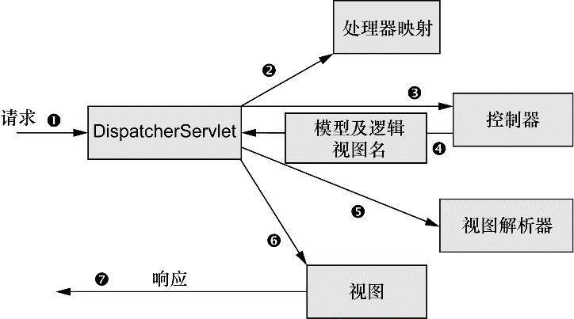

### 5.1 Spring MVC起步

Spring MVC基于模型-视图-控制器（Model-View-Controller，MVC）模式实现，它能够构建像Spring框架那样灵活和松耦合的Web应用程序。

#### 5.1.1 跟踪Spring MVC的请求

每当用户在Web浏览器中点击链接或提交表单的时候，请求就开始工作了。请求是一个十分繁忙的家伙。从离开浏览器开始到获取响应返回，它会经历好多站，在每站都会留下一些信息同时也会带上其他信息。如图是请求使用Spring MVC所经历的所有站点：

+ 在请求离开浏览器时，会带有用户所请求内容的信息，至少会包含请求的URL。但是还可能带有其他的信息，例如用户提交的表单信息。
+ 请求旅程的第一站是Spring的DispatcherServlet，在这里一个单实例的Servlet将请求委托给应用程序的其他组件来执行实际的处理。
+ 控制器是一个用于处理请求的Spring组件。DispatcherServlet需要知道应该将请求发送给哪个控制器，所以DispatcherServlet会查询处理器映射（handler mapping）来确定请求的下一站。处理器映射会根据请求所携带的URL信息来进行决策。
+ 一旦选择了合适的控制器，DispatcherServlet会将请求发送给选中的控制器。到了控制器，请求会卸下其负载（用户提交的信息）并耐心等待控制器处理这些信息。
+ 控制器在完成逻辑处理后，通常会产生一些信息，这些信息需要返回给用户并在浏览器上显示。这些信息被称为模型（model）。
+ 控制器所做的最后一件事就是将模型数据打包，并且标示出用于渲染输出的视图名。它接下来会将请求连同模型和视图名发送回DispatcherServlet。
+ 这样，控制器就不会与特定的视图相耦合，传递给DispatcherServlet的视图名并不直接表示某个特定的JSP。实际上，它甚至并不能确定视图就是JSP。它仅仅传递了一个逻辑名称，这个名字将会用来查找产生结果的真正视图。DispatcherServlet将会使用视图解析器（view resolver）来将逻辑视图名匹配为一个特定的视图实现，它可能是也可能不是JSP。
+ 请求的最后一站是视图的实现（可能是JSP），在这里它交付模型数据。请求的任务就完成了。

#### 5.1.2 搭建Spring MVC

